<div align="center">


###  Homelab Operations Repository 

_... managed with Flux, Renovate, GitHub Actions, and Talos_

</div>

<div align="center">

[](https://discord.gg/home-operations)&nbsp;&nbsp;
[](https://talos.dev)&nbsp;&nbsp;
[](https://kubernetes.io)&nbsp;&nbsp;
[](https://fluxcd.io)&nbsp;&nbsp;
[](https://github.com/renovatebot/renovate)

</div>

<div align="center">

[](https://status.grippeling.net)&nbsp;&nbsp;
[](https://github.com/webgrip/homelab-cluster)&nbsp;&nbsp;
[](https://status.grippeling.net)

</div>

<div align="center">

[](https://github.com/webgrip/homelab-cluster)
[](https://github.com/webgrip/homelab-cluster)
[](https://github.com/webgrip/homelab-cluster)
[](https://github.com/webgrip/homelab-cluster)
[](https://github.com/webgrip/homelab-cluster)
[](https://github.com/webgrip/homelab-cluster)
[](https://status.grippeling.net)

</div>

## 💡 Overview

This is the living source of truth for the Talos-powered cluster behind `grippeling.net`. Flux owns every namespace under `kubernetes/apps`, Renovate watches the whole repo for drift, and GitHub Actions runs validation plus flux diffs before anything merges. TechDocs (in `docs/techdocs`) surface runtime inventory, Talos node state, and runbooks inside Backstage so docs ship with the manifests.

##  Kubernetes

My cluster runs on three bare-metal Talos controllers (`soyo-1`..`3`) that also schedule workloads. Everything runs kube-proxy-free via Cilium, with split-DNS gateways and Cloudflare tunnels for ingress. GitOps keeps the manifests authoritative while Taskfile/Mise make local development reproducible.

### Core Components

- [actions-runner-controller](https://github.com/actions/actions-runner-controller): GitHub Actions scale sets for CI bursts.
- [cert-manager](https://github.com/cert-manager/cert-manager): ACME certificates for both envoy gateways.
- [cilium](https://github.com/cilium/cilium): eBPF networking, kube-proxy-free dataplane.
- [cloudflared](https://github.com/cloudflare/cloudflared) + [Cloudflare DNS](https://github.com/kubernetes-sigs/external-dns): tunnel and DNS automation for `*.grippeling.net`.
- [envoy-gateway](https://github.com/envoyproxy/gateway): Provides `envoy-internal`/`envoy-external` Gateway API classes.
- [flux](https://github.com/fluxcd/flux2): Source, Kustomize, Helm, and notification controllers.
- [k8s-gateway](https://github.com/kubernetes-sigs/gateway-api): Split DNS responder for internal resolution.
- [metrics-server](https://github.com/kubernetes-sigs/metrics-server), [reloader](https://github.com/stakater/Reloader), [spegel](https://github.com/spegel-org/spegel): telemetry, config reloads, and OCI image cache.

### GitOps

Flux watches the `kubernetes/apps` tree, reconciling each top-level `kustomization.yaml` it finds. Those Kustomizations in turn apply HelmReleases, Jobs, ConfigMaps, and SOPS secrets. Renovate opens PRs whenever container tags, Helm charts, or Actions workflows drift; GitHub Actions runs linting plus `flux diff --cached` against the target cluster before a merge. Secrets are committed only as Age-encrypted SOPS files (see `kubernetes/components/sops/`), so Flux can decrypt them once the controller pulls from this repo.

## 📦 Featured Workloads

| Category | Namespace(s) | Highlights |
| --- | --- | --- |
| Platform control | `flux-system`, `kube-system` | Flux controllers, notification receiver, Weave GitOps UI, plus Cilium, CoreDNS, metrics-server, Spegel, and Reloader.
| Networking & ingress | `network` | Envoy internal/external gateways, Cloudflare DNS + Tunnel, and `k8s-gateway` for split-horizon DNS.
| PKI & security | `cert-manager`, `components/sops` | ACME HTTP-01 + DNS-01 issuers for wildcard certs; shared secrets rendered into namespaces through the SOPS component.
| CI infrastructure | `arc-systems` | Actions Runner Controller plus a Docker-in-Docker runner scale set so GitHub repos can burst jobs onto the homelab.
| Applications | `default`, `freshrss`, `invoiceninja` | Echo sample service, FreshRSS HelmRelease with Bitnami bootstrap job, and Invoice Ninja 5.12.39 paired with an app-template-managed MariaDB 11.8.5 StatefulSet on Longhorn storage.

TechDocs tracks all of these via Backstage catalog entries under `catalog/`, so you can pivot from docs to manifests without leaving the repo.

### Directories

```sh
📁 kubernetes
├── 📁 apps             # Applications managed by Flux
├── 📁 bootstrap        # Talos + Helmfile bootstrap resources
└── 📁 flux             # Flux controllers and sources
    ├── 📁 components   # Shared components (SOPS, networking)
    └── 📁 meta         # Repository definitions
📁 docs/techdocs        # MkDocs TechDocs (runtime inventory, Talos state)
📁 talos                # Generated Talos configs + patches
📁 scripts              # Helper scripts + common libraries
```

### Flux Workflow


## 🌐 Networking

```mermaid
graph TD
  A>Odido Fiber 1Gb/1Gb]
  A --> |Genexis ONT bridge| R[Protectli V1410 · OPNsense]
  B>WireGuard / Cloudflare Tunnel] --> |Remote access| R
  R --> |TL-SG108PE Port 1 uplink| S1[TP-Link TL-SG108PE]
  S1 --> |Port 3 → Q-Link| S2[Q-Link Switch]
  S1 --> |Port 2 → Zyxel · AP Port 4| W[Zyxel VMG8825-T50 Wi-Fi 5]
  S2 --> |Port 7 → soyo-1| K1([soyo-1])
  S2 --> |Port 6 → soyo-2| K2([soyo-2])
  S2 --> |Port 5 → soyo-3| K3([soyo-3])
  S2 --> |Port 2 → NAS| N([NAS])
  S2 --> |Port 1 → Proxmox| PX([Proxmox host])
  W --> |Port 1 → Hue| H([Philips Hue bridge])
  W --> |Port 2 → Home Assistant| P([Raspberry Pi Home Assistant])
  W --> |SSID| W1([Main Wi-Fi])
  W --> |IoT SSID| W2([IoT devices])
  W --> |Guest SSID| W3([Guest access])
```



### 🏘️ Flat LAN

| Device | Role | Address | Notes |
| ------ | ---- | ------- | ----- |
| Protectli V1410 / OPNsense | Router + firewall | `10.0.0.1` | DHCP scope `10.0.0.50-10.0.0.150`, WireGuard termination, split DNS rules.
| TL-SG108PE | Managed switch | `10.0.0.2` | Port 1 uplinks to the Protectli WAN handoff, port 2 feeds the Wi-Fi bridge, and port 3 uplinks the Q-Link switch. |
| Zyxel VMG8825-T50 | Wi-Fi bridge/AP | `10.0.0.3` | Bridge mode so SSIDs land on the same subnet as wired clients. |

Static infrastructure (Talos nodes, Proxmox host, Synology, Home Assistant) keeps IPs below `.50` and is reserved in OPNsense Terraform so DHCP drift is impossible.

### 🌎 DNS

Three ExternalDNS deployments keep Cloudflare public records and `k8s-gateway` entries aligned. `envoy-internal` routes stay inside the LAN, while `envoy-external` hostnames are proxied through Cloudflare Tunnel. OPNsense runs split-horizon DNS—every `*.grippeling.net` lookup hits the router, which forwards internally to the `k8s-gateway` LoadBalancer (`10.0.0.26`) so services stay reachable on-LAN without touching Cloudflare.

### 🏠 Home DNS


## ☁️ Cloud Dependencies

| Service | Use | Cost |
|---------|-----|------|
| Cloudflare | Authoritative DNS, Zero Trust tunnels for `*.grippeling.net` | ~$50/yr |
| GitHub | Repo hosting, Actions, container registry | Free |
| Healthchecks.io | Connectivity + job heartbeat monitoring | Free tier |
| Fastmail | Email + identity provider for alerts | ~$56/yr |

## 🖥️ Hardware

| Num | Device | CPU | RAM | OS / Firmware | Function |
|-----|--------|-----|-----|---------------|----------|
| 3 | SOYO Mini PC M4 (Twin Lake N150) | Intel N150 | 12 GB DDR5 | Talos Linux v1.11.5 | Control-plane + workloads, each with 512 GB NVMe + Wi-Fi5/BT5 (disabled) |
| 1 | Protectli V1410 | Intel i5 | 8 GB | OPNsense | Router/firewall, DHCP `10.0.0.50-150`, WireGuard, split DNS for `grippeling.net` |
| 1 | TP-Link TL-SG108PE | — | — | Managed firmware | 8-port 1 GbE switch feeding downstream fan-out |
| 1 | Q-Link 1 GbE switch | — | — | Unmanaged | Directly uplinks Talos nodes for east-west traffic |
| 1 | Zyxel VMG8825-T50 | — | — | Bridge/AP firmware | Wi-Fi AP bridging onto the same flat LAN |
| 1 | NAS + Proxmox host | Intel i7 | 32 GB | Arch Linux + Proxmox | Backups, bulk storage, automation VMs |
| 1 | Raspberry Pi 4 (Home Assistant) | Broadcom | 4 GB | Home Assistant OS | Local automations + integrations |

## 🔢 Cluster & Upstream IPs

| Device / Endpoint | Purpose | Address |
| --- | --- | --- |
| Protectli V1410 / OPNsense | Router, DHCP, split DNS | `10.0.0.1` |
| TP-Link TL-SG108PE | Managed switch | `10.0.0.2` |
| Zyxel VMG8825-T50 | Wi-Fi bridge/AP | `10.0.0.3` |
| `soyo-1` | Talos controller / worker | `10.0.0.20` |
| `soyo-2` | Talos controller / worker | `10.0.0.21` |
| `soyo-3` | Talos controller / worker | `10.0.0.22` |
| Kubernetes / Talos API VIP | Control-plane endpoint | `10.0.0.25` |
| `k8s-gateway` LoadBalancer | Split DNS responder | `10.0.0.26` |
| `envoy-internal` LoadBalancer | LAN-only ingress | `10.0.0.27` |
| `envoy-external` / Cloudflare tunnel VIP | Public ingress origin | `10.0.0.28` |

## 🙏 Thanks

Thanks to the Home Operations Discord, onedr0p for the original cluster-template inspiration, bjw-s for the app-template, and every maintainer building Talos, Flux, Renovate, and the CNCF projects that make GitOps homelabs straightforward.
