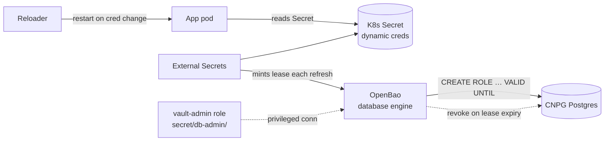

# RFC: Dynamic Database Credentials via OpenBao

> Status: **Proposed.** This RFC proposes giving applications **short-lived, per-workload,
> auto-revoked** Postgres credentials minted on demand by OpenBao's `database` secrets engine,
> instead of the static long-lived passwords they hold today. The headline choice is
> [ADR-0010](adr-0010-openbao-dynamic-postgres-credentials.md). It flips to **Accepted** when the
> pilot succeeds and the first app cuts over.

## Why

After the [SOPS → OpenBao migration](../../blog/2026-06-12-the-long-goodbye-to-sops.md), database
passwords are no longer encrypted files — but they are still **static, long-lived values that
exist**. [ADR-0009](adr-0009-secret-rotation-model.md) makes rotating them easy; this RFC makes
rotation **irrelevant** for the database class, which is the genuinely state-of-the-art posture:

- A credential that lives for **one hour** and is then revoked has a blast radius measured in
  minutes. A leaked dynamic credential is useless almost immediately.
- Each workload gets its **own** credential, so access is **attributable** — OpenBao's audit log
  shows exactly which lease did what, and a single workload can be cut off without touching others.
- There is **nothing to rotate, nothing to leak long-term, and nothing to remember to rotate.**
  Rotation stops being an operation and becomes a property of the TTL.

OpenBao today runs **only the KV-v2 engine** (`init.sh: bao secrets enable -path=secret kv-v2`).
This RFC adds the `database` engine alongside it.

## How it works

1. OpenBao holds a **privileged admin connection** to each CNPG cluster (a dedicated
   `vault_admin` Postgres role that can `CREATE ROLE` / `DROP ROLE` — *not* the superuser).
2. A **role definition** per app: a `creation_statement` (`CREATE ROLE "v-<name>" LOGIN PASSWORD …
   VALID UNTIL …; GRANT <app_privs> …`), a `revocation_statement`, a `default_ttl` (e.g. 1h) and a
   `max_ttl`.
3. An **`ExternalSecret`** reads the role's `creds/<role>` path through `ClusterSecretStore/openbao`.
   Each ESO refresh **mints a fresh credential + lease**; the app's Secret is updated and
   **Reloader** restarts the pod onto the new credential.
4. When a lease's TTL elapses (or ESO mints a replacement), OpenBao runs the revocation statement
   and the old role disappears from Postgres.

## Boundary with CNPG (the important part)

CNPG already manages each app's role and emits `<app>-db-app`. Dynamic credentials do **not** replace
that — they coexist:

- The **CNPG-managed role** (`<app>-db-app`) stays as the operator's own bootstrap/owner role and the
  break-glass path. CNPG continues to own schema ownership and superuser-ish lifecycle.
- OpenBao mints **separate, ephemeral login roles** that are `GRANT`ed membership in the app's
  privilege set (or the owning role) — so dynamic creds get exactly the app's data-plane rights,
  nothing more, and never the owner DDL rights unless explicitly granted.
- This keeps CNPG's reconcile loop and OpenBao's lease loop from fighting over the same role.

## Scope

**In scope:** the `database` engine; one privileged `vault_admin` role per CNPG cluster; per-app
dynamic roles with TTLs; ESO wiring; a pilot → rollout sequence.

**Out of scope (future):** OpenBao **PKI** engine (short-lived mTLS certs) and **transit** engine
(encryption-as-a-service to retire app at-rest keys) — both natural follow-ons under the same
"OpenBao does more than KV" banner, but separate decisions. Dynamic creds for non-Postgres backends
(Garage S3, Redis) — same idea, later.

## Implementation (phased)

**Phase 0 — engine + one admin connection.** Enable the `database` engine, then register **one**
CNPG cluster's `vault_admin` connection. No app touches dynamic creds yet. Implementation surfaced
three realities the high-level design glossed (all now reflected here):

> **Activation realities (discovered 2026-06-12, committed groundwork in `cfe9aab`):**
>
> 1. **Mounting the engine needs root, there is no live root — and `generate-root` is UNSUPPORTED
>    here.** `init.sh` only runs the root setup on a *fresh* cluster and revokes root after;
>    `config-admin` **deliberately cannot mount engines**. So `bao secrets enable database` is added
>    to `init.sh` for future fresh clusters. For an already-bootstrapped cluster the obvious recovery
>    — a one-time break-glass `bao operator generate-root` with the unseal key — was tried and
>    **fails: `GET sys/generate-root/attempt` returns `405 unsupported operation`** on this OpenBao
>    (verified via both the Service and headless addresses; `openbao-0` is the active node, since
>    `config-admin` writes succeed there). The documented "recover emergency root via generate-root"
>    path is therefore **not available on this cluster.** That leaves two real options to mount the
>    engine on the running cluster: **(a)** grant `config-admin` a narrowly-scoped `sys/mounts/database`
>    so the reconcile loop mounts it — it contradicts the deliberate "no mount" boundary, but
>    `config-admin` can *already* self-escalate via `sys/policies/acl/*` + `auth/+/role/*` writes, so
>    the explicit grant is little real new exposure and is reversible; or **(b)** a destructive
>    wipe+re-init (where `init.sh` now mounts it on fresh) — **rejected**, it would destroy every
>    migrated secret. Option (a) is the pragmatic path; it gates live activation.
> 2. **`config-admin` cannot read KV** (`secret/data` is denied by design), so it can't pull the
>    `vault_admin` password from `secret/db-admin/<cluster>` to build the connection string. The
>    password must instead reach `config.sh` via a **k8s Secret mounted into the config job pod**
>    (same namespace, `security`) — so the ESO-materialised `vault_admin` secret is needed in
>    `security`, and the *same* value in the app namespace for CNPG. Generate it once into OpenBao,
>    then `ExternalSecret` it into both namespaces.
> 3. **`rotate-root` is off the table for an existing cluster.** Post-init SQL won't re-run on a
>    live CNPG cluster, so `vault_admin` must come via `managed.roles` — which CNPG continuously
>    reconciles, so OpenBao must **not** rotate the password out from under it. The shared random
>    password (ESO-generated, never typed) stays the source of truth.
>
> Groundwork already shipped: `init.sh` enables the engine on fresh clusters; `config-admin.hcl`
> gained `database/config|roles|rotate-root|reset` (not `sys/mounts`). The connection + role
> reconcile in `config.sh`, the `vault_admin` CNPG role, and the ESO plumbing land **after** the
> mount decision.

**Phase 1 — pilot one app.** Pick a **low-connection, restart-tolerant, non-critical** app (a
read-mostly internal tool — *not* Authentik, *not* Forgejo, *not* Dependency-Track). Define its role,
add the `creds/<role>` ExternalSecret with `refreshInterval` **< `default_ttl`**, annotate the
workload for Reloader, cut its `DATABASE_URL`/secret reference over. Measure for a week: lease count,
connection churn, revocation lag, app reconnect behavior.

**Phase 2 — expand by appetite.** Roll to other apps **only** where the connection model tolerates
periodic credential change. Apps with large/long-lived connection pools or poor reconnect behavior
stay on static (ADR-0009) creds — dynamic is a *fit-for-purpose* tool, not a mandate.

## Risks & open questions

- **Connection churn.** Every credential change means reconnecting. Apps with aggressive pooling, or
  that open a connection at boot and never re-auth, will need a restart (Reloader) on each rotation —
  which at a 1h TTL is a restart an hour. **Mitigation:** longer TTL for those, or a pooler
  (PgBouncer) that re-auths; or simply keep them static. This is the central trade-off.
- **ESO doesn't *renew* leases, it *re-reads*.** Each refresh mints a *new* lease rather than
  extending the old — so `default_ttl` must comfortably exceed `refreshInterval`, and OpenBao must
  reliably revoke superseded leases (max-lease accounting, lease count caps).
- **The privileged bootstrap role is the new crown jewel.** `vault_admin` can create/drop roles in
  the cluster; its credential must be tightly scoped (no superuser, no `BYPASSRLS`), audited, and
  itself ideally short-lived.
- **CNPG failover / restore.** On a CNPG switchover the `vault_admin` connection must follow the
  `-rw` service; on a restore-from-backup, OpenBao-created ephemeral roles won't exist in the restored
  state (they're transient by design) — confirm nothing depends on a *specific* dynamic role surviving.
- **Lease storms on mass restart.** A fleet restart re-mints every credential at once; size
  `max_ttl` and lease caps so OpenBao/Postgres aren't swamped.

## Success criteria

- Pilot app runs for a week on dynamic creds: every credential is `VALID UNTIL` ≤ its TTL, OpenBao's
  audit log attributes DB access to per-lease roles, and revoked roles are gone from `pg_roles`.
- Killing a leased credential in OpenBao severs exactly that workload's access and nothing else.
- No measurable error-rate increase from credential rotation (reconnects are clean).
- A documented rollback: drop the ExternalSecret, repoint the app at its CNPG `<app>-db-app` static
  secret, done — fully reversible per app.

## References

- [ADR-0010](adr-0010-openbao-dynamic-postgres-credentials.md) ·
  [RFC: Security Hardening](rfc-security-hardening.md) ·
  [ADR-0009: Rotation model](adr-0009-secret-rotation-model.md)
- [The Long Goodbye to SOPS](../../blog/2026-06-12-the-long-goodbye-to-sops.md) ·
  [CNPG Backups](../cnpg-backups.md) · [External Secrets](../external-secrets-plan.md)
