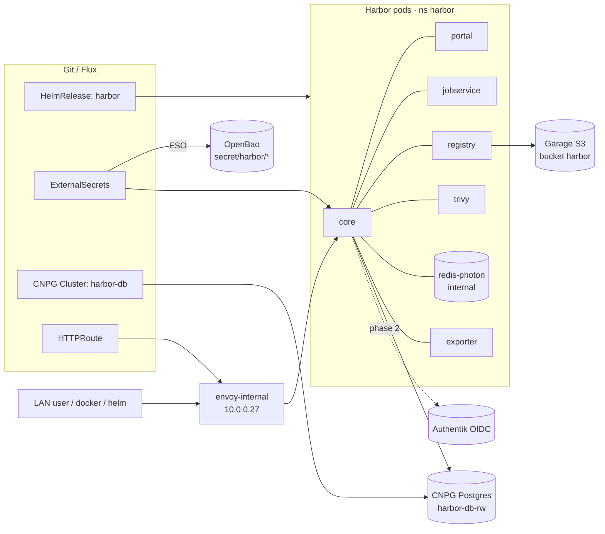

# RFC: Harbor Container Registry

> Status: **Proposed.** This RFC proposes deploying [Harbor][harbor] as the cluster's private
> OCI registry and artifact store — container images, Helm charts, and generic OCI artifacts —
> with Trivy scanning, Prometheus metrics, S3-backed blob storage, a CNPG Postgres with backups,
> and Authentik SSO, all GitOps-managed by Flux. The individual decisions are recorded as
> [ADR-0001](adr-0001-adopt-harbor.md) … [ADR-0006](adr-0006-authentik-oidc-phased.md). This
> document is the umbrella; it flips to **Accepted** when the design is approved and the
> Phase-1 manifests merge.

[harbor]: https://goharbor.io/
[eso]: https://external-secrets.io/
[oci]: https://github.com/opencontainers/distribution-spec

## Why

The cluster has **no artifact registry of its own**. Every image and chart is pulled from a
public registry (`ghcr.io`, `mirror.gcr.io`, `docker.io`), and there is nowhere to *store* the
homelab's own artifacts — built images, OCI Helm charts, SBOM/attestation blobs. That leaves
three gaps:

- **No private publish target.** Forgejo Actions and the ARC runners can build images but have
  nowhere first-party to push them.
- **No scanning gate at rest.** Vulnerability posture is computed downstream
  (dependency-track / guac, see [Supply Chain Pipeline](../supply-chain-pipeline.md)) but nothing
  scans images *as they are stored*.
- **No project/RBAC/replication model** for artifacts.

The goal: a feature-complete, in-cluster registry that slots into the existing patterns
(HelmRelease, CNPG, Garage S3, Gateway API, ESO/OpenBao, Authentik) so the deploy is reproducible
and reversible — no new infrastructure primitives.

## Scope

**In scope:** OCI image + Helm-chart + generic-artifact push/pull; private projects and robot
accounts; Trivy vulnerability scanning; Prometheus metrics; Garage S3 blob storage; a managed
CNPG Postgres with S3 backups; Authentik OIDC SSO with a local-admin fallback.

**Out of scope (future work):** replication to/from a remote Harbor; mandatory cosign/Notation
signature *enforcement* (Harbor can hold signatures now, but gating deploys on them is a separate
initiative); public/off-LAN exposure.

## Decisions

Each row links its ADR.

| # | Decision | Choice |
|---|----------|--------|
| [ADR-0001](adr-0001-adopt-harbor.md) | Registry product | **Harbor 2.x** via the official Helm chart, under `kubernetes/apps/harbor/` |
| [ADR-0002](adr-0002-registry-blob-storage-garage-s3.md) | Blob storage | **Garage S3** bucket `harbor` (path-style, `disableredirect`) |
| [ADR-0003](adr-0003-external-cnpg-database.md) | Database | **External CNPG** `harbor-db` (db `registry`), no bootstrap secret |
| [ADR-0004](adr-0004-chart-internal-redis.md) | Redis | **Chart-bundled** `redis-photon` (`redis.type: internal`) |
| [ADR-0005](adr-0005-lan-only-exposure.md) | Exposure | **LAN-only** via `envoy-internal` (`10.0.0.27`) |
| [ADR-0006](adr-0006-authentik-oidc-phased.md) | Authentication | **Authentik OIDC**, layered in Phase 2; local admin fallback |

## Architecture

**Dependency ordering (Flux):** `harbor-db` Kustomization depends on `cloudnative-pg`
(cnpg-system); the `harbor` Kustomization depends on `harbor-db` plus `kube-prometheus-stack`
(for the ServiceMonitor CRD). TLS terminates at the gateway's wildcard `*.${SECRET_DOMAIN}`
certificate, so Harbor itself runs `expose.type: clusterIP` with TLS disabled.

## Secrets (ESO / OpenBao)

Harbor is a **new** app, so there is no SOPS→OpenBao migration and **no `PushSecret`** (those only
seed values out of pre-existing SOPS Secrets — see [External Secrets](../external-secrets-plan.md)).
Its secrets are plain [ExternalSecret][eso]s reading paths the owner populates once in OpenBao
(`bao kv put`), via `ClusterSecretStore/openbao`:

| OpenBao path | Surfaced Secret | Keys | Consumed by |
|--------------|-----------------|------|-------------|
| `secret/harbor/core` | `harbor-core` | `HARBOR_ADMIN_PASSWORD`, `secretKey` (16 chars), `CSRF_KEY` (32), `REGISTRY_HTTP_SECRET`, `JOBSERVICE_SECRET` | HelmRelease `existingSecret*` |
| `secret/harbor/s3` | `harbor-s3` | `REGISTRY_STORAGE_S3_ACCESSKEY`, `REGISTRY_STORAGE_S3_SECRETKEY` | registry blob storage |
| `secret/harbor/oidc` *(Phase 2)* | `harbor-oidc-values` | `values.yaml` (a `core.configureUserSettings` fragment) | HelmRelease `valuesFrom` (`optional: true`) |

The CNPG database needs **no** ExternalSecret — CNPG emits `harbor-db-app` itself
([ADR-0003](adr-0003-external-cnpg-database.md)) — and backup credentials come from the shared
`cnpg-backup` component, which renders its own ExternalSecret into the namespace.

## Implementation

GitOps, in two phases under `kubernetes/apps/harbor/` (mirrors `kubernetes/apps/forgejo/`):

**Phase 1 — registry online (local auth):**

- `namespace.yaml` + namespace `kustomization.yaml` (`components: [sops, cnpg-backup]`).
- `harbor/database/` — CNPG `Cluster` `harbor-db` + `ObjectStore` + `ScheduledBackup`.
- `harbor/app/` — `HelmRepository` (`https://helm.goharbor.io`), `HelmRelease`, `HTTPRoute`
  (`envoy-internal`), and the `harbor-core` / `harbor-s3` ExternalSecrets.
- Register `./harbor` in `kubernetes/apps/kustomization.yaml`.

**Phase 2 — SSO:** Authentik blueprint `kubernetes/apps/authentik/app/blueprints/36-oidc-harbor.yaml`
(redirect `/c/oidc/callback`), the `harbor-oidc-values` ExternalSecret, and the HelmRelease
`valuesFrom` reference.

**Cluster guardrails the manifests must honour:** there is **no default StorageClass** (every PVC
sets `storageClass` explicitly — `longhorn-general` for app PVCs, `longhorn` for the CNPG Cluster);
**kyverno `disallow-rwx-pvcs` is `Enforce`** (every PVC is `ReadWriteOnce`); CNPG governance
requires `walStorage` and the `monitoring.webgrip.io/enabled` label. See
[Adding Applications](../adding-applications.md) and [CNPG Backups](../cnpg-backups.md).

## Success criteria

- `docker login` + push/pull and `helm push`/`helm pull` (OCI) round-trip through
  `harbor.${SECRET_DOMAIN}` on the LAN; blobs land in the Garage `harbor` bucket.
- A Trivy scan of a pushed image returns a vulnerability report.
- `harbor_core_http_request_total` is scraped (visible in Prometheus/Grafana).
- An on-demand CNPG backup writes an object under
  `s3://cnpg-backups-bucket/homelab-cluster/harbor-db/`.
- **Phase 2:** "LOGIN VIA OIDC PROVIDER" completes an Authentik flow and auto-onboards a user.

## Risks

- **Garage is a hard dependency** for blob I/O once blobs live on S3
  ([ADR-0002](adr-0002-registry-blob-storage-garage-s3.md); analogous to the
  [CNPG ↔ Garage WAL risk](../cnpg-backups.md)).
- **Pending PVCs** if any `storageClass` is omitted — the #1 silent failure given no cluster default.
- **An un-synced ExternalSecret blocks the HelmRelease** — if `harbor-core` / `harbor-s3` are not
  `SecretSynced`, the OpenBao path/keys are missing; populate them before reconciling.
- **OIDC first-boot loop** if SSO is wired before the Authentik app exists — hence the phased
  rollout with `optional: true` on the OIDC `valuesFrom`.
- **Resource footprint** — ~9 pods on the soyo pool; Trivy scans are spiky.

## Operations

A `runbooks/harbor.md` operational runbook (bring-up steps: Garage bucket/key creation, the
`bao kv put` keys, OIDC configuration, and a restore drill) is written alongside the Phase-1
implementation, not in this RFC. Disaster recovery follows the standard
[CNPG Restore Playbook](../cnpg-restore-playbook.md).

## References

- ADRs [0001](adr-0001-adopt-harbor.md), [0002](adr-0002-registry-blob-storage-garage-s3.md),
  [0003](adr-0003-external-cnpg-database.md), [0004](adr-0004-chart-internal-redis.md),
  [0005](adr-0005-lan-only-exposure.md), [0006](adr-0006-authentik-oidc-phased.md)
- [External Secrets](../external-secrets-plan.md) · [CNPG Backups](../cnpg-backups.md) ·
  [Authentik](../authentik.md) · [Supply Chain Pipeline](../supply-chain-pipeline.md) ·
  [Adding Applications](../adding-applications.md)
