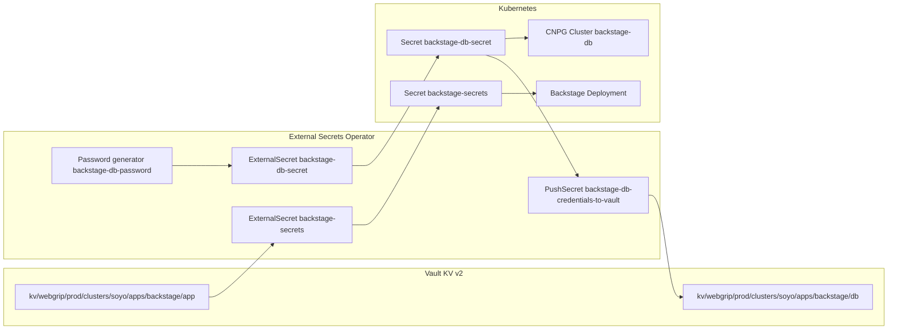
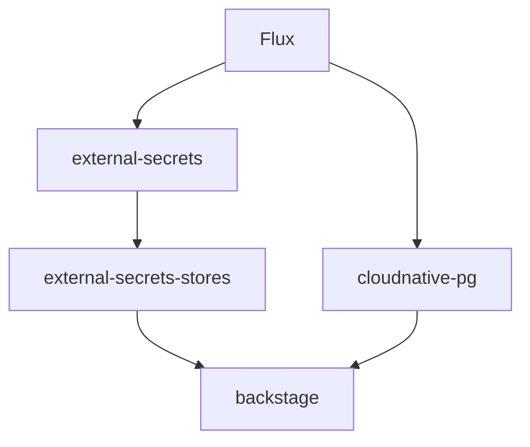
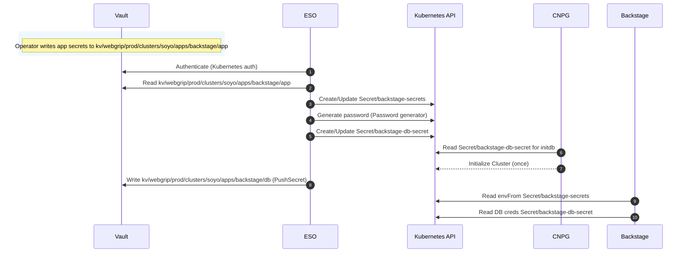

# Backstage + Vault + External Secrets (ESO)

This cluster runs Backstage with secrets sourced from Vault via External Secrets Operator (ESO), and CloudNativePG (CNPG) database credentials generated in-cluster and pushed into Vault.

This page documents the **current desired state in Git** for Backstage and how it interacts with Vault/ESO.

## Components and manifests

- Backstage app kustomization (includes the ExternalSecret):
  - [kubernetes/apps/backstage/backstage/app/kustomization.yaml](../../kubernetes/apps/backstage/backstage/app/kustomization.yaml)
- Backstage application secrets from Vault (creates `Secret/backstage-secrets`):
  - [kubernetes/apps/backstage/backstage/app/secret-externalsecret.yaml](../../kubernetes/apps/backstage/backstage/app/secret-externalsecret.yaml)
- Backstage CNPG DB bootstrap secret generated in-cluster (creates `Secret/backstage-db-secret`):
  - [kubernetes/apps/backstage/backstage/app/base/backstage-db-externalsecret.yaml](../../kubernetes/apps/backstage/backstage/app/base/backstage-db-externalsecret.yaml)
- Backstage DB credentials pushed into Vault:
  - [kubernetes/apps/backstage/backstage/app/base/pushsecret-vault.yaml](../../kubernetes/apps/backstage/backstage/app/base/pushsecret-vault.yaml)
- Flux dependency ordering for Backstage:
  - [kubernetes/apps/backstage/backstage/ks.yaml](../../kubernetes/apps/backstage/backstage/ks.yaml)

## High-level architecture

## Vault paths used

### Backstage application secret bundle

Backstage’s application secret bundle is stored in Vault at:

- `kv/webgrip/prod/clusters/soyo/apps/backstage/app`

ESO reads this Vault secret using `dataFrom.extract` in [kubernetes/apps/backstage/backstage/app/secret-externalsecret.yaml](../../kubernetes/apps/backstage/backstage/app/secret-externalsecret.yaml) and creates/updates:

- `Secret/backstage-secrets` (namespace `backstage`)

Backstage consumes it via `envFrom.secretRef` in the Backstage deployment.

Expected keys in Vault (non-exhaustive; match what the manifest templates reference):

- `GITHUB_TOKEN`
- `AUTH_GITHUB_CLIENT_ID`
- `AUTH_GITHUB_CLIENT_SECRET`
- `GA_MEASUREMENT_ID`
- `OPENAPI_AI_KEY`
- `GITHUB_APP_ID`
- `GITHUB_APP_CLIENT_ID`
- `GITHUB_APP_CLIENT_SECRET`
- `GITHUB_APP_WEBHOOK_SECRET`
- `GITHUB_APP_PRIVATE_KEY` (multi-line)
- `BACKEND_SECRET`

Optional keys (if absent, ESO templates default them to empty):

- `SENTRY_TOKEN`
- `NEW_RELIC_REST_API_KEY`
- `NEW_RELIC_USER_KEY`
- `K8S_SERVICE_ACCOUNT_TOKEN_BACKSTAGE`
- `K8S_CONFIG_CA_DATA`

### Backstage DB credentials pushed into Vault

Backstage’s CNPG bootstrap Secret is generated in-cluster as:

- `Secret/backstage-db-secret` (namespace `backstage`)

A `PushSecret` then pushes that secret into Vault at:

- `kv/webgrip/prod/clusters/soyo/apps/backstage/db`

as properties:

- `username`
- `password`

This makes Vault a convenient lookup location for the DB credentials while keeping the CNPG bootstrap path fully GitOps-managed and secret-free.

## Reconciliation and ordering

Flux applies Backstage with explicit dependencies in [kubernetes/apps/backstage/backstage/ks.yaml](../../kubernetes/apps/backstage/backstage/ks.yaml):

- `cloudnative-pg` (CNPG operator) in namespace `cnpg-system`
- `external-secrets` and `external-secrets-stores` in namespace `external-secrets`

## End-to-end sequence

## Vault policy requirements

For ESO to read `kv/webgrip/prod/clusters/soyo/apps/backstage/app`, the Vault policy bound to the ESO role must allow KV v2 reads:

- `read` on `kv/data/external-secrets/*`
- `read`/`list` on `kv/metadata/external-secrets/*`

For `PushSecret` to write `kv/webgrip/prod/clusters/soyo/apps/backstage/db`, the same policy must also allow:

- `create` and `update` on `kv/data/external-secrets/*`

(Exact policy lives in Vault; see [docs/techdocs/docs/external-secrets-vault.md](external-secrets-vault.md) for the one-time setup flow.)

## Notes and caveats

- Backstage environment variables are loaded at container start; after secrets change, Backstage Pods need a restart to pick them up.
- CNPG `initdb` runs once per cluster initialization; changing `backstage-db-secret` later does not retroactively change the database user password unless you run an explicit rotation procedure.
