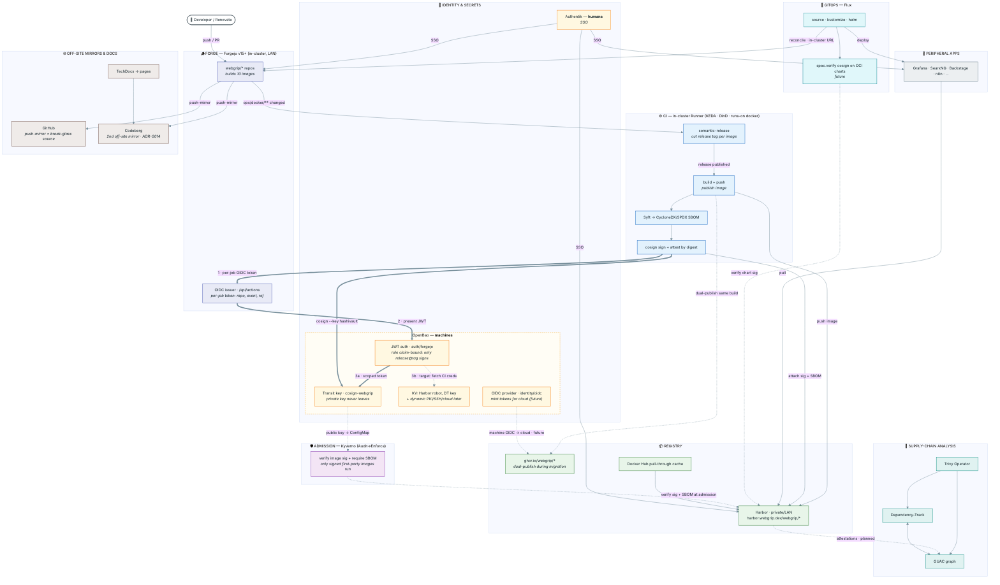
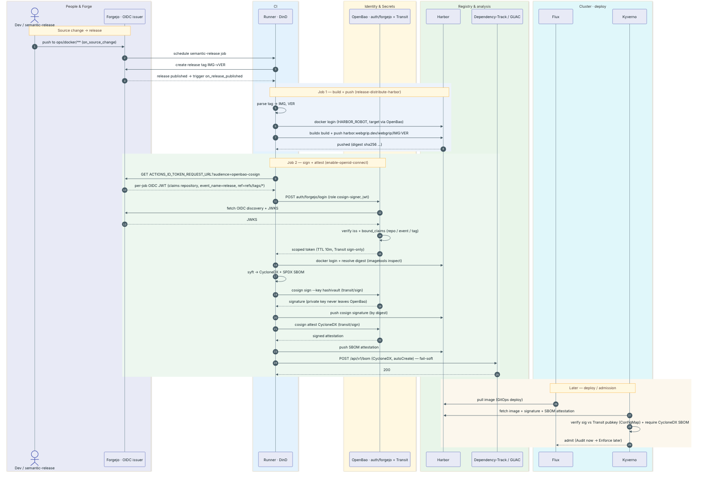

# Bringing the Forge Home

### Leaving GitHub for a self-hosted Forgejo — and discovering, part by part, how many things "GitHub" secretly meant

*Published 2026‑06‑12*

---

> **Update — 2026-06-17.** Two threads this post filed under *"not started"* have moved a long way since it was written. **Harbor is live**, and the **supply-chain trust chain is built (in audit)** — though it didn't land where the first draft guessed. The *registry* and *trust boundary* sections below, and the status board near the end, are revised to match; everything else stands as written.
>
> **Update — 2026-06-18.** The CI runner — *"Live, unproven on a real job"* below — is now **proven**, after clearing four sequential admission/runtime gates; it also gained a warm pool, and `webgrip/infrastructure` has begun de-mirroring to become Forgejo-authoritative. The new chapter is its own post: [The Runner Runs](2026-06-18-the-runner-runs.md).

## Prologue: the north star

The goal is easy to say and surprisingly hard to finish: **leave GitHub.**

Not "mirror to a backup." Not "self-host a copy and keep working on GitHub anyway." Actually leave — make a Forgejo instance running on the cluster the *source of truth*, demote GitHub to a thing you pull *from* during the transition, stand up Codeberg as an off-site mirror for redundancy, and then, when the dust settles, walk away from GitHub entirely.

It sounds like one move. It is not. "GitHub," it turns out, is not a website you visit; it is a load-bearing assumption threaded through dozens of unrelated-looking systems. It is where your code lives, yes — but it is also your CI engine, your runner autoscaler, your package registry, the **cryptographic identity that signs your container images**, the OIDC issuer a Kyverno admission policy trusts, the bot account your dependency updater logs in as, the webhook that tells your GitOps controller to reconcile, and the place a documentation site quietly fetches from. Pull on the thread marked "git host" and a dozen other systems follow it out of the drawer.

This is the story of finding every one of those threads and, one at a time, re-tying it to something we own. Some are done. Some are half-done and honest about it. One is wedged in the most poetic way possible. The map we're working from looks like this: a **Forge** (Forgejo) at the centre; **GitOps** (Flux) and **CI** (Forgejo Actions + runners) hanging off it; a **Package Registry** (Harbor) feeding deployments; **Identity** (Authentik) vouching for everyone; a constellation of **peripheral applications** that log in through that identity; and a ring of **public mirrors** — Codeberg, a second Forgejo, and a demoted GitHub — for redundancy. Let's walk the map.



*The map, literally. Thick arrows `1→2→3` are the signing spine; dotted arrows are trust / verify / planned; solid arrows are built-and-active flow. Gold is identity and secrets — humans authenticate through **Authentik**, machines through **OpenBao**. Several nodes are marked* future*/*planned *and are honest about it; the prose below says which.*

---

## The forge itself

The centre of the new world is `forgejo.webgrip.dev` — a [Forgejo](https://forgejo.org/) server, the community fork of Gitea, deployed by the official Helm chart and reconciled by Flux like everything else. It is already live, already public, and already the nicest piece of the migration to look at, because it's the part that's genuinely *done*.

A few deliberate choices define it:

- **It is rootless and deliberately humble.** A single replica, a `Recreate` upgrade strategy, all Linux capabilities dropped, no privilege escalation. Forgejo is not HA-capable and we don't pretend otherwise — one pod, recreated cleanly on upgrade, is the honest configuration. For a homelab forge serving one human and a fleet of automation, "simple and correct" beats "clustered and fragile."
- **Two front doors.** The web UI is exposed publicly through the external Envoy gateway, with a k6 synthetic canary watching the ingress. Git-over-SSH gets its *own* dedicated Cilium LoadBalancer IP — `10.0.0.31`, announced on the LAN by L2, resolving as `forgejo-ssh.webgrip.dev` — so clone URLs render as `git@forgejo-ssh.webgrip.dev:owner/repo.git` and SSH never has to share a port with anything. (The `forgejo` namespace had to be explicitly allow-listed in the Kyverno network-exposure policy to be permitted a LoadBalancer at all; sovereignty has paperwork.)
- **A storage split that keeps the expensive disk small.** This is the quietly clever bit. Git repositories themselves live on a modest 20Gi Longhorn volume — they're small, they want low latency, they belong on fast replicated block storage. But the *heavy* objects — LFS blobs, package-registry artifacts, attachments, avatars, CI artifacts — are pushed out to **Garage S3** (`10.0.0.110:3900`, path-style addressing, plain HTTP, the minio-compatible protocol Forgejo speaks natively). The result: the forge can host gigabytes of LFS and packages without ever inflating a Longhorn claim. Block storage stays lean; object storage absorbs the bulk.
- **Postgres for everything stateful.** A CloudNativePG cluster, `forgejo-db`, backs the server — backed up nightly to Garage S3 with its own dedicated write-ahead-log volume, the standard pattern across this cluster. And sessions live in Postgres too (`session.PROVIDER=db`), which means logins survive pod restarts and the whole thing needs **no Redis**. Cache is in-process memory; the queue is a LevelDB file on the data volume. One database, no auxiliary stateful services, restarts that don't log you out.

It even runs in `OFFLINE_MODE` — no phoning home, no third-party avatars or gravatars, a forge that works the same whether or not the wider internet is reachable. Which is, when you think about it, the whole point.

---

## Identity: who are you, without GitHub?

On GitHub, identity is free and invisible — you *are* your GitHub account, your org membership *is* your authorization, and you never think about it. Take GitHub away and you have to answer the question explicitly: who is allowed in, and who says so?

The answer is **Authentik**, the cluster's OIDC provider. Forgejo trusts it as an OpenID Connect login source via an auto-discovery URL, and the wiring is configured for the post-GitHub world:

- **Auto-provisioning.** First SSO login through Authentik creates the Forgejo account automatically (`ENABLE_AUTO_REGISTRATION`, `ACCOUNT_LINKING=auto`). You don't pre-create users; Authentik vouches for them and Forgejo materialises them.
- **SSO is the *only* front door.** The local signup form is hidden and only external registration is allowed (`ALLOW_ONLY_EXTERNAL_REGISTRATION=true`). There is exactly one way to become a user: log in through Authentik.
- **Break-glass, not daily-driver.** A local `gitea_admin` account exists with `passwordMode: keepUpdated`, but it is strictly an emergency hatch. The human identity is `Ryangr0` — deliberately separated from Authentik's `akadmin` superuser, and placed in the `homelab-users` and `homelab-mfa` groups so that even the forge owner logs in as a normal, MFA-bound mortal.

The piece still on the drawing board is **teams**. On GitHub, org teams gate repository access. The plan is to map **Authentik groups → Forgejo teams**, so that group membership in the identity provider becomes the single source of authorization across the forge — the same way it already gates every other app behind Authentik. It's deferred for now, sequenced after the content actually lands in Forgejo, but it's the move that finally retires "GitHub teams" as a concept.

---

## CI, act one: the autoscaler nobody sees

Here is where leaving GitHub stops being a settings change and becomes engineering.

On GitHub, your workflows run on `ubuntu-latest` and you never think about where. In this cluster they ran on **ARC** — GitHub's Actions Runner Controller — with two pools: a normal pool (`arc-runner-set`, pinned to the `soyo` nodegroup) for linting and tests, and a heavy pool (`arc-runner-set-heavy`, pinned to `fringe`, labelled `dind`) for Docker image builds. ARC is good software. But it is *GitHub's* software, speaking GitHub's runner protocol, and it has no idea Forgejo exists.

The replacement starts one layer down, with a prerequisite most people never have to think about: **KEDA**, the Kubernetes Event-Driven Autoscaler. ARC bundled its own scaling logic; Forgejo's runner does not. So KEDA becomes the general-purpose engine that watches an external signal and turns it into pods — and the external signal, in our case, is "how many CI jobs are pending in Forgejo right now?" KEDA is the unglamorous foundation the whole CI story is built on, and it had to land first.

---

## CI, act two: ephemeral runners that scale to zero

On top of KEDA sits the actual ARC replacement: a **KEDA `ScaledJob`** that is, frankly, a lovely piece of design.

It works like this. A KEDA Forgejo scaler polls the server every thirty seconds, asking how many jobs are queued with the `docker` label. When work appears, KEDA creates **one ephemeral Kubernetes Job per pending CI job** — scaling from zero up to a ceiling of six. Each runner pod runs `forgejo-runner one-job`: it registers itself, executes *exactly one* job, and exits. There are no long-lived runners sitting idle burning memory; when the queue is empty, the runner count is genuinely zero.

And because half of what CI does is build container images, each runner pod ships with **Docker-in-Docker as a native sidecar** — a privileged `dind` container that starts before the runner, exposes a TLS-secured Docker daemon, and is automatically torn down the instant the runner finishes its one job, so the Job completes cleanly instead of hanging on a sidecar that never dies. The runners are pinned to the dedicated `fringe` nodes, mount no service-account token they don't need, and clean up after themselves completely.

That privileged sidecar is worth pausing on, because it is the one place this otherwise-rootless cluster keeps a `privileged: true` — and it sits in the exact spot that runs repo-controlled code. Which forces a clarity the "runner + sidecar" shorthand hides: the pod isn't two things, it's **three roles that must stay separated**. An **agent** that only claims a job and orchestrates it. A **toolchain** where the steps actually run — node, git, the `docker`/`buildx` client, and the secrets and the checkout. And a **build engine** that assembles the image. The rule that keeps it honest is *privilege and secrets never share a container*: the privileged daemon holds no credentials, and the credential-bearing toolchain holds no privilege.

Getting even that far surfaced a row of small truths, learned the hard way. The runner had never actually run a job, so it advertised only the single label it was registered with — and the label set had to stop pretending to be a GitHub-ARC pool (`arc-runner-set`, `ubuntu-latest`) and tell the plain truth: it's a `docker` runner, nothing more. Then *where* steps run turned out to matter more than it sounds: a job container spawned off to the side can't reach the daemon at `localhost`, but a job that runs *in the same container as the agent* shares the pod's network namespace and reaches the sidecar for free. So step one is **host-mode** — the agent runs inside webgrip's own `github-runner` toolchain image (it already carries the docker CLI and the buildx plugin; an init container slips the `forgejo-runner` binary in beside them), and a real job can finally execute end to end.

And the privileged daemon itself is on borrowed time. [ADR-0026](../adr/adr-0026-rootless-ci-image-builds.md) already records the destination, and the order: prove the runner first — this host-mode step — then replace Docker-in-Docker with a **shared, rootless BuildKit** reached as an ordinary Service. No privileged container anywhere; a build cache that survives the ephemeral runners instead of starting cold every time (exported to Harbor); and, as a free consequence, the whole `localhost:2376` network-namespace puzzle simply gone. The runners get smaller, the one wart gets removed, and the cache finally warms.

It is everything ARC gave us — ephemeral, autoscaling, DinD-capable runners — rebuilt on event-driven primitives we control, pointed at a forge we own. It is proven to sit correctly at zero. There is exactly one honest caveat, and the manifest says so out loud in a code comment: the precise `one-job` invocation hasn't been confirmed against a *real* job yet. Which is the perfect segue, because the thing that proves a runner is a workflow.

---

## CI, act three: rewriting the workflows

This is the part the one-line summary buries and the reality inflates. Migrating CI isn't moving runners; it's **rewriting every workflow**, because GitHub Actions workflows are saturated with GitHub.

Today the repo carries seven of them in `.github/workflows/`: a Flux-manifest validator (`flux-local`), an end-to-end check (`e2e`), two label managers (`labeler`, `label-sync`), two Renovate helpers (`renovate-dry-run`, `renovate-trigger`), and a Claude-powered PR reviewer (`claude-review`). Pull one open — the Flux validator is representative — and count the GitHub-isms:

- `runs-on: ubuntu-latest` — a GitHub-hosted runner that simply does not exist in our world.
- A pile of **Marketplace actions** pinned by digest: `actions/checkout`, `tj-actions/changed-files`, `mshick/add-pr-comment`, `anthropics/claude-code-action`. Forgejo Actions can resolve actions, but *where from* is a decision — and it turns out to be made *for* you by `DEFAULT_ACTIONS_URL`, which points the cluster's forge at `data.forgejo.org` (a curated, **incomplete** mirror). The common ones resolve; many don't, and 404 with `remote: Not found` until you pin them to an absolute URL by hand. The `webgrip/infrastructure` pipeline in act four hit this in full and is the place it's worked out properly.
- Deep coupling to the **GitHub event and API surface**: `github.event.pull_request.number`, `GITHUB_OUTPUT`, `GITHUB_STEP_SUMMARY`, posting PR comments through GitHub's REST API. Forgejo has analogues, but they are not identical, and the diff-commenting and labeling workflows lean on them hardest.

Against all that, the Forgejo side currently holds a single file — a nine-line `ci.yml` that says `runs-on: docker`, prints a greeting, and runs `docker version`. It looks like nothing. It is, in fact, the beachhead: the one workflow whose only job is to prove the KEDA runner executes a real `docker`-labelled job end to end. Once it goes green, the seven real workflows get ported behind it, one at a time, each re-expressed in Forgejo's dialect. The smoke test is small on purpose. Everything else waits behind it.

---

## CI, act four: the image pipeline — release once, publish many

Everything above is about *this* repo's CI — the Flux validators and helpers in `homelab-cluster/.github/workflows`. But the cluster also *consumes* CI it doesn't author: the container images it runs are built by a sibling repo, **`webgrip/infrastructure`**, which holds ten Dockerfiles under `ops/docker/<image>/` and its own release pipeline. Leaving GitHub means porting that pipeline too — and porting it surfaced a principle worth naming, because it's the shape the whole supply chain below depends on.

> **Update — 2026-06-26.** The first draft below described the image pipeline as *"two trees"* — a `.forgejo/` tree pushing to Harbor living beside a `.github/` tree still pushing to GHCR. That was the transitional shape; it's no longer how `webgrip/infrastructure` works, and the section is rewritten to match. The pipeline is now **"release once, publish many":** Forgejo is the *sole release authority*, GitHub runs **zero** Actions (its `.github/` workflow tree was deleted), and the *one* in-cluster runner fans a single release out to **both** registries.

The principle is **release once, publish many**: exactly one system decides a version, and then a single build fans it out to every registry. `webgrip/infrastructure` carries a `.forgejo/` directory — `on_source_change`, `on_release_published`, `on_docs_change` — and that tree is the *only* CI it has. The matching `.github/` workflows are **gone**, deleted on the repo; GitHub now runs no Actions at all and exists purely as a push-mirror. When a commit touches `ops/docker/**`, semantic-release on the in-cluster runner cuts one release tag (`<image>-v<version>`, e.g. `helm-deploy-v1.2.3`), and *that same job* publishes the resulting image to **both** Harbor (LAN) *and* GHCR (internet) — dual-publish as a single build with two registry-qualified tags, not two parallel pipelines racing to agree. One authority, one build, many destinations.

That collapses the old "keep the trees in sync" problem into nothing, because there's only one tree. What's left is a handful of Forgejo-specific substitutions inside it:

- **semantic-release changes plugins, by env gate.** A shared `.releaserc.js` swaps `@semantic-release/github` for `@saithodev/semantic-release-gitea` when it sees the in-cluster forge — the Gitea plugin talks Forgejo's REST API, where the GitHub plugin 404s on the GraphQL endpoint Forgejo doesn't serve. The GitHub *Release object* is still recreated, but by a **best-effort step** rather than an inline plugin, so a GitHub or PAT hiccup can never abort the real (Forgejo) release. It authenticates as a Forgejo bot, not a GitHub App. (The monorepo logic lives in a local composite action, `semantic-release-monorepo`, checked out with `actions/checkout@v5` — not `@v6`, for a reason that's about to matter.)
- **The runner answers to a second label.** The release-cutting and parse jobs declare `runs-on: arc-runner-set` — they never touch Harbor — while only the build/push and the sign/attest jobs pin `runs-on: docker`, the one label that reaches the LAN-only registry and DinD. So the in-cluster runner now advertises **both** `docker` and `arc-runner-set`, with a KEDA scaler trigger per label: the act-two `ScaledJob`, taught to watch two queues at once.
- **The bot is provisioned, not pasted.** A do-once Job mints the `webgrip-ci` bot, drops it in the `webgrip` org's `ci` team (write, all repos), and stores a scoped token in OpenBao. The same OpenBao-reading CronJob that publishes the Harbor robot and Dependency-Track keys also publishes that token as the org Actions secret `WEBGRIP_CI_TOKEN`, plus org *variables* (`WEBGRIP_FORGEJO_URL`, `WEBGRIP_CI_BOT_NAME`) — `WEBGRIP_`-prefixed because Forgejo reserves `FORGEJO_`/`GITHUB_`/`GITEA_` names for built-ins. The pipeline's identity and config are GitOps, end to end — nothing hand-entered in a Forgejo settings page.

And the reusable workflows it calls come from a **third repo, `webgrip/workflows`** — the shared library of composite actions and callable workflows. `webgrip/infrastructure` `uses:` its callable workflows: `determine-changed-directories` (which `ops/docker/**` changed), the dual-publish build engine (multi-arch buildx, itself pinned `runs-on: docker`), and the `techdocs-*` pair. Two Forgejo-specific traps lurk in *how* those calls resolve, and both cost real time:

- **Reusable-workflow expansion is conditional, and bites when it fires.** Forgejo v15 expands a `uses:` reusable call by *flattening* its inner jobs into the caller's graph — but **only when the calling job omits `runs-on`**. When it does fire, the caller job's `if:` no longer gates those inner jobs, so two mutually-exclusive `if:`-gated calls (a release build vs a prerelease build, say) **both** run, racing on the same registry tag and buildx cache. The fix is to push the conditional *inside* the call's `inputs` rather than gate the call from outside — or, equivalently, to give the caller its own `runs-on` so expansion never happens. (And a caller job id must not collide with an inner job id, or the flattened graph has no dependency-free job and Forgejo rejects it with a misleading "must contain at least one job without dependencies" error.) On GitHub the same files are fine, because GitHub namespaces inner jobs instead of flattening them.
- **Step-level composite actions resolve against `data.forgejo.org` — an incomplete mirror.** Job-level reusable `uses:` resolve against the *local* Forgejo instance, but a step's `uses:` composite action resolves against `[actions] DEFAULT_ACTIONS_URL`, which defaults to `https://data.forgejo.org` — a curated mirror that has `actions/checkout` and `docker/*` but 404s (`remote: Not found`) on `actions/github-script`, `sigstore/cosign-installer`, `anchore/sbom-action`, and every `webgrip/*` action. So missing externals **and** our own internal actions get pinned to *absolute* URLs case-by-case (`https://github.com/…` or `https://forgejo.webgrip.dev/…`) — greppable, deliberate, one action at a time. Flipping `DEFAULT_ACTIONS_URL` globally to the in-cluster forge was rejected: too high a blast radius while the un-mirrored actions would 404 in turn.

A CI **parity check** guards the no-GitHub discipline mechanically: it fails the build if anything under the `.forgejo` tree reaches *back* to GitHub to run — `actions/checkout@v6` (which hardcodes GitHub paths and breaks on a non-GitHub runner), `create-github-app-token`, or `@semantic-release/github`. The circular-dependency joke from act three — *depending on GitHub to run the CI that's supposed to free you from GitHub* — is, on this path, caught by a linter. (Publishing the built image *to* `ghcr.io` is fine and expected — that's the "publish many" half; what the guard forbids is *depending on* GitHub to do the building.)

The one genuinely Forgejo-only step with no GitHub twin at all is the local composite action `cosign-sign-attest` — and that's where this story hands off to the registry and the trust boundary below.

---

## The registry: the Harbor-shaped hole, filled

Every image this platform builds used to land in **GHCR** — `ghcr.io/webgrip/*`. The plan was to replace it with a self-hosted **Harbor**, so that container images, like source code, live on infrastructure we own. When this post first went up, that was pure intention: Harbor had **zero footprint in the cluster** — not a namespace, not a manifest, not so much as a stray reference in a values file.

That box on the diagram is now a running service. **Harbor is live at `harbor.webgrip.dev`**, reconciled by Flux like everything else, and it earns its keep two ways at once: as a **pull-through cache** in front of the upstream registries (its own [story](2026-06-13-harbor-as-a-pull-through-cache.md)), and as the **first-party registry** that `webgrip` images are built to and pulled from. It is private and LAN-only — a detail that turns out to matter enormously to the section right after this one.

GHCR hasn't vanished, but its role has flipped. It is no longer a *separate lane* that GitHub builds into — under "release once, publish many," GitHub builds nothing, and the **same in-cluster Forgejo job** that pushes to Harbor pushes to GHCR too. GHCR is now just the *internet-facing destination* of a Forgejo-authored build: still there during the transition (and still keyless-signed at push time by the old GitHub path's leftovers, until those images age out), but fed by the home forge, not by GitHub. So the registry doesn't run in two lanes so much as in two *destinations of one build* — Harbor on the LAN, GHCR on the internet — which is exactly the shape "publish many" promised. The registry itself was never the hard part, though. The keystone is the trust chain anchored to it: the instant images move to Harbor, the whole supply-chain trust boundary — the signature, the SBOM, the admission policy that believes them — has to move with them. That's the section that just went from *"not started"* to *built, in audit, and honest about the rest.*

---

## The trust boundary: re-anchored — and not where we guessed

If there is a part of this migration that will demand real care, it is this one, and it's the part the short brief gestured at with five words — *"GitHub's OIDC → Authentik."* Those five words hide the deepest GitHub dependency in the building.

Here's what's actually wired today. When an application image is built and released, CI doesn't just push it to GHCR — it **signs the image digest with Cosign, keylessly, using GitHub's OIDC identity** (`https://token.actions.githubusercontent.com`). No private key; the signature is anchored to a short-lived token that proves "this was built by this GitHub workflow, on this repo, on this release tag." It then attaches a CycloneDX SBOM and SLSA provenance as further signed attestations, all living in GHCR beside the image.

That signature is not decorative. A **Kyverno admission policy** verifies it at deploy time, and the subject it trusts is spelled out exactly:

> Issuer `https://token.actions.githubusercontent.com`, subject `https://github.com/webgrip/infrastructure/.github/workflows/on_release_published.yml@refs/tags/<tag>`.

Meanwhile **GUAC**, the supply-chain graph, runs an `oci-collector` that continuously polls `ghcr.io/webgrip/*` for exactly these attestations to build its picture of what's running and where it came from. The cluster's whole notion of "is this image trustworthy?" is, right now, a sentence that contains the words *github.com*, *githubusercontent.com*, and *ghcr.io* — three times over, in a security policy.

The plan, when this post first described it, was to re-anchor every clause of that sentence by moving the **keyless signing identity from GitHub's OIDC issuer to Authentik's** — Authentik playing the Fulcio-style certificate authority that vouches for "our CI built this." Worth leaving the guess on the page, because the destination changed, and the *why* is the interesting part.

For a private, LAN-only registry with no public transparency log to lean on, keyless-via-Authentik was the wrong tool. What actually got built is **keyed, not keyless**. The trust root is a single asymmetric key whose private half is generated inside **OpenBao's Transit engine** (`cosign-webgrip`, ECDSA-P256) and **never leaves it** — cosign signs by calling `transit/sign` over OpenBao's API; the runner only ever holds a short-lived token, never the key.

What replaces the keyless "who built this" proof is **per-workflow Forgejo Actions OIDC**. Forgejo mints a fresh OIDC token for each job, and OpenBao's JWT auth method (`auth/forgejo`, role `cosign-signer`) will only exchange it for a sign-only Transit token when its claims match exactly:

> `repository: webgrip/infrastructure`, `event_name: release`, `ref: refs/tags/*`.

That is the keyed-path equivalent of the old GitHub subject regex — the authorization to sign lives *at sign time*, in OpenBao, gated on claims only a genuine release-on-a-tag can present. A push build, a PR build, a different repo, a branch ref: each fails the binding and cannot sign, even on the same runner. And the load-bearing corollary — **Forgejo Actions OIDC is disabled for fork PRs** — means a fork cannot mint a signer token at all. The privileged DinD runner's blast radius does not include the signing key, because the key is in OpenBao and only a tag-event token unlocks it.

Here is that whole release job end to end. Build and sign run as *separate* ephemeral runner pods; they're drawn as one "Runner" lane for readability. The security-critical moments are steps 6–11 (the runner proves a per-job identity; OpenBao independently re-verifies it against Forgejo's JWKS and the bound claims before issuing a 10-minute, sign-only token) and 16–19 (signing calls `transit/sign` — the key material never reaches the runner):



The verify side moved with it. A second Kyverno policy, **`image-verify-harbor-audit`**, checks every `harbor.webgrip.dev/webgrip/*` image for a Cosign signature **and** a CycloneDX SBOM attestation, both against the Transit **public** key — which it reads from a ConfigMap a small CronJob **publishes straight from OpenBao**. No human ever pastes a PEM; the publisher even emits every still-trusted key version, so a key rotation overlaps with zero downtime. Because Harbor is private, Kyverno authenticates with a robot pull credential to fetch the signatures. And every credential CI needs to do its half — the Harbor robot, the Dependency-Track SBOM-upload key, the bot's own Forgejo token — is **published to the `webgrip` org as Forgejo Actions secrets by an in-cluster job reading OpenBao**, so even the secrets that make signing possible are GitOps, never hand-typed.

Two honest caveats, because this is the section most likely to sound more finished than it is. First, it runs in **Audit, not Enforce**: Kyverno *reports* unsigned Harbor images, it does not block them, and it will keep reporting until the in-cluster images are re-released through the signing workflow. Promotion to Enforce is a deliberate, gated, per-policy move still down the road. Second, standing the keyed path up needed a **one-time break-glass** — and that turned into its own small lesson. OpenBao keeps *no live root token* in-cluster, so the textbook move was a `generate-root` ceremony; on OpenBao 2.5.x that endpoint is disabled by default and 405s until a listener flag is flipped and the pod restarted. The path that actually worked needed no root at all: the `config-admin` identity that runs the day-to-day reconcile can rewrite its *own* ACL policy, so it can grant itself the mount permission, do the one-time mounts, and let the next reconcile revert it. Tidy — and an uncomfortable reminder that an identity holding `sys/policies/acl/*` is *already* root-equivalent, design intentions notwithstanding. With the engine mounted and the signer role created (after a `bound_claims`-as-JSON fix in the bootstrap script), the verify side is now live in audit: armed, watching, and waiting for the first signed release.

So the boss fight named at the end of the first draft — *"GitHub built this"* as the cluster's most security-critical assumption — is now joined rather than purely ahead of us. For new home-forge images the sentence is being rewritten to read *"a tagged release of `webgrip/infrastructure` signed this, with a key only OpenBao holds,"* and a Kyverno policy is already watching — quietly, in audit — to see whether it's true. The GHCR clause still reads the old way, and will until those images age out. Two lanes again; but this one, at last, points at trust we issue.

The full picture is written up next door, for when prose stops being enough: a [supply-chain architecture overview](../general/supply-chain-overview.md) (the system map and this sequence diagram, with the read-the-arrows notes), an [enforcement roadmap](../rfc/rfc-kyverno-audit-enforce-hardening.md) that enumerates every gate between Audit and Enforce, and a [Transit key-rotation runbook](../runbooks/cosign-transit-key-rotation.md) for the day the key turns over.

(One small scar from getting here, in the spirit of "go look": Harbor does its *own* OIDC discovery to Authentik server-side, and that call hairpins back out through the gateway VIP. Under the cluster's zero-trust default-deny, Cilium enforces egress on the post-NAT *backend* identity, not the VIP address or port — so a CIDR/port rule silently dropped it and Harbor login returned a 500 until an identity-based egress allow went in. The fix became its own [ADR](../adr/adr-0005-cilium-gateway-egress-for-oidc.md). Leaving the managed world means meeting, in person, the networking a managed gateway used to hide.)

---

## Renovate: the bot changes employers

Dependency updates run through a self-hosted Renovate, driven by an operator. It is, today, thoroughly a GitHub employee: its config declares `"platform": "github"`, it authenticates by minting a **GitHub App installation token** on a schedule (a little CronJob that exchanges an app ID, installation ID, and private key for a short-lived token against `api.github.com`), and it commits as `webgrip-renovate[bot]` with a `users.noreply.github.com` email.

In the post-GitHub world Renovate has to change employers wholesale: platform flipped from `github` to Forgejo's, the GitHub-App token dance replaced by a Forgejo token, the bot identity re-homed. The good news is that Renovate has supported Gitea/Forgejo as a first-class platform for a long time, so this is a configuration migration rather than a rewrite. The subtle part is the *datasources* — Renovate also reaches out to `api.github.com` to discover new versions of upstream dependencies, and that's legitimate; you can leave GitHub as your *source host* while still querying it as a *version oracle*. Telling those two roles apart — GitHub-as-employer (must leave) versus GitHub-as-public-data (fine to keep using) — is most of the work.

Since that audit, this thread has gone from *named* to *designed* — and the shape it took turns on the same ouroboros that wedged the mirror. Renovate can only open a pull request against a repo it can *push branches to*, and you cannot push to a pull-mirror. Every `webgrip/*` repo in Forgejo is, right now, a read-only mirror of its GitHub original; Renovate's Forgejo autodiscover even skips them on sight. So the bot cannot simply be re-pointed at Forgejo and switched on. It can only act on a repo *after* that repo stops being a mirror and becomes authoritative — which is, once again, content-first, cutover-last.

That dictated the design: not a flip, but a **dual-run**. The GitHub-employed Renovate keeps doing its job for every repo still living on GitHub, while a *second* Renovate — a new job, Forgejo-flavoured, committing as a Forgejo bot — comes online beside it and adopts each repo the moment it's de-mirrored. The two coexist for the whole transition; at the very end, when the last repo (you can guess which one) flips, the GitHub half is deleted in a single stroke rather than nervously cut over.

And there's a small, satisfying inversion buried in it. Almost every other thread of this migration *adds* machinery — a runner autoscaler, a webhook bridge, an entire trust chain to re-anchor. Renovate's gets *simpler*. The GitHub employee needs a CronJob that, every thirty minutes, trades an app ID and a private key for a token that expires in an hour; the Forgejo employee just needs a long-lived bot token sitting in OpenBao. The whole token-minting apparatus — CronJob, RBAC, the PEM private key — doesn't get ported. It gets thrown away. Leaving GitHub, here, means *deleting* code.

The honest caveat the audit demanded still holds: Renovate will leave GitHub as an **employer** well before it leaves as a **data oracle**. It keeps reading `api.github.com` for upstream release numbers (a public catalog, not a matter of sovereignty) and keeps pulling GHCR images through a read-only `read:packages` token until Harbor exists. Those are read paths; they retire on their own schedule. The write path — the part that actually matters — moves now. The full design is written up as [a dedicated RFC and three ADRs](../rfc/rfc-renovate-forgejo.md).

---

## The GitOps umbilical

Here is the one that surprises people, and it surprised the audit too. After all of the above — a live forge, live runners, a near-complete mirror — **Flux still pulls the cluster's own desired state from GitHub.** The GitRepository that drives the entire GitOps loop points, today, at `https://github.com/webgrip/homelab-cluster.git`. So does `git remote`. So does the Flux **`Receiver`** — a webhook endpoint of `type: github` that lets a GitHub push trigger an instant reconcile instead of waiting for the poll interval. So do the two credentials sitting at the repo root: a `github-deploy.key` for read access and a `github-push-token.txt` for writes.

This is not an oversight; it's the correct *order*. The GitOps source is the last thing you cut over, not the first, because the moment Flux points at Forgejo, Forgejo's availability becomes your cluster's ability to change itself. You want the forge proven, the mirror complete, and the content verified *before* you make the new git host load-bearing for the platform that hosts it. So the umbilical to GitHub stays connected on purpose — right up until the cutover, when the GitRepository URL, the deploy key, the push token, and the webhook Receiver all swing over to Forgejo in one deliberate, well-rehearsed move. Until then, every section of this post is running on a cluster whose marching orders still come from GitHub. There's a certain tension in that, and it's the right tension to hold.

---

## The mirror, and the most poetic bug in the project

The bridge between the two worlds is **gitea-mirror** (`gitea-mirror.webgrip.dev`) — a small SvelteKit app, SQLite-backed, that bulk-mirrors the entire GitHub account and the `webgrip` org into Forgejo in *continuous* mode: code, issues, pull requests, releases, wikis, the lot, kept in sync rather than copied once. It is the workhorse of the transition, and it has done its job almost completely: roughly **seventy-one of seventy-two repositories** are mirrored and tracking.

Almost. There is exactly one holdout, and you could not script a better one if you tried: **`homelab-cluster` itself** — the very repository that *describes this cluster*, the one these blog posts live in — is wedged in a stale "Mirroring" lock, left over from an earlier out-of-memory event that killed the mirror mid-operation and never released the latch. The repository that defines the infrastructure is the single repository the infrastructure can't finish mirroring. The migration's one open snag is a perfect little ouroboros.

Unsticking it is mechanical — reset the mirror state in gitea-mirror's database, or delete-and-re-mirror the one repo — but it lands on the wrong side of a guardrail: the automation is blocked from `kubectl exec`-ing into pods by the same GitOps-only safety rules that keep the rest of the cluster honest. So it waits for a human hand, or an explicit authorization. The other ninety-nine percent is done; the last one percent is a fittingly recursive joke.

---

## Redundancy: Forgejo → Codeberg, and a second forge

The end-state isn't a single self-hosted forge with no safety net — that would trade GitHub's lock-in for a single point of failure of our own making. The diagram's outer ring is a set of **public mirrors**: **Codeberg** (the community Forgejo host, for genuine off-site redundancy), a **second, separate Forgejo instance** (off-cluster, so a total cluster loss doesn't take the forge with it), and — in a satisfying inversion — **GitHub itself, demoted** from origin to just another downstream mirror.

This is deliberately *not built yet*, and the reasoning is sound enough to state plainly: there's no point standing up `Forgejo → Codeberg` push-mirrors (via Forgejo's native push-mirror feature, or a `forgesync`-style job) *before* the GitHub → Forgejo cutover, because until Forgejo is authoritative, all you'd be doing is laundering GitHub's content sideways into Codeberg. Mirror *from* the new source of truth, not *through* a way-station that's about to be retired. So redundancy is sequenced last: finish the inbound mirror, validate, cut over, *then* fan back out to Codeberg and the second forge. The whole time, the real disaster-recovery floor is the boring, reliable one — CNPG backing `forgejo-db` up to Garage S3, every night.

---

## Documentation, and the smaller pieces

A few more threads, each shorter but real:

- **Documentation hosting.** These very techdocs, today built and served inside the cluster, are slated to move to **Codeberg Pages** — documentation that survives the cluster being down, hosted on infrastructure aligned with the rest of the redundancy story. Planned, not yet wired.
- **The Claude PR reviewer.** One of the seven GitHub workflows runs `anthropics/claude-code-action` to review pull requests. Forgejo Actions can run it too, but PR-review semantics and the comment API differ enough that it's a genuine port, not a copy.
- **Secrets, already handled.** Every secret the forge ecosystem needs — the Forgejo admin and OIDC and S3 credentials, the runner registration and scaler tokens, the gitea-mirror secret — has *already* been migrated off SOPS and onto External Secrets with an OpenBao backend. That was a parallel effort (told in [its own post](2026-06-12-the-long-goodbye-to-sops.md)), and it means the forge migration never had to touch an encrypted file; it just referenced Secrets that manage themselves.

---

## Field notes: standing it up, and every trap in the way

The sections above are the *map* — what moved, and why. This is the *field guide*: the order you bring the hardest path (keyed image signing) up in, and the specific traps that cost hours each. Every one of them passed `kubeconform` and a `flux-local` render and only failed at runtime. If you're reading this as a how-to, this is the part to keep.

**Bring-up order.** Flux reconciles all the manifests green on its own — `wait: false`, fail-soft jobs — but the machinery is *inert* until a one-time activation:

1. **Break-glass the OpenBao mounts.** On an already-running cluster the bootstrap `init.sh` short-circuits, so the Transit engine, the signing key, and the `auth/forgejo` JWT method must be created once by hand — and you do **not** need a root token (see trap 3):
   ```sh
   SA_JWT=$(kubectl -n security create token openbao-config)
   export BAO_ADDR=http://127.0.0.1:8200   # kubectl -n security port-forward svc/openbao 8200:8200
   export BAO_TOKEN=$(bao write -field=token auth/kubernetes/login role=openbao-config jwt="$SA_JWT")
   bao policy read config-admin > /tmp/ca.hcl
   cat >> /tmp/ca.hcl <<'EOF'
   path "sys/mounts/*"   { capabilities = ["create","read","update","delete","sudo"] }
   path "sys/auth/*"     { capabilities = ["create","read","update","delete","sudo"] }
   path "transit/keys/*" { capabilities = ["create","read","update"] }
   EOF
   bao policy write config-admin /tmp/ca.hcl
   bao secrets enable -path=transit transit
   bao write transit/keys/cosign-webgrip type=ecdsa-p256
   bao auth enable -path=forgejo jwt
   kubectl -n security create job obc --from=cronjob/openbao-config   # writes the signer role + reverts the policy
   ```
2. **Let the reconcile finish the rest.** `openbao-config` writes `auth/forgejo/config` + the `cosign-signer` role (claims: repo `webgrip/infrastructure`, event `release`, ref `refs/tags/*`); the publisher mirrors the public key into the `cosign-webgrip-pub` ConfigMap; the org-secrets CronJob pushes the CI credentials to the `webgrip` Forgejo org. Verify the chain:
   ```sh
   bao read auth/forgejo/role/cosign-signer
   kubectl -n security get cm cosign-webgrip-pub -o jsonpath='{.data.cosign\.pub}' | grep -c 'BEGIN PUBLIC KEY'  # 1
   kubectl -n forgejo create job fga --from=cronjob/forgejo-actions-secrets && kubectl -n forgejo logs job/fga -f  # "reconcile complete"
   ```
3. **Sign for real.** Cut a release tag on `webgrip/infrastructure`; the runner mints a Forgejo OIDC token (audience `openbao-cosign`), exchanges it for a sign-only Transit token, signs the Harbor image and attaches a CycloneDX SBOM. The Kyverno audit policy then reports that image as verified.

**The traps, collected.** Each passed every static check; each only showed up live:

- **`could not resolve registry digest for code.forgejo.org/...`** — the CI guard that pins every `OCIRepository` to a digest only spoke `ghcr.io`/`docker.io` token auth. *Fix:* teach it the registry's anonymous-token flow (the `WWW-Authenticate: Bearer realm=…` it advertises). Any chart off the beaten registry path needs this.
- **OIDC login returns 500; the log says `dial tcp 10.0.0.27:443: i/o timeout`** — an app doing *server-side* OIDC discovery hairpins out through the gateway VIP. Under a Cilium default-deny, egress is enforced on the **post-DNAT backend identity and target port**, not the VIP — so a `0.0.0.0/0`-except-pod-CIDR rule *drops* it and a `port: 443` rule *misses* it (the real backend port is `10443`). *Fix:* an identity-based (`namespaceSelector`) egress allow with **no port filter**. Bit Harbor; would silently have bitten Backstage and n8n.
- **`bao operator generate-root` returns 405** — OpenBao 2.5.x disabled the unauthenticated `sys/generate-root/*` endpoints by default (re-enable with `disable_unauthed_generate_root_endpoints=false` on the tcp listener + a restart). And there's no live root token anyway — the bootstrap revokes it. *Fix:* skip root entirely. The `config-admin` identity holds `sys/policies/acl/*`, so it can grant *itself* the mount permission, do the mounts, and let the next reconcile revert it — no restart, no root. Which surfaces an uncomfortable truth worth stating plainly: **any identity that can write ACL policies is already root-equivalent.** "config-admin cannot mount engines" was never a real boundary; if you want one, scope its policy-write away from its own policy.
- **`error converting input for field "bound_claims": expected map, got string`** — the OpenBao CLI won't turn an inline `key={"a":"b"}` argument into a map. *Fix:* send the whole role payload as JSON on stdin (`bao write <path> - <<'JSON' … JSON`).
- **Forgejo org secret/variable write returns 400 (secret) / 404 (var)** — Forgejo Actions reserves the `GITHUB_`, `GITEA_`, and `FORGEJO_` name prefixes for built-ins. A secret named `FORGEJO_TOKEN` is rejected — and would shadow the built-in per-job token even if it weren't. *Fix:* publish under any other name (`WEBGRIP_CI_TOKEN`, `WEBGRIP_FORGEJO_URL`), and point the consuming workflows at it (a workflow's `secrets.FORGEJO_TOKEN` is always the built-in, *not* your org bot token).
- **A missing ConfigMap can fail-close every pod admission** — the Kyverno image-verify policy reads its trusted key from a ConfigMap published *asynchronously* by a CronJob, and pulls from a *LAN-only* registry. With `failurePolicy: Fail`, a not-yet-published ConfigMap (fresh cluster) or an unreachable Harbor could block *unrelated* admissions for an audit-only check. *Fix:* `failurePolicy: Ignore` while in Audit; flip to `Fail` only when you promote that rule to Enforce.
- **`flux reconcile kustomization <name>` → not found** — here the Flux `Kustomization` objects live in their **app** namespace, not `flux-system` (the CLI default). *Fix:* `-n <app-ns>`; `flux get kustomizations -A` prints the namespace in column one.
- **Over-broad provisioner RBAC** — a Job that only `kubectl apply`s one Secret does not need `secrets: ["*"]`. Scope `get/update/patch` to that one `resourceName` and put `create` in its own rule (RBAC can't name-scope `create`). And note `secretKeyRef` env is injected by the **kubelet**, not via the pod's ServiceAccount — consuming a Secret as env needs *zero* RBAC.

None of these are exotic. They're the ordinary tax of *owning* the stack instead of renting it — each one a thing GitHub, or a managed registry, or a hosted Vault quietly did for you. The migration, in the end, is mostly this: paying that tax one runtime surprise at a time, and writing down the receipt so the next person doesn't pay it twice.

---

## Where we actually are

Stripped of narrative, the honest status board:

| Part | From (GitHub) | To | State |
|---|---|---|---|
| Git host | github.com/webgrip | Forgejo (`forgejo.webgrip.dev`) | **Live** |
| Forge database | — | CNPG `forgejo-db` → Garage S3 | **Live** |
| Bulk storage | — | Git on Longhorn, LFS/packages on Garage S3 | **Live** |
| SSO / identity | GitHub accounts & teams | Authentik OIDC (`Ryangr0`) | **Live** (groups→teams pending) |
| Runner autoscaler | ARC | KEDA | **Live** |
| Runners | ARC scale sets (normal+heavy) | KEDA `ScaledJob` (ephemeral, DinD, warm pool; `docker`) | **Live, proven** — [The Runner Runs](2026-06-18-the-runner-runs.md) |
| CI workflows (this repo) | 7× `.github/workflows` | Forgejo Actions | **1 smoke test; 7 to port** |
| Image pipeline (`webgrip/infrastructure`) | `.github`→GHCR | **Forgejo sole authority** → release once, publish many (Harbor + GHCR from one build; `.github/` deleted, GitHub runs zero Actions); shared `webgrip/workflows` | **Live; pending first signed release** |
| Bulk mirror | — | gitea-mirror (continuous) | **~71/72; `homelab-cluster` wedged** |
| Package registry | GHCR | Harbor (`harbor.webgrip.dev`) | **Live** — pull-through cache + first-party registry; GHCR still in parallel |
| Signing / trust | GitHub OIDC + GHCR + Kyverno | Cosign via OpenBao Transit, authorized by Forgejo Actions OIDC; Kyverno verify | **Live, in Audit** — key + signer role + published org CI creds all up; awaiting first signed release |
| Renovate | platform `github` + GitHub App | Forgejo platform (dual-run) | **Designed ([RFC](../rfc/rfc-renovate-forgejo.md) + ADRs); build pending** |
| GitOps source | Flux ← GitHub (+ webhook Receiver) | Flux ← Forgejo | **Not started (cutover last)** |
| Off-site mirrors | — | Codeberg + 2nd Forgejo + demoted GitHub | **Deferred (after cutover)** |
| Docs hosting | in-cluster | Codeberg Pages | **Planned** |

The shape of it: **the forge is home, and people and machines can already live in it.** What remains is the harder, less glamorous half — re-pointing the things that *believe in GitHub*. Two of them have now moved: the **registry** stands, and the **image-signing trust chain** is live in audit (key minted, signer role bound, waiting on the first signed release). Still ahead are the **dependency bot** and, last of all, the **GitOps controller itself** — re-pointed in the right order, cutover last, so the platform never loses its footing.

---

## Epilogue: what "leaving" really costs, and buys

It would have been easy to declare victory the day `forgejo.webgrip.dev` served its first page. The forge was up; the code was there; you could clone over SSH and log in through SSO. Done, surely?

But "leaving GitHub" was never about where the code is hosted. It's about *whose assumptions you're running on*. The audit that produced this post kept turning up the same shape: a system that looked self-contained, with the word "GitHub" buried three levels down — a Kyverno policy trusting GitHub's OIDC, a Renovate bot logging in as a GitHub App, a Flux controller taking its orders from a GitHub URL, a supply-chain graph polling a GitHub registry. None of those are the git host. All of them are GitHub.

So the work that remains is the work that matters: re-homing the *trust*, not just the *files*. Teaching the cluster to believe in Authentik's signature instead of GitHub's, in Harbor's images instead of GHCR's, in Forgejo's webhooks instead of GitHub's. Each one is a small, careful act of sovereignty, and the order matters — content first, cutover last, redundancy after.

And when it's finished, the prize is the same humble thing the storage split and the offline mode were already reaching for: a system that works because *you* run it, on hardware *you* own, trusting identities *you* issue — that keeps serving whether or not the wider internet, or one very large company, is having a good day. The forge is home. The rest of the house is being rewired around it, one honest thread at a time.

*And somewhere in a SQLite database, a single repository named `homelab-cluster` is still waiting, very patiently, to finish describing the cluster it's stuck inside.*
