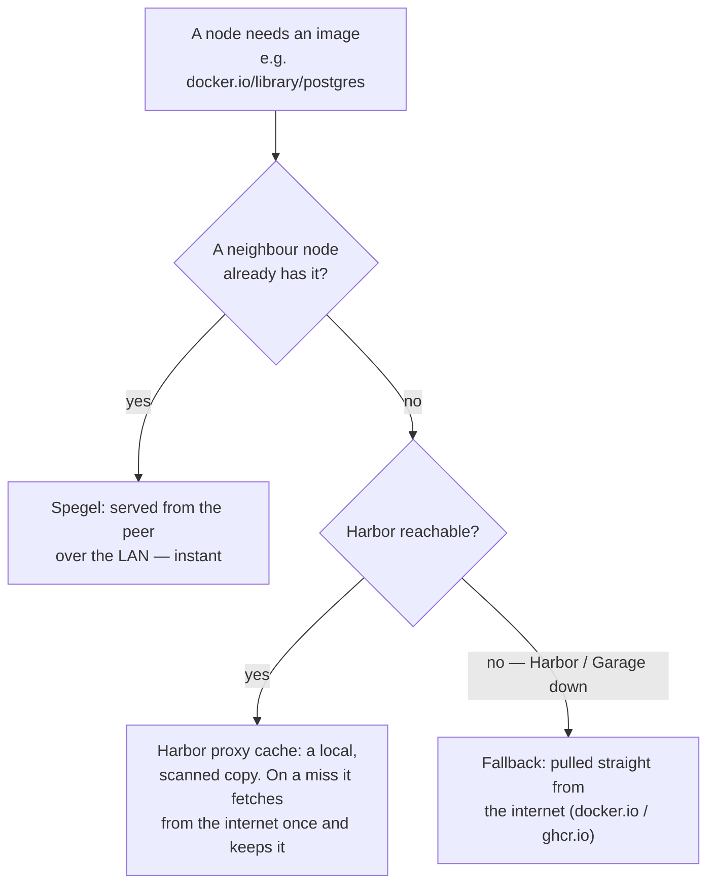
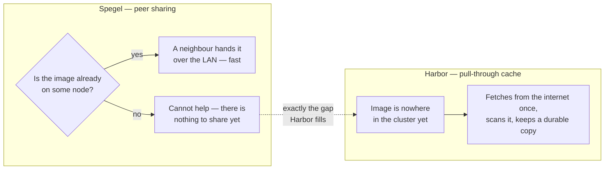
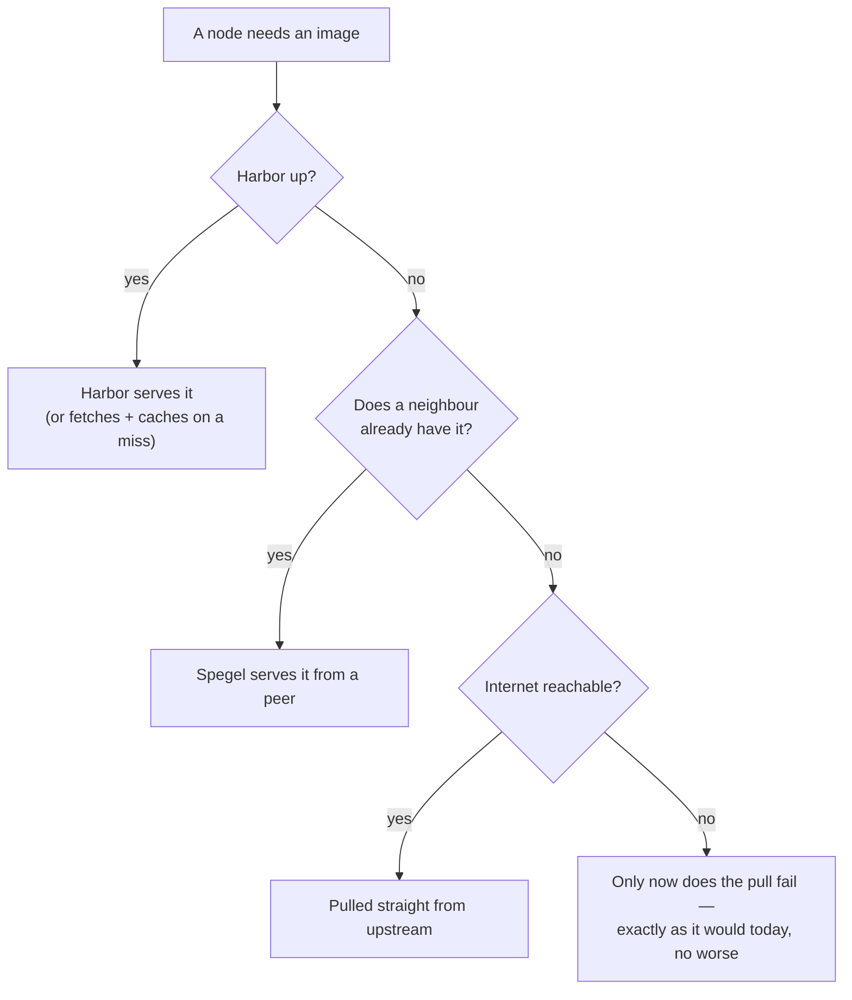

# Harbor as a Pull-Through Cache (Without Building a New SPOF)

### How to put a registry in front of every image pull the day after that same registry's storage took the cluster down

*Published 2026‑06‑13*

---

## The deceptively simple question

It started as a one-line ask: *can I move my docker and ghcr stuff to Harbor?* Harbor was already
running — LAN-only, blobs on Garage S3, SSO through Authentik. The cluster pulls something like 64
distinct third-party images: 23 from `docker.io`, 34 from `ghcr.io`, the rest from quay and the
Kubernetes registry. Pointing those at a local Harbor proxy-cache is a well-trodden path. You get
Docker Hub rate-limit relief, a local cache that survives upstream hiccups, and Trivy scanning
every image as it lands.

The reason this post exists is that the *obvious* way to do it is quietly dangerous, and I'd just
been handed a very expensive reminder of why.

## The thing that makes this not simple

A pull-through cache, done naively, means **every image pull in the cluster now depends on Harbor.**
And Harbor's blobs live on Garage S3 — the exact component whose outage, the night before, had
cascaded into a full storage collapse: instance managers OOM-killed, forty volumes faulted, every
database down, Harbor itself crashlooping. If the whole cluster had been pulling through Harbor that
night, recovery would have been a circular nightmare: nothing can pull the images it needs to
restart, because the thing that serves the images is the thing that's down.

So the real design question was never "can I proxy through Harbor." It was: **how do I put Harbor in
the pull path without making Harbor a single point of failure in the pull path?** Everything below
is the answer to that one question.

> A cache you can't survive losing isn't a cache. It's a dependency wearing a cache costume.

## Where the mirror lives matters more than that it exists

The instinct is to rewrite image references — change `docker.io/library/postgres` to
`harbor.../dockerhub/library/postgres` across the tree. Don't. That hard-codes Harbor into 64
manifests with no escape hatch, and the day Harbor is down, every one of them is stuck.

The right layer is **containerd's registry mirror** config, where a pull of `docker.io/...` is
*transparently* redirected — the manifest never changes, and crucially, containerd will **fall back
to the real upstream when the mirror is unreachable.** That fall-back is the whole ballgame. It's
what turns "Harbor is down" from an outage into a slowdown.

There was a wrinkle. This cluster already runs [Spegel](https://spegel.dev/), a peer-to-peer image
mirror that lets nodes share images they've already pulled — and Spegel *already owns* the
containerd mirror configuration on every node. Two things wanted to write the same files. I spent a
while in Spegel's and Talos's docs making sure I composed with it instead of fighting it, and the
answer turned out to be clean:

- **Talos `machine.registries.mirrors`** declares the Harbor endpoint *per registry* — `docker.io`
  → `harbor/v2/dockerhub`, `ghcr.io` → `harbor/v2/ghcr`. (Spegel's own `additionalMirrorTargets` is
  a single flat list applied to every registry, so it physically can't route two upstreams to two
  different Harbor project paths. Wrong tool.)
- **Spegel `prependExisting: true`** tells Spegel to *keep* the Talos-written Harbor mirror and
  prepend itself, rather than clobbering it.

Stack those and the resolved pull order on every node becomes:

> **Spegel peers → Harbor proxy cache → upstream registry.**



A node that has the image gets it from a neighbor instantly. A cache miss goes to Harbor. And if
Harbor — or Garage, or the Envoy gateway it routes through — is unreachable, containerd shrugs and
pulls straight from `docker.io`. The same mechanism makes cold boot safe for free: at bootstrap
Harbor isn't running yet, the mirror is unreachable, and every node just pulls upstream as if none
of this existed. The storage and bootstrap chain — Talos, Cilium, Longhorn, CNPG, OpenBao, Garage
itself — never routes through Harbor, and never needs to.

I verified all of this against the upstream docs before writing a line of node config, because
"fails open" is a claim you have to *earn*: Talos leaves `skipFallback` off by default, and since
1.9 it matches the CRI fallback behaviour (these nodes run 1.13.3). The full reasoning, with the
exact config, is in [ADR-0017](../adr/adr-0017-registry-mirror-talos-spegel.md).

## Spegel and Harbor do different jobs

It's tempting to lump Spegel and Harbor together as "the caching stuff," but they solve two
*different* halves of the problem, and the whole design only works because they **stack** rather
than compete.



**Spegel shares what the cluster already has.** Once any node has pulled an image, Spegel lets the
others grab it from that neighbour over the LAN instead of going back out to the internet. It's
instant — but it has a hard limit: it can only share an image *some node already holds*. Ask it for
something brand-new that nobody has pulled yet and it has nothing to give.

**Harbor fetches what the cluster doesn't have.** A proxy-cache project reaches out to the upstream
registry, pulls the image once, scans it, and keeps a durable copy on Garage. That is precisely the
gap Spegel can't fill — the *first* pull of an image nobody has seen.

So they aren't redundant; they're a relay. Spegel is the fast inner ring (peers), Harbor is the
durable, scanned middle ring (one local copy), and the public internet is the outer ring — the
source of truth, and the fallback. That's the ordering in the first diagram: a pull walks outward
only as far as it has to, and stops at the first ring that can answer.

Why not just point Spegel *at* Harbor and skip the node-level config entirely? Because Spegel's own
"additional mirror" setting is a single flat list applied to *every* registry identically — it
can't send `docker.io` to Harbor's `dockerhub` project and `ghcr.io` to Harbor's `ghcr` project,
which are two different URLs. Per-registry routing has to live one layer down, in the Talos node
config; Spegel only needs the one flag that says "keep what's already here and put yourself in
front of it."

And the reason all three rings earn their keep shows up the moment something breaks. Harbor sitting
on Garage was the dependency that worried me — so the question that actually matters is *what still
works when a ring is missing*:



Harbor down? Pulls fall through to the internet. Harbor *and* the internet both down? A node can
still get any image a neighbour already holds. The pull only fails in the one case where it would
have failed anyway today — Harbor never makes things *worse*. That is the entire bargain that made
it safe to add.

## The other half: Harbor has no operator

The Kubernetes side of this is GitOps as usual. The *Harbor* side isn't — proxy projects and
upstream registry endpoints are Harbor-internal objects you create through its API, and there's no
Harbor operator to declare them as custom resources. The tempting shortcut is to click them into the
Harbor UI once and forget it. But undeclared clickops is exactly the kind of state that vanishes
silently the next time Harbor's database is restored from backup — which, given the week I was
having, was not a hypothetical.

So the proxy config gets provisioned the same way OpenBao bootstraps itself here: an **idempotent
CronJob** that reconciles Harbor's state from a script — checks whether each endpoint and project
exists, creates only what's missing, treats "already there" as success, and re-runs hourly so a
Harbor rebuild self-heals on the next tick. It's **fail-soft** by design: if the upstream
credentials aren't in OpenBao yet, or Harbor is mid-restart, it logs and exits cleanly instead of
crashlooping. (That last detail is a scar from the same incident week — a different bootstrap Job
had been quietly piling up failed pods until they tripped the cluster's own health alerts. The
fix, `ttlSecondsAfterFinished` plus a history limit of one, is baked into this CronJob from the
start.) The rationale is [ADR-0018](../adr/adr-0018-harbor-config-idempotent-job.md).

The credentials themselves — a Docker Hub token, a GitHub PAT — exist only to lift the *upstream's*
anonymous rate limit. The Harbor proxy projects are public, so in-cluster pulls stay anonymous. The
tokens flow through the usual path: written once to OpenBao, surfaced as a Kubernetes Secret by
External Secrets, mounted optionally so their absence degrades gracefully instead of wedging the pod.

## Doing it in two phases, on purpose

The split that falls out of all this is what got built today versus what gets switched on
deliberately:

- **Phase 0 — the provisioning plane (shipped, and inert).** The ExternalSecret and the CronJob are
  in Git and reconciling now, but until someone runs `bao kv put secret/harbor/registry-proxy ...`
  the CronJob no-ops. Nothing about Harbor changes; nothing about image pulls changes. It's safe to
  land precisely because it does nothing until asked.
- **Phase 1 — the pull-path cutover (a deliberate, human-gated step).** Applying the Talos mirror
  config touches every node, and flipping it on the day after a storage incident is not a thing you
  do casually or autonomously. So it's a documented runbook: populate the creds, confirm a manual
  pull through the proxy works, apply the Talos patch one node at a time, set Spegel's flag — and
  then run the drill that matters most. **Scale Harbor to zero and confirm an uncached image still
  pulls.** If fallback doesn't work, you find out with one volume drained, not with the whole
  cluster wedged.

## Living with it: the happy path

Once Phase 1 lands, *using* the cache is the most boring part of the whole story — which is the
point. Your manifests never change. A pod that pulls `docker.io/library/postgres` just gets it,
transparently, from the nearest of three places: a neighbour node, Harbor's cache, or (if both are
cold or down) `docker.io` itself. The only thing you *notice* is that Docker Hub's rate-limit `429`s
stop and cold pulls speed up as the cache warms. There is no "it's all imported now" moment — the
cache only ever holds what something has actually pulled at least once. (The explicit form,
`docker pull harbor.$SECRET_DOMAIN/dockerhub/library/<repo>`, works today; the transparent form waits
on the Phase-1 mirror cutover.)

Publishing *my own* images is the deliberately-separate other half, and Harbor being
[LAN-only by design](../adr/adr-0005-lan-only-exposure.md) turns out to quietly answer "who's
allowed to push": only something already inside the perimeter. So the build-and-push runs on an
**in-cluster runner** (the ARC / Forgejo runners already on the LAN), authenticated as a scoped Harbor
*robot account*, into a private `webgrip` project:

```bash
docker login harbor.$SECRET_DOMAIN -u 'robot$webgrip+ci' -p "$TOKEN"
docker push  harbor.$SECRET_DOMAIN/webgrip/twitch-exporter:1.2.3
```

Workloads then pull `harbor.$SECRET_DOMAIN/webgrip/…` with a pull secret, like any private registry.
GitHub-hosted runners can't reach Harbor at all — which is the correct answer, not a workaround — so
that pipeline lives in the `webgrip/workflows` repo, while the Harbor side (the private project and the
robot's token, generated and vaulted in OpenBao) stays GitOps here. The step-by-step is in
[Runbook: Harbor](../runbooks/harbor.md#using-harbor-day-to-day-the-happy-path).

## What I actually learned

The technically interesting part of "move my registries to Harbor" turned out to have almost nothing
to do with Harbor. It was about **failure domains** — specifically, the discipline of adding a
component to a critical path *only* through a layer that fails open, and refusing to trust that it
fails open until you've watched it do so with the primary turned off.

The incident the night before wasn't a detour from this work. It was the brief. A homelab is where
you get to learn these lessons cheaply, on your own hardware, with nobody paged. The whole design is
written up in [RFC: Harbor Pull-Through Proxy Cache](../rfc/rfc-harbor-proxy-cache.md) — and
the most important sentence in it is the one promising that when Harbor falls over, the cluster
keeps pulling.
