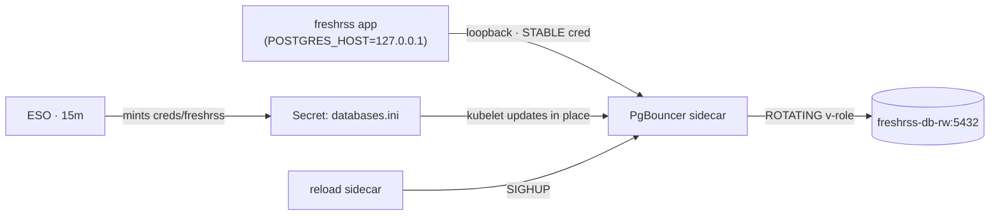

# The freshrss dynamic-credentials pilot: four bugs and a zero-downtime rotation

**2026-07-03**

freshrss now runs on **short-lived, auto-revoked Postgres credentials** minted by OpenBao, swapped
through a PgBouncer sidecar with **provably zero downtime** — a continuous probe fired 60 requests
straight through a forced credential rotation and every one returned `200`. This is the pilot for
[ADR-0016](../adr/adr-0016-openbao-dynamic-postgres-credentials.md); the concept is explained with
diagrams in [Dynamic database credentials — explained](../general/dynamic-db-credentials-explained.md)
and operated via the [runbook](../runbooks/dynamic-db-credentials.md). This post is the honest record
of *how it actually went* — because the pipeline was the easy 90%, and the pooler pod was a minefield.

## What shipped

Instead of a static Postgres password that lives forever, OpenBao's `database` engine mints a
throwaway role (`v-freshrss-…`) valid ~1h and drops it automatically. ESO couriers each fresh
credential into a Secret; a **PgBouncer sidecar** lets the app keep one stable loopback connection
while only the pooler's database-side credential rotates — so a leaked credential is worthless within
the hour, and rotation costs no restart.

**Evidence:** app session shows as a `v-…` role in `pg_stat_activity`; the reload sidecar logs
`SIGHUP → reloaded onto rotated backend cred`; **0 / 60** requests failed across a live rotation.

## Four bugs — every one caught in isolation, not on the live app

The pooler pod failed four different ways, each of which would take a single-replica app down (and
did, twice, before switching approach). The turning point was a **throwaway test harness**: a pod
mounting the *real* secrets, running the exact sidecars plus a psql client, with zero connection to
the live freshrss app.

| # | Symptom | Root cause | Fix |
|---|---|---|---|
| 1 | mint failed: `permission denied to grant role "freshrss"` | PG16+ needs **ADMIN OPTION** to grant a role; CNPG's `inRoles` gives plain membership | switched creation to `SET ROLE freshrss` + object grants — no admin option, no superuser, reproducible from Git |
| 2 | pgbouncer crash-loop: `should not run as root` | ran as uid 0 to write the socket dir; pgbouncer refuses root | run as uid 70 + pod `fsGroup 70` for the emptyDir |
| 3 | reloader silently never fired | Flux `envsubst` blanked the script's `$cur`/`$BACKEND` — a latent zero-downtime failure `flux-local` can't catch | escape shell vars as `$$` |
| 4 | pooler→DB: `password authentication failed for user "v-…"` | reading the **dynamic** creds path as two `data[]` entries minted **two** creds — username from one, password from another | single `dataFrom.extract` (one mint, matched pair) |

**Lesson banked:** never iterate a brand-new sidecar against a single-replica live app — each mistake
is an outage. Prove the pod in an isolated harness, then do one clean cutover. That is exactly how the
final cutover landed on the first try.

## The incident

The cutover reached `main` prematurely (a concurrent push bundled a locally-held commit) while the
mint was still blocked on bug #1 — so the pooler pod couldn't start, the HelmRelease upgrade timed
out, and freshrss flapped. It was rolled back to the static credential within minutes; the pipeline
stayed staged. This is why the test-harness approach replaced blind GitOps pushes for the rest.

## Security posture — the honest trade

Not "100% secure" — nothing is. It **shrinks** the blast radius of the app credential (short-lived,
attributable, non-exfiltratable from the app) at the cost of a new long-lived crown jewel and a little
pod-internal isolation.

| Residual risk | Severity | Blast radius | Bounded by / hardening |
|---|---|---|---|
| `vault_admin` long-lived & powerful | High | Create roles in **freshrss-db only** (not superuser, DB-scoped) | rotate it · confirm audit log · TLS · DB-scoped |
| `shareProcessNamespace` | Medium | Compromised app could reach pgbouncer's ≤1h cred via `/proc` | caps dropped (no PTRACE) · drop it via admin-console reload |
| Ephemeral roles get owner-level rights | Low–Med | Leaked ≤1h cred can DDL, not just DML | short-lived + attributable |
| NetworkPolicy is namespace-wide | Low | Any `security`-ns pod can reach the DB port (still needs a cred) | tighten to an OpenBao podSelector |
| pgbouncer→DB TLS is `prefer` | Low | Possible unverified hop inside the pod net | mitigated by Cilium WireGuard · set `verify-full` |
| etcd-at-rest / OpenBao audit | Verify | Secrets in etcd; attribution needs an audit device | confirm both enabled |

## Hardening & rollout roadmap

**Harden this route** (ordered by value): (P1 ✓, done) make the grant reproducible from Git via
object grants; (P2) drop `shareProcessNamespace` by reloading via pgbouncer's admin console + rotate
`vault_admin` + confirm the audit device; (P3) tighten the netpol to a podSelector, set `verify-full`
TLS, confirm etcd encryption-at-rest.

**Roll the pattern out — zero-downtime is mostly free.** Apps that can run two pods during a restart
get zero-downtime dynamic creds from an ordinary rolling restart — **no pooler**. Only single-replica
RWO apps need the sidecar.

| Phase | Apps | Engine | Mechanism |
|---|---|---|---|
| Done | freshrss | postgresql | PgBouncer sidecar ✓ |
| 2 | authentik, grafana, guac, backstage, devex, sparkyfitness | postgresql | rolling restart — free |
| 3 | n8n, forgejo, dependency-track | postgresql | reuse the freshrss pooler |
| 4 | invoiceninja · harbor | mysql | MySQL pooler · Harbor needs a Multi-Attach fix first |

At-rest encryption keys (n8n, authentik, dependency-track, invoiceninja, harbor) stay **un-rotatable** —
regenerating corrupts stored data, and OpenBao's transit engine is not a workaround because none of
those apps support an external KMS. See the [secret-rotation strategy](../general/secret-rotation-strategy.md)
for the full per-secret-class plan.

## See also

- [ADR-0016](../adr/adr-0016-openbao-dynamic-postgres-credentials.md) · [runbook](../runbooks/dynamic-db-credentials.md) · [explainer](../general/dynamic-db-credentials-explained.md) · [ADR-0015 rotation model](../adr/adr-0015-secret-rotation-model.md)
