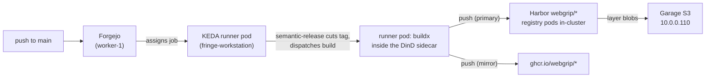
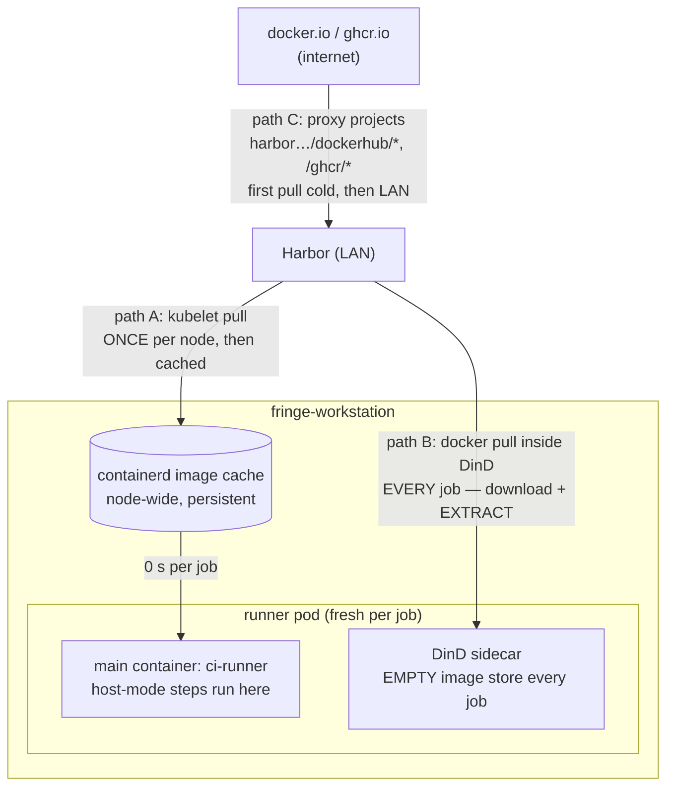
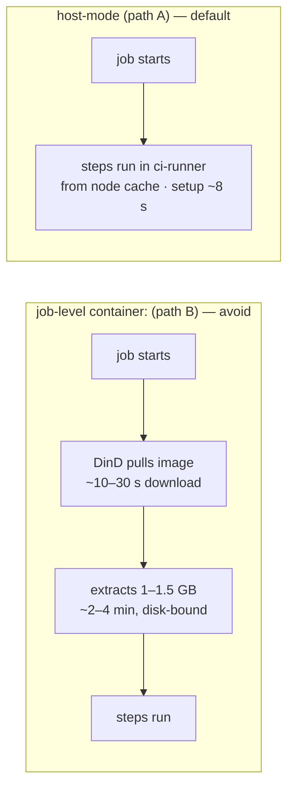

# CI image flow — who builds, who pulls, and where the minutes go

> Status: living · Companion to the [supply-chain pipeline](./supply-chain-pipeline.md) (trust:
> signing/verification), the [forgejo-runner runbook](../runbooks/forgejo-runner.md) (operating the
> pool), and [ADR-0026](../adr/adr-0026-rootless-ci-image-builds.md) /
> [ADR-0018](../adr/adr-0018-registry-blob-storage-garage-s3.md).

This page answers the mechanical questions: **on which machine** is an image built, **which
machine** pulls it, **through which path**, and **why each path costs what it costs**. Every
number here was measured on 2026-07-18 during the CI-stall investigation.

## The machines

| Machine | Role in the image flow | Disk that matters |
|---|---|---|
| **fringe-workstation** (8c / ~15 Gi) | Runs the KEDA runner pods — so all CI **builds** and all job-container **extractions** happen here. Also hosts Longhorn replicas and part of Harbor. | Single Micron M600 256 GB SATA SSD. **~12 MB/s effective writes under load; the cluster's #1 CI bottleneck.** |
| **worker-1** (4c) | Runs Forgejo + its Postgres — serves every `git clone`/push that CI does. | Samsung 870 EVO 1 TB (healthier, but shared with the DB — don't move CI here). |
| **Garage box** (`10.0.0.110`) | Harbor's **blob storage** (ADR-0018). Registry *processes* run in-cluster; the actual layer bytes live here. | Garage S3. |
| **soyos ×3** | Control plane only. No CI, by doctrine. | — |

## Build path (first-party images)

A change under `ops/docker/**` in `webgrip/infrastructure` releases and publishes like this:

Wall-clock for a `ci-runner`-sized release: **~20–25 min** end-to-end (semantic-release ~6 min,
image build+dual-push ~15 min) — dominated by `apt`/`npm` inside the build and by fringe's disk.
Buildx layer-cache in Harbor (`:cache` ref) makes no-Dockerfile-change rebuilds much cheaper.

## Pull paths — the part that was misunderstood

There are **three distinct pull paths**, and they have wildly different costs. Confusing them is
how "jobs keep stalling" went undiagnosed:

| Path | When it happens | Measured cost | Why |
|---|---|---|---|
| **A — kubelet → containerd** (the runner pod's own images: `ci-runner`, dind, runner-bin) | Once per node per new digest | First pull: minutes. **Every job after: 0 s** — `already present on machine`. | containerd's cache is node-wide and persistent. This is what host-mode exploits. |
| **B — `docker pull` inside the DinD** (any job-level `container:` in a workflow) | **Every single job** | node:24-trixie from Docker Hub: **4 m 10 s**. Same-size image from LAN Harbor: **3 m 38 s**. | Each ephemeral pod gets a fresh DinD with an empty store. Download is cheap (1.4 GB warm from Harbor = **11.9 s** on the LAN); the cost is **extraction** — gunzip + writing tens of thousands of small files through overlayfs onto fringe's ~12 MB/s SSD. During a pull the node sits at 77–97 % IO-stall, and the network goes idle ~90 s before `image pulled` fires. |
| **C — Harbor pull-through proxies** (`…/dockerhub/*`, `…/ghcr/*`, `…/quay/*`, …) | First request per upstream digest | Cold: upstream internet fetch (minutes for big images). Warm: LAN speed. | Harbor caches upstream layers into Garage. The **ghcr proxy holds upstream credentials**, so it can even serve *private* `ghcr.io/webgrip/*` packages to anonymous LAN pullers. |

**The trap:** swapping the registry only changes the *download* half of path B — which was never
the bottleneck. That's why the Docker Hub → Harbor swap moved a job from 4 m 10 s to only
3 m 38 s. Eliminating path B entirely (host-mode → path A) moved it to **8 s**.

## The two consumption patterns

- **Host-mode (default).** `runs-on: docker` with **no `container:`** — steps execute in the
  runner's own `ci-runner` toolchain (node 24, python3+PyYAML, php, dotnet, git, docker CLI,
  claude). Measured on ai-skills: setup **4 m 38 s → 8 s**, full release pipeline ~10 m → 81 s.
  Adding a tool to `ci-runner` is nearly free at job time — the image is pulled per *node*, not
  per job.
- **Job-level `container:` (exception, budget for it).** Only when the toolchain genuinely can't
  live in `ci-runner` (e.g. techdocs' mkdocs/plantuml stack). Each run pays the ~3 min
  extraction. Acceptable for infrequent jobs; **never** for per-PR paths. If you must, pull via
  a Harbor path (proxy or first-party), not bare `docker.io/...` — path C at least removes the
  internet and rate limits.

## Second-order effect worth knowing

When path-B extractions saturate fringe's disk, the DinD sidecar's startup probe (`docker info`)
answers slowly; with the old 1 s timeout, **healthy daemons failed their probes**, fresh warm
pods hung in `Init`, and runner capacity collapsed exactly when the queue was deepest — the
"jobs blocked" experience. The probe now allows 5 s per attempt. The real cure is fewer path-B
consumers (roadmap #343: the shared reusables still run `container: node:22`).

## Rules of thumb

1. New CI job? **Host-mode first.** Reach for `container:` only with a reason, and write the
   reason next to it.
2. Tool missing in CI? **Bake it into `ci-runner`** (`webgrip/infrastructure`,
   `ops/docker/ci-runner/`) — don't `apt-get`/`npm i -g` per job, and don't add a container.
3. Any image reference in CI or manifests: **Harbor path, never bare `docker.io`/`ghcr.io`**.
   First-party → `harbor…/webgrip/*` (needs `harbor-pull`); third-party → the proxy projects.
4. A "stalled" job with a `container:` line is almost certainly in extraction. Check
   fringe's IO-stall before blaming the network — `rate(node_pressure_io_waiting_seconds_total{instance="10.0.0.23:9100"}[2m])`.
