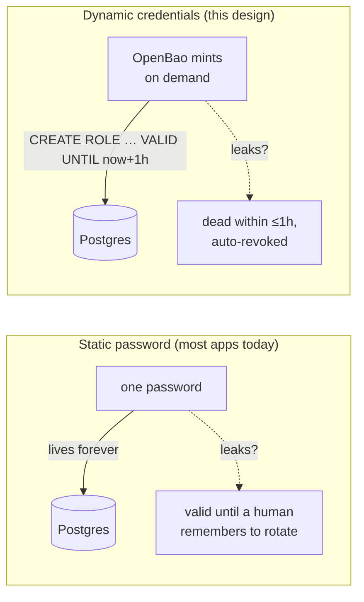
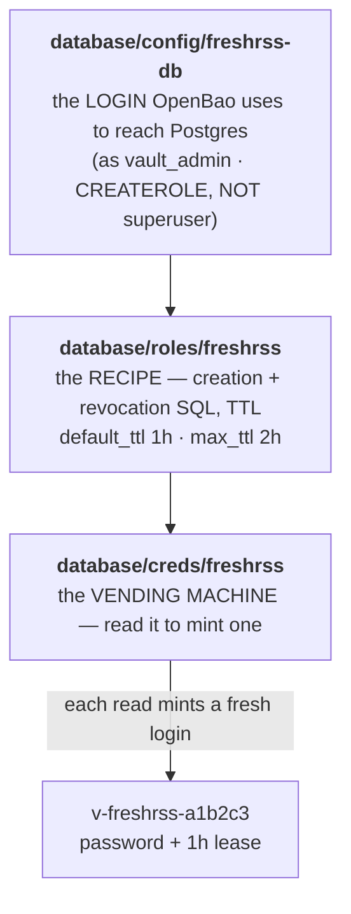
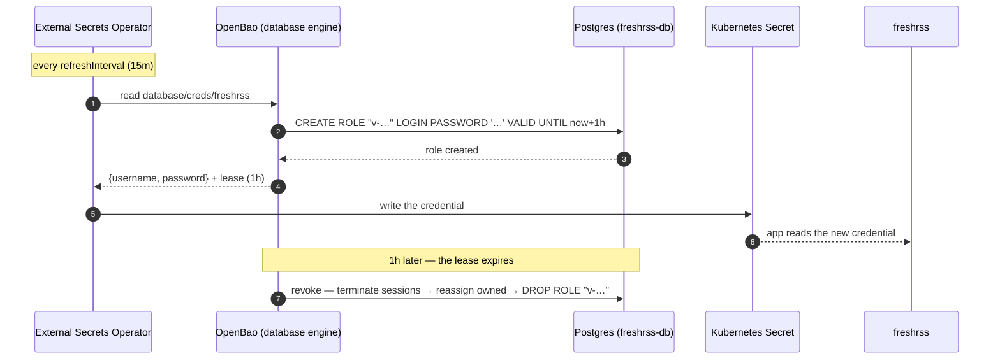
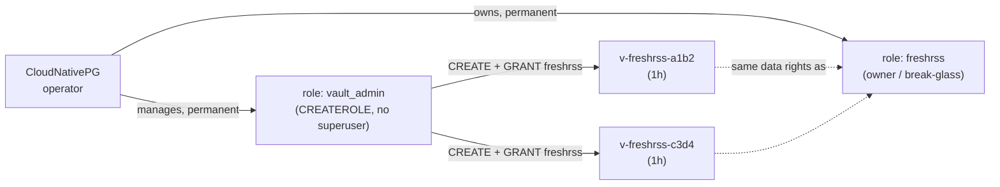
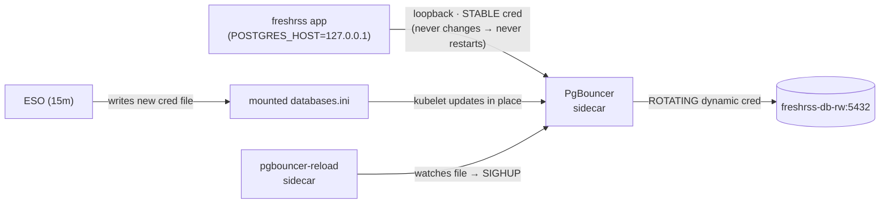

# Dynamic database credentials — explained (with diagrams)

A from-scratch explainer of how OpenBao mints short-lived Postgres logins and how they reach a
running pod with **zero downtime**. For the operational side (verify, troubleshoot, rollback) see
the [runbook](../runbooks/dynamic-db-credentials.md); for the decision, [ADR-0016](../adr/adr-0016-openbao-dynamic-postgres-credentials.md).

> These diagrams render on GitHub and in the techdocs site (Mermaid). Pilot app: **freshrss**.
>
> **Status (2026-07-02):** the pipeline below is staged (engine, store, `vault_admin` live), but
> the freshrss app cutover is **rolled back** — applied (`678b1da`), reverted (`03f222e`, PG16
> `ADMIN OPTION` mint failure), re-applied by accident (`e805c83a`), re-reverted (`391eeb19`;
> the PgBouncer sidecar needs hands-on runtime iteration). Track it in ADR-0016's Status log.

## 1. The core idea — store a *recipe*, not a *value*

A static password lives forever, so a leak is valid until a human rotates it. OpenBao instead stores
*how to make* a credential: on demand it runs `CREATE ROLE … VALID UNTIL now+1h`, hands back that
throwaway login, and remembers to `DROP` it in an hour (a **lease**).



## 2. The engine's three sub-paths — setup → recipe → vending machine

Everything lives under one mount, `database/`:



## 3. How a credential travels from OpenBao into the pod

The app never talks to OpenBao. **External Secrets Operator (ESO)** is the courier: it reads
`database/creds/freshrss` on a schedule and writes a normal Kubernetes Secret.



**The key quirk:** ESO does not *renew* a lease — every refresh mints a **new** one, and the old one
just lives out its TTL and is auto-dropped. So `refreshInterval` (15m) must be **shorter** than
`default_ttl` (1h) — that gap is the overlap that makes rotation seamless.

## 4. The CNPG boundary — why nothing fights

CloudNativePG owns the app's real role, `freshrss`. Dynamic creds don't replace it — OpenBao mints
*separate* disposable roles that are granted the same data rights as `freshrss`.



> The `GRANT freshrss TO "v-…"` step needs `vault_admin` to hold **ADMIN OPTION** on `freshrss`
> (a PostgreSQL 16+ rule). That one grant is the single manual/bootstrap prerequisite — see the
> runbook. The revocation is deliberately defensive: a bare `DROP ROLE` fails if the role owns
> objects or has open sessions, so it terminates sessions → reassigns owned objects → drops.

## 5. Zero downtime — the PgBouncer sidecar

freshrss reads its DB password **once, at container start**, and is a single-replica app on an RWO
disk — so a normal rotation would mean a pod restart (an outage) every time. The fix is a tiny
**PgBouncer** pooler in the same pod. The app connects to it over `localhost` with a **stable**
password that never changes; only *PgBouncer's* connection to Postgres uses the rotating credential.



When the credential rotates, a small reload sidecar notices the file changed and sends PgBouncer a
`SIGHUP`. PgBouncer swaps its **server-side** connections onto the new credential **without dropping
the app's connections**:

```mermaid
sequenceDiagram
  autonumber
  participant ESO
  participant File as mounted databases.ini
  participant RL as pgbouncer-reload
  participant PB as PgBouncer
  participant App as freshrss
  Note over App,PB: app holds live connections on cred v-A (still valid)
  ESO->>File: write new cred (user = v-B)
  Note over File: kubelet updates the file in place — no restart
  RL->>PB: SIGHUP (reload)
  PB->>PB: new server connections use v-B; in-flight ones finish on v-A
  Note over App: client connections are never dropped → zero downtime
  Note over PB: ~45 min later v-A's lease expires → OpenBao drops it
```

## 6. Why the timing never gaps — lease overlap

Because ESO mints `v-B` ~45 minutes before `v-A` expires, there's a long window where **both** work.
The reload takes ~90 seconds — a rounding error inside that window — so no request ever hits an
expired credential.

```mermaid
gantt
  title Lease overlap — default_ttl 1h, refreshInterval 15m
  dateFormat HH:mm
  axisFormat %H:%M
  section Credential v-A
  valid & in use              :done, a1, 00:00, 60m
  section Credential v-B
  minted, PgBouncer switches   :active, b1, 00:15, 60m
  section Reload
  ESO mints v-B + SIGHUP (~90s) :milestone, m1, 00:15, 0m
```



## When you need the pooler (and when you don't)

The pooler exists to solve **restart-on-rotation** for an app that can't restart cheaply. The
discriminator is *"can two of the app's pods run at once during a restart?"*

- **Yes** (multi-replica / stateless, no single-attach RWO volume) → an ordinary rolling restart is
  already zero-downtime. Just use dynamic creds + a longer TTL. **No pooler.**
- **No** (single-replica + RWO, like freshrss) → you need the PgBouncer sidecar.

## Glossary

| Term | Meaning |
|---|---|
| **Lease** | OpenBao's timer binding a credential to an expiry; on expiry OpenBao revokes (drops) the role. |
| **TTL** | How long a lease lives (`default_ttl` 1h, `max_ttl` 2h here). |
| **`vault_admin`** | The `CREATEROLE` (not superuser) role OpenBao logs in as to mint/drop the disposable roles. |
| **Ephemeral role** | The `v-freshrss-…` login OpenBao creates per lease; granted the same rights as `freshrss`. |
| **ESO** | External Secrets Operator — reads OpenBao and writes Kubernetes Secrets; re-reads (new lease) each refresh. |
| **PgBouncer** | A connection pooler; here a pod sidecar that lets the app keep a stable local login while the DB-side login rotates. |
