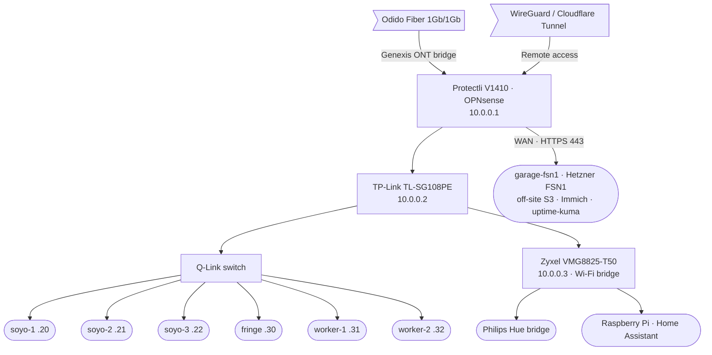

# Infrastructure at a glance

Every machine, every disk, every address. **Measured from the hardware**
(`talosctl get cpu|memorymodules|disks`, `ssh`), not copied forward from older
docs — an audit on 2026-08-02 found the previous inventory wrong about node
count, RAM, disk sizes and Talos version.

Last verified: **2026-08-02**.

---

## The fleet

| Node | Addr | CPU | RAM | Storage | Pool / cpu / ram | Longhorn |
|---|---|---|---|---|---|---|
| `soyo-1` | `10.0.0.20` | Intel N150 · 4C/4T | 12 GB | 512 GB WUXIN G15 SSD | `soyo` / `standard` / `low` | no |
| `soyo-2` | `10.0.0.21` | Intel N150 · 4C/4T | 12 GB | 512 GB WUXIN G15 SSD | `soyo` / `standard` / `low` | no |
| `soyo-3` | `10.0.0.22` | Intel N150 · 4C/4T | 12 GB | 512 GB WUXIN G15 SSD | `soyo` / `standard` / `low` | no |
| `fringe-workstation` | `10.0.0.23` | i7-4770 · 4C/8T · 3.4 GHz | 16 GB | 256 GB Micron SSD + 1 TB Seagate HDD | `worker` / `high` / `standard` | yes |
| `worker-1` | `10.0.0.24` | i5-4670K · 4C · 3.4 GHz | 24 GB | 1 TB Samsung 870 SSD | `worker` / `standard` / `high` | yes |
| `worker-2` | `10.0.0.32` | i7-6700K · 4C/8T · 4.0 GHz | 16 GB | **2 TB Samsung 990 EVO Plus NVMe** + 250 GB 850 + 1 TB 860 SSD + 1 TB Seagate HDD + 2 TB Samsung HDD | `worker` / `high` / `standard` | yes |

**Totals:** 6 nodes · 24 cores · 96 GB RAM · Talos v1.13.4 (worker-2: v1.13.7) · Kubernetes v1.36.1

The three `soyo` boxes are the control plane and also schedule workloads.
`worker-2` is the reclaimed Proxmox host, wiped and rejoined 2026-08-02.

### Off-site

| Host | Addr | CPU | RAM | Storage | Runs |
|---|---|---|---|---|---|
| `garage-fsn1` (Hetzner FSN1) | `116.202.53.185` · `2a01:4f8:231:37df::2` | i7-6700 · 4C/8T | 62 GB | 2 × 512 GB Samsung NVMe · **RAID1**, 452 GB usable | Garage S3 (all backups), Immich, uptime-kuma |

Everything on it binds to **loopback**; Caddy on 443 is the only public path.
nftables allows 22/80/443 and nothing else. Garage's admin API (3903) is
deliberately unreachable — it can mint keys and delete buckets.

---

## What the labels decide

Placement is label-driven, never hostname-pinned ([ADR-0001](../adr/adr-0001-node-taxonomy.md)).

| Label | Values | Meaning |
|---|---|---|
| `node.webgrip.io/pool` | `soyo` · `worker` | `soyo` = control plane + recovery brain. Apps hard-pin to `worker`. |
| `node.webgrip.io/cpu` | `standard` · `high` | `high` = fringe + worker-2. Authentik and other latency-sensitive apps pin here. |
| `node.webgrip.io/ram` | `low` · `standard` · `high` | `high` = worker-1 only (24 GB). |
| `storage.webgrip.io/longhorn` | `"true"` | Node may host Longhorn replicas. Workers only ([ADR-0008](../adr/adr-0008-confine-longhorn-to-workers.md)). |

!!! warning "`cpu=high` used to be a single point of failure"
    Until worker-2 joined, `cpu=high` resolved to **fringe alone**. Every
    `cpu=high` workload concentrated on one node, which is a large part of why
    fringe OOM-thrashed on 2026-08-01/02 and lost its CNI. Two `high` nodes
    means the scheduler has a choice — keep it that way.

---

## Storage

| Tier | Where | Holds |
|---|---|---|
| **Longhorn** (in-cluster block) | worker-1, worker-2, fringe | All PVCs. Replicas need ≥2 schedulable storage nodes. |
| **Garage S3 — in-cluster** (ns `garage`) | `garage-s3.garage.svc:3900` | Harbor registry blobs **only** ([ADR-0018](../adr/adr-0018-registry-blob-storage-garage-s3.md)) |
| **Garage S3 — off-site** | `https://s3-offsite.webgrip.dev` | CNPG WAL + base backups, Longhorn backups, OpenBao snapshots, Forgejo LFS/attachments, guac SBOMs, invoiceninja dumps |

!!! danger "One storage node is not enough"
    With only worker-1 schedulable, 58 of 69 volumes sat `degraded` and **no PVC
    in the cluster could be expanded at all** — Longhorn refuses with `cannot
    expand volume before replica scheduling success`. If you ever drop back to a
    single storage node, expect both symptoms to return.

---

## Network



### Address map

| Range | Use |
|---|---|
| `10.0.0.1` – `.3` | Router, managed switch, Wi-Fi bridge |
| `10.0.0.20` – `.24` | Talos control plane (`.23`–`.24` free once workers renumber) |
| `10.0.0.25` | Kubernetes / Talos API VIP |
| `10.0.0.26` | `k8s-gateway` — split-DNS responder |
| `10.0.0.27` | `envoy-internal` — LAN-only ingress |
| `10.0.0.28` | `envoy-external` — public ingress origin |
| `10.0.0.30` – `.39` | Talos workers — `fringe` `.30`, `worker-1` `.31`, `worker-2` `.32` |
| `10.0.0.40` – `.49` | Other static infra (Home Assistant, Hue) |
| `10.0.0.50` – `.150` | **DHCP scope** |

!!! note "Renumbering in progress"
    The worker block is the target layout, not yet fully applied. `worker-2` is
    live on `10.0.0.29` until its `.32` config is applied; `worker-1` and `fringe`
    still sit at `.24` and `.23`. Renumber only when the node is quiet — Longhorn
    replicas and etcd do not enjoy address changes mid-rebuild.

### DNS

OPNsense runs split-horizon: every `*.${SECRET_DOMAIN}` lookup goes to
`k8s-gateway` (`10.0.0.26`), which answers for in-cluster HTTPRoutes/Services.

!!! note "Off-cluster names under the same domain"
    `k8s-gateway` is **authoritative** for the domain, so it NXDOMAINs anything
    it does not itself host — which silently broke `s3-offsite`, `immich`,
    `uptime` and `hetzner` for every LAN client. Two things make them resolve:
    `fallthrough` on k8s-gateway (forwarding to `1.1.1.1`/`1.0.0.1`, **not**
    `/etc/resolv.conf` — that is CoreDNS and creates a loop), plus a
    longest-match CoreDNS zone for pods. Adding public A records alone does
    nothing, because the LAN never asks a public resolver for this domain.

---

## Upgrade headroom

| Node | Opportunity |
|---|---|
| `worker-2` | **2 free DIMM slots** — 2 × 8 GB DDR4-2133 (Kingston HyperX KHX2133C14/8G) takes it to 32 GB and `ram=high`. The cheapest meaningful capacity win available; source secondhand via Tweakers V&A or Kleinanzeigen. |
| `worker-2` | Four SATA disks (250 GB + 1 TB SSD, 1 TB + 2 TB HDD) are **installed but unused** — Talos installs to the NVMe only. Candidates for a Longhorn cold tier ([ADR-0009](../adr/adr-0009-longhorn-hot-cold-tiers.md)). |
| `fringe-workstation` | 16 GB and a history of memory-pressure incidents. The smallest worker doing the most volatile work (CI, dind). |
| control plane | 12 GB each, running apiserver + etcd + kubelet. `kube-apiserver` reached 7.4 GB RSS on 2026-08-02 and took two nodes down; now bounded by `GOMEMLIMIT=4GiB`. |

---

## Operating it

Everything imperative lives in the root **`justfile`** — one task runner, no second
one. (Taskfile/`.taskfiles/` were removed 2026-08-02.) Tools are pinned in
`.mise.toml`, so always go through mise:

```bash
mise exec -- just --list      # every recipe, grouped
```

| Group | What it covers |
|---|---|
| `cluster` | `reconcile` — force Flux to pull from Git |
| `validate` | `flux-local` (auto-scoped, seconds) · `flux-local-full` (~20min) · `kyverno-test` · `kyverno-chainsaw` · `verify-oci-digests` · `update-oci-digests` |
| `talos` | `talos-generate-config` · `talos-apply-node` · `talos-apply-node-safe` · `talos-upgrade-node` · `talos-upgrade-k8s` · `talos-reset` |
| `bootstrap` | `bootstrap-talos` · `bootstrap-apps` — building a cluster from nothing |
| `secrets` | `bao-login` · `harbor-s3-cred` · `ntfy-auth-cred` — one-time OpenBao seeding via `gum` prompts |

Talos recipe arguments are **positional**: `<node> [at] [mode] [insecure]`.
`node` is a hostname *or* the address in `talconfig.yaml`; `at` is where the
machine answers **right now**, which differs from `node` in exactly two cases —
a fresh node still on DHCP in maintenance mode, and any node mid-renumber.

```bash
mise exec -- just talos-apply-node worker-1 '' no-reboot   # live label change, never reboots
mise exec -- just talos-apply-node-safe worker-1           # drain → apply → wait Ready → uncordon
mise exec -- just talos-apply-node worker-2 10.0.0.29      # config says .32, machine is still at .29
```

!!! note "`just` has no `preconditions:`"
    Taskfile's precondition blocks caught real mistakes during the 2026-08-02
    node work — an empty node name, a missing rendered config, a node that was
    not listening. They are re-implemented as explicit `_need` / `_file` guards
    plus a reachability probe in each recipe. Keep them: a `talosctl` command
    built from an empty variable still does something, just not what you meant.
