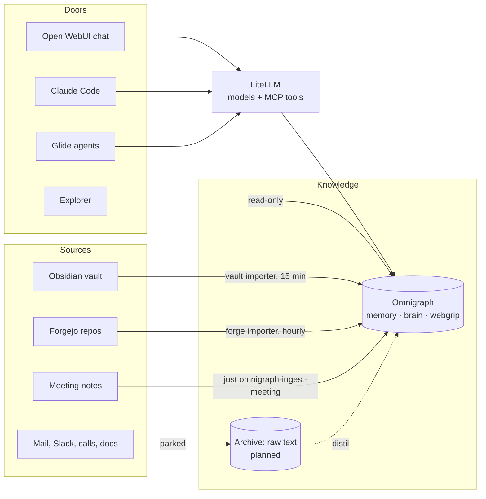

# Knowledge system

How the second brain, agent memory and company knowledge fit together, and how to use them.
Operations (tokens, importers, upgrades, failures) live in the [Omnigraph runbook](../runbooks/omnigraph.md)
and the [Open WebUI runbook](../runbooks/open-webui.md). Epic: VIK-1259.

## In one paragraph

Knowledge lives in **Omnigraph**, a graph database with git-style branches, running in the cluster.
You and your AI assistants reach it through **LiteLLM**, which is the single gateway for models *and*
tools. Importers keep it fed from Obsidian and Forgejo. Every AI client has its own identity with a
written policy: your own assistant writes straight in, background agents only propose on branches, and
**only you merge**. Every write is a commit, so anything can be traced and undone.

## The layers



| Layer | Holds | Good for | Status |
|---|---|---|---|
| **Archive** (raw data) | Every email, message, transcript and document, whole | "Find where X was said" | Parked, see the [personal archive RFC](../rfc/rfc-personal-archive.md) |
| **Omnigraph** (knowledge) | People, organisations, projects, notes, decisions, tasks and the links between them, each pointing at its source | "What do I owe whom", "which decisions touch client X" | Live |

Omnigraph does not replace the raw data. Short, self-written material (Obsidian notes, READMEs, ADRs,
issues) goes straight into the graph; long or bulk text belongs in the archive once it exists.

## The graphs

| Graph | What it is | Who writes `main` |
|---|---|---|
| `brain` | Your second brain: notes, people, tasks, projects, Forgejo, Obsidian | You, your chat and Claude Code, the Obsidian and Forgejo importers |
| `memory` | What AI agents learn across sessions | You (agents propose on branches) |
| `webgrip` | Company meetings: decisions and action items. Each client gets its own sealed `client-<name>` graph | You (meeting ingests land on `ingest/*` branches) |

## How things get in

| Source | How | Lands | You do |
|---|---|---|---|
| **Talking to it** | "Remember …" in the chat or Claude Code | `brain` `main`, at once | Nothing |
| **Obsidian** | Obsidian Git pushes the vault to `webgrip/obsidian-vault`; the importer syncs every 15 minutes | `brain` `main`; `[[links]]` become links, daily notes become journal entries, notes matching a client term get the tag `client` | One-time setup: [Obsidian vault](../runbooks/omnigraph.md#obsidian-vault) |
| **Forgejo** | Hourly importer over every repo you can see | `brain` `main`: repos as projects, READMEs, `docs/`, ADRs as decisions, issues, PRs, people | One-time: a read-only token, see [Forgejo projects](../runbooks/omnigraph.md#forgejo-projects) |
| **Meeting notes** | `just omnigraph-ingest-meeting <graph> extraction.json notes.txt` | An `ingest/*` branch of `webgrip` or a client graph | Review and merge |
| **Glide agents** | Their own tools through LiteLLM | A `glide/<run>` branch of `memory`, `brain` or `webgrip` | Review and merge |
| **Mail, Slack, calls, documentation** | Through the archive | Archive first, distilled into the graph | Parked |

## How to use it

### Chat: `https://chat.<domain>`

1. Pick a model. The default, `chat-default`, is Fireworks Qwen with the cheapest DeepSeek model as fallback; the Claude models stay selectable.
2. Under the message box, open the tools menu and switch on **Omnigraph**, once per chat.
3. Talk to it. You see a tool call each time it reads or writes the graph.

| You want to | Say |
|---|---|
| Capture | "Remember: the heat pump needs a service every 2 years, last done March 2026." |
| Track a promise | "Add a task: send Pieter the quote by Friday, I owe him." |
| Record a person | "Remember Jan: works at Client X, prefers calls." |
| Recall | "What do I know about Jan?" · "What have I promised people?" |
| Use your projects | "Which of my repos have open issues?" · "What do my ADRs say about secrets?" |
| Review | "What did I save this week?" |

The chat's key sees `memory` and `brain` only. It cannot see `webgrip` or the Glide tools.

### Claude Code

Connect once (the key never prints):

```bash
export BAO_ADDR="$(just bao-addr)"
bao token lookup >/dev/null 2>&1 || bao login -method=oidc
claude mcp add --transport http --scope user omnigraph \
  "https://$(kubectl get httproute litellm -n ai -o jsonpath='{.spec.hostnames[0]}')/mcp/" \
  --header "Authorization: Bearer $(bao kv get -mount=secret -field=key litellm/keys/claude-code)"
```

`claude mcp list` should show `omnigraph ✔ Connected`. New tools load when a session starts, so
restart Claude Code once. Then ask in any session: "check my brain for …", "remember that …". The
key is tools-only (it cannot call models) with a small budget.

### Explorer: `https://graph.<domain>`

A read-only visual map of `brain`, `memory` and `webgrip`. Pick a graph at the top, search with `/`,
click a node to inspect it, press `F` to fit. With only one or two nodes the camera jumps while it
loads (VIK-1296); it settles once there is real content.

### Terminal

`just omnigraph-login` caches your own token (`act-ryan`, the only identity that can merge) in
`~/.omnigraph/credentials`. After that the `omnigraph` CLI works against the `homelab` server, for
example `omnigraph branch list --server homelab --graph brain`.

### Glide agents

A Glide run reaches `memory`, `brain` and `webgrip` through the `omnigraph_glide_*` tools in LiteLLM.
It reads `main` freely and writes only on its own branch, `glide/<run>`. The cluster side is live; the
Glide side (handing each run its tools) is VIK-1300, specified in
[Glide runs on Omnigraph](../rfc/spec-glide-omnigraph.md).

## Branches and review

`main` is protected on every graph. What each writer may do:

| Writer | Identity | Writes | Merges |
|---|---|---|---|
| You (CLI) | `act-ryan` | Anywhere | Yes |
| Your chat and Claude Code | `act-brain-agent` | `brain` `main` directly | No |
| Obsidian importer | `act-vault-import` | Its own `obsidian/` notes on `brain` `main` | No |
| Forgejo importer | `act-forge-import` | Its own `forge/` rows on `brain` `main` | No |
| Glide agents | `act-glide` | Unprotected branches (`glide/<run>`) of all three graphs | No |
| In-cluster agents on `memory` | `act-agent` | Their own branches of `memory` | No |
| Meeting ingest | `act-ingest` | `ingest/*` branches; cannot read | No |
| Explorer | `act-explorer` | Nothing | No |

**Reviewing a branch today**, as yourself:

```bash
omnigraph branch list --server homelab --graph brain
omnigraph commit list --server homelab --graph brain --branch glide/<run> --json
omnigraph branch merge glide/<run> --into main --server homelab --graph brain
omnigraph branch delete glide/<run> --server homelab --graph brain --yes
```

If `main` changed the same row since the branch was made, the merge is refused and names the conflicting rows. Write the value you want on `main`, then merge again; see [merge conflicts](../runbooks/omnigraph.md#merge-conflicts). A one-click review screen is VIK-1258.

**Keep branches short-lived.** Any open branch on a graph blocks the next schema change to that graph,
and a failed schema apply stops every graph until it is fixed. Merge or delete branches instead of
letting them pile up. Details: [open `glide/*` branches block schema
changes](../runbooks/omnigraph.md#open-glide-branches-block-schema-changes).

## Safety

| Concern | How it is handled |
|---|---|
| Who can reach it | LAN only, through `envoy-internal`. Nothing is on the internet. |
| Who can log in | Authentik at the gateway. The chat also requires the `knowledge-graph-chatters` group, the explorer `knowledge-graph-viewers`; both hold only you. |
| What an AI may do | Its identity's policy, enforced by Omnigraph on every request, whatever the model is told. |
| Which tools a key sees | LiteLLM `object_permission.mcp_access_groups` per key: chat and Claude Code `memory` + `brain`; Glide runs `glide`. |
| Secrets | Generated in the cluster, stored in OpenBao, delivered by External Secrets. Never in git. |
| Mistakes | Every write is a commit. Find it with `commit list`, undo it with a follow-up write or by restoring from history. |

**Residual risks, stated plainly:**

- **Prompt injection.** Imported text (an issue, a doc, a note) can carry instructions aimed at the
  model. Your chat and Claude Code write `brain` `main` directly, so an injected instruction could add or
  change rows there. The commit history shows it and allows undo; it does not prevent it. Glide writes
  wait for your merge.
- **Where your data goes.** Whatever the model reads is sent to the model's provider. The owner rule
  (2026-09-28): everything runs through LiteLLM, Fireworks first, the cheapest DeepSeek model as the
  fallback, Claude on request. Client content may reach all three, so a Fireworks outage sends chats,
  client material included, to DeepSeek.
- **Branch names are a convention.** Omnigraph protects `main`, not a name prefix, so a Glide run could
  write on another unprotected branch. `main` stays protected.
- **Deleting is not forgetting.** Old versions stay in the storage files until a cleanup runs. For real
  erasure follow [forget a meeting](../runbooks/omnigraph.md#forget-a-meeting).

## When something looks wrong

| Symptom | Likely cause | Fix |
|---|---|---|
| Chat page reloads in a loop | A stale cached page from an expired session | Ctrl+Shift+R once; sessions now refresh themselves |
| "Something went wrong" at Authentik | A leftover login attempt | Close all chat and Authentik tabs, open the chat again |
| The model answers without calling a tool | Omnigraph is not switched on in that chat | Tools menu, switch on Omnigraph |
| A tool call answers 403 | The identity is not allowed that action (for example a Glide write to `main`) | Expected; work on a branch and merge as yourself |
| New notes are found by keyword but not by meaning | Vectors are filled at the nightly restart | Wait until after 03:15 |
| `OmnigraphVaultImportStale` or `OmnigraphForgeImportStale` | The importer's setup is incomplete or it failed | See the importer's section in the [runbook](../runbooks/omnigraph.md) |
| Claude answers look like DeepSeek | The Anthropic key failed and LiteLLM fell back | Check the key in OpenBao (`secret/litellm`); VIK-1251 adds an alert |

## Roadmap

| Ticket | What |
|---|---|
| VIK-1258 | One-click review and merge of branches |
| VIK-1300 | Glide hands each run its Omnigraph tools |
| VIK-1260 | The archive layer, then mail (VIK-1254), Slack (VIK-1290), calls (VIK-1253) |
| VIK-1251 | Alert when Claude requests silently fall back |
| VIK-1296 | Explorer camera on tiny graphs |
