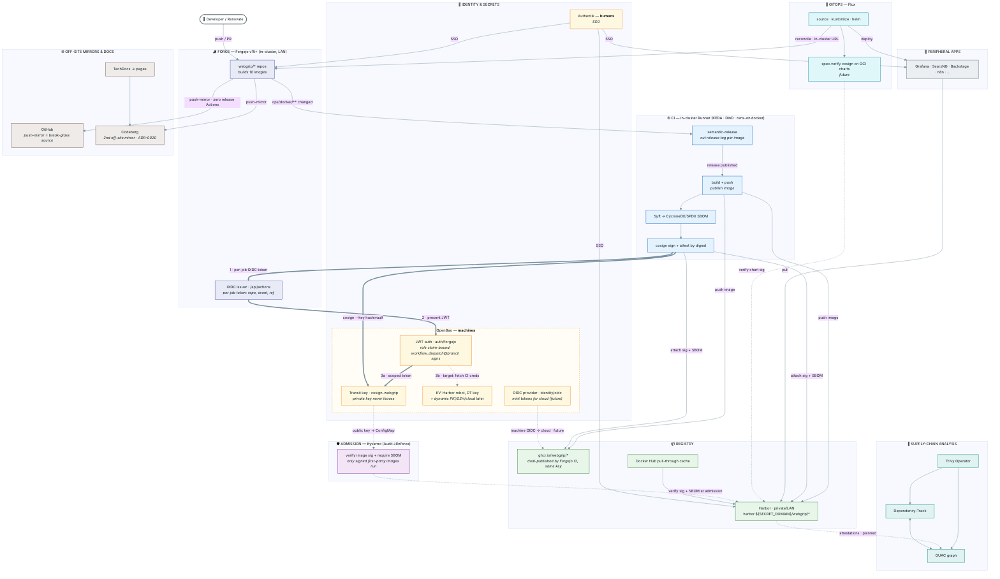
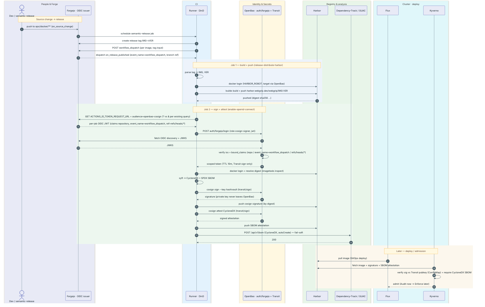

# Container Supply Chain — Architecture Overview

> Status: living · Companion to the [Supply Chain Intelligence Pipeline](supply-chain-pipeline.md),
> [RFC: Kyverno audit→enforce hardening](../rfc/rfc-kyverno-audit-enforce-hardening.md),
> the [Transit key-rotation runbook](../runbooks/cosign-transit-key-rotation.md), and
> [ADR-0020 (Codeberg mirror)](../adr/adr-0020-codeberg-offsite-push-mirror.md).

How webgrip images get built, signed, published, verified, and analysed — and where identity and
secrets come from. **Solid arrows = built/active flow; dotted = trust / verify / planned.**
Colours group by domain (see the system map).

## 1. System map

### How to read it
- **Thick arrows (1→2→3) are the signing spine.** A Forgejo job proves identity with a *per-job*
  OIDC token whose claims (`event_name=workflow_dispatch`, `ref=refs/heads/*`) are the authorization → OpenBao checks the
  claims → returns a *scoped, short-lived* token → cosign signs via Transit (key never leaves OpenBao).
  (The build/sign job is reached via `workflow_dispatch` on a branch, **not** a tag-`release` event —
  binding the OpenBao role to `event_name=release` + `refs/tags/*` 400s the login.)
- **`3b` (dotted) is the unification target.** Harbor/DT creds reach CI as Forgejo org secrets today
  (a CronJob); the goal is to fetch them over the same spine so there are **zero** standing Forgejo secrets.
- **Two dotted "verify" arrows are the gates.** Flux verifies *charts* before deploy; Kyverno verifies
  *images* (signature + SBOM) at admission using the Transit **public** key.
- **Dual-publish** (`.github`→ghcr, `.forgejo`→Harbor) is the migration safety net; **mirrors**
  (GitHub/Codeberg) are DR for the Git source. **Gold = identity/secrets; humans via Authentik, machines via OpenBao.**

## 2. The release job (sequence)

Build and sign run as *separate* ephemeral runner pods; shown as one "Runner" lane for readability.

### Security-critical moments
- **10–11:** the runner proves identity with a *per-job* OIDC token; a fork PR gets no token.
  Append `audience=openbao-cosign` to `ACTIONS_ID_TOKEN_REQUEST_URL` with the right separator
  (`?` if the URL has no query string, else `&`) — a malformed URL silently mints the *default*
  audience and OpenBao 400s the login.
- **12–16:** OpenBao independently verifies that token against Forgejo's JWKS + the bound claims
  (`event_name=workflow_dispatch`, `ref=refs/heads/*`) before issuing a 10-minute, sign-only token.
- **19–22:** signing/attesting call `transit/sign` — the key material never reaches the runner.
- **29:** Kyverno re-checks signature + SBOM at admission against the **public** (Transit) key.

## 3. Prerequisites to go live

See the [Kyverno audit→enforce RFC](../rfc/rfc-kyverno-audit-enforce-hardening.md) for the full gate list (the standalone enforcement roadmap was retired into it, 2026-07-02).
In short: Forgejo server ≥ v15 (for `enable-openid-connect`); a one-time OpenBao break-glass on the
*existing* cluster to enable Transit + the `forgejo` jwt auth and create the key (a fresh rebuild does
this automatically via init.sh); the `cosign-pubkey` CronJob then publishes the public key to the
`cosign-webgrip-pub` ConfigMap — no manual paste; runner→OpenBao/Harbor/Dependency-Track and OpenBao→Forgejo
network reachability.
