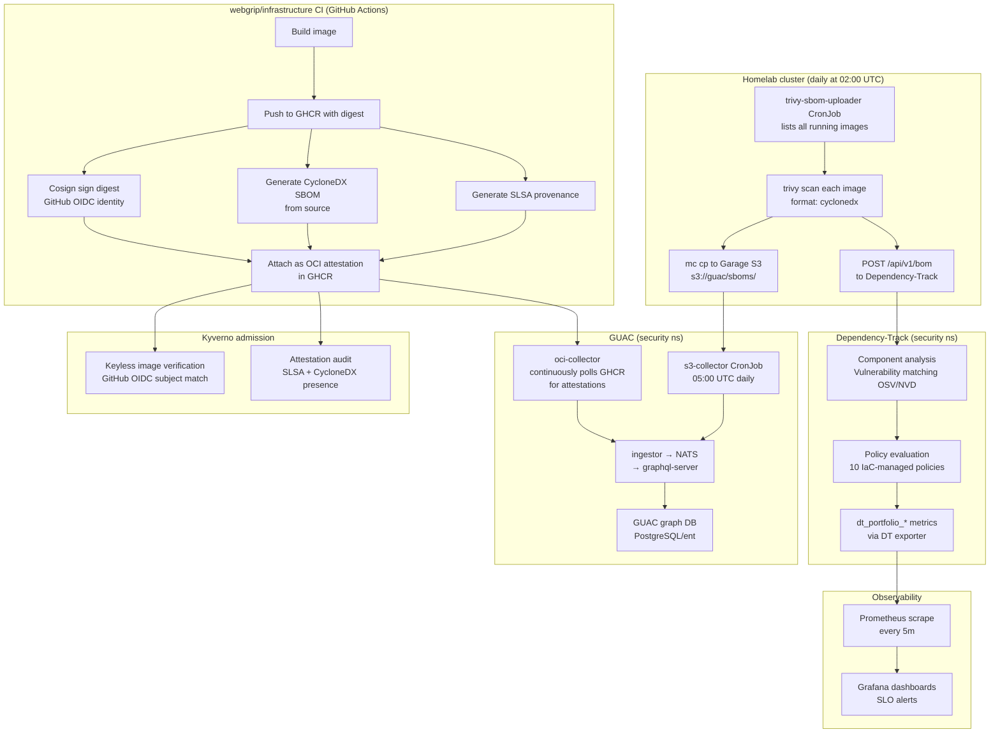

# Supply Chain Intelligence Pipeline

This document explains the complete software supply chain intelligence system in this cluster: where SBOMs come from, how they flow into Dependency-Track and GUAC, how attestations from CI fit in, and what questions you can actually answer as a result.

---

## The two SBOM origins

There are two fundamentally different moments at which a Software Bill of Materials (SBOM) is produced for images in this environment. Understanding the difference is essential to understanding the pipeline.

### Origin 1 — Build-time (CI, webgrip/infrastructure)

When `webgrip/infrastructure` builds and releases an application image, the GitHub Actions workflow (triggered on `on_release_published`) does several things in addition to building the image:

1. Builds the container image and pushes it to GHCR with an immutable digest reference.
2. Signs the image digest with **Cosign**, using a short-lived **GitHub OIDC identity** (`https://token.actions.githubusercontent.com`). No long-lived private key is involved.
3. Generates a **CycloneDX SBOM** describing what went into the image (source dependencies, lockfiles, package manifests).
4. Attaches the SBOM to the image digest in GHCR as a **Cosign attestation** (OCI artifact in the same registry).
5. Generates and attaches **SLSA provenance** — a machine-readable record of who built this, from which repository, on which commit, on what workflow trigger.
6. Optionally uploads a vulnerability scan (Trivy SARIF) to GitHub Security.

The resulting attestation artifacts live in GHCR alongside the image. They are queryable with `cosign verify-attestation`, readable by Kyverno policies, and ingestable by GUAC's OCI collector.

> **Key characteristics of build-time SBOMs:**
> - High fidelity — produced from source code, not from scanning a binary layer
> - Available immediately when the image is pushed
> - Signed with a cryptographically verifiable CI identity
> - Represent what was declared to be in the image

### Origin 2 — Runtime scanning (Trivy in-cluster)

The cluster runs a daily `trivy-sbom-uploader` CronJob at **02:00 UTC**. This job:

1. Lists every running container image across all pods in all namespaces.
2. For each image, runs `trivy image --format cyclonedx` to scan the actual image layers.
3. Uploads the CycloneDX SBOM to **Dependency-Track** via `POST /api/v1/bom`.
4. Also writes the SBOM to the GUAC S3 bucket (`s3://guac/sboms/<name>-<version>.cdx.json`) for GUAC ingestion.

> **Key characteristics of runtime SBOMs:**
> - Cover every image actually running in the cluster, regardless of where it came from (third-party, operator, system)
> - Produced by scanning binary image layers (what is actually there, not just what was declared)
> - Not signed or attested (the SBOM is evidence, but without a cryptographic chain back to CI)
> - May differ from the build-time SBOM if image layers were manipulated after build

### Why you need both

| Concern | Build-time | Runtime |
|---|---|---|
| Covers third-party / external images | No | **Yes** |
| Cryptographically tied to CI identity | **Yes** | No |
| Detects supply-chain tampering | **Yes** (signature mismatch) | No |
| Covers what is actually running right now | No | **Yes** |
| SBOMs for system/operator images | No | **Yes** |
| Basis for SLSA admission policy | **Yes** | No |

In a mature pipeline, build-time SBOMs provide the trust anchor and CI governance, and runtime SBOMs provide continuous posture visibility for everything in the cluster.

---

## Data flow diagram



---

## Dependency-Track in depth

### What it does

Dependency-Track is a **continuous component analysis** platform. It maintains a portfolio of projects (one per image), each with its SBOM. For every SBOM upload it:

1. Parses all components (name + version + PURL).
2. Looks up every component against **OSV, NVD, GitHub Advisory**, and other vulnerability databases.
3. Evaluates the portfolio against the configured **policies** (see below).
4. Aggregates portfolio-level metrics (`dt_portfolio_vulnerabilities`, `dt_portfolio_risk_score`, etc.).

### Policy engine

Ten policies are bootstrapped via an idempotent `policy-bootstrap` CronJob:

| Policy | Type | Action |
|---|---|---|
| P1 Critical CVEs | Vulnerability severity | FAIL |
| P2 High CVEs | Vulnerability severity | WARN |
| P3 Unpatched Critical (>30d) | Vulnerability age | WARN |
| P4 CVSS >= 9 | CVSS score | FAIL |
| P5 No License | No license declared | INFO |
| P6 Copyleft License | License group (copyleft) | WARN |
| P7 PURL required | Component without PURL | INFO |
| P8 CVSS 7-9 | CVSS score range | WARN |
| P9 Old Components (>2 years) | Component age (`P2Y`) | INFO |
| P10 Copyleft | License group (dynamic UUID lookup) | WARN |

> **Known bug (fixed):** DT v4.12+ sets `IS_LATEST=false` on all projects by default. All policies use `onlyLatestProjectVersion: false` to ensure they evaluate all imported images.

### Metrics exposed

The DT metrics exporter (Deployment `dependency-track-metrics-exporter`) polls `GET /api/v1/metrics/portfolio/current` every 5 minutes and exposes these Prometheus metrics:

| Metric | Description |
|---|---|
| `dt_portfolio_vulnerabilities{severity}` | Vulnerability count by severity (critical/high/medium/low/unassigned) |
| `dt_portfolio_policy_violations{state}` | Policy violation count by state (fail/warn/info) |
| `dt_portfolio_projects` | Total projects in portfolio |
| `dt_portfolio_components` | Total components |
| `dt_portfolio_vulnerabilities_suppressed` | Suppressed vulnerability count |
| `dt_portfolio_risk_score` | Aggregate portfolio risk score |
| `dt_portfolio_findings{audited}` | Findings by audit state |
| `dt_exporter_last_scrape_timestamp` | Unix timestamp of last successful scrape (stale = exporter down) |

### Accessing DT

- Public URL: `https://dependency-track.webgrip.dev`
- Projects view: `https://dependency-track.webgrip.dev/projects` — shows all scanned images
- Portfolio dashboard: `https://dependency-track.webgrip.dev/dashboard` — portfolio-level metrics (refreshes hourly from `PROJECTMETRICS`)

> **Note:** DT's portfolio dashboard aggregates from `PROJECTMETRICS` on an hourly cycle. If you just uploaded SBOMs and don't see numbers yet, wait up to 1 hour or trigger a manual refresh via `POST /api/v1/metrics/portfolio/refresh`.

---

## GUAC in depth

### What it does

GUAC (Graph for Understanding Artifact Composition) is a **supply chain metadata graph**. Where DT focuses on component risk analysis, GUAC focuses on **relationship queries**: "which of my running images depends on log4j?", "what is the full dependency path from this SLSA provenance to that CVE?", "which images share this vulnerable component?"

GUAC ingests structured documents (SBOMs, attestations, provenance) and stores them as a graph in PostgreSQL. You query the graph via GraphQL (`https://guac.webgrip.dev` / `graphql-server:8080/query`) or REST (`rest-api:8081`).

### Components

| Component | Role |
|---|---|
| `graphql-server` | GraphQL query API, backend: PostgreSQL/ent |
| `rest-api` | REST query API for simpler access |
| `ingestor` | Subscribes to NATS, fetches docs from S3 blob store, ingests into graph |
| `collectsub` | Collect-sub service — coordinates what collectors should fetch |
| `oci-collector` | Polls GHCR for OCI-attached attestations (build-time SBOMs, SLSA provenance) |
| `depsdev-collector` | Enriches packages with deps.dev metadata |
| `osv-certifier` | Cross-references components against OSV vulnerability database |
| `cd-certifier` | Cross-references with ClearlyDefined license data |
| `guac-nats` | NATS message bus for collector → ingestor pipeline |

### Two ingest paths

**Path A — OCI attestations (build-time)**

The `oci-collector` deployment continuously polls GHCR for images under `ghcr.io/webgrip/*` and fetches any attached Cosign attestations. These include:

- CycloneDX SBOMs (produced during CI)
- SLSA provenance documents

This gives GUAC the cryptographically-anchored build-time supply chain graph.

**Path B — S3 cluster SBOMs (runtime)**

The `guac-s3-collector` CronJob runs at **05:00 UTC daily** (3 hours after the SBOM upload at 02:00 UTC). It runs `guaccollect s3 --service-poll=false` against the `sboms/` path in the `guac` Garage S3 bucket, ingesting all CycloneDX SBOMs generated by the Trivy scanner.

This gives GUAC visibility into every running image in the cluster, including third-party and operator images that have no CI attestations.

### Storage

- **Graph database**: CloudNativePG PostgreSQL cluster (`guac-db`)
- **Blob store**: Garage S3 (`s3://guac` on `http://10.0.0.110:3900`), credentials from `security-s3` secret
- **Message bus**: NATS (`guac-nats`)

### What you can query

From the GUAC GraphQL API or visualizer (`https://guac.webgrip.dev`):

- "What packages does image X contain?" (SBOM graph)
- "What images in my cluster are vulnerable to CVE-Y?" (via osv-certifier cross-reference)
- "What is the build provenance for image Z — which CI run, which repo, which commit?" (SLSA attestation)
- "Which images share component package:P?" (dependency graph traversal)
- "Show me the complete dependency chain from image A to vulnerable component B"

---

## Attestation flow (webgrip/infrastructure CI)

When a release tag is pushed to `webgrip/infrastructure`:

```
on_release_published.yml triggers
    ↓
docker build → ghcr.io/webgrip/<app>:<tag>@sha256:<digest>
    ↓
cosign sign --oidc-issuer https://token.actions.githubusercontent.com
    ↓ (stored in GHCR as OCI artifact alongside the image)
cosign attest --type cyclonedx       → CycloneDX SBOM attestation
cosign attest --type slsaprovenance  → SLSA provenance attestation
    ↓
GUAC oci-collector discovers these via GHCR catalog API
    ↓
Kyverno at admission time verifies:
  - signature subject matches webgrip/infrastructure/.github/workflows/on_release_published.yml@refs/tags/*
  - SLSA provenance attestation present
  - CycloneDX SBOM attestation present
```

### Kyverno OIDC contract

The cluster currently trusts the following identity shape for `ghcr.io/webgrip/*` images:

- **Issuer**: `https://token.actions.githubusercontent.com`
- **Subject pattern**: `https://github.com/webgrip/infrastructure/.github/workflows/on_release_published.yml@refs/tags/<tag>`

If a `webgrip/*` image is deployed that was **not** built through this exact workflow on a release tag, Kyverno will flag it (audit mode — not yet blocking). This is the supply chain trust boundary.

### What CI must do (checklist for webgrip/infrastructure workflows)

For the full pipeline to work end-to-end, the CI workflow needs:

```yaml
permissions:
  id-token: write       # required for GitHub OIDC
  packages: write       # required for GHCR push
  contents: read
```

Steps required:

1. `docker build` + `docker push` with digest output
2. `cosign sign $IMAGE_DIGEST` (keyless)
3. `trivy image --format cyclonedx --output sbom.json $IMAGE` then `cosign attest --type cyclonedx --predicate sbom.json $IMAGE_DIGEST`
4. `cosign attest --type slsaprovenance --predicate provenance.json $IMAGE_DIGEST` (or use the SLSA GitHub Generator action)
5. Deploy using `image: ghcr.io/webgrip/<app>@sha256:<digest>` (pinned, not tag)

> **Current gap**: CI workflows need to be audited to confirm all five steps are implemented. The cluster-side policy is in place and working. CI is the remaining half.

---

## How GUAC, DT, Kyverno, and Trivy relate to each other

These tools are not redundant. They occupy different jobs in the supply chain:

| Tool | Primary job | Data source | When it runs |
|---|---|---|---|
| **Kyverno** | Admission gate — enforce acceptable state at deploy time | OCI attestations (real-time) | At every pod admission |
| **Trivy Operator** | Continuous in-cluster scanning — CVE + config + RBAC posture | Running images (cluster) | Scheduled, on workload change |
| **Dependency-Track** | Portfolio-level SBOM analysis — component risk, policy, license | CycloneDX SBOMs (daily from Trivy) | Daily scrape + hourly aggregation |
| **GUAC** | Supply chain graph — relationship queries across all evidence | SBOMs + attestations + OSV + ClearlyDefined | Continuous (OCI) + daily (S3) |

They form a layered funnel:

```
GUAC                         ← aggregates and relates ALL evidence
  ↑ attestations (CI)         ↑ runtime SBOMs (Trivy)
Dependency-Track             ← policy + risk analysis on runtime SBOMs
  ↑ daily SBOM upload (Trivy)
Kyverno                      ← admission gate using CI attestations
  ↑ real-time OCI check (at admission)
Trivy Operator               ← continuous running-state scanner
```

A finding may be visible in more than one tool. That is intentional, not waste:

- DT says "this component has a critical CVE" → actionable for operators
- GUAC says "here are the 12 images that share this component" → actionable for remediation scoping
- Kyverno says "this image has no SLSA provenance" → actionable for CI enforcement
- Trivy Operator says "this running pod has CVE-XYZ" → actionable for patching

---

## SLO alerts and Grafana dashboards

### Active SLO alert rules (GrafanaAlertRuleGroup)

Three `GrafanaAlertRuleGroup` CRDs are deployed in the `observability` namespace, all synced to Grafana under the **Security** folder:

**Security SLOs** (`slo-security`):

| Alert | Threshold | Severity |
|---|---|---|
| DT Critical CVEs | > 0 | critical |
| DT High CVEs | > 500 | warning |
| DT Policy FAIL violations | > 0 | warning |
| DT Portfolio risk score | > 2000 | warning |
| Kyverno high/critical violations | > 0 | critical |
| Kyverno total FAIL violations | > 50 | warning |
| DT exporter stale | no scrape for 15m | warning |

**Platform SLOs** (`slo-platform`): Flux reconciliation failures, cert expiry (<14d critical, <3d critical), node memory/disk pressure.

**Observability SLOs** (`slo-observability`): Prometheus targets down, TSDB reload failures, Grafana operator reconcile failures.

### Dashboards

| Dashboard | Location in Grafana | Coverage |
|---|---|---|
| Security / Supply Chain (Dependency-Track) | Security folder | DT portfolio metrics, CVE trends, policy violations |
| Security / SOC Command Center | Security folder | Cross-tool overview (Kyverno + Trivy + Falco + Tetragon + DT) |
| Kyverno / Policy Insights | Security folder | Policy pass/fail rates, violation trends |
| Kyverno / Policy Violations | Security folder | Individual violations, severity breakdown |
| Trivy / Vulnerabilities | Security folder | Workload-level CVE findings |
| Falco / Runtime Detections | Security folder | Runtime alert heatmap, top rules |
| Tetragon / Runtime Telemetry | Security folder | Process execution, network events |

### Adding notification routes

The 16 SLO rules currently fire but route to the Alertmanager `null` receiver (Discord was removed). To route alerts to a channel:

1. Go to **Grafana → Alerting → Contact Points** and add a contact point (email, Slack, PagerDuty, etc.)
2. Go to **Alerting → Notification Policies** and add a route matching `severity=critical` (or your desired label)
3. No Git changes needed — contact points are managed in Grafana UI (backed by Grafana DB, not CRDs)

---

## Operational schedule

| Time (UTC) | Job | What it does |
|---|---|---|
| 02:00 daily | `trivy-sbom-uploader` | Scans all running images, uploads SBOMs to DT and S3 |
| 03:00+ | DT `PORTFOLIOMETRICS` aggregation | Hourly background job aggregates project metrics |
| 05:00 daily | `guac-s3-collector` | Ingests all SBOMs from S3 into GUAC graph |
| Continuous | `oci-collector` | Polls GHCR for new OCI attestations on webgrip images |
| Every 5m | `dt-metrics-exporter` | Polls DT REST API, exposes `dt_portfolio_*` to Prometheus |
| Every 30m (scrape) | Prometheus | Scrapes DT exporter, Trivy operator, Kyverno, Falco, Tetragon |
| Renovate schedule | Renovate | Keeps chart/image versions updated (automatic dependency hygiene) |

---

## Gaps and what still needs to be done

### CI side (webgrip/infrastructure)

The cluster-side policies are in place. These CI gaps remain:

1. **Confirm `on_release_published.yml` produces Cosign signatures** — verify with `cosign verify ghcr.io/webgrip/<app>:latest` from a workstation with the OIDC issuer pattern
2. **Confirm CycloneDX SBOM attestation is published** — `cosign verify-attestation --type cyclonedx ghcr.io/webgrip/<app>@sha256:<digest>`
3. **Confirm SLSA provenance attestation is published** — `cosign verify-attestation --type slsaprovenance ...`
4. **Deploy by digest** in Flux HelmReleases and kustomize image overrides, not by tag

Until CI publishes all three, Kyverno will flag webgrip images with `audit` violations (not blocking, but visible in the Kyverno dashboard).

### GUAC ↔ DT direct integration

GUAC has a conceptual DT collector path but the GUAC chart v0.8.0 does not include it as a first-class component. The current integration is indirect via the shared S3 bucket:

- Trivy generates CycloneDX → GUAC S3 bucket → GUAC ingests
- This is sufficient for runtime SBOMs
- A future improvement would be to have DT emit VEX/CycloneDX enriched with its vulnerability analysis, and GUAC ingest that for richer graph data

### VEX / exploitability context

DT v4.x has VEX support but it requires human review to mark vulnerabilities as not exploitable. Once the team is reviewing DT findings regularly, VEX analysis reduces noise significantly — especially for distro-level CVEs that are not exploitable in the deployed context.

### Admission enforcement (webgrip images)

Kyverno's image verification and attestation policies for `ghcr.io/webgrip/*` are currently in **audit** mode. Once CI is confirmed to produce all required artifacts, these can be promoted to **enforce**. The promotion checklist:

1. No audit violations in Kyverno dashboard for webgrip images
2. CI confirmed to produce signature + SLSA + CycloneDX on every release
3. All Flux image overrides use digest pins
4. PolicyException governance process is in place for legitimate exceptions

---

## Quick reference: key endpoints

| Service | In-cluster URL | External URL |
|---|---|---|
| Dependency-Track API | `http://dependency-track-api-server.security.svc.cluster.local:8080` | `https://dependency-track.webgrip.dev` |
| GUAC GraphQL | `http://graphql-server.security.svc.cluster.local:8080/query` | `https://guac.webgrip.dev` (visualizer) |
| GUAC REST | `http://rest-api.security.svc.cluster.local:8081` | — |
| DT metrics exporter | `http://dependency-track-metrics-exporter.security.svc.cluster.local:9090/metrics` | — |

## Quick reference: key secrets

| Secret | Namespace | Keys | Purpose |
|---|---|---|---|
| `dependency-track-api-key` | `security` | `api-key` | DT REST API authentication (exporter + uploader) |
| `dependency-track-secret` | `security` | `username`, `password`, `secret.key` | DT admin credentials |
| `security-s3` | `security` | `S3_ACCESS_KEY_ID`, `S3_SECRET_ACCESS_KEY`, `S3_ENDPOINT`, `S3_GUAC_BUCKET`, `S3_REGION` | Garage S3 for GUAC blob store + SBOM bucket |
| `guac-secrets` | `security` | `values.yaml` | GUAC database credentials |
