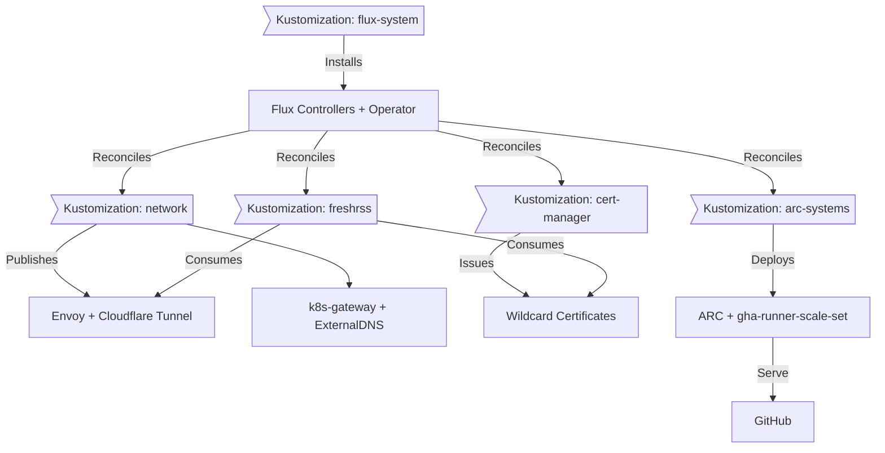
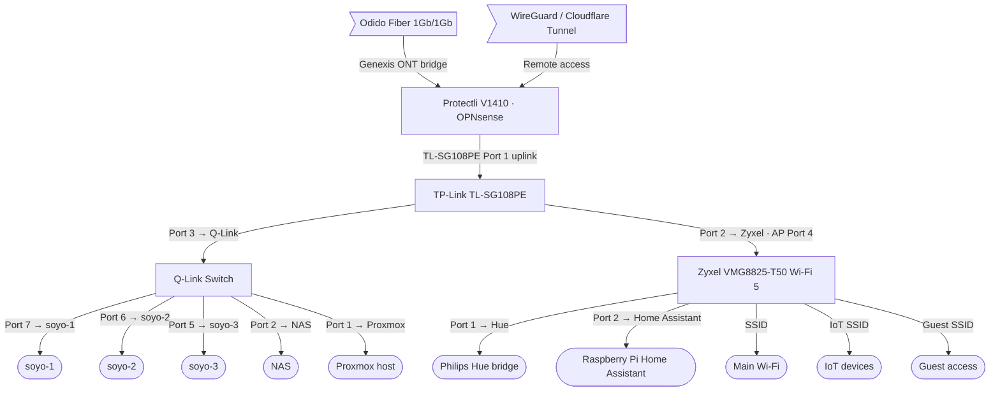
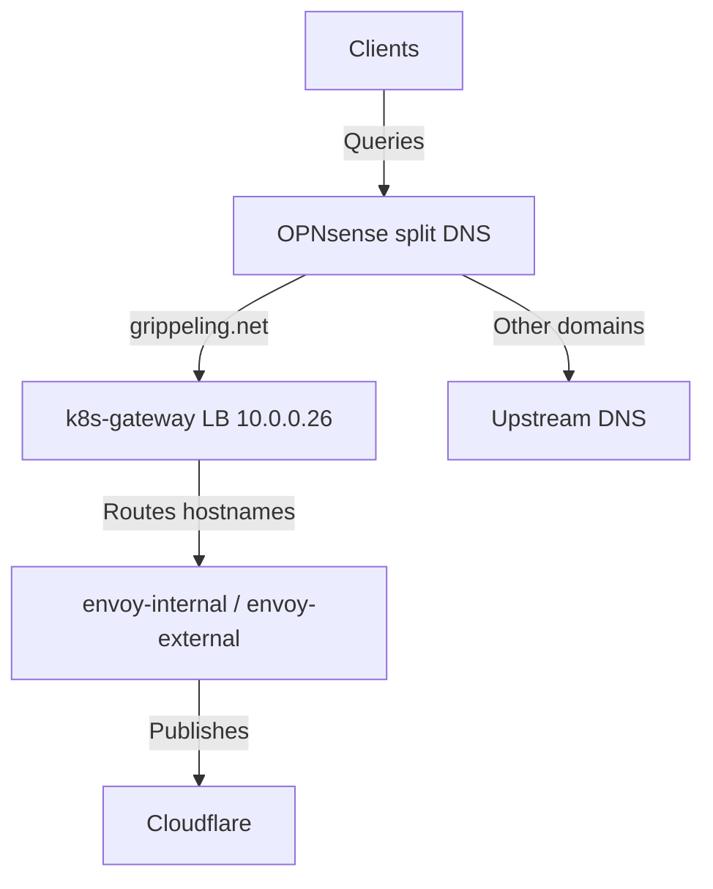

# Homelab Platform Docs

This TechDocs space mirrors the updated README so Backstage shows the same diagrams, wiring tables, and GitOps context that exist in the repository. Everything below is kept in lock-step with the Flux-managed manifests and Talos configs.

## Scope

- Talos cluster layout, versions, health checks, and etcd membership
- Flux GitOps flow, bootstrap steps, and security posture
- Networking (fiber → Protectli → switches → Wi-Fi), DHCP reservations, and split DNS
- Runtime inventory (pods and services) captured from `kubectl`

Commit refreshed TechDocs whenever the physical wiring, workloads, or Talos facts change so Backstage stays authoritative.

## Featured Workloads

| Category | Namespace(s) | Highlights |
| --- | --- | --- |
| Platform control | `flux-system`, `kube-system` | Flux controllers, notification receiver, Weave GitOps UI, Cilium, CoreDNS, metrics-server, Spegel, Reloader. |
| Networking & ingress | `network` | Envoy internal/external gateways, Cloudflare DNS + Tunnel, `k8s-gateway` split DNS. |
| PKI & security | `cert-manager`, `components/sops` | ACME HTTP-01 + DNS-01 issuers, SOPS secrets rendered into namespaces. |
| CI infrastructure | `arc-systems` | Actions Runner Controller with gha-runner-scale-set for GitHub burst capacity. |
| Applications | `default`, `freshrss`, `invoiceninja` | Echo sample service, FreshRSS HelmRelease with Bitnami bootstrap job, and Invoice Ninja 5.12.39 riding on an app-template-managed MariaDB 11.8.5 StatefulSet backed by Longhorn PVCs. |

TechDocs sources live under `docs/techdocs/` and are referenced in `catalog/catalog-info.yaml` so every catalog entity links back here.

## Flux Workflow

Flux reconciles every directory listed in the mermaid diagram. Renovate watches for drift, GitHub Actions runs `flux diff --cached`, and Talos bootstrap scripts live under `bootstrap/`.

## Networking Overview

Everything is 1 GbE from the Protectli firewall through the TP-Link fan-out and Q-Link downstream switch. No LACP/10G trunks exist, so plan bandwidth assuming single-gigabit hop-by-hop throughput.

### Flat LAN

| Device | Role | Address | Notes |
| ------ | ---- | ------- | ----- |
| Protectli V1410 / OPNsense | Router + firewall | `10.0.0.1` | DHCP scope `10.0.0.50-10.0.0.150`, WireGuard termination, split DNS rules. |
| TL-SG108PE | Managed switch | `10.0.0.2` | Port 1 uplink to Protectli, port 2 Wi-Fi bridge, port 3 downlink to Q-Link. |
| Zyxel VMG8825-T50 | Wi-Fi bridge/AP | `10.0.0.3` | Bridge mode so SSIDs stay on the flat LAN. |

**Port map:**

- **TP-Link TL-SG108PE**
	- Port 1 → Protectli/ONT uplink
	- Port 2 → Zyxel AP
	- Port 3 → Q-Link downstream switch
- **Q-Link switch**
	- Port 8 ← uplink from TL-SG108PE
	- Ports 7/6/5 → `soyo-1`/`soyo-2`/`soyo-3`
	- Port 2 → NAS
	- Port 1 → Proxmox host
- **Zyxel AP (4-port)**
	- Port 4 ← uplink from TL-SG108PE
	- Port 1 → Philips Hue bridge
	- Port 2 → Raspberry Pi Home Assistant

Static infrastructure keeps IPs below `.50`, reserved in OPNsense Terraform so DHCP drift cannot move critical nodes.

### Home DNS

`k8s-gateway` answers `*.grippeling.net` lookups inside the LAN while Cloudflare + tunnels continue to serve public DNS. This lets on-prem clients stay on-LAN without hairpinning through Cloudflare.

## Maintenance Checklist

1. Capture fresh `kubectl get nodes -o wide`, `kubectl get pods -A -o wide`, and `kubectl get svc -A` outputs for the runtime page.
2. Record `talosctl version`, `talosctl -n <node> services`, `talosctl etcd members`, and `talosctl health` for the Talos reference.
3. Update wiring diagrams or tables when physical cabling changes.
4. Commit updates to `docs/techdocs/` with the same PR that modifies manifests so Backstage TechDocs match the repo.
