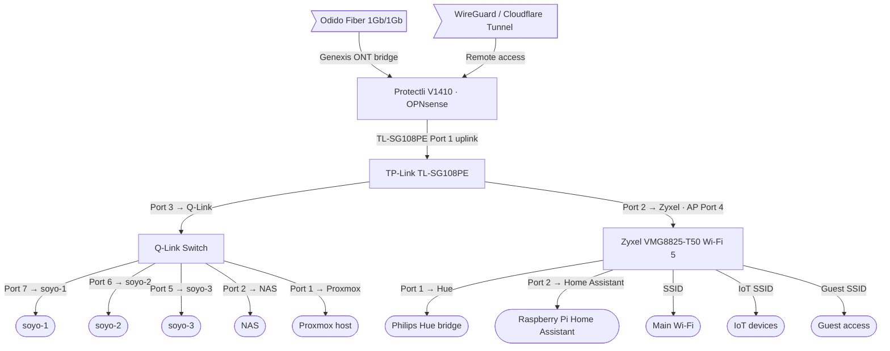
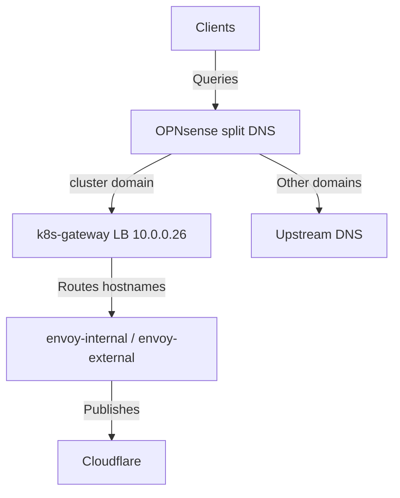

# Homelab Platform Docs

TechDocs for the Flux-managed Talos homelab. Everything here mirrors the manifests in
`webgrip/homelab-cluster`; when the docs and the repo disagree, the repo wins.

## Platform at a glance

| Concern | Implementation |
| --- | --- |
| GitOps | Flux (flux-operator + flux-instance); 3 layers: root `kubernetes/flux/cluster/ks.yaml` → per-app `ks.yaml` → `app/` manifests |
| Nodes | 5 × bare-metal Talos (3 soyo control-plane + 2 workers) — [Talos cluster](general/talos-cluster.md) |
| Ingress | Gateway API via Envoy Gateway: `envoy-internal` (LAN) + `envoy-external` (public via Cloudflare Tunnel) |
| DNS | Split-horizon: `k8s-gateway` answers `*.${SECRET_DOMAIN}` on the LAN; ExternalDNS → Cloudflare for public records |
| Secrets | **ESO + OpenBao** (`ExternalSecret`/`PushSecret`; see the [ESO reference](rfc/external-secrets-plan.md)). Minimal SOPS floor remains: age key, `cluster-secrets`, `talsecret` (+ one zomboid straggler) |
| Storage | Longhorn (replicas confined to the worker pool); Garage S3 off-cluster for object storage |
| Databases | CloudNativePG Postgres per app namespace, barman-cloud backups to Garage |
| Observability | VictoriaMetrics + Loki + Grafana (grafana-operator) — [Observability](general/observability.md) |
| Security | Kyverno, Trivy Operator, cosign/OpenBao Transit signing, DT + GUAC — [Security platform](general/security-platform.md) |
| CI | Forgejo Actions (in-cluster, release authority) + ARC GitHub runners — [Forgejo](general/forgejo.md), [ARC](general/arc-runners.md) |
| Identity | Authentik OIDC SSO — [Authentik](general/authentik.md) |

**Workloads:** the full per-app inventory (hostnames, gateways, LoadBalancers, disabled apps)
lives in [Applications — canonical inventory](general/applications.md).

## Endpoints & VIPs

| Endpoint | Purpose | Source | Address |
| --- | --- | --- | --- |
| `cluster_api_addr` | Talos + Kubernetes API VIP | `cluster.yaml` | `10.0.0.25` |
| `cluster_dns_gateway_addr` | `k8s-gateway` LoadBalancer (split DNS) | `kubernetes/apps/network/k8s-gateway` | `10.0.0.26` |
| `cluster_gateway_addr` | `envoy-internal` LoadBalancer (LAN-only) | `kubernetes/apps/network/envoy-gateway` | `10.0.0.27` |
| `cloudflare_gateway_addr` | `envoy-external` / Cloudflare Tunnel origin | `kubernetes/apps/network/cloudflare-tunnel` | `10.0.0.28` |
| Garage S3 | Object storage (off-cluster VM) | — | `10.0.0.110:3900` |

Supporting controllers in `kubernetes/apps/network/`: `k8s-gateway` (split DNS, watches
`HTTPRoute` + `Service`), `envoy-gateway` (both `Gateway` resources), `cloudflare-tunnel`
(`cloudflared` → `envoy-external`), `cloudflare-dns` (ExternalDNS → Cloudflare).

## Networking Overview

```mermaid
graph TD
	A>Odido Fiber 1Gb/1Gb]
	A --> |Genexis ONT bridge| R[Protectli V1410 · OPNsense]
	B>WireGuard / Cloudflare Tunnel] --> |Remote access| R
	R --> |TL-SG108PE Port 1 uplink| S1[TP-Link TL-SG108PE]
	S1 --> |Port 3 → Q-Link| S2[Q-Link Switch]
	S1 --> |Port 2 → Zyxel · AP Port 4| W[Zyxel VMG8825-T50 Wi-Fi 5]
	S2 --> |Port 7 → soyo-1| K1([soyo-1])
	S2 --> |Port 6 → soyo-2| K2([soyo-2])
	S2 --> |Port 5 → soyo-3| K3([soyo-3])
	S2 --> |Port 2 → NAS| N([NAS])
	S2 --> |Port 1 → Proxmox| PX([Proxmox host])
	W --> |Port 1 → Hue| H([Philips Hue bridge])
	W --> |Port 2 → Home Assistant| P([Raspberry Pi Home Assistant])
	W --> |SSID| W1([Main Wi-Fi])
	W --> |IoT SSID| W2([IoT devices])
	W --> |Guest SSID| W3([Guest access])
```

Everything is 1 GbE from the Protectli firewall through the TP-Link fan-out and Q-Link
downstream switch. No LACP/10G trunks exist, so plan bandwidth assuming single-gigabit
hop-by-hop throughput. (The two workers hang off the same switching path; per-port wiring for
them is in [Talos cluster → Network Wiring](general/talos-cluster.md#network-wiring).)

### Flat LAN

| Device | Role | Address | Notes |
| ------ | ---- | ------- | ----- |
| Protectli V1410 / OPNsense | Router + firewall | `10.0.0.1` | DHCP scope `10.0.0.50-10.0.0.150`, WireGuard termination, split DNS rules. |
| TL-SG108PE | Managed switch | `10.0.0.2` | Port 1 uplink to Protectli, port 2 Wi-Fi bridge, port 3 downlink to Q-Link. |
| Zyxel VMG8825-T50 | Wi-Fi bridge/AP | `10.0.0.3` | Bridge mode so SSIDs stay on the flat LAN. |

**Port map:**

- **TP-Link TL-SG108PE**
	- Port 1 → Protectli/ONT uplink
	- Port 2 → Zyxel AP
	- Port 3 → Q-Link downstream switch
- **Q-Link switch**
	- Port 8 ← uplink from TL-SG108PE
	- Ports 7/6/5 → `soyo-1`/`soyo-2`/`soyo-3`
	- Port 2 → NAS
	- Port 1 → Proxmox host
- **Zyxel AP (4-port)**
	- Port 4 ← uplink from TL-SG108PE
	- Port 1 → Philips Hue bridge
	- Port 2 → Raspberry Pi Home Assistant

Static infrastructure keeps IPs below `.50`, reserved in OPNsense so DHCP drift cannot move critical nodes.

### Home DNS

```mermaid
graph TD
	Clients -->|Queries| Router[OPNsense split DNS]
	Router -->|cluster domain| K8sGW[k8s-gateway LB 10.0.0.26]
	Router -->|Other domains| WAN[Upstream DNS]
	K8sGW -->|Routes hostnames| Envoy[envoy-internal / envoy-external]
	Envoy -->|Publishes| Cloudflare
```

`k8s-gateway` answers `*.${SECRET_DOMAIN}` lookups inside the LAN while Cloudflare + tunnels
serve public DNS. On-prem clients stay on-LAN without hairpinning through Cloudflare.

## Where to go next

- [General docs](general/index.md) — architecture and reference pages
- [Runbooks](runbooks/index.md) — incident-driven operational procedures
- [ADRs](adr/index.md) · [RFCs](rfc/index.md) — decisions and designs
- [Incidents](incidents/index.md) · [Blogs](blogs/index.md)

## Maintenance

Update these docs in the same commit as the manifest change. For live snapshots use the
verify commands in [Applications](general/applications.md) and the re-capture commands in
[Talos cluster](general/talos-cluster.md#re-capturing-hardware-specs); update wiring diagrams
whenever physical cabling changes.
