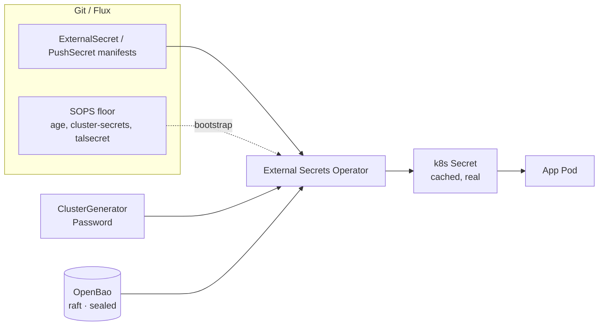

# External Secrets (ESO) migration

> **✅ Complete.** The SOPS → ESO migration is done; the external backend is
> **[OpenBao]** (OSS, native OIDC, single-node raft). This page is the architecture +
> full secret-inventory reference. For *why* SOPS was retired, see
> [The long goodbye to SOPS][blog]; for *how to operate it day-to-day* (deploy, seed,
> migrate, troubleshoot, DR), see the **[External Secrets runbook](../runbooks/external-secrets.md)** —
> that is the authoritative operational doc. OpenBao exposes **KV v2 at `secret/<app>/<name>`**
> and ESO authenticates with a **Kubernetes-auth ServiceAccount** (no machine identity,
> `hostAPI`, or `ENCRYPTION_KEY`).

[openbao]: https://openbao.org/
[blog]: blog/2026-06-12-the-long-goodbye-to-sops.md

## Why

Today every secret is SOPS+age encrypted and a human drives the whole lifecycle:
*generate → `sops --encrypt` → commit → uncomment → reconcile*. There are ~47
`*.sops.yaml` files across ~25 apps. The toil concentrates in two classes:

- **Random / internal** — pure entropy no human should ever type (session keys,
  `BETTER_AUTH_SECRET`, runner registration secrets). Fully automatable in-cluster.
- **OIDC** — Authentik mints a `client_secret`, which is then hand-copied into a SOPS
  secret for the consuming app (grafana, n8n, backstage, forgejo). A copy-paste dance.

The goal: take the human out of the menial loop without losing the GitOps model, and
centralize the genuinely-external secrets so they're entered once and synced everywhere.

## Decisions

| Decision | Choice | Rationale |
| --- | --- | --- |
| Backend | **OpenBao** (self-hosted) | OSS (MPL-2.0 Vault fork), native OIDC login via Authentik, single-node raft (no extra Postgres/Redis), Kubernetes-auth for ESO. |
| OIDC client secrets | **Auto-eliminate** | Generate once → blueprint sets it via `!Env` → PushSecret. Removes the copy-paste for every OIDC app. |
| Random generator | **ESO-native `Password` / `ClusterGenerator`** | No second operator (e.g. mittwald); unifies with the external class. |
| At-rest encryption keys | **Never regenerate** | A fresh value corrupts data already encrypted. Seed the existing value once; never a generator. |
| SOPS | **Keep a minimal floor forever** | ESO cannot bootstrap itself; build-time `${SECRET_DOMAIN}` substitution has no ESO equivalent. |

## Architecture

ESO is the single engine. It reconciles three **stores** plus a shrunk SOPS floor:

| Store | Kind | Backs which class | Auth |
| --- | --- | --- | --- |
| `password-generator` | `ClusterGenerator` (Password) | random / internal | none |
| `openbao` | `ClusterSecretStore` (provider: `vault`) | external / provider (read) | ESO ServiceAccount (Kubernetes auth) |
| `openbao-push` | `ClusterSecretStore` (provider: `vault`) | migration seed (write) | ESO ServiceAccount (Kubernetes auth) |
| `kube-store` | `ClusterSecretStore` (provider: `kubernetes`) | OIDC cross-namespace PushSecret | ESO ServiceAccount + RBAC |
| SOPS (age) | n/a | bootstrap floor + at-rest keys (interim) | age key (bootstrap) |



**Key property — ESO writes real, cached k8s Secrets.** Once written, a pod reads its
Secret straight from the API server with **no runtime dependency** on ESO or OpenBao. A
backend outage (or a sealed OpenBao) blocks only *create/rotate*, never *runtime read* — a
down OpenBao never crashes running apps. This is the core argument for ESO over
sidecar-injection models.

ESO installs in the existing `security` namespace next to the other operators
(kyverno / falco / tetragon / trivy / …), mirroring the cert-manager app layout.

## Secret taxonomy + full inventory mapping

Every `*.sops.yaml` is classified by this rule:

- **Bootstrap floor** → stays SOPS forever (needed before/at Flux start, or for build-time
  substitution ESO can't provide).
- **At-rest encryption key** → never regenerate; seed the existing value once.
- **Random / internal** (throwaway / session) → ESO generator, `refreshInterval: "0"`.
- **OIDC `client_secret`** → auto-elimination (see [OIDC](#oidc-client_secret-auto-elimination)).
- **External / provider** → OpenBao `ExternalSecret`.
- **CNPG `*-db-app`** → already automated by CloudNativePG; leave alone.

### Stays SOPS — bootstrap floor (forever)

| Secret | Why it can't move |
| --- | --- |
| `bootstrap/sops-age.sops.yaml` | The age key itself. |
| `bootstrap/github-deploy-key.sops.yaml` | Flux's own Git auth — needed before Flux runs. |
| `kubernetes/components/sops/cluster-secrets.sops.yaml` | `${SECRET_DOMAIN}` is `postBuild.substituteFrom`-substituted into ~48 `ks.yaml` at build time. ESO has no build-time substitution. |
| `talos/talsecret.sops.yaml` | Talos cluster identity (pre-Kubernetes). |

### OpenBao's own bootstrap (no new SOPS floor)

OpenBao adds **almost nothing** to the SOPS floor:

| Concern | How OpenBao handles it |
| --- | --- |
| Backend storage | Single-node **raft** on a PVC — no external Postgres, no Redis. |
| Seal / unseal | Sealed at rest; the `openbao-unsealer` Deployment auto-unseals from the unseal key. The unseal key + root token are the *only* OpenBao secrets that stay offline / on the minimal SOPS floor. |
| ESO → OpenBao auth | **Kubernetes auth** — ESO's own ServiceAccount + the `external-secrets` role, created during the init ceremony. No machine identity, no `clientId`/`clientSecret`, no `ENCRYPTION_KEY`. |

### At-rest encryption keys — never regenerate

Seed the existing decrypted value into OpenBao **once** (via a `PushSecret`, runbook), then
read it with a normal `ExternalSecret` (`remoteRef`, not a generator). **Never** a
generator — a fresh value corrupts encrypted data.

| App | Key | Notes |
| --- | --- | --- |
| gitea-mirror | `ENCRYPTION_SECRET` | (its `BETTER_AUTH_SECRET` is throwaway → generator) |
| n8n | `N8N_ENCRYPTION_KEY` | in `n8n-secrets.sops.yaml` |
| invoiceninja | `APP_KEY` | Laravel app key |
| authentik | `AUTHENTIK_SECRET_KEY` | signs sessions/tokens |
| dependency-track | `secret.key` | app encryption |
| **forgejo** | `SECRET_KEY`, `INTERNAL_TOKEN`, `LFS_JWT_SECRET` | **already chart-autogenerated, not in SOPS — leave untouched.** Introducing generated ones breaks sessions/LFS. |

### Random / internal → ESO `Password` generator (`refreshInterval: "0"`)

- gitea-mirror `BETTER_AUTH_SECRET`  *(Wave 1 pilot)*
- forgejo-runner `forgejo-runner-secret` (40-char registration; pairs with a register Job)
- searxng `secret`, zomboid admin/config entropy, backstage `BACKEND_SECRET`-class keys,
  authentik bootstrap password/token (regenerable), and similar session keys.

Multi-key secrets → **one `ExternalSecret`, one generator pull per key** (keeps a 1:1 mapping
with the old `*.sops.yaml`, and each key gets independent entropy).

### OIDC client secrets → auto-elimination

`grafana-oauth`, `forgejo-oidc-secret`, `n8n-oidc-secrets`, `backstage-oidc-secrets`.

### External / provider → OpenBao `ExternalSecret`

| Area | Secrets |
| --- | --- |
| network | `cloudflare-dns`, `cloudflare-tunnel` |
| cert-manager | `secret` (ACME / DNS token) |
| observability | `grafana-github-api`, `alertmanager-discord`, `twitch-exporter` (+ eventsub) |
| forgejo | `forgejo-s3-secret` *(external pilot)*, `forgejo-admin-secret`, `forgejo-runner-scaler-token` |
| flux-system | `flux-instance` (GitHub webhook), `grafana-annotations-token`, `flux-ui` |
| arc-systems | `gha-runner-scale-set`, `gha-runner-scale-set-heavy` |
| renovate | `renovate-operator` token, `webhook-auth` |
| **shared S3 components** | `kubernetes/components/{cnpg-backup,observability-s3,security-s3}/` — convert in place, same Secret name + keys, cluster-scoped store (see [component conversion](#shared-s3-component-conversion)) |

### CNPG initdb / DB secrets — Wave 5 (DR-sensitive)

`dependency-track-secret` (username/password + at-rest `secret.key`), backstage
`postgres-secret`, freshrss `postgres-secret`, sparkyfitness `postgres-secret`,
`guac-secrets`, `n8n-db-secret`, `grafana-db-secret`.

DB passwords are rotatable (CNPG reconciles the role password from the secret) — seed the
existing value to avoid a needless rotation. The `secret.key`-type fields follow the
at-rest rule.

### Leave alone — CNPG auto-generated

`authentik-db-app`, `forgejo-db-app`, … — already automated, never in SOPS.

## File layout

```text
kubernetes/apps/security/
├── external-secrets/
│   ├── ks.yaml                              # dependsOn kube-prometheus-stack; targetNs security
│   └── app/
│       ├── ocirepository.yaml              # oci://ghcr.io/external-secrets/charts/external-secrets
│       ├── helmrelease.yaml                # installCRDs: true, serviceMonitor on
│       ├── kustomization.yaml
│       ├── clustergenerator.yaml           # Password generator (random class)
│       ├── clustersecretstore-kube.yaml    # provider: kubernetes (OIDC cross-ns push)
│       └── rbac-authentik-push.yaml        # ESO SA → write Secrets in authentik ns
└── openbao/                                # external backend
    ├── ks.yaml                              # dependsOn external-secrets
    ├── app/
    │   ├── helmrepository.yaml + helmrelease.yaml   # OpenBao chart (single-node raft)
    │   ├── clustersecretstore.yaml         # provider: vault (read)  — name: openbao
    │   ├── clustersecretstore-push.yaml    # provider: vault (write) — name: openbao-push (migration)
    │   ├── unsealer.yaml                   # auto-unseal Deployment
    │   ├── rbac.yaml                       # token-review / auth-delegator
    │   ├── domain-configmap.yaml           # UI hostname
    │   ├── httproute.yaml                  # UI at openbao.${SECRET_DOMAIN}
    │   ├── prometheusrule.yaml             # raft-snapshot staleness / sealed alerts
    │   └── kustomization.yaml
    └── bootstrap/                           # one-time init/config + ongoing snapshots
        ├── init-cronjob.yaml + init.sh     # operator-init, write unseal/root to shared
        ├── config-cronjob.yaml + config.sh # enable KV, kubernetes auth, policies/roles
        ├── snapshot-cronjob.yaml + snapshot.sh + upload.sh   # raft snapshots → S3
        └── *.hcl                            # admins / external-secrets / push policies
```

Wiring rules:

- Add both apps to `kubernetes/apps/security/kustomization.yaml` (external-secrets first).
- Per migrated app: add `dependsOn: [{name: external-secrets, namespace: security}]` to its
  `ks.yaml` (so the ESO CRDs exist before the app's first reconcile), add
  `app/externalsecret.yaml`, and remove the `*.sops.yaml` from `app/kustomization.yaml` and
  delete the file **only after** the ESO-produced Secret is confirmed present.
- **Renovate** already auto-covers `kubernetes/apps/security/**` (prPriority 10) and any
  `ocirepository.yaml` (digest-pinned, patch-automerged). **No `.renovaterc.json5` change
  needed** for the ESO OCIRepository; the OpenBao HelmRepository chart is covered by the
  `flux`/`helm` managers.

## Manifest patterns

All examples preserve the **exact target Secret name and key names** so consuming
HelmReleases need **zero** changes.

> API versions are version-sensitive. Confirm against the pinned ESO chart at implementation
> time: `ExternalSecret`/`ClusterSecretStore` are `external-secrets.io/v1`; generators are
> `generators.external-secrets.io/v1alpha1` (`ClusterGenerator` requires ESO ≥ v0.12);
> `PushSecret` is `external-secrets.io/v1alpha1`.

### ESO install

`app/ocirepository.yaml` — copy the cert-manager shape (tag + digest + `layerSelector`):

```yaml
---
apiVersion: source.toolkit.fluxcd.io/v1
kind: OCIRepository
metadata:
  name: external-secrets
spec:
  interval: 15m
  layerSelector:
    mediaType: application/vnd.cncf.helm.chart.content.v1.tar+gzip
    operation: copy
  ref:
    tag: v0.20.4              # Renovate-managed; verify latest at implementation time
    digest: sha256:...        # filled by scripts/update-oci-digests.sh
  url: oci://ghcr.io/external-secrets/charts/external-secrets
```

`app/helmrelease.yaml`:

```yaml
---
apiVersion: helm.toolkit.fluxcd.io/v2
kind: HelmRelease
metadata:
  name: external-secrets
spec:
  chartRef:
    kind: OCIRepository
    name: external-secrets
  interval: 1h
  install:
    remediation: { retries: 3 }
  upgrade:
    cleanupOnFail: true
    remediation: { retries: 3, remediateLastFailure: true }
  values:
    installCRDs: true          # CRDs chart-managed; root ks already forces crds: CreateReplace
    replicaCount: 1
    webhook: { replicaCount: 1 }
    certController: { replicaCount: 1 }
    serviceMonitor:
      enabled: true
      additionalLabels: { release: kube-prometheus-stack }
```

CRDs stay chart-managed — do **not** add ESO CRDs to `bootstrap/helmfile.d/00-crds.yaml`
(ESO installs *after* Flux, like cert-manager, so there's no pre-Flux chicken-and-egg).

`ks.yaml` (mirror cert-manager; the store healthcheck proves readiness):

```yaml
---
apiVersion: kustomize.toolkit.fluxcd.io/v1
kind: Kustomization
metadata:
  name: external-secrets
spec:
  dependsOn:
    - { name: kube-prometheus-stack, namespace: observability }
  healthChecks:
    - { apiVersion: helm.toolkit.fluxcd.io/v2, kind: HelmRelease, name: external-secrets, namespace: security }
  interval: 1h
  path: ./kubernetes/apps/security/external-secrets/app
  postBuild:
    substituteFrom:
      - { kind: Secret, name: cluster-secrets }
  prune: true
  sourceRef: { kind: GitRepository, name: flux-system, namespace: flux-system }
  targetNamespace: security
  timeout: 15m
```

### Random generator (`ClusterGenerator` + per-secret `ExternalSecret`)

`app/clustergenerator.yaml`:

```yaml
---
apiVersion: generators.external-secrets.io/v1alpha1
kind: ClusterGenerator
metadata:
  name: password-generator
spec:
  kind: Password
  generator:
    passwordSpec:
      length: 64
      digits: 16
      symbols: 0           # avoid symbols — values land in URLs/headers
      noUpper: false
      allowRepeat: true
```

Per-secret (gitea-mirror pilot; one `dataFrom` per key → independent entropy):

```yaml
---
apiVersion: external-secrets.io/v1
kind: ExternalSecret
metadata:
  name: gitea-mirror-secret
  namespace: forgejo
spec:
  refreshInterval: "0"                       # generate once, never rotate
  target:
    name: gitea-mirror-secret                # exact name the HelmRelease envFrom expects
    creationPolicy: Owner
    deletionPolicy: Retain                   # keep cached Secret if ExternalSecret is removed
  dataFrom:
    - sourceRef:
        generatorRef: { apiVersion: generators.external-secrets.io/v1alpha1, kind: ClusterGenerator, name: password-generator }
      rewrite:
        - regexp: { source: "^password$", target: "BETTER_AUTH_SECRET" }
    # ENCRYPTION_SECRET is at-rest → stays SOPS (or seed-once into OpenBao), NOT here.
```

### OpenBao `ClusterSecretStore`

```yaml
---
apiVersion: external-secrets.io/v1
kind: ClusterSecretStore
metadata:
  name: openbao
spec:
  provider:
    vault:
      server: http://openbao.security.svc.cluster.local:8200
      path: secret
      version: v2
      auth:
        kubernetes:
          mountPath: kubernetes
          role: external-secrets
          serviceAccountRef:
            name: external-secrets
            namespace: security
```

A second write-capable store, `openbao-push` (role `external-secrets-push`), is used **only**
by `PushSecret` to seed existing Secret values into OpenBao during migration; it can be
removed once seeding is done.

### External `ExternalSecret` — three shapes

**(a) `existingSecret` name match** (e.g. `forgejo-oidc-secret`, keys `key` / `secret`):

```yaml
spec:
  refreshInterval: "1h"
  secretStoreRef: { kind: ClusterSecretStore, name: openbao }
  target:
    name: forgejo-oidc-secret
    template:
      type: Opaque
      data: { key: "{{ .client_id }}", secret: "{{ .client_secret }}" }
  data:
    - { secretKey: client_id,     remoteRef: { key: forgejo-oidc, property: client_id } }
    - { secretKey: client_secret, remoteRef: { key: forgejo-oidc, property: client_secret } }
```

**(b) bulk `secretRef` / `envFrom`** (template emits the exact env-var keys the chart wants):

```yaml
spec:
  secretStoreRef: { kind: ClusterSecretStore, name: openbao }
  target:
    name: grafana-oauth
    template:
      type: Opaque
      data:
        GF_AUTH_GENERIC_OAUTH_CLIENT_ID:     "{{ .client_id }}"
        GF_AUTH_GENERIC_OAUTH_CLIENT_SECRET: "{{ .client_secret }}"
  dataFrom:
    - extract: { key: grafana-oidc }
```

**(c) per-key `secretKeyRef`** (e.g. `forgejo-s3-secret`):

```yaml
spec:
  secretStoreRef: { kind: ClusterSecretStore, name: openbao }
  target: { name: forgejo-s3-secret }
  data:
    - { secretKey: MINIO_ACCESS_KEY_ID,     remoteRef: { key: garage-forgejo, property: access_key_id } }
    - { secretKey: MINIO_SECRET_ACCESS_KEY, remoteRef: { key: garage-forgejo, property: secret_access_key } }
```

### Shared S3 component conversion

The Kustomize **Components** under `kubernetes/components/{cnpg-backup,observability-s3,
security-s3}/` are rendered into ~9 namespaces. Replace each `*.sops.yaml` in the component
with an `externalsecret.yaml` that references the **cluster-scoped** `openbao` store and
emits the **same Secret name + keys** (`cnpg-backup-s3` with `S3_ACCESS_KEY_ID` /
`S3_SECRET_ACCESS_KEY` / `S3_REGION` / `S3_ENDPOINT` / `S3_BUCKET`, etc.). ESO writes one
copy per target namespace; every CNPG `ObjectStore` keeps referencing it unchanged. A
cluster-scoped store is required precisely because the component is namespace-agnostic.

## OIDC `client_secret` auto-elimination

Blueprints (`kubernetes/apps/authentik/app/blueprints/3x-oidc-*.yaml`) currently omit
`client_secret`, so Authentik mints it and the value is hand-copied into a SOPS secret. The
blueprints already use custom tags (`!Format`, `!Context`, `!Find`, `!KeyOf`), and the
Authentik chart's `global.env` already injects values via `secretKeyRef` — so we can set
`client_secret` from a generated value. Per provider:

1. **Generate once** in the app's namespace — `ExternalSecret{generatorRef, refreshInterval:"0"}`
   producing a Secret with key `client_secret` (pure entropy → generator-safe).
2. **PushSecret** that value into the `authentik` namespace via the `kube-store`
   `ClusterSecretStore`, as `oidc-<app>-shared`.
3. **Mount** it into Authentik — add to `global.env` in the Authentik HelmRelease:

   ```yaml
   global:
     env:
       - name: OIDC_FORGEJO_CLIENT_SECRET
         valueFrom:
           secretKeyRef: { name: oidc-forgejo-shared, key: client_secret }
   ```

4. **Set in the blueprint** under the provider `attrs`:

   ```yaml
   attrs:
     client_id: forgejo                          # pin so the app's `key` is deterministic too
     client_secret: !Env OIDC_FORGEJO_CLIENT_SECRET
   ```

`kube-store` (provider `kubernetes`, writes into `authentik`) + the RBAC the ESO SA needs:

```yaml
---
apiVersion: external-secrets.io/v1
kind: ClusterSecretStore
metadata:
  name: kube-store
spec:
  provider:
    kubernetes:
      remoteNamespace: authentik
      server: { url: https://kubernetes.default.svc }
      auth:
        serviceAccount: { name: external-secrets, namespace: security }
---
# Role + RoleBinding in authentik ns granting the ESO SA create/update on Secrets
apiVersion: rbac.authorization.k8s.io/v1
kind: Role
metadata: { name: eso-push-secrets, namespace: authentik }
rules:
  - apiGroups: [""]
    resources: [secrets]
    verbs: [get, list, create, update, patch]
```

```yaml
---
apiVersion: external-secrets.io/v1alpha1
kind: PushSecret
metadata: { name: forgejo-oidc-to-authentik, namespace: forgejo }
spec:
  refreshInterval: "1h"
  secretStoreRefs: [{ kind: ClusterSecretStore, name: kube-store }]
  selector: { secret: { name: forgejo-oidc-secret } }
  data:
    - match:
        secretKey: secret                        # the app's client_secret key
        remoteRef: { remoteKey: oidc-forgejo-shared, property: client_secret }
```

The app side keeps its existing `existingSecret` / `secretKeyRef` wiring — it just reads the
generated Secret. **Zero human copy.** Roll provider-by-provider: grafana (pilot) → forgejo
→ n8n → backstage, verifying login end-to-end before deleting each `*-oidc-secret.sops.yaml`.

> Alternative (if PushSecret RBAC proves fiddly): generate the shared secret directly in the
> `authentik` namespace and have the app-namespace `ExternalSecret` read it back via a
> `kube-store` scoped to `authentik`. Same end state, RBAC on the read side instead.

## Migration waves

Gate **every** wave with `./scripts/run-flux-local-test.sh` (per-Kustomization build) and
`./scripts/run-flux-local-diff.sh` (diff) before commit. **Deletion rule:** delete an old
`*.sops.yaml` only after `kubectl get secret <name> -n <ns>` shows it owned by an
`ExternalSecret` **and** the consuming pod is healthy. Each wave is an independent,
git-revertible commit set.

| Wave | Scope | Gate / notes |
| --- | --- | --- |
| **0 — ESO install** | `external-secrets/**` + `ClusterGenerator` + `kube-store` + RBAC | HelmRelease Ready, CRDs present, stores Ready. |
| **1 — Pilot** | gitea-mirror `BETTER_AUTH_SECRET` → generator (keep `ENCRYPTION_SECRET`) | Proves the generator path end-to-end. |
| **2 — Random class** | forgejo-runner secret (+ register Job), searxng, zomboid, backstage session keys | Excludes all at-rest keys + Forgejo chart-autogen keys. |
| **3 — OIDC elimination** | grafana → forgejo → n8n → backstage | Real login E2E each before deleting SOPS. |
| **4 — OpenBao + external class** | stand up `openbao/**` (single-node raft + init/config ceremony) → seed secrets via `PushSecret` → `forgejo-s3-secret` pilot → S3 components → cloudflare / cert-manager / github / twitch / discord / renovate / flux / arc | Seeding is `PushSecret`-driven (runbook). |
| **5 — CNPG initdb / DB secrets** | dependency-track / backstage / freshrss / sparkyfitness / guac / n8n / grafana DB secrets | Seed existing values; verify against a CNPG restore drill (`cnpg-restore-test`) before deleting SOPS. |

## Bootstrap & disaster recovery

- **`scripts/bootstrap-apps.sh` is effectively unchanged.** Its three pre-Flux SOPS applies
  (`github-deploy-key`, `sops-age`, `cluster-secrets`) stay. ESO and OpenBao install
  *after* Flux (like cert-manager).
- **New from-zero rebuild order:** Talos (`talsecret`) → `bootstrap-apps.sh` (SOPS floor +
  CRDs + helmfile/Flux) → Flux installs **ESO** → random + OIDC ExternalSecrets reconcile
  (no backend needed) → Flux installs **OpenBao** (single-node raft) → one-time init/unseal +
  config ceremony (enable KV v2, kubernetes auth, the `external-secrets` role/policy) →
  `openbao` store Ready → external-class ExternalSecrets reconcile.
- **Irreducible SOPS floor (forever):** `talsecret`, `sops-age`, `github-deploy-key`,
  `cluster-secrets`, plus the OpenBao **unseal key + root token** (held offline). At-rest
  keys stay SOPS until explicitly seeded into OpenBao.
- **DR for OpenBao's contents:** recovered from a **raft snapshot** (taken by the
  `openbao-snapshot` CronJob and uploaded to Garage S3), restored into a freshly-initialized
  OpenBao. The runbook tags each external secret as *re-derivable at provider* vs
  *must-restore-from-snapshot*.

## Risks & rollback

- **Blast radius:** OpenBao becomes a high-value target. Mitigate with a least-privilege
  Kubernetes-auth role (`external-secrets`, read-only on `secret/`), a NetworkPolicy limiting
  OpenBao to ESO + admin, audit logging, sealed-at-rest storage, and offline unseal keys.
- **Runtime dependency:** none for running pods (cached Secrets). Only create/rotate needs
  OpenBao unsealed and up.
- **Data corruption:** prevented by the at-rest rule — those keys are never regenerated.
- **Rollback (uniform per wave):** git-revert the wave's commits. That restores the
  `*.sops.yaml` (deleted only in the wave's final commit) and removes the
  ExternalSecret / `dependsOn` / blueprint `!Env`. The retained ESO Secret
  (`deletionPolicy: Retain`) lingers harmlessly until pruned. No data loss, because at-rest
  keys never change owner.

## Verification

- **Static:** `./scripts/run-flux-local-test.sh` + diff script — green before every commit.
- **Live (read-only):** `ExternalSecret` / `ClusterSecretStore` / `PushSecret`
  `status.conditions` Ready; the target Secret exists with `ownerReferences → ExternalSecret`;
  the consuming pod is healthy after a reloader restart.
- **OIDC:** real login through Authentik for grafana / forgejo / n8n / backstage.
- **External pilot:** Forgejo S3 (LFS upload/download) works off the ESO-produced
  `forgejo-s3-secret`.
- **DR-sensitive (Wave 5):** CNPG restore drill (`cnpg-restore-test`) passes before deleting
  any DB SOPS secret.
- **Observability:** the ESO `ServiceMonitor` is scraped by kube-prometheus-stack; sync
  errors alert.

See the [External Secrets runbook](../runbooks/external-secrets.md) for the step-by-step deploy,
seed, migrate, troubleshoot, and DR procedures.
