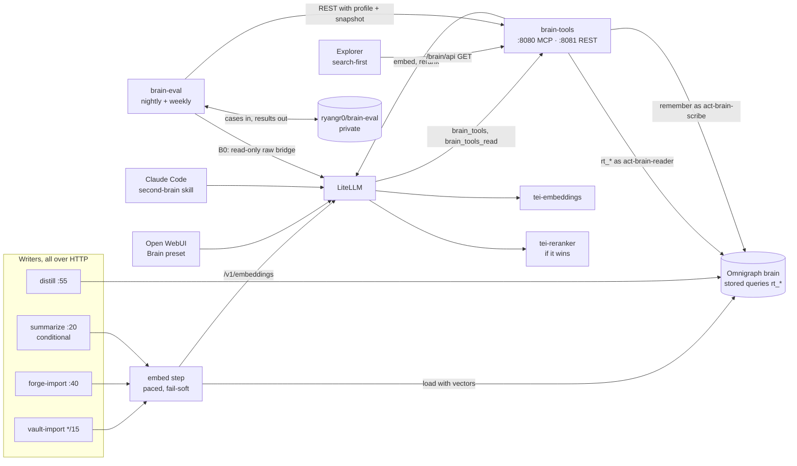

# RFC: Brain retrieval — a measured GraphRAG layer over the `brain` graph

> Status: **Accepted** (direction approved by Ryan on 2026-09-28; open choices in
> [section 13](#13-decisions-for-ryan)) · Date: 2026-09-28, P0 spikes 2026-09-29 ([results](#p0-spikes)) ·
> Epic: VIK-1259 · Tickets: VIK-1378, VIK-1379, VIK-1380, VIK-1381, VIK-1382, VIK-1384, VIK-1385,
> VIK-1386, VIK-1388 (P0–P8, [section 9](#9-phased-plan)), VIK-1348, VIK-1403 · Builds on the [knowledge system](../general/knowledge-system.md), the
> [Omnigraph runbook](../runbooks/omnigraph.md) and the
> [branch workflow RFC](rfc-omnigraph-branch-workflow.md)

> **TL;DR.** The `brain` graph holds the right material (750 notes, 2,615 Forgejo documents cut
> into 17,011 passages, 2,544 topics) and already has hybrid search as stored queries. Nobody can
> use it well. The LiteLLM MCP bridge exposes only raw tools, so the chat model has to hand-write
> the query language, and the recall query that does exist returns whole notes of up to 85k tokens.
> Half the text of the Obsidian notes sits past the 1,024 tokens the embedding model reads, and new
> or edited rows get vectors only at the nightly restart.
>
> The plan, in order:
>
> 1. **Measure first.** A 36-question evaluation set lives in a private repo, never in this
>    one. An in-cluster harness scores retrieval every night for free, and scores answers weekly.
> 2. **Fix the data without a schema change.** Obsidian notes are cut into passages the way
>    Forgejo documents are, stored as `Passage` rows of a shadow `obsidian-file/*` artifact.
>    Every writer supplies its own vectors, so nothing waits for the nightly restart.
> 3. **One tool server, `brain-tools`,** gives agents seven small tools (`search`, `read`,
>    `about`, `connect`, `recent`, `open_items`, `remember`). Each answer is compact and cited.
>    Behind `search`: one query embedding, parallel keyword and meaning legs, weighted fusion,
>    dedupe, an optional CPU reranker and a light graph expansion.
> 4. Open WebUI gets a **Brain** preset, Claude Code a `second-brain` skill, and the explorer
>    opens on search instead of the whole graph.
>
> Every step is scored against the same questions on the same graph snapshot, and ships only if
> the score moves. "No reranker" and "no summaries" are acceptable outcomes.

## 1. Why

Ryan asked on 2026-09-28 to make the second brain usable by him and by agents, and accepted the
proposal in this RFC's TL;DR. What was measured that day, read-only:

| Problem | Evidence |
|---|---|
| Agents cannot reach the hybrid search that exists | `recall_notes`, `recall_passages` and `recall_topics` rank by `rrf(nearest(...), bm25(...))`, but `@modernrelay/omnigraph-mcp` 0.10.0 (the newest on npm) registers only raw tools: `query` with hand-written GQ, `mutate`, `load`, branches, commits. A call to `query` with just a stored query's name fails with a parse error |
| Its output is unusable for a cheap model | `recall_notes` returns whole note content: 10 rows are 35–344 KB, about 9k–85k tokens |
| Half of every long note is invisible to meaning search | TEI truncates at 1,024 tokens (`--max-batch-tokens 1024`). 49.8% of Obsidian note tokens and 39.1% of forge ADR tokens lie past that point |
| New and edited rows have no vector until 03:15 | Loads never embed. The init container backfills at start. On 2026-09-28 that backfill held every graph offline for about 2 hours (VIK-1348). 331 passages lacked a vector the same evening |
| Edits wipe vectors | A merge load replaces the whole row. forge-import re-loads every passage of a changed artifact without a vector, and both importers write Note rows without one |
| Results are crowded by clones | About 21% of passages are exact duplicates: Renovate PR bodies and the issues that mirror them |
| Dutch questions pull noise | The full-text analyzer is English. A Dutch question's function words match unrelated Dutch documents on the keyword leg |
| The explorer opens on a hairball | It exports all 6,541 non-passage nodes into the browser at start |

## 2. What we know

Everything here was measured on 2026-09-28: live checks were read-only, and v0.11 behaviour was
tested with the pinned `omnigraph` 0.11.0 CLI on throwaway local graphs. No personal content is
reproduced; only counts, public repo names and generic examples. The P0 spikes (2026-09-29) re-ran
every mechanism the plan leans on against the pinned versions in throwaway local containers with
synthetic data; rows marked *(P0)* come from them, and the [P0 results](#p0-spikes) hold the detail.

### 2.1 The graph

| Type | Rows | Notes |
|---|---|---|
| Note | 750 | 461 Obsidian (`obsidian/`), 288 forge ADR copies (`forge/`, each also chunked as its artifact's passages), 1 hand capture (`nt-`) |
| Artifact | 2,615 | 1,003 documents, 1,612 issues and pull requests |
| Passage | 17,011 | forge chunks of at most 1,500 characters, median 350 tokens, none over 1,024 tokens; 38% from this repo |
| Topic | 2,544 | 53% linked to a single document ("dust"); 436 have 5 or more documents |
| Person / Organization / Project | 179 / 331 / 90 | 8 bot accounts stored as Person; 75% of persons and 65% of organisations have one link |
| Task, Event, Goal, Habit, Media | 0 | `open_items()` has no Task data today; open work lives in the `State: open` line of forge issue and PR headers |

Obsidian notes: median 686 characters, p90 5,878, max about 305k. 12 are titled "Untitled", 23
notes are empty. Daily and journal notes are mostly real content (median 718 stripped characters),
so "stub daily notes" are a small noise source.

### 2.2 Omnigraph v0.11 mechanics that shape the design

| Fact | Consequence |
|---|---|
| `rrf()` fuses exactly two arms (`nearest` or `bm25`); the fused score cannot be projected | Multi-leg fusion happens in the tool server, over ranks |
| `limit` must be an integer literal; there is no offset, `OR`, optional match or `IN` list | Candidate queries get fixed limits; expansion is one query per edge type |
| **Engine bug:** the ranked variable must be the first binding in `match{}`. Anchor-first makes `nearest`/`bm25` error and makes `rrf` silently return unranked rows. *(P0: anchor-first `nearest` answers 400 `search-ordered query produced rows without its 'p._distance' ranking column`; anchor-first `rrf` answers 200 in unranked order; `omnigraph lint` passes both)* | Every stored query binds the ranked variable first; a lint in this repo enforces it ([P1](#p1-safety-rails)), because the upstream lint cannot |
| `$p: Passage; $p passageOf $a; $a.slug starts_with "obsidian-file/"; $n noteFromArtifact $a` ranks correctly, with the filter applied before the limit *(P0: exactly the brute-force top 40 by distance)* | Obsidian chunks can share the `Passage` table and still be searched on their own |
| `nearest()` accepts a `Vector(384)` parameter | The tool server embeds a question once and passes the vector to every leg |
| Loads and mutations never embed; a writer may supply the vector in the load | Write-time vectors are possible today (the distiller already does this for topics) |
| A merge load or an `insert` on an existing key replaces the whole row, vector included | Every writer includes the vector, and never rewrites unchanged rows |
| `search()`/`bm25()` see rows written after the last index build (flat scan); only `fuzzy()` waits for the rebuild | No tool uses `fuzzy()`; no maintenance ever runs beside the live server |
| A `bm25` order returns only rows that match; an unknown term returns 0 rows *(P0)* | Keyword legs need no `search()` filter, and an empty keyword leg is a normal result |
| At a pinned `snapshot`, `bm25` and every other read see that snapshot's rows and scores: identical after later commits and after an index rebuild at head, and blind to later text *(P0)* | Eval arms pinned to one `graph_commit_id` are reproducible; a head read after a rebuild can shift scores in the third decimal |
| `rebuild-full-text-indexes` writes a commit on `main` as the operator actor *(P0)* | Commit audits and "no commit from this work" checks expect `act-gitops` commits after 03:15 |
| A type's full-text index is built only when `optimize` runs with rows present; before that, keyword search is case-sensitive and unstemmed | A **new** node type would search badly until the next restart. Reusing `Passage` avoids this |
| Policy-only and query-only bundle changes apply while a branch is open; a schema change does not, and a failed apply stops every graph | This plan changes no `.pg` file, so it needs no branch-free window |
| `invoke_query` in a rule together with `branch_scope` is rejected by `cluster apply` (`policy_invalid`), and today's validator does not catch it | New rules keep `invoke_query` in a separate rule; the rehearsal gate runs a real apply |
| Stored queries are served at `POST /graphs/{g}/queries/{name}` (0.07–0.26 s live, embedding included) | A tool server calls them over HTTP directly. Through the stdio bridge the same work costs 1–2 s |
| Per commit per table: 8,192 rows and 32 MiB; per request: 1 MiB for queries, 32 MiB for loads. *(P0: the 32 MiB request body binds first with vectors and answers 413 `length limit exceeded`: about 3,200 passages of 1,400 characters with full-precision floats, about 4,800 with 8 significant digits, which keeps cosine at 0.99999994 or more. Row 8,193 of one type answers a structured 413 with `resource_limit`)* | Writers split load files by body size (24 MiB) as well as by rows, and write floats with 8 significant digits |
| Mutation predicates take only comparison operators: `delete Passage where @id starts_with "…"` is a parse error *(P0)* | A prune names every chunk id; a missed chunk fails the whole mutation with `@card violation on edge PassageOf` |
| Writes are optimistic, not serialised: a write that sees another commit land during its preparation answers 409 with `read_set_conflict` (`write authority 'graph_head:main' changed during preparation`) and writes nothing *(P0)* | Every writer retries on `read_set_conflict` only, with backoff ([section 7.3](#73-importer-order-of-work)) |
| An `append` load of an existing id answers 409 `key_conflict`; an identical `merge` re-load still writes an empty commit *(P0)* | `remember` loads with `append`, so a retry never commits twice and never overwrites |
| A stored-query denial answers 404 `not_found`, like a missing query *(P0)* | The tool server checks the catalog at start; a 404 on a listed query is a policy error |
| Running `optimize`, `rebuild-full-text-indexes` or `repair` beside a server with writers can leave drift that blocks all writes to a type across restarts (reproduced 1 in 4) | Maintenance stays in the init container |

### 2.3 Serving stack

- **Embeddings.** TEI `cpu-1.9.4`, `granite-embedding-97m-multilingual-r2` (384 dimensions, Dutch
  and English in one space), about 1,000 tokens per second on worker-2. The model supports 32k
  tokens; the deployment caps inputs at 1,024. *(P0)* TEI's `auto_truncate` defaults to true and
  `max_input_length` is the smaller of 32,768 and `--max-batch-tokens`, so the OpenAI route drops
  everything past token 1,024 without an error: a 1,923-token input and its first 1,024 tokens embed
  identically, and appended text changes nothing. `/embed` with `truncate: false` answers 422, as do
  more than 64 inputs in one request. `dimensions: 384` is a no-op; a smaller value truncates the
  vector.
- **Embedding text.** *(P0)* `omnigraph embed` (the backfill) sends one row per request, body
  `{model, input: [text], dimensions: 384}`, and stores L2-normalised vectors. The text is
  `type: <Type>\n<field>: <value>` with the value trimmed of Unicode white space at both ends and
  inner white space kept verbatim; an empty value gives just `type: <Type>`. The trim set is Rust's,
  not Python's: `str.strip()` also removes U+001C–U+001F, which Omnigraph keeps. The
  [embedding contract](../../../../kubernetes/apps/ai/omnigraph/embed-step/app/contract.json) states
  the format, the trim set and the empty form, and its test proves all three against the pinned CLI.
  A stdlib builder following it matches `omnigraph embed` through the real TEI to 4.6e-8 per
  component, single or in batches of 16; without the trim, a trailing space already moves cosine to
  0.9988. The server embeds query text raw, and the distiller writes topic vectors from raw names.
  Raw versus prefixed text: cosine 0.98–0.99 for passages and notes, 0.91–0.93 for short topic
  names, so `Topic` stays raw and `Note` and `Passage` stay prefixed until E1 decides.
- **Reranking** is possible through LiteLLM's `huggingface/` rerank provider against a TEI
  `/rerank` endpoint. The provider always sends `truncate: false` and ignores `top_n`. On a Ryzen
  (4 cores), 20 candidates of 800 characters took 0.35 s with mMiniLM, 0.8 s with
  gte-multilingual-reranker-base int8 and 1.7 s with bge-reranker-v2-m3 int8. worker-2 (i7-6700K,
  no VNNI) is estimated at 2–3 times slower. No multilingual reranker fits TEI's CPU path besides
  these three. *(P0)* The provider sends `truncate: false`, `raw_scores: false`,
  `truncation_direction: Right` and forwards `top_n`; TEI returns every candidate anyway and LiteLLM
  does not slice. One candidate over the model's input length (512 tokens for mMiniLM) or more
  candidates than `--max-client-batch-size` fails the whole call with 422.
- **LiteLLM** spawns a stdio MCP server per call (0.7–1.0 s). An HTTP MCP server answers in
  0.15–0.4 s. The MCP REST route stops a call at 60 s. *(P0)* Virtual-key access groups hold on every
  route: `/mcp/`, the scoped `/<server>/mcp` and `/<group>/mcp`, and `/mcp-rest/tools/list` and
  `/tools/call`; a key without the group gets 403 at `initialize` or `access_denied`.
  `disallowed_tools` hides a tool and refuses its call on both routes. **Spend logs keep every MCP
  call's arguments** (`metadata.mcp_tool_call_metadata.arguments`, not the result) for the 90-day
  retention, with or without `turn_off_message_logging`; live on 2026-09-29, 233 of 251
  `omnigraph_brain` calls carried them, and the OTEL spans carried them too (327 `litellm` spans
  in VictoriaTraces over 7 days, attribute `metadata.mcp_tool_call_metadata`). VIK-1403 strips
  them from both since 2026-09-29 ([LiteLLM: MCP tool arguments](../general/litellm.md#mcp-tool-arguments)).
- **Open WebUI** 0.11.4 runs with `ENABLE_PERSISTENT_CONFIG=false` and `ENABLE_API_KEYS=false`. A
  named custom model exists only in its database and needs an admin call to create. *(P0)* That
  call can use a JWT signed with `WEBUI_SECRET_KEY`, but only for the id of an existing admin user,
  and that id lives only in `webui.db` (SQLite on the RWO volume `open-webui-data`); no API returns
  it without a token. The model picker pre-selects a model's `meta.toolIds`; the backend only uses
  `tool_ids` the client sends. Open WebUI adds 27 built-in tools to every UI chat unless the model's
  `meta.capabilities.builtin_tools` is false.

## 3. Principles

1. **Measure, then change one thing.** Every phase names the metric it should move and is scored
   against the previous phase on one pinned snapshot.
2. **No schema change.** Everything new fits the existing `brain.pg` types. This removes the only
   bundle change that can take every graph down.
3. **Writers bring their own vectors,** in the same text format as the vectors already stored. The
   startup backfill becomes a bounded safety net.
4. **Tools, not a query language.** Agents never write GQ. The tool server calls fixed stored
   queries, returns compact cited text, and says plainly when the brain has nothing.
5. **Read and write are different identities and different endpoints.** Reads run as
   `act-brain-reader`. The one write, `remember`, runs as `act-brain-scribe` and never appears on
   the read endpoint.
6. **Nothing about Ryan's data leaves the cluster** except through model calls via LiteLLM. Eval
   questions, answers and note text never enter this public repo, logs, metric labels, ntfy or
   Vikunja. Logs carry question ids, hashes, counts and timings, never slugs, because a note slug is
   derived from its title.

## 4. Architecture



### 4.1 Components

| Component | What | Where |
|---|---|---|
| `brain-tools` | Node 24 TypeScript, `node:http`, `@modelcontextprotocol/sdk` (streamable HTTP, stateless), `@modernrelay/omnigraph` client. Port 8080 serves `/mcp` (7 tools) and `/mcp/read` (6 read tools) and admits only LiteLLM. Port 8081 serves the read-only REST API (`/api/search`, `/api/read`, `/api/about`, `/api/connect`, `/api/recent`, `/api/open_items`, `/api/neighbourhood`, `/api/hubs`, `/metrics`, `/healthz`, `/readyz`) and admits the explorer, the eval jobs and `observability`. REST never writes | Repo `webgrip/brain-tools` (Forgejo-leading), built like the explorer: `docker-build-push-registry-fast`, grype CVE gate, cosign. Manifests `kubernetes/apps/ai/brain-tools/`. One replica, worker pool, 50m/128Mi request, 512Mi limit |
| Embed step | One shared script, used as a container between plan and apply in vault-import, forge-import and summarize. Fills `embedding` on every Note and Passage row it is about to write, in the backfill's text format, pre-truncated to 8,000 characters, batches of 16, paced to about 300 tokens per second. On a LiteLLM failure it writes the row without a vector and logs `embedding skipped` | `kubernetes/apps/ai/omnigraph/embed-step/` (ConfigMap with a fixed name) |
| Embedding contract | One ConfigMap holding model, dimensions and text format, read by the embed step, the summarizer and `brain-tools`. A test asserts it matches `brain.pg`'s `@embed` model and `cluster.yaml`'s provider | `kubernetes/apps/ai/omnigraph/embed-step/` |
| `tei-reranker` | TEI `cpu-1.9.4` (same digest as `tei-embeddings`), one model, `--tokenization-workers 2 --max-batch-tokens 2048 --max-client-batch-size 32`, 2Gi limit. Built only in the bake-off, kept only if it wins | `kubernetes/apps/ai/tei-reranker/` |
| `brain-eval` | stdlib Python harness in CronJobs: nightly retrieval, weekly answers, manual gate, suspended candidate generation | `kubernetes/apps/ai/omnigraph/brain-eval/` |
| Summarizer | Optional; topic, person and project summaries as Notes | `kubernetes/apps/ai/omnigraph/summarize/` |

### 4.2 Identities

| Identity | Rights on `brain` | Held by |
|---|---|---|
| `act-brain-reader` (new) | `read` on any branch; `invoke_query` (separate rule) | `brain-tools` for every read |
| `act-brain-scribe` (new) | `read` and `change` on `branch_scope: protected` (that is `main`); no branch rights, no `invoke_query` | `brain-tools` for `remember` only |
| `act-brain-eval` (new) | `read` and `export` on any branch; `invoke_query` (separate rule) | `brain-eval` jobs and the `omnigraph_brain_eval` bridge |
| LiteLLM key `brain-tools` | models: granite embedding and `rerank-*`; no MCP groups; USD 1 per 30 days | `brain-tools` |
| LiteLLM key `omnigraph-eval` | models: `chat-default`, `fireworks-gpt-oss-120b`, `fireworks-deepseek-v4p1-flash` (judge, pooling), `deepseek-chat` (pooling fallback); MCP groups `brain-read`, `brain-eval-raw`; USD 10 per 30 days | `brain-eval` |
| Existing key `omnigraph-embeddings` | reused by the embed step | importers, summarizer |

LiteLLM MCP servers after [P6](#p6-agent-surfaces):

| Server | Target | Access group | Keys |
|---|---|---|---|
| `brain_tools` | `brain-tools:8080/mcp` | `brain` | `open-webui`, `claude-code` |
| `brain_tools_read` | `brain-tools:8080/mcp/read` | `brain-read` | `omnigraph-eval` |
| `omnigraph_brain` (raw, `act-brain-agent`) | stdio bridge | `brain-raw`, with `disallowed_tools: [branches_merge, branches_delete]` | `claude-code` only |
| `omnigraph_brain_eval` (raw, `act-brain-eval`) | stdio bridge | `brain-eval-raw` | `omnigraph-eval`, to score the B0 baseline |

The server is named `brain_tools`, not `brain`, because LiteLLM resolves access-group names on
the scoped `/<name>/mcp` path and the group `brain` already exists.

*(P0)* This table works as written on LiteLLM 1.102.1. With keys shaped like the ones above, a
stateless `brain_tools` stub and the real stdio bridge: `open-webui` sees the 7 `brain_tools-*` tools
on `/mcp/`, `/brain_tools/mcp` and `/brain/mcp` and gets 403 everywhere else; `claude-code` sees 20
(7 plus the raw bridge's 15 minus the two disallowed); `omnigraph-eval` sees 6 plus 15; a key with no
groups, or with models only like the `brain-tools` key, gets 403 on every MCP path. On a scoped path
both `search` and `brain_tools-search` resolve. A `server_id` follows from the server's config, so
the local `omnigraph_brain` id equalled the live one. `omnigraph_brain_eval` also gets
`disallowed_tools` for `mutate`, `load` and the branch writes: `act-brain-eval` is refused by policy
anyway, and the list then shows the model only what it may use.

### 4.3 Network

Namespace `ai` is default-deny, so every path opens on both ends: `litellm-allow-egress` gains
`brain-tools:8080` and `tei-reranker:8080`; `omnigraph-ingress` gains `brain-tools` and
`omnigraph-brain-eval`; `brain-tools` egress reaches `omnigraph:8080`, `litellm:4000` and DNS; the
explorer egress gains `brain-tools:8081`; the importers' egress gains `litellm:4000`; `brain-eval`
egress reaches `omnigraph`, `brain-tools:8081`, `litellm`, `forgejo-ssh:22`, `vmagent:8429` and
`ntfy:8080`. `tei-reranker` admits only LiteLLM and the scrape, with a `toFQDNs` Hugging Face egress
for its model fetch.

## 5. Retrieval pipeline

`search()` in the production profile:

1. Normalise the question and guess Dutch or English from stopword hits.
2. Embed it once through LiteLLM (raw text, as today's query side does). On failure, run keyword
   legs only and mark the answer `degraded: keyword-only`.
3. Build the keyword string with Dutch and English stopwords and punctuation removed. If nothing
   is left, skip the keyword legs.
4. Run the legs in parallel, at most 8 in flight, all as `act-brain-reader`:

   | Leg | Stored queries | Limit |
   |---|---|---|
   | Forge passages | `rt_doc_passages_vec($v)`, `rt_doc_passages_bm25($k)` (artifact slug starts with `forge/`) | 40 |
   | Obsidian passages | `rt_note_passages_vec`, `rt_note_passages_bm25` (artifact slug starts with `obsidian-file/`, joined to the Note) | 40 |
   | Captures | `rt_captures_vec`, `rt_captures_bm25` (Note slug starts with `nt-`) | 10 |
   | Summaries (P7) | `rt_summaries_vec`, `rt_summaries_bm25` (Note slug starts with `derived/summary/`) | 5 |
   | Topics, for `related` | `rt_topics_vec`, `rt_topics_bm25` | 8 |

5. Fuse by weighted reciprocal rank (k = 60). Starting weights: meaning 1.0; keywords 1.0 for
   English and 0.6 for Dutch. Weights are tuned on the dev split only.
6. Collapse: normalised-text hash dedupe keeps the newest and notes `+N similar`; at most 2 chunks
   per document; chunks of 80 characters or fewer dropped unless nothing else is left; artifacts
   authored by bot persons weighted ×0.3 unless the question names them. Forge ADR Notes never
   appear, because their text is served through their artifact's passages.
7. Rerank (profiles `p2` and up): the top 24, each cut to title plus the best 1,000-character
   window, through LiteLLM `/rerank`; top-n sliced client-side; on a 2.5 s timeout keep the fused
   order and mark `reranked: false`.
8. Expand the top 3 documents: topics (5 each), project, people (3 each), and the top topic's
   summary when one exists.
9. Render: numbered sources with ref, title, kind, date, link and a snippet of at most 600
   characters centred on the best term hit; then related entities; then the footer.

**Profiles** are named pipelines chosen per REST request, so eval arms compare for free on one
snapshot: `p0` replicates today's stored `recall_*` queries exactly, `p1` fuses and dedupes, `p2`
adds rerank, `p3` adds expansion and summaries. The production default comes from an environment
variable.

## 6. Tool specs

### 6.1 Common contract

- MCP names are `brain_tools-<tool>`. Every tool returns a text block for the model plus
  `structuredContent` (the same data as JSON).
- **Refs** are stable handles: `note:<slug>#<chunk>`, `doc:<artifact slug>#<chunk>`,
  `topic:<slug>`, `person:<slug>`, `project:<slug>`, `org:<slug>`. **Links**: a forge document's
  own URL; everything else `https://graph.<domain>/?graph=brain&node=<slug>`, which the
  search-first explorer opens as that node's neighbourhood. The base URL is an environment
  variable, never hardcoded.
- **Limits:** request body 16 KB; question 500 characters; names 200; `remember` text 4,000.
  Deadline 8 s per call, far under LiteLLM's 60 s. Responses: `search` and `about` at most 6,000
  characters (about 1,500 tokens), `read` 4,000, the rest 3,000. Lowest-ranked items are cut first
  and `truncated: true` is set.
- **Errors teach.** Examples: "No results. Try 2–4 key words, or `about` with a topic or person
  name." · "Ambiguous: did you mean A (topic, 120 documents) or B (person)?" · "The brain is
  unavailable right now (restarting). Tell Ryan you could not check his brain; do not answer from
  memory." `/readyz` fails while the stored-query catalog is unreachable or incomplete, so LiteLLM
  reports an error instead of hanging.
- **Footer:** graph commit, whether a rerank happened, elapsed time, and "Private: cite, do not
  copy into git, tickets or public pages."
- **Caches.** An entity name and alias index (Topic, Person, Project, Organization, Area; about
  3.5k rows, refreshed every 15 minutes), the bot-person set and the noise sets. When a request
  pins a `snapshot`, the caches are bypassed or rebuilt at that snapshot, so pinned runs are
  reproducible.
- **Logs and metrics** carry tool, outcome, latency, counts and graph commit. Never arguments,
  results or slugs.

### 6.2 The seven tools

| Tool | Signature | Does | Budget |
|---|---|---|---|
| `search` | `search(query, scope = all\|notes\|docs, limit = 8)` | Section 5. Use first for any question about Ryan's work, notes, decisions or projects | p95 ≤ 1.0 s fused, ≤ 3.0 s with rerank |
| `read` | `read(ref, around = 1)` | Opens a `doc:` or `note:` ref with its neighbouring chunks (at most 3). Entity refs redirect to `about`. An unknown ref answers "use refs exactly as search returned them" | p95 ≤ 1 s |
| `about` | `about(thing, limit_docs = 6)` | Resolves a name or ref: exact slug, then exact name or alias (case- and accent-folded), then fuzzy against the cache, then `rt_topics_vec` and the entity keyword queries. Near-ties return "did you mean" with at most 5 candidates and never guess. Returns a card (description, status, relation, aliases, degree), the summary if one exists, recent linked documents with snippets, related topics by shared documents, and linked people and projects | p95 ≤ 2.5 s, ≤ 6,000 chars |
| `connect` | `connect(a, b)` | Resolves both like `about`. Tries direct edges (`TopicRelatedTopic` with its document count, `Knows`, `PersonInvolvedInProject`, `ProjectAboutTopic`), then shared documents (intersection of each side's linked documents, capped at 200 each, ranked against `search("a b")`), then bridging topics. Says "no connection within 2 hops" when nothing is found | p95 ≤ 3 s |
| `recent` | `recent(days = 7, kind = all\|notes\|docs\|captures)` | Notes by `updatedAt` (excluding `derived/`) and artifacts by `timestamp` (excluding `obsidian-file/` and bot authors), grouped by day, at most 40 lines. States that `updatedAt` is when the importer saw the change | p95 ≤ 1 s |
| `open_items` | `open_items(project?, include_dependency_updates = false)` | Task rows not done or dropped (none today, and it says so); unchecked `- [ ]` lines in Obsidian passages; forge issues and pull requests whose header says `State: open`, from the last 365 days, Renovate and dependency PRs hidden unless asked. Grouped by project, at most 30 lines | p95 ≤ 1 s |
| `remember` | `remember(text, about = [], kind = idea)` | Only on `/mcp`, only when Ryan explicitly asks. Refuses credential-shaped text; 20 per hour. Slug `nt-<yyyymmdd>-<sha256(text)[:10]>`, so a retry is idempotent and an existing slug is never overwritten. Resolves `about` names with the `about` resolver and never creates entities; unresolved names come back with suggestions. One `append` load on `main` as `act-brain-scribe` (P0: a retry then answers 409 `key_conflict` instead of writing a second, empty commit): the Note with its vector (text up to 4,000 characters fits one vector) and `NoteAbout*` edges with fixed ids `remember:<EdgeType>:<note>><target>`. Answers "Saved as <ref> (commit <id>). Linked: … Unresolved: …". The note is searchable at once; the distiller adds topics at :55 | p95 ≤ 1.5 s |

`remember` uses the documented capture prefix `nt-`, so `recent`, the explorer, the eval
equivalence map and the audit all see one capture namespace. An hourly housekeeping loop in
`brain-tools` checks, from `commits_list` and `commits_changes`, that every row `act-brain-scribe`
touched is an `nt-` Note it inserted or a `remember:` edge, and exports
`brain_scribe_foreign_writes_total`.

### 6.3 Brain preset prompt

A generic prompt committed as a file and mounted by both the preset provisioner and the eval
harness, so the prompt that is measured is the prompt that ships: use the brain tools for any
question about Ryan's work, notes, decisions, people or projects; `search` or `about` before
answering; cite every claim with the link the tool gave; `read` instead of guessing; say plainly
when the brain has nothing and do not answer from general knowledge unless asked; relay a "brain
unavailable" error; `remember` only on an explicit request, then repeat back what was saved;
answer in the question's language. *(P0)* Open WebUI shows the tools to the model as
`brain_tools_brain_tools-<tool>` (its connection id, then LiteLLM's prefix), so the prompt names
tools by their short names: `search`, `read`, `about`.

## 7. Data changes, without a schema change

### 7.1 Representations

| Need | Representation in today's `brain.pg` |
|---|---|
| Obsidian chunks | A shadow Artifact `obsidian-file/<tail>` (kind `document`, source `notes-app`, `content` null, `content_sha256` of the note) linked by the existing `NoteFromArtifact` edge, plus `Passage` rows `obsidian-file/<tail>#<i>` with `PassageOf`. Heading-aware chunks of at most 1,200 characters, each starting with a `Title › Heading` line. Notes under 80 stripped characters get no chunks. The Note row stays, so links, topics and the explorer are unchanged |
| Write-time vectors | The embed step fills `embedding` on Note and Passage rows in the backfill's `type: <Type>\n<field>: <value>` format, so each type keeps one vector space. Experiment E1 ([section 8.6](#86-experiments)) decides whether a one-off raw re-embed is worth it |
| Unchanged chunks keep vectors | forge-import and vault-import diff a changed document's chunks by text against a per-document query (ids and text only) and write only chunks whose text changed; removed chunk ids are deleted. Unchanged rows are never touched |
| Open items | The existing `State: open` line in forge thread headers, and `- [ ]` lines in Obsidian passages |
| Summaries (P7) | Notes `derived/summary/<type>/<tail>`, kind `insight`, tag `summary`, with a vector and no edges. State rows are Distillation rows `derived/summary/state/<type>/<tail>` whose `source` is the summary slug itself, never a document or entity slug |
| Captures from `remember` | Notes `nt-…` with a vector and fixed-id edges |

### 7.2 Stored queries

One new file, `brain.retrieval.gq`, holds every `rt_*` query that P4 to P7 need, listed in
`cluster.yaml` **and** in the `omnigraph-bundle` `configMapGenerator` in the same commit. Rules:
the ranked variable is bound first, every limit is a literal, no fused score is projected, and
passage queries return `$p.@id`. It is one push, so omnigraph restarts once (about 76 s).

*(P0)* These shapes lint clean and returned the expected rows on the pinned server; the legs of
section 5 follow the first two (captures, summaries and topics filter `$n.slug starts_with "nt-"`,
`"derived/summary/"` or nothing, with limits 10, 5 and 8):

```gq
query rt_doc_passages_vec($v: Vector(384)) {
  match {
    $p: Passage
    $p passageOf $a
    $a.slug starts_with "forge/"
  }
  return { $p.@id, $a.slug, $a.name, $a.kind, $a.url, $a.timestamp, $p.chunk_index, $p.text }
  order { nearest($p.embedding, $v) }
  limit 40
}

query rt_note_passages_bm25($k: String) {
  match {
    $p: Passage
    $p passageOf $a
    $a.slug starts_with "obsidian-file/"
    $n noteFromArtifact $a
  }
  return { $p.@id, $n.slug, $n.name, $n.kind, $n.updatedAt, $p.chunk_index, $p.text }
  order { bm25($p.text, $k) desc }
  limit 40
}

query rt_recent_notes($since: DateTime) {
  match {
    $n: Note
    $n.updatedAt >= $since
  }
  return { $n.slug, $n.name, $n.kind, $n.updatedAt }
  order { $n.updatedAt desc }
  limit 40
}

query rt_open_threads($since: DateTime) {
  match {
    $a: Artifact
    $a.timestamp >= $since
    $a.content contains "\nState: open\n"
  }
  return { $a.slug, $a.name, $a.url, $a.timestamp }
  order { $a.timestamp desc }
  limit 60
}

query rt_open_checkboxes() {
  match {
    $p: Passage
    $p.text contains "- [ ] "
    $p passageOf $a
    $a.slug starts_with "obsidian-file/"
    $n noteFromArtifact $a
  }
  return { $p.@id, $n.slug, $n.name, $p.text }
  limit 60
}

query rt_topic_hubs() {
  match {
    $t: Topic
    $a artifactAboutTopic $t
  }
  return { $t.slug, $t.name, count($a) as documents }
  order { documents desc }
  limit 20
}

query rt_passage_window($slug: String, $lo: I32, $hi: I32) {
  match {
    $a: Artifact { slug: $slug }
    $p passageOf $a
    $p.chunk_index >= $lo
    $p.chunk_index <= $hi
  }
  return { $p.@id, $p.chunk_index, $p.text }
  order { $p.chunk_index asc }
  limit 5
}

query rt_artifact_chunks($slug: String) {
  match {
    $a: Artifact { slug: $slug }
    $p passageOf $a
  }
  return { $p.@id, $p.chunk_index, $p.text }
  order { $p.chunk_index asc }
  limit 2000
}
```

Result columns are named by expression (`p.@id`, `a.slug`, `n.updatedAt`); `DateTime` values come
back as `2026-09-27T08:00:00` in UTC without `Z`, and a bare date is accepted as a `DateTime`
parameter. `rt_open_threads` matches the forge thread header's second line exactly;
`rt_passage_window` and `rt_artifact_chunks` rank nothing, so anchoring them first is fine.
`rt_artifact_chunks` is the per-document read for the changed-chunk diff and the complete prune
list of section 7.3.

### 7.3 Importer order of work

1. **Distiller first, one commit ahead:** skip every Artifact whose slug starts with
   `obsidian-file/` or whose `content` is null; filter `distill_state` to
   `$n.slug starts_with "derived/distill/"`; tests. Verify the live ConfigMap carries it before step 4.
   Without this the distiller would extract topics from 461 bare titles, and summary state rows
   would make it re-extract projects every hour.
2. **Embed contract and embed step.**
3. **forge-import:** changed-chunk diff, vectors on every Passage and Note row it writes, heal mode
   for its own vectorless rows (at most 1,500 per run), retry with backoff on 409 `read_set_conflict`.
4. **vault-import:** shadow artifacts and chunks, vectors on Note and Passage rows, heal mode (300
   per run), at most 300 notes chunked per run so the first load spreads over a few runs. A
   renamed or deleted note is pruned from the snapshot's **complete** chunk list, with Passages,
   the shadow Artifact and the Note deleted in one mutation; a missed chunk would fail
   `PassageOf @card(1..1)` and stop every later run. *(P0)* Deleting only the Note leaves the
   shadow artifact and its passages behind, so the snapshot also lists `obsidian-file/*` artifacts
   on their own and prunes any whose Note is gone.

*(P0)* Rules every writer follows, from the S3–S5 spikes:

- **Retry only `read_set_conflict`.** Three concurrent writers made 2–7% of loads and most strict
  prunes answer 409 `read_set_conflict`; with 200 ms doubling backoff and jitter over 6 attempts
  every load succeeded and 18 of 20 contended prunes did. The importers run minutes apart, so 8
  attempts is ample. Never retry `key_conflict` (it will not change) or a 503 (recovery required:
  fail the run and let the next one replan).
- **Embed text** per the embedding contract: trim with its `value_trim_characters` (never
  `str.strip()` without arguments), use `empty_value_format` for an empty value, and skip rows
  with no text rather than embed `type: <Type>`. Batches of up to 64 inputs give the same vectors
  as single requests.
- **Read JSONL by `\n` only.** Python's `splitlines()` also splits on U+0085, U+2028 and U+2029,
  which JSON strings carry unescaped; `omnigraph embed` output with a U+2028 broke exactly that way.
- **Write floats with 8 significant digits** and split load files at 24 MiB of request body as well
  as at the row limit.

### 7.4 Bundle rollout

- The rehearsal gate ([P1](#p1-safety-rails)) must pass in `lefthook` pre-commit. e2e on `main`
  is a backstop only: it runs after the push, and a later push cancels an earlier run today.
- New actors take two restarts by nature (the policy ConfigMap, then the `omnigraph-tokens`
  aggregator 15 minutes later). Push the token ExternalSecret and PushSecret pairs first, wait
  until the aggregator has re-rendered, then push the policy. Both pushes avoid minutes :38–:58
  and the 03:15 window.
- Verify live after each push: `GET /graphs/brain/queries` lists the new queries, and
  `brain-tools` `/readyz` is green.

### 7.5 Forgetting

Deleting a sensitive note must also clear what was derived from it:

- The importer deletes the Note, its chunks and its shadow artifact.
- A summary whose sources changed is regenerated on the next run, **bypassing** the minimum
  regeneration interval when a source was removed.
- Eval cases that pointed at the note become stale and are reported; Ryan removes them from the
  eval repo.
- `remember` captures that quote it are found with `search` and deleted by Ryan as `act-ryan`.
- Old Lance versions keep the text until a `cleanup` runs; follow
  [forget a meeting](../runbooks/omnigraph.md#forget-a-meeting). A retention for `cleanup` is a
  follow-up (section 9.10).
- LiteLLM kept the arguments of every MCP tool call *(P0)*: a `search` question, a `remember`
  text, a raw `mutate` with note text, for 90 days in the spend logs and 14 days in the trace
  spans. VIK-1403 replaces them with `{"redacted": true}` since 2026-09-29, before P2's answer
  mode; rows and spans written before it age out with their retention.

## 8. Evaluation

### 8.1 Where it lives

The questions, expected documents, key facts, candidates and per-question results live in a
**private Forgejo repo, `ryangr0/brain-eval`**, under the user account so the org-wide mirror
sweeps never touch it. The commit that creates the jobs also adds it to forge-import's
`skip_repos`, before any content lands. This repo (public on GitHub) holds only the harness code,
synthetic fixtures, opaque question ids and aggregate scores.

### 8.2 The set

36 cases, one YAML file each: id, split (`dev` or `holdout`), category, language, question,
answerable, expected documents with grades 2 or 1, 1–4 key facts, and for time-bound cases a
computed expectation instead of stored answers.

| Category | Cases | Notes |
|---|---|---|
| docs-en | 6 | Runbooks, ADRs, how-tos |
| notes-nl | 6 | At least 2 whose answer sits past a note's first 1,024 tokens |
| notes-en | 4 | |
| cross-lingual | 4 | Dutch question on an English source, or the reverse |
| about | 6 | "What do I know about X" |
| connect | 4 | "How does X relate to Y" |
| temporal | 3 | `recent`, `open_items` |
| unanswerable | 3 | Scored on abstention only |

Eight cases, one per category, are holdout: never inspected while tuning, reported at gates.

**Building it.** A suspended candidates Job samples about 30 sources, stratified (Obsidian notes
with 300 or more stripped characters, balanced Dutch and English; forge docs, runbooks and ADRs
without bot PRs; topics with 10 or more documents; persons with 3 or more). `fireworks-gpt-oss-120b`
drafts two paraphrased questions per source; a candidate sharing any 5-gram with its source is
regenerated once, then dropped. Relevance pooling: the judge model (D3) grades the union of the top
10 from `p0`, a meaning-only leg and a keyword-only leg to pre-fill expected documents. The Job
pushes a `candidates/<date>` branch; Ryan edits in the Forgejo web UI, adds at least 6 questions
he really asks and the 3 unanswerable ones, cuts to 36 and merges. He also hand-grades 10 answers
into `calibration/` for the judge check.

### 8.3 Modes

| Mode | What | When | Cost |
|---|---|---|---|
| Retrieval | Each case calls `brain-tools` REST (`/api/search`, or `/api/about` and `/api/connect` for their categories) per profile, all pinned to the snapshot read at run start | Nightly 04:40 Europe/Amsterdam, after the 03:15 restart finished | USD 0 |
| Answer | `chat-default` with `disable_fallbacks`, temperature 0.2, at most 6 tool turns, the shipped prompt, tools through LiteLLM `/brain_tools_read/mcp` with the eval key. B0 uses `/omnigraph_brain_eval/mcp` (raw GQ tools, read-only actor) and no brain prompt: today's experience | Weekly, Sunday 05:10 UTC (outside the eval store's 03:05–03:30 UTC backup window); at gates with 3 repeats | about USD 0.60 a run; B0 about 0.50 |
| Gate | Every relevant profile plus answer mode, 3 repeats | Manual, `kubectl -n ai create job --from=cronjob/omnigraph-brain-eval-gate omnigraph-brain-eval-gate-manual` | about USD 3.50 |

The harness carries its own small MCP client (initialize, tools/list, tools/call), so it drives
the real agent path with its own budgeted key.

### 8.4 Metrics

- **Retrieval:** Recall@5, Recall@8, Hit@1, MRR@8, graded nDCG@8 (primary), candidate recall@40
  (the ceiling before rerank), payload characters, stage latency p50 and p95. Ground truth is at
  document level: a passage hit rolls up to its artifact, an `obsidian-file/x` hit counts as
  `obsidian/x`, a forge ADR Note counts as its artifact (map fetched at run time).
- **Answers,** judged by `fireworks-deepseek-v4p1-flash` (D3; a different family from MiniMax and gpt-oss) at
  temperature 0 with strict JSON: key-fact recall, faithfulness (share of claims grounded in the
  tool outputs), citation precision, abstention accuracy. Alongside: tool calls per answer,
  tool-error rate, tokens and USD per answer, end-to-end latency. Tool outputs are cut to the same
  12 KB for every arm before the judge sees them.
- **Tool level:** `about` top-1 entity resolution, `connect` path found.

### 8.5 Rigour

- **Control pair on every answer run:** a planted correct answer must score 0.8 or more, a
  planted unsupported answer 0.2 or less, or the run publishes only
  `brain_eval_judge_control_ok 0`, exits non-zero and alerts.
- **Judge calibration:** agreement with Ryan's 10 hand grades at least 80%, rechecked whenever
  the judge or its prompt changes; otherwise switch to the next cheapest judge of another family
  (`deepseek-chat`, then `deepseek-reasoner`; never Anthropic, D3). Ten grades is a sanity
  check, not a proof.
- **Pinning:** every arm of a run reads one `graph_commit_id`. Comparisons across days use the
  stored per-question results, never re-runs of old snapshots, so a future `cleanup` retention does
  not break the history.
- **Stale cases:** every expected slug is checked before scoring; a missing one excludes the case
  and counts in `brain_eval_stale_cases`.
- **Independent temporal truth:** time-bound expectations come from an `export` of the type plus
  a Python filter, never from the stored queries the tools use. A unit test plants a fixture on
  which the two paths disagree.
- **Spend cap per run,** read from `x-litellm-response-cost`; hitting it aborts and marks the run
  invalid. Each new mode first runs on 3 questions.
- **Decision rule,** fixed before P4. On the dev split (28 cases) a change is adopted only if all
  hold:
  1. the paired mean delta of the primary metric (nDCG@8 for retrieval changes, key-fact recall
     for answer changes, averaged over 3 repeats) is at least +0.05;
  2. net per-case wins are at least 3 (sign-test p reported);
  3. no category loses more than one case;
  4. guardrails hold: search p95 ≤ 3.0 s, response ≤ 6,000 characters, USD per question up by
     at most 50% unless quality rose by 0.10.

  The holdout direction is reported; when it disagrees with dev, Ryan decides. A tie keeps the
  simpler pipeline. With n = 36 (standard error about 0.09 on a hit metric) only large effects are
  visible; paired comparison helps, and the set grows toward 60 after P6.

### 8.6 Experiments

Run in memory, writing nothing: **E1** raw versus `type:`-prefixed vectors for the candidate pool
of each question (decides whether a one-off raw re-embed of 17k passages, about 1 hour of CPU at
night, is worth doing); fusion-weight sweeps on the dev split.

### 8.7 Outputs

- Per-question detail: `results/<date>/<mode>-<profile>.json` in the private repo (the durable
  history; Forgejo is backed up).
- Aggregates to `vmagent` (`/api/v1/import/prometheus`): `brain_eval_score{metric, profile,
  category, split, mode}`, `brain_eval_cost_usd{mode}`, `brain_eval_latency_seconds{stage,
  quantile}`, `brain_eval_missing_vectors_ratio{type}`, `brain_eval_stale_cases`,
  `brain_eval_judge_control_ok`, `brain_eval_last_success_timestamp_seconds{mode}`. Labels come
  from a fixed allowlist enforced by a unit test. VictoriaMetrics keeps 15 days, so this is a
  monitoring feed, not the record. *(P0)* The push goes to
  `vmagent-vmagent.observability:8429/api/v1/import/prometheus?extra_label=job=omnigraph-brain-eval`.
  A pushed sample leaves plain instant queries after about 5 minutes, so alerts and stat tiles read
  `last_over_time(…[3d])`.
- Grafana *Brain retrieval quality*: stat tiles and tables per profile and category, money in
  nl-NL with 2 decimals.
- ntfy and Vikunja evidence comments: numbers only. The Vikunja and VictoriaLogs MCP servers log
  full payloads, so eval text never travels through them.

## 9. Phased plan

| Phase | Delivers | Depends on | Ticket |
|---|---|---|---|
| P0 | Spikes that settle every unverified mechanism | none | VIK-1378 |
| P1 | Safety rails: rendered-bundle rehearsal gate, capped backfill, embedding contract | none | VIK-1379 |
| P2 | Eval set, harness, baselines B0 and p0 | P0, P1 | VIK-1380 |
| P3 | Data: write-time vectors, changed-chunk diff, Obsidian chunks | P1, P2 | VIK-1381 |
| P4 | `brain-tools` retrieval core: `search` and `read` | P2, P3 | VIK-1382 |
| P5 | Reranker bake-off on CPU | P4 | VIK-1384 |
| P6 | Agent surfaces: all tools, Brain preset, skill, answer gate | P4 (P5's outcome optional) | VIK-1385 |
| P7 | Topic, person and project summaries, only if the eval asks | P3, P6 | VIK-1386 |
| P8 | Explorer search-first with noise hidden | P4 | VIK-1388 |

### P0 Spikes

Pinned `omnigraph` 0.11.0 and `litellm` 1.102.1 in throwaway directories; no live writes. Results
(yes or no, timings, no data) are appended to this RFC.

**Results (2026-09-29).** Run against the pinned binaries and image digests (`omnigraph-server`
v0.11.0 `db091109`, `litellm-database` v1.102.1 `c38fe5ef`, TEI `cpu-1.9.4` `2538ea1c`, Open WebUI
v0.11.4-slim `0487ad4a`, vmagent and vmsingle v1.147.0) in local containers on the workstation, with
synthetic data only: a seeded copy of the live bundle with 270 passages, 60 Obsidian-shaped notes
and 120 forge-shaped documents. Timings are from that workstation (32 threads), not worker-2.

| # | Result | What was measured |
|---|---|---|
| S1 | Yes, re-confirmed | With a branch open, a query-only apply and a policy-only apply converge. A rule with `invoke_query` and `branch_scope` fails `policy_invalid` (`uses branch_scope with unsupported action 'invoke_query'`). A schema change is `Blocked: schema_apply_failed` (`requires a graph with only main`) |
| S2 | Yes, 20 of 20 shapes | The shapes in [section 7.2](#72-stored-queries) and the legs of section 5 lint clean and return the expected rows: vector legs equal the brute-force top 40 by distance after the prefix filter; the `DateTime` leg is ordered and bounded; grouped `count()` matches a hand count; the `contains` legs find exactly the planted open threads and checkboxes. Anchor-first `nearest` answers 400 and anchor-first `rrf` answers 200 unranked, and `omnigraph lint` passes both. A `bm25` order returns only matches. At a pinned snapshot, `bm25` returns identical rows and scores after later commits and after an offline index rebuild at head, and never sees later text. Legs took 2–15 ms locally |
| S3 | Yes, with one no | One `/load` carries the Note, the shadow Artifact (no `content`, source `notes-app`), `NoteFromArtifact`, Passages with vectors and their `PassageOf` edges, in any order, 33 ms. A prune naming every chunk commits; missing one chunk, or deleting the artifact first, fails the whole mutation. **No:** `delete … where @id starts_with` does not parse, so the prune must list every id. Deleting only the Note orphans the shadow artifact and its passages. `act-brain-scribe` (`read` and `change` on `branch_scope: protected`) loads on `main` in 16 ms, is refused on another branch, cannot create branches, export or invoke stored queries, and **can** delete any row on `main`: the audit is the only guard. `append` answers 409 `key_conflict` on an existing id. A fixed-id edge merge-loaded twice stays one edge; an identical merge still commits (empty). Limits: see [section 2.2](#22-omnigraph-v011-mechanics-that-shape-the-design) |
| S4 | Not serialised | Three writers, a pruner and a reader, 40 writes each: without retries 2–7% of loads and 11 to 20 of 20 contended prunes answered 409 `read_set_conflict`; no 503, no 429. With retries on `read_set_conflict` only (200 ms doubling, jitter, 6 attempts): 120 of 120 loads and 18 of 20 prunes succeeded. Reader p95 55–177 ms, unaffected |
| S5 | Yes, once values are trimmed | See *Embedding text* in [section 2.3](#23-serving-stack). The embedding contract gained `value_trim_characters` and `empty_value_format`; its test now proves both against the pinned CLI, with three new must-fail cases (no trim, Python's trim set, an empty field line) beside the two must-pass cases |
| S6 | Yes, with one privacy finding | Stub server on `@modelcontextprotocol/sdk` 1.31.0, stateless streamable HTTP (`sessionIdGenerator: undefined`, `enableJsonResponse: true`), behind the live `sitecustomize` protocol cap: registered, listed and called in 18 ms; the stdio bridge answered `branches_list` in 0.16 s. Access groups, scoped paths, `/mcp-rest` and `disallowed_tools`: see [section 4.2](#42-identities). A tool's `isError` result reaches the client unchanged. **Finding:** spend logs keep every call's arguments (VIK-1403); a post-import hook in `sitecustomize.py` that blanks them in `_get_spend_logs_metadata` removed them on both routes and kept tool name and status. Rerank through LiteLLM: 20 candidates of 800 characters in 430–590 ms (TEI alone 240–420 ms) with mMiniLM; the request shape and its 422 failures are in section 2.3 |
| S7 | Yes, but not as a stand-alone Job | A JWT signed HS256 with `WEBUI_SECRET_KEY` and claims `id`, `exp`, `jti`, `iat` authenticates as that user; expired, foreign-signed or unknown-id tokens get 401, but a token without `exp` never expires. `POST /api/v1/models/create` stores `meta.toolIds: ["server:mcp:brain_tools"]`, `params.system`, `function_calling: native` and `temperature`; a second create answers 401 `MODEL_ID_TAKEN`, so the seeder reads `GET /api/v1/models/model?id=` and updates with `POST /api/v1/models/model/update?id=`. A changed model takes effect after `GET /api/models` refreshes the cache. In a UI-shaped chat (chat id, message id, session id) native tool calling ran `search` through LiteLLM `/brain_tools/mcp` and saved the answer; an API chat without `tool_ids` gets no tools. With `meta.capabilities.builtin_tools: false` the model saw 7 tools instead of 34. The admin id comes only from `webui.db`: `file:…?mode=ro` on a read-only mount reads it while the app runs; `immutable=1` returned 0 admins because it skips the WAL |
| S8 | Yes | vmagent 1.147.0 answers 204 on `/api/v1/import/prometheus` (optional millisecond timestamps, `extra_label=job=…`), adds `cluster=homelab-cluster` and forwards to vmsingle. The live Service is `vmagent-vmagent.observability:8429`; `observability` has no NetworkPolicy. A pushed sample is invisible for 30 s (`-search.latencyOffset`) and gone from plain instant queries after about 5 minutes |
| S9 | Yes, nothing is orphaned | Only a topic created in the same run is folded into another; existing topics are never merged, so a `remember:` edge keeps its target. A topic whose distiller links all vanish stays while a foreign edge points at it, and the distiller never adds its own copy of a foreign link when it distils the capture. Five scenarios on the simulated graph passed and two mutants were caught; the merge case is now a test in the distiller suite (`test_a_topic_merge_never_folds_an_existing_topic_so_remember_edges_keep_their_target`) with the mutant *existing topics merged away*, which the suite used to miss |

Verification: each spike ran as a local transcript; `commits_list` on live `brain` shows only the
scheduled writers' commits since the spikes began (the check is in the VIK-1378 evidence comment).
Monitoring: not applicable (no deploy). The throwaway containers and directories are removed.

**What P0 changes in later phases.** No phase is blocked; these are the adjustments.

- **P1** (shipped alongside): the `.gq` lint had to be this repo's own, as planned, because the
  upstream lint passes both anchor-first shapes. The embedding contract now carries the trim rule.
- **P2:** VIK-1403 ships before the first answer-mode run. Alerts and stat panels on pushed series
  use `last_over_time(…[3d])`, and a verification waits 30 s after a push. The job's egress names
  `vmagent-vmagent.observability:8429`. Runs pin with the `snapshot` field of
  `POST /queries/{name}`, which covers every read, not only `bm25`.
- **P3:** the writer rules at the end of [section 7.3](#73-importer-order-of-work): retry only
  `read_set_conflict`, the contract's trim, JSONL split by `\n`, 8 significant digits, 24 MiB
  files, and pruning orphaned shadow artifacts.
- **P4:** the confirmed shapes of section 7.2; keyword legs without `search()`; `/readyz` reads
  `GET /graphs/brain/queries` as `act-brain-reader`. `remember` loads with `append`: a retry that
  meets its own slug gets 409 `key_conflict` and no commit, and the tool reports "already saved"
  after comparing the stored text. The scribe audit reads `GET /commits` (with `actor_id`) and
  `GET /commits/{id}/changes` (kind, type, op, id), both open to `act-brain-reader`.
- **P5:** `brain-tools` cuts each candidate so the query plus the text stays under the reranker's
  input length (512 tokens for mMiniLM: about 900 characters of text beside a 300-character
  question), sends at most 32 candidates, and slices the top-n itself.
- **P6:** decision D5 keeps its intent (a named Brain model seeded from git with a five-minute admin
  JWT), but the seeder cannot be a stand-alone Job, because the admin id lives only in `webui.db`
  on an RWO volume. It runs as a native sidecar in the Open WebUI pod, which already holds
  `WEBUI_SECRET_KEY`: mount `open-webui-data` read-only, wait for `/health`, read the admin id with
  `mode=ro` (never `immutable=1`), mint the JWT with `exp`, read then create or update the model,
  call `GET /api/models`, then idle. It reseeds on every pod start. The model sets
  `meta.capabilities.builtin_tools: false`; the prompt uses short tool names. If a sidecar is
  unwelcome, a Job with pod affinity to Open WebUI can mount the same volume read-only instead.

### P1 Safety rails

- `scripts/rehearse-omnigraph-bundle.sh`, run through `mise`:
  - renders `kustomize build kubernetes/apps/ai/omnigraph/app` and extracts the
    `omnigraph-bundle` ConfigMap, so it rehearses exactly what the pod mounts;
  - imports the rendered bundle of `origin/main` into a throwaway cluster and seeds every node and
    edge type with synthetic rows, vectors included;
  - opens a branch on `memory`, applies the working bundle with a real `cluster apply` (which
    catches `policy_invalid`), and smoke-invokes every stored query;
  - lints every `.gq`: ranked variable first, literal limits.
- `scripts/test-rehearse-omnigraph-bundle.sh` mutation test. Must fail: a query file in
  `cluster.yaml` but not in the ConfigMap; `invoke_query` with `branch_scope`; an anchor-first
  `rrf`; `limit $n`; a schema change while `brain` has a branch. Must pass: the unchanged bundle,
  and one with a valid new query file.
- Wiring: `.lefthook.toml` pre-commit (the real gate) and e2e (backstop). e2e push runs on `main`
  stop cancelling each other (`cancel-in-progress` only for pull requests).
- A check that `mise`'s `omnigraph` version equals the deployed server image tag, and a runbook
  *Upgrade* step: run the eval gate before and after any Omnigraph bump.
- **VIK-1348, capped backfill:** rows per type (`OMNIGRAPH_BACKFILL_MAX_ROWS=500`), parts of 100
  rows each under `timeout`, an overall deadline (`OMNIGRAPH_BACKFILL_DEADLINE_SECONDS=150`)
  checked before every part, a failed part skipped instead of failing the type, and a start offset
  that rotates daily so one bad row cannot block the same head forever. Log line `vector backfill
  capped: <n> <graph> <type> rows left for writers`.
- The embedding contract ConfigMap and its test.

Verification: mutation output attached; a commit touching `bundle/` shows the hook running; locally
a restart with 20k synthetic unembedded passages serves within 3 minutes. Live: the next 03:15
restart's init container finishes in under 3 minutes (VictoriaLogs `apply-and-optimize`).
Monitoring: `OmnigraphUnreachable` (blackbox, 10 minutes) already catches a stuck init container;
`AppPersistentVolumeLowFree` already covers `omnigraph-state`.

**Outcome (2026-09-29).** Shipped as planned, with three additions found while building it. The
backfill exports every type first and fills the smallest backlogs first: with one global deadline, a
large `Passage` backlog otherwise used the whole budget and left `Topic`, `memory` and `webgrip` rows
unfilled every night. The rehearsal opens a branch on every graph, not only `memory`, so a schema
change of any graph fails unless that graph is declared drained (`OMNIGRAPH_REHEARSAL_DRAINED`). It
also refuses a policy that names an actor whose token the deployed aggregator lacks (section 7.4).
Measured with the pinned CLI: `omnigraph embed` sends one row per request with `dimensions: 384`,
in the text `type: <Type>\n<field>: <value>`, and stores L2-normalised vectors; this is the
embedding contract. A restart with 20,001 vectorless passages against a fake embedder at 1,000
tokens a second served after 152 s, with 400 passages filled. Details in the
[Omnigraph runbook](../runbooks/omnigraph.md#rehearse-a-bundle-change).

### P2 Eval set, harness and baselines

- Ryan creates `ryangr0/brain-eval` (private, no mirror, no collaborators) **after** the commit
  adding it to `skip_repos`.
- Actors `act-brain-reader`, `act-brain-eval`, `act-brain-scribe` (all three now, to restart
  omnigraph as few times as possible), in the two-step order of [section 7.4](#74-bundle-rollout).
- LiteLLM key `omnigraph-eval` and the `omnigraph_brain_eval` bridge.
- `kubernetes/apps/ai/omnigraph/brain-eval/`: `brain_eval.py` (modes candidates, retrieval, answer,
  gate, experiment), prompts and schemas, the synthetic control pair, clone and push scripts, a
  write deploy key for that one repo (SSHKey generator, `secret/omnigraph/brain-eval-deploy-key`),
  CronJobs, network policy, PrometheusRule, dashboard.
- `scripts/test_omnigraph_brain_eval.py` plus a mutation script, in e2e: metric maths against
  hand-computed values, rollup and equivalence, stale-slug exclusion, the independent temporal
  path, the control-pair gate, the spend cap, and a redaction test that plants a sentinel phrase and
  asserts it never reaches stdout or a metric label.
- `scripts/forgejo-sync.sh --all` skips private repos, closing the existing mirror path for
  `webgrip/obsidian-vault`.
- Baselines on one snapshot: `p0` (stored `recall_*` interleaved by rank, invoked directly as
  `act-brain-eval`) and B0 (answer mode through the raw bridge, 3 repeats). Before P4 exists, the
  harness invokes stored queries directly.

Verification, live: two retrieval runs on one `graph_commit_id` give identical aggregates; the
control pair passes; judge agreement is recorded; a results commit exists in the private repo;
`brain_eval_*` series and the dashboard show `p0` and B0; renaming one expected slug in a scratch
case yields `stale_cases 1`; a VictoriaLogs search for the sentinel phrase over the job's streams is
empty; `git grep` here finds no case text. Monitoring: `OmnigraphBrainEvalStale` (no retrieval run
for 36 h), `OmnigraphBrainEvalJudgeControlFailed`, `OmnigraphBrainEvalBudgetNearlySpent` (spend
over 80% of the key's budget).

*(P0)* Answer mode waits for VIK-1403: until LiteLLM stops keeping MCP arguments, every eval
question sent through `/brain_tools_read/mcp` or the raw bridge would stay in `litellm-db` for 90
days. Retrieval mode calls Omnigraph and `brain-tools` REST directly and is not affected.
`OmnigraphBrainEvalStale` reads
`time() - last_over_time(brain_eval_last_success_timestamp_seconds{mode="retrieval"}[3d]) > 36 * 3600`
and fires on `absent_over_time` of the same series.

**Outcome (2026-09-29).** Shipped: the three actors (tokens, then policy, each restart converged
with every graph serving), the `omnigraph-eval` key, the read-only `omnigraph_brain_eval` bridge (10
tools), the harness and its six CronJobs, the dashboard *Brain retrieval quality*, seven alerts, and
the tests (36 cases against fake Omnigraph, LiteLLM, vmagent and Forgejo servers and a fake `git`;
26 mutants, all killed; every harness query run on the pinned server in CI). Details in the
[Omnigraph runbook](../runbooks/omnigraph.md#brain-eval). Changes from the plan:

- **Provisional store.** The private repo could not be created from this session, so the jobs keep
  the set in a bare git repository on the PVC `omnigraph-brain-eval-store` and move it into
  `ryangr0/brain-eval` on the first run after Ryan creates the repo and adds the deploy key. The
  volume is attached only while a job runs, and Longhorn's `gitops-backup` skips detached volumes, so
  it has its own backup job at 03:15 UTC with a CronJob holding it attached from 03:05 to 03:30 UTC,
  and `OmnigraphBrainEvalStoreNotBackedUp` while the store is provisional.
- **Privacy gate.** A deploy key also works on a public repo. Before `store` uses the Forgejo repo and
  before every `publish`, an anonymous `GET /api/v1/repos/ryangr0/brain-eval` must answer 404;
  anything else stops the pod, marks the run invalid, and a 200 raises
  `OmnigraphBrainEvalRepoNotPrivate` (critical).
- **The cut is automatic.** The candidates job drafted 46 questions from 26 sources and 8
  unanswerable ones, and added 6 templated temporal questions. Pooling dropped 2 unanswerable drafts
  (it found relevant documents) and 1 question whose grading failed, leaving 57 candidates, which it
  cut to 36 cases, 8 holdout, all `provisional: true`, straight into `cases/`. Ryan's own questions and review replace them in place; `brain_eval_set_provisional`
  stays 1 until then.
- **Pooling ran on gpt-oss.** The first candidates run pooled all 54 candidates with
  `fireworks-gpt-oss-120b` (recorded per candidate), the family that also drafts the questions. The
  judge never falls back. Pooling now runs on the judge model, `fireworks-deepseek-v4p1-flash`, with
  `deepseek-chat` as its fallback; re-pool with it during curation if the expected sets look thin.
- **Missing vectors are counted with queries,** pinned to the run's commit (`nearest()` ranks only
  rows with a vector), because `/export` of `Passage` now stops at the server's
  `ordered_scan_input_batch_bytes` limit. The same limit made the startup backfill of `Passage`
  fail at the 02:08 restart (logged and skipped, as designed); P3's writer-side vectors remove the
  dependency.
- **Additions:** a smoke job on public synthetic questions, a nightly scan of a fresh clone of this
  public repo for eval questions and for the key facts of cases not sourced from this repo
  (`brain_eval_public_repo_leaks`, alert `OmnigraphBrainEvalCaseTextInPublicRepo`),
  `OmnigraphBrainEvalRunInvalid`, and the embedding model on the eval key for experiment E1.

Baseline `p0` on graph commit `01M3N7WZG14MFY9T5PZCY9TWB4`, 33 scored cases (3 unanswerable are
answer-only), two runs with identical scores, provisional set:

| Category | nDCG@8 | Recall@8 | Candidate recall@40 |
|---|---|---|---|
| docs-en | 0.700 | 0.718 | 0.842 |
| notes-nl | 0.490 | 0.631 | 0.837 |
| notes-en | 0.662 | 0.583 | 0.908 |
| cross-lingual | 0.301 | 0.327 | 0.719 |
| about | 0.304 | 0.410 | 0.782 |
| connect | 0.295 | 0.436 | 0.565 |
| temporal | 0.147 | 0.002 | 0.005 |
| **all** | **0.437** | **0.483** | **0.714** |

Dev split: nDCG@8 0.432, Recall@8 0.492, Hit@1 0.385, MRR@8 0.596; holdout nDCG@8 0.459. Payload
p95 is about 364,000 characters per question and leg latency p95 0.50 s. Missing vectors 0 for
`Note` and `Topic`; `Passage` 0.7% after the 02:40 forge import.

Experiment E1 on the same provisional set (24 dev cases, candidate pools of the meaning and
keyword legs, re-embedded in memory): raw vectors minus `type:`-prefixed vectors is −0.011 nDCG@8,
6 wins and 7 losses (sign test p 1.0), with `about` and `connect` losing more than one case each.
Not adopted: writers keep the prefixed format (P3), and no raw re-embed is filed. Re-run it once the
set is curated.

VIK-1403 shipped the same day: LiteLLM stores `{"redacted": true}` for MCP tool arguments in the spend
log and the trace spans, the eval pods set `BRAIN_EVAL_MCP_ARGUMENTS_REDACTED=true`, and the weekly
answer CronJob runs. Judge agreement waits for Ryan's 10 grades.

**Baseline B0** (gate `omnigraph-brain-eval-gate-b0-3`, 2026-09-29, graph commit
`01M3QP3YAWYCVQEYFXCXEHXXHH`, 36 cases × 3 repeats = 108 answers, provisional set). The judge
`fireworks-deepseek-v4p1-flash` passed the control pair (1.0 and 0.0); no verdict was unreadable; the
run cost USD 0.49, USD 0.0037 an answer, 21 s mean latency.

| Category | Key-fact recall | Faithfulness | Abstention accuracy | Tool error rate |
|---|---|---|---|---|
| docs-en | 0.000 | 0.880 | 0.444 | 0.296 |
| notes-nl | 0.028 | 0.655 | 0.556 | 0.634 |
| notes-en | 0.167 | 1.000 | 0.750 | 0.609 |
| cross-lingual | 0.208 | 0.750 | 0.500 | n/a |
| about | 0.000 | 1.000 | 0.944 | 0.743 |
| connect | 0.139 | 1.000 | 0.667 | 0.749 |
| temporal | n/a | 1.000 | 0.444 | 0.589 |
| unanswerable | n/a | 1.000 | 0.889 | 0.683 |
| **all** | **0.074** | **0.867** | **0.648** | **0.621** |

*n/a*: temporal and unanswerable cases carry no key facts, and no cross-lingual answer called a tool.
Dev key-fact recall 0.063, holdout 0.120. Citation precision is 0.00: B0 answers never cite. The
answers made 4.2 tool calls on average, and 51 of the 108 used no tool at all.

**The B0 finding: the raw bridge fails because cheap models cannot write GQ.** 317 of 458 tool
calls failed (69%), and every failure is the model's query. Classified by the shape of the bridge's
error, 201 were `gq_foreign` (text that is not GQ at all, such as Cypher, SQL or a stored query's
bare name: the parser stops at the first character) and 116 `gq_parse` (GQ with a grammar slip).
There were no type or parameter errors, refusals, server or transport failures, or malformed tool
calls, so the harness and the bridge measure the real raw-bridge experience. This is the gap P4 and
P6 close with tools that take plain questions.

Two harness fixes made the full run possible. A cut-off judge verdict no longer aborts the run.
The second gate attempt stopped after 67 of 108 answers on `429 throttling_error`: the eval key's
own limiter (TPM 400,000 per fixed 60-second window, `retry-after: 60`), filled by B0's resent
conversations, while the harness gave up after 14 seconds of backoff. The harness now paces model
and tool calls under 300,000 tokens and 90 requests a minute and waits out a `retry-after` of up
to 120 seconds; the key's limits are unchanged. The completed run needed no pause
(`brain_eval_paced_seconds` 0).

All B0 scores stay provisional until Ryan has replaced at least 6 drafted cases with his own
questions and hand-graded 10 answers (`calibration/pending/` holds the templates).

### P3 Data: write-time vectors and Obsidian chunks

Section 7.3 in that commit order, plus: the vault-import and forge-import egress to
`litellm:4000`; tests and mutation cases (an updated Note row carries a 384-float vector; an
unchanged chunk is not emitted; a rename prunes every chunk; a partially chunked note prunes
completely; the distiller skips `obsidian-file/` and null-content artifacts; summary state stays out
of `distill_state`); the runbook's Obsidian mapping and *Embeddings and recall* sections.

Verification, live: `brain_eval_missing_vectors_ratio{type="Passage"}` falls from 1.9% to under
0.1% within a day and stays there between restarts; Obsidian passages land in the expected band
(about 1.0k–1.5k) with full vector coverage; the next 03:15 restart logs 50 or fewer backfilled
rows (16,897 on 2026-09-28); the importers' counts lines show `embedded`, `unchanged_chunks` and no
failed run; the distiller's counts line shows 0 `obsidian-file/` documents; Ryan edits one harmless
note and it ranks first by meaning within 15 minutes. Monitoring: the existing importer staleness
alerts; `omnigraph_embed_rows_missing` and the age of the oldest vectorless row per writer, with
`OmnigraphVectorsBacklog` (more than 500 missing for 6 h); a panel on TEI queue time.

Freshness is measured by the vectorless-row gauge, not a scheduled canary: the vault is nearly
static, and a canary would add daily commits (and storage versions) plus write access for the eval
identity.

**Outcome (2026-09-30).** Shipped in the commit order of section 7.3: the distiller skip and the
`distill_state` filter first (verified in the live ConfigMap before the vault change), then the embed
step, then forge-import, then vault-import. Details in the
[Omnigraph runbook](../runbooks/omnigraph.md#write-time-vectors). Live, read-only checks through the
`omnigraph_brain_eval` bridge (counts only):

| Check | Before | After |
|---|---|---|
| `Passage` rows without a vector | 1,425 of 17,677 (8.1%) | 0 of 18,383 (0 after the 02:40 and 03:30 eval runs too) |
| `Note` and `Topic` rows without a vector | 0 | 0 |
| Obsidian passages | 0 | 1,697 of 394 shadow artifacts (every note of 80 or more characters), all with a vector |
| Passages a forge run rewrites | every chunk of a changed artifact (201 at 00:20) | only changed chunks: 23 written and 56 kept at 00:40, 2 and 131 at 01:40 |
| Distiller documents from `obsidian-file/` | n/a | 0; `skipped_textless=409` (394 shadows, 15 forge artifacts without text) |
| Vault run with nothing to do | 0 writes | 0 writes, 0 embeddings (03:00) |

The first forge run healed 992 of its 1,407 vectorless rows before the embed step's 1,200-second
deadline; the 01:15 restart's backfill filled the other 415 (the Passage backfill worked again, see
VIK-1404). The vault chunked its notes over six runs from 01:00 to 02:45; one run hit its deadline and
wrote 12 passages without a vector, which the next run healed. No write needed a
`read_set_conflict` retry. The restart's init container took 2 min 33 s and every graph converged and
served; the second pod start at 01:39 (VIK-1406) backfilled nothing.

Changes from the plan:

- **Batches of 4, not 16.** TEI works through a request's inputs in turn. During the first forge heal,
  batches of 16 (about 5,600 tokens) raised the TEI queue time p95 from about 3 ms to 4 s, which a
  search arriving meanwhile waits out too. Four inputs keep that wait near 1.4 s at the same paced
  300 tokens a second.
- **Short sections share a chunk.** Starting a chunk at every heading gave a median chunk of 319
  characters, 37% of them with 200 characters or less of text. A section now joins the open chunk,
  its heading kept as a line, while it fits; a section that does not fit starts its own
  `Title › Heading` chunk. That gives 1,697 passages with a median of about 900 characters, a little
  above the expected 1.0k–1.5k band because the vault's notes are longer than the estimate assumed.
- **Chunk budget per run** is 300 notes **and** about 300,000 characters of new chunk text, so a run
  stays inside the embed step's 300-second deadline instead of writing rows it cannot embed.
- **Heal files are separate.** Heal rows go in `heal-*.ndjson` after the loads; a heal row that did
  not get a vector is dropped instead of rewritten, so a failed or late embedding never costs a commit.
- **The TEI input cap** is handled by length, not truncation: forge chunks (1,500 characters) and
  Obsidian chunks (1,200) fit in 1,024 tokens whole, and Note rows, whose vector covers only their first
  1,024 tokens, are cut to 8,000 characters before the request, well past that point.
- **Gauge and alerts** as planned (`omnigraph_embed_rows_missing`, the oldest vectorless age,
  `OmnigraphVectorsBacklog` above 500 for 6 hours), plus `OmnigraphVectorsReportStale` and a TEI queue
  time p95 panel on *Brain retrieval quality*.
- **Tests:** the importer suites run the embed step between plan and apply; a 25-mutant writers
  mutation test; a real-server test runs both importers' `snapshot.sh` and `apply.sh` against the
  pinned server (a vault import with vectors, an idempotent second run, a rename pruned in one mutation,
  a prune missing one chunk refused, a node-only heal keeping `PassageOf`). Pre-commit and CI run them.

Retrieval, `p0` after P3 (graph commit `01M3R3SRH6W2GJ2BXSZ7SA0NFD`, the same provisional set, 33
scored cases), against the P2 baseline:

| Category | nDCG@8 | Recall@8 | Candidate recall@40 |
|---|---|---|---|
| docs-en | 0.700 → 0.704 | 0.718 → 0.718 | 0.842 → 0.842 |
| notes-nl | 0.490 → 0.453 | 0.631 → 0.520 | 0.837 → 0.837 |
| notes-en | 0.662 → 0.695 | 0.583 → 0.583 | 0.908 → 0.867 |
| cross-lingual | 0.301 → 0.379 | 0.327 → 0.410 | 0.719 → 0.719 |
| about | 0.304 → 0.314 | 0.410 → 0.410 | 0.782 → 0.719 |
| connect | 0.295 → 0.321 | 0.436 → 0.436 | 0.565 → 0.534 |
| temporal | 0.147 → 0.112 | 0.002 → 0.001 | 0.005 → 0.004 |
| **all** | **0.437 → 0.447** | **0.483 → 0.473** | **0.714 → 0.693** |

Dev nDCG@8 0.432 → 0.436, holdout 0.459 → 0.485. `p0` still runs today's `recall_*` queries over
whole notes (payload p95 about 363,000 characters, unchanged), so P3 barely moves it, as expected:
the chunks pay off in P4's `rt_note_passages_*` legs. Obsidian chunks now also compete for ranks
inside `recall_passages`; whether that explains the notes-nl recall loss (0.11 on 6 cases) is for the
per-case results in the private repo and P4's per-document collapse to show. Temporal expectations are
recomputed daily, so that row moves with the data.

Answers, B0 once more after P3 (`omnigraph-brain-eval-answer-p3`, 36 answers, 1 repeat, judge control
pair 1.0 and 0.0, USD 0.17): key-fact recall 0.074 → 0.128, faithfulness 0.867 → 0.625, citation
precision 0.00 → 0.10, abstention accuracy 0.648 → 0.750, tool-error rate 0.621 → 0.672 (92 of 137
calls: 54 `gq_foreign`, 38 `gq_parse`). One repeat against B0's three, with a standard error near 0.09,
so none of these moves is a finding: the raw bridge still fails on model-written GQ, which P4 and P6
replace. The P6 bar stays B0 + 0.15 = 0.224.

Still open: the next 03:15 restart logging 50 or fewer backfilled rows (the first one after P3
backfilled 415, the forge heals the first run deferred), `brain_eval_missing_vectors_ratio` staying
under 0.1% between restarts for a day, and Ryan editing one harmless note and seeing it rank first by
meaning within 15 minutes.

### P4 Retrieval core

- `brain.retrieval.gq` (section 7.2) in one push through the gate.
- `webgrip/brain-tools` v0.1: the pipeline of section 5, `search` and `read` on MCP, REST with
  profiles, `snapshot` and `debug` (per-leg ranks, fused ranks, stage timings), the caches with
  snapshot bypass, the embedding-contract check (a mismatch between the contract and the schema's
  `@embed` model turns meaning legs off and marks answers degraded), `/metrics`.
- Manifests, the `brain-tools` LiteLLM key, network policy on both ends, and the `brain_tools`
  registration granted first to the `claude-code` key only (dogfood).
- The harness switches to REST.

Verification, live: `p0` through `brain-tools` returns the same ranked documents as the direct
`p0` for all 36 cases (the replica is faithful); a gate compares `p1` with `p0`; `claude mcp list`
shows `brain_tools-search`; Kyverno admits the signed, digest-pinned image. Monitoring:
`BrainToolsDown`, `BrainToolsSearchSlow` (p95 over 3 s for 15 minutes), `BrainToolsUpstreamErrors`
(over 5% for 15 minutes), `BrainToolsDegraded` (keyword-only answers over 10% for 30 minutes, the
signal that TEI is starved), `BrainToolsCatalogIncomplete`.

Expected to move: nDCG@8 and Recall@8, most on docs-en (dedupe) and notes (chunks, stopwords);
payload from 9k–85k tokens to at most about 1.5k.

**Outcome (2026-09-30).** Shipped: the 21 `rt_*` stored queries in `brain.retrieval.gq` (one push, one
restart, converged with every graph serving), `brain-tools` v0.1 with `search` and `read` on MCP and REST,
its LiteLLM key, network paths on both ends, five alerts plus a contract-mismatch and a budget alert, the
`brain_tools` registration for the `claude-code` key, and the harness on REST. Details in the
[Omnigraph runbook](../runbooks/omnigraph.md#brain-tools). Live on graph commit
`01M3RB0SJGX7MVMV2V7XQTW9KZ`:

- `GET /graphs/brain/queries` lists all 21 `rt_*` queries; `brain-tools` `/readyz` is green (no missing
  query, embedding contract matches the schema).
- The `claude-code` key's tools list holds `brain_tools-search` and `brain_tools-read`; a search through
  that key answered 8 cited sources in 5,427 characters in 0.33 s, and a `read` of one of its refs in 0.08 s.
- Replica check: `p0` through brain-tools ranks the same documents as the direct `p0` for all 36 cases
  (`brain_eval_replica_identical_ratio` 1, run `omnigraph-brain-eval-gate-retrieval-p4-redraw` on graph
  commit `01M3RHHEYK51EA3EE6TKZXR72P`). The first run compared only the 33 scored cases; the three
  `unanswerable` cases have no expected documents but still have a ranking, so the check now covers them.
  Covering them exposed that Omnigraph orders tied `rrf` rows differently from call to call on one pinned
  commit: 12 direct `recall_passages` calls for one question gave two orders. The direct `p0` disagrees with
  itself, so a first-draw mismatch is redrawn up to four times on both sides; one case of 36 needed a redraw,
  none stayed different. The same run repeats the gate decision: not adopted, dev mean delta −0.018.
- Search p95 over the first hour: 0.48 s on MCP, 0.95 s on REST (the gate's `p1` runs included).

Gate `omnigraph-brain-eval-gate-retrieval-p4`, `p0` against `p1`, same snapshot, provisional set (33 scored
cases), no model spend:

| Category | nDCG@8 `p0` → `p1` | Recall@8 `p0` → `p1` | Candidate recall@40 `p0` → `p1` |
|---|---|---|---|
| docs-en | 0.704 → 0.737 | 0.718 → 0.689 | 0.842 → 0.847 |
| notes-nl | 0.453 → 0.268 | 0.520 → 0.329 | 0.837 → 0.627 |
| notes-en | 0.707 → 0.408 | 0.625 → 0.308 | 0.867 → 0.450 |
| cross-lingual | 0.379 → 0.607 | 0.410 → 0.604 | 0.719 → 1.000 |
| about | 0.314 → 0.238 | 0.410 → 0.336 | 0.719 → 0.534 |
| connect | 0.321 → 0.427 | 0.436 → 0.414 | 0.534 → 0.548 |
| temporal | 0.112 → 0.179 | 0.001 → 0.004 | 0.004 → 0.014 |
| **all** | **0.448 → 0.417** | **0.478 → 0.407** | **0.693 → 0.609** |

Hit@1 0.455 → 0.515; payload p95 about 364,000 characters direct, 5,962 through brain-tools `p0` and 5,907
with `p1`. **Decision: not adopted.** On the dev split the mean delta is −0.014 with 11 wins and 12 losses
(sign test p 1.0), and four categories lose more than one case. `p0` stays the production profile
(`BRAIN_TOOLS_PROFILE=p0`); served through brain-tools it already delivers the compact, cited answers of
at most 6,000 characters that P4 set out to reach.

`p1` wins where fusion should: cross-lingual (+0.23), connect (+0.11), docs-en (+0.03) and Hit@1. It loses
the note categories and `about`. Part of that is by design: `p0` ranks topic slugs among its documents
and the pooled expectations include them (13 of 37 expected documents in `about`, 6 of 18 in notes-en,
2 of 18 in notes-nl), while `p1` lists topics as related entities instead of ranking them; P6's `about`
answers those questions. Offline sweeps on the dev split, in memory
on the same snapshot, found nothing better than `p1` as built: whole-note meaning and keyword legs (−0.05),
per-family fusion with round-robin interleaving (−0.05, −0.11 with topics ranked), keyword weight 0.5, 1.5 or 2
(−0.012 to +0.004) and a notes weight of 1.3 or 1.6 (−0.16, −0.22). Raising the notes weight moved neither
notes category, which points at the set rather than the pipeline: its expected documents were pooled from
`p0`'s top 10 and one meaning and one keyword leg, so notes that `p1` surfaces were never judged. Re-pooling
the notes cases with `p1` during Ryan's curation comes before any further tuning.

Changes from the plan:

- **No image yet.** `webgrip/brain-tools` could not be created from the build session. The TypeScript runs
  from the `brain-tools-server` ConfigMap on the digest-pinned official `node` 24.21.0 image with Node's type
  stripping; a ready repository with the explorer's CI (build, grype CVE gate, cosign) waits locally for
  Ryan to create the remote. The Deployment then switches to the signed image and the source leaves this repo.
  What the switch needs from this repo is in place: the OpenBao `cosign-signer` role lists `webgrip/brain-tools`,
  and the `brain-tools-harbor-pull` pull secret is synced and mounted.
- **No runtime dependencies.** The MCP transport is a small stateless JSON-RPC handler instead of
  `@modelcontextprotocol/sdk`, so the provisional pod needs no `npm install`; the official 1.31.0 client
  and LiteLLM both drive it (a conformance test in the repository keeps it that way).
- **Group `brain-dogfood`,** not `brain`: the dogfood grant reaches only the `claude-code` key, since
  `open-webui` holds `brain`. P6 regroups.
- **Short captures are kept.** The 80-character floor applies to passages only; a short `nt-` capture is a
  whole thought, and `remember` must find it at once in P6.
- **REST takes GET as well as POST,** and answers carry `tool_chars` (the size of the default tool answer)
  so the eval measures what a model would receive.
- **The harness** adds profiles `p0-rest` and `p1`, the replica check, the gate guardrails (search p95 at
  most 3 s, answers at most 6,000 characters) and the suspended `omnigraph-brain-eval-gate-retrieval` job;
  the nightly run scores all three profiles.

### P5 Reranker bake-off

- `kubernetes/apps/ai/tei-reranker/` with **one** container; the model is switched by a git change
  between gate runs, not three containers side by side. Order: gte-multilingual-reranker-base int8
  (default), mMiniLM, then bge-reranker-v2-m3 int8 only if the first two are clearly beaten
  offline.
- Placement: `pool=worker`, never `fringe-workstation` (it hosts Omnigraph and has a
  memory-pressure history), worker-2 only if at least 3 GiB is available there before and after
  (decision D8).
- LiteLLM models `rerank-*` (`huggingface/` provider, mode `rerank`, cost 0) and an alias
  `rerank-default`, so a later GPU move (VIK-1338) is a LiteLLM change only.
- `brain-tools` profile `p2`.
- A decision commit keeps the winner or deletes the whole app.

Ships only if the decision rule passes and search p95 with rerank stays at or under 3.0 s,
measured in-cluster. Verification, live: gate on one snapshot; `container_memory_working_set_bytes`
at or under 2Gi; node MemAvailable before and after. Monitoring: `TeiRerankerDown`,
`BrainToolsRerankFallbackHigh` (over 20% for an hour), `BrainToolsSearchSlow`. If bge-m3 wins on
quality but misses the budget, that is the evidence VIK-1338 needs, not a reason to relax the
budget.

### P6 Agent surfaces

- `brain-tools` v0.2: `about`, `connect`, `recent`, `open_items`, `remember`; `/mcp/read`; the
  scribe audit.
- LiteLLM regrouping per section 4.2; key register Jobs for `open-webui`, `claude-code`,
  `omnigraph-eval`.
- Open WebUI: a second tool connection `brain_tools` to `/brain_tools/mcp`; the prompt file; the
  **Brain** model (base `chat-default`, brain tools pre-selected, the prompt, native function
  calling, temperature 0.2) seeded by an idempotent provisioner Job that mints a 5-minute admin JWT
  from `WEBUI_SECRET_KEY`, mounted only in that Job (decision D5). *(P0)* The seeder runs as a native
  sidecar of the Open WebUI pod instead, because only `webui.db` knows the admin id; the steps are
  in [P0 results](#p0-spikes). The model also sets `meta.capabilities.builtin_tools: false`.
- `second-brain` skill in `webgrip/ai-skills`: when to use the tools, in what order, citation,
  `remember` only on request, never copy brain content into git, tickets or public pages; with
  synthetic evals. A private *Brain contract* in `~/.claude/CLAUDE.md`, and a rule in this repo's
  `AGENTS.md`: brain content never goes into this public repo.
- The harness answer mode switches to `brain_tools_read` and the shipped prompt.
- Docs: *Brain tools* in the Omnigraph runbook; *How to use it* in the knowledge-system page.

Verification, live: tools/list per key (`claude-code` sees seven `brain_tools-*`, `omnigraph-eval`
exactly six read tools, `open-webui` no longer `omnigraph_brain-mutate`); the Brain model appears
with tools pre-selected (Ryan confirms once); one real `remember` from chat returns a ref, `search`
ranks it in the top 3 at once, the audit counter stays 0; a gate compares answer mode against B0.
Monitoring: `BrainScribeForeignWrite`, `brain_tools_remember_total`, the key budget alerts, the
weekly answer run.

Expected to move: key-fact recall at least B0 + 0.15; faithfulness at least 0.85; citation
precision at least 0.8; abstention on all 3 unanswerable cases; tool-error rate near 0; fewer
turns and less USD per answer.

### P7 Summaries, only if needed

Built only if the P6 gate shows `about` or `connect` key-fact recall below 0.7, or `about` answers
over 2k tokens. Otherwise the ticket closes with "not needed" and the evidence.

- `omnigraph-summarize` CronJob at :20 as `act-distill` with its own key (`fireworks-gpt-oss-120b`
  plus the embedding model, USD 3 per 30 days, at most USD 0.25 and 60 subjects per run).
- Subjects: topics with 5 or more documents (436), non-bot persons with 3 or more, active projects;
  about 550–600.
- Fingerprint: the sorted `(document slug, content_sha256 or updatedAt)` of the top 30 linked
  non-bot documents. Regenerated only when the fingerprint changed **and** 7 days have passed or at
  least 20% of those documents changed; a removed source bypasses the interval (section 7.5). The
  queue is ordered by staleness times degree, so hub topics cannot starve the rest.
- Output: at most 120 words plus 3–5 points, every point citing input refs; a point citing
  anything else is dropped, and a summary with fewer than 2 surviving points is not written.
- Orphans (subject merged or deleted) are removed.

Verification, live: coverage `omnigraph_summary_coverage_ratio` at least 0.95; a second run with
no changes writes 0; a weekly judge audit of 20 random summaries reaches faithfulness 0.9; a gate on
the `about` and `connect` categories. Monitoring: `OmnigraphSummarizeStale` (3 h),
`summaries_deferred` with an alert when the oldest eligible summary is older than 14 days, the
budget alert.

### P8 Explorer search-first

- `webgrip/omnigraph-explorer`: for graphs in `OMNIGRAPH_EXPLORER_SEARCH_FIRST_GRAPHS=brain`, no
  `/export` at load. The canvas opens on a focused search box, recent items and hubs (top topics by
  non-bot degree, active projects). Selecting a result seeds its neighbourhood (at most 60 nodes);
  a click grows it by one hop. `?node=` lands on a neighbourhood (every tool citation link);
  `?q=` runs a search. *Load full graph* keeps the old path.
- Noise hidden by default, toggle *Show hidden (N)*: empty and stub notes, `Untitled` notes under
  200 characters, ADR and MADR template titles, topics with one document, bot persons, shadow
  `obsidian-file/*` artifacts, summary Notes (shown in their entity's inspector instead).
  Thresholds from environment variables.
- The explorer nginx adds `GET /brain/api/` to `brain-tools:8081`. `memory` and `webgrip` keep
  today's full export.
- VIK-1296 (camera on tiny graphs) is small and independent; if it has not landed when P8 starts,
  P8 claims it and removes its `agent-ready` label so a Glide run does not race the rewrite.

Verification: a headless check (the board verify rig pattern) against a mock and then the live
URL: no `/export` request, the first paint is interactive in under 1 s with 0 nodes, a search then
a selection shows at most 60 fitted nodes; a citation link from a Brain chat opens that
neighbourhood; Ryan accepts it by using it. Monitoring: the existing explorer alerts,
`brain_tools_latency_seconds{tool="neighbourhood"}`.

### 9.10 Follow-ups, filed when their trigger fires

| Trigger | Follow-up |
|---|---|
| E1 shows raw vectors win by the decision rule | One night-time raw re-embed of all Passages, writers switched at once |
| Bot boilerplate still in the top 8 of docs-en cases after dedupe | forge-import skips Renovate PR bodies and mirrored `[PR ##]` issue bodies |
| P5 quality win that CPU cannot serve in 3 s | VIK-1338 GPU decision, weighing roughly 10–15 W idle (about €30–45 a year) |
| VIK-1300 lands | A `brain_tools_glide` registration where `remember` writes Glide's branch |
| `omnigraph-state` grows (about 28 MB a day today, never cleaned) | A `cleanup` retention run in the restart window with writers quiesced |
| The personal archive (VIK-1260) ships | `search` federates `archive_search` as one more leg; the model keeps one search tool |
| Housekeeping | The origin of the `nt-omnigraph-live` note; topic slug collision suffixes (`devops-2` and similar); bot accounts stored as Person |

## 10. Costs

**Power** (1 W continuous is about €3 a year): `brain-tools` idles at a fraction of a watt;
reranker bursts at about 100 searches a day come to about 2 Wh a day; the first chunk embed is
about 6 minutes of CPU once; eval runs are minutes a week. Net under 1–2 W, about €3–6 a year. The
GPU option is VIK-1338's decision, not this RFC's.

**Model spend** (USD, all through LiteLLM on budgeted keys; embeddings and reranks are local and
free):

| Item | Cost |
|---|---|
| Building the eval set once | about 1.00 |
| Phase gates, about 6 at 3.50 | about 21.00 over the build |
| Nightly retrieval eval | 0 |
| Weekly answer eval | about 2.40 a month |
| Summaries, if built | about 0.75 once, then about 1.50 a month |
| A Brain chat question on `chat-default` | about 0.005–0.01 |

Steady state about USD 4–6 a month, inside the new keys' caps (`omnigraph-eval` 10,
`brain-tools` 1, summarizer 3, per 30 days, each with an 80% alert).

**Memory:** `brain-tools` at most 512Mi; the reranker about 1.5 GB for one model. If worker-2 lacks
the headroom, a second-hand 2×8 GB DDR4 kit is about €30–40 (1–2 W).

**Ryan's time:** 15 minutes to create the eval repo and register its deploy key; 1.5–2 hours to
curate 36 cases and grade 10 answers; 15–30 minutes per gate; one acceptance each for the preset
and the explorer.

## 11. Risks and mitigations

| Risk | Mitigation |
|---|---|
| A bundle push stops every graph | No `.pg` change; rehearsal of the rendered ConfigMap in pre-commit with seeded rows, a branch open and a real apply; mutation-tested; stored queries in one push |
| The startup backfill outage returns | Capped by rows, parts and deadline (P1); writers embed and heal their own rows (P3) |
| Maintenance races writers and leaves drift | Never run beside the server; no tool uses `fuzzy()` |
| Vectors wiped by whole-row writes | Every writer includes vectors on Note and Passage rows; unchanged chunks are never rewritten; `remember` never reuses a slug |
| Bulk embedding starves chat embeddings on the single CPU TEI | Paced embed step; `BrainToolsDegraded` and a TEI queue-time panel; a second TEI replica for bulk writers only if the alert fires |
| Mixed vector formats in one type | Writers keep the backfill's prefix format until E1 decides |
| Private data leaks | Eval data only in the private user repo, `skip_repos` first; ids-and-numbers logs, tested; metric label allowlist; generic skill and prompt; the `AGENTS.md` rule; tool footer |
| Brain text copied into LiteLLM's spend logs and trace spans (found in P0: arguments of every MCP call, kept 90 and 14 days) | VIK-1403 redacts them before answer mode, tested against the pinned image and alerted on (`LiteLLMMCPArgumentsStored`); section 7.5 lists the old rows until they age out |
| The anchor-first bug silently unranks results | Ranked-first rule, lint in this repo's gate, and the `p0` replica check |
| A cheap model misuses tools | Seven narrow tools, teaching errors, "did you mean", explicit negatives, no raw write tools in chat |
| `remember` writes junk to `main` | Explicit-ask rule, rate limit, idempotent `nt-` slugs, no branch rights, foreign-write audit, revertible commits, weekly review of captures in the explorer |
| Eval noise or judge bias | Paired decisions, holdout, control pair, calibration, `disable_fallbacks`, a judge from another family |
| Reranker too slow or memory-hungry | One model at a time, headroom check, 24 candidates of 1,000 characters, 2.5 s fallback, "no reranker" accepted |
| Omnigraph upgrade breaks v0.11-specific behaviour | CLI-version check against the image; eval gate before and after each bump |
| Concurrent writers collide on `main` | S4 decides; importers retry idempotent loads with backoff |

## 12. Review findings and how they were resolved

Three plans (eval-first, ops-first, experience-first) were written, judged and critiqued on
2026-09-28. The backbone is the ops-first plan (no schema change, capped backfill, pre-commit
rehearsal, writers in the backfill's vector format, a scribe identity with an audit) with the
eval-first plan's measurement (holdout, decision rule, calibration, B0 through a read-only bridge,
`/mcp/read`, nightly free retrieval) and the experience-first plan's tool surface (`read`, "did you
mean", entity cache, clickable citations, server-side explorer API, UX metrics, relevance pooling).

| Finding | Resolution |
|---|---|
| `invoke_query` with `branch_scope` is rejected at apply time | Separate rules; a must-fail mutation case |
| The gate read git, the pod reads the rendered ConfigMap | Rehearse the kustomize-rendered ConfigMap; must-fail case for a missing file |
| A new node type searches badly until the next restart | No new type: Obsidian chunks reuse `Passage` |
| A partial chunk prune fails every later vault run | Prune from the complete chunk list in one mutation; tests for rename, delete and a partially chunked note |
| Importers wipe Note vectors | The embed step covers Note rows too |
| Summary state rows would confuse the distiller | `distill_state` filter shipped first; summary state `source` is the summary slug |
| Shadow artifacts would be distilled as bare titles | Distiller skip shipped one commit ahead and verified live; null-content skip as a second guard |
| Bulk embeds starve interactive embeds | Pacing, degraded-rate alert, escalation path |
| Hash-based vector reuse needs every vector hourly | Replaced by never rewriting unchanged chunks |
| Hub summaries would regenerate hourly | Minimum interval, change threshold, staleness-ordered queue, bot exclusion, deferred metric |
| B0 raw outputs could exhaust the eval budget | Per-run spend cap, 12 KB tool-output cut for every arm, 3-question dry runs |
| Temporal expectations were tautological | Computed from an export plus a Python filter |
| Caches broke pinned reproducibility | Bypassed or rebuilt when a snapshot is pinned |
| e2e cancels itself on busy `main` | Pre-commit is the gate; push runs stop cancelling |
| The reranker bake-off crowded worker-2 | One model at a time; fringe excluded; headroom check |
| The `.gq` lint lived in the wrong repo | It lives here, in the rehearsal gate |
| A last-applied-bundle fallback in `bootstrap.sh` | **Not adopted.** It fails in the cases it exists for (a gated reversal after a partial apply, a revocation silently not applied, stored queries missing behind a green Flux). This plan changes no schema, and the blocked-schema case is VIK-1347 |
| New actors cause two restarts | Tokens first, policy after the aggregator refresh |
| `omnigraph-state` grows with no cleanup | Existing `AppPersistentVolumeLowFree` covers it; eval never relies on old snapshots; retention is a follow-up |
| Capture namespace | `nt-`, the documented prefix |
| Embedding model named in many places | One contract ConfigMap and a test; a runtime check in `brain-tools` |
| No path for erasure of derived text | Section 7.5 |
| Brain content in this public repo through Claude Code | `AGENTS.md` rule, skill rule, tool footer |
| `brain-tools` down during the nightly restart | Explicit "brain unavailable" error the prompt tells the model to relay |
| Freshness barely moves on real traffic | Vectorless-row gauge instead of a canary (P3) |
| The personal archive would add a second search tool | Federated into `search` later |

## 13. Decisions for Ryan

Each has a recommended default; P0 and P1 can start on the defaults.

| # | Question | Recommended | Alternatives |
|---|---|---|---|
| D1 | Where does the eval set live? | Private `ryangr0/brain-eval` on Forgejo: best editing and diff view, backed up, holds the run history | A dot-folder in the vault (the importer skips it; jobs can only read it); a separate `brain-eval` graph (review in graph-review, whole-branch merges only); OpenBao KV (private, clumsy) |
| D2 | Who writes the questions? | About 60 drafted candidates, cut to 36, with at least 6 of your own and 3 unanswerable; 10 hand grades once. About 2 hours | Write all 36 yourself |
| D3 | Judge model | `fireworks-deepseek-v4p1-flash` (USD 0.22 and 0.66 per million tokens in and out), another model family than the answer model and the drafter, kept while it passes the control pair and the calibration. **Owner decision 2026-09-29:** the cheapest model that does the job everywhere in this build | `deepseek-chat`, then `deepseek-reasoner`, as the escalation of the same family; `gpt-oss-120b` (about USD 0.04 a run, but the same family drafts the questions) |
| D4 | Obsidian chunk representation | Passages of shadow `obsidian-file/*` artifacts, no schema change | A new `NotePassage` type: cleaner, but a schema change needing a drained graph and a restart before its keyword search works |
| D5 | Brain preset shape | A named *Brain* model seeded by a provisioner with a short-lived admin JWT (P0: a native sidecar in the Open WebUI pod, since the admin id is only in its database) | Global defaults through `DEFAULT_MODEL_METADATA` and `DEFAULT_MODEL_PARAMS`: pure environment, but the brain tools and prompt then sit on every model, Claude included |
| D6 | Raw GQ tools in chat | Remove them from chat; keep them for Claude Code with merge and delete disallowed | Keep them in chat next to the brain tools |
| D7 | Where `remember` writes | `main` directly as `act-brain-scribe`, `nt-` slugs, revertible commits | `agent/*` branches you merge in graph-review; or write into the Obsidian vault so the vault stays the single source of truth |
| D8 | Reranker placement | Worker pool, never `fringe-workstation`, worker-2 only with 3 GiB free; otherwise worker-1 or a €30–40 DIMM kit for worker-2 | Always worker-2 |
| D9 | `brain-tools` build | Node TypeScript in its own private repo and image, like the explorer's review server: the MCP SDK carries the protocol | stdlib Python from a ConfigMap: no image pipeline, but a hand-written MCP transport |
| D10 | Skill home | Generic `second-brain` skill in public `webgrip/ai-skills`, plus a private contract in `~/.claude/CLAUDE.md` | A private user-level skill |
| D11 | Bot boilerplate (21% duplicate passages) | Dedupe at retrieval first; importer skip only if the eval still shows noise | Skip bot PR bodies in forge-import now (they leave the explorer too) |
| D12 | Summaries | Only if the P6 gate asks | Build them regardless (about USD 1.50 a month) |
| D13 | Fast follow | Expose `search` and `read` to Claude Code at the end of P4 | Wait for the full tool set |

## 14. Alternatives considered

| Option | Why not |
|---|---|
| Keep the npm MCP bridge and teach the model GQ in the prompt | Cheap models fail at it today, outputs are unbounded, and every call pays a process start |
| LiteLLM `spec_path` OpenAPI-to-MCP over Omnigraph's stored-query endpoint | One generic `/queries/{name}` path with a nested body; no fusion, dedupe, caps or citations |
| Wait for Omnigraph's in-server MCP surface (upstream RFC 0003) | Draft, not started at v0.11 |
| New `NotePassage` and `Summary` types in one migration | Works, but adds the one change that can stop every graph, needs a drained graph, and new types search badly until a restart; the existing types carry the same data |
| Rely on the startup backfill for vectors | Unbounded restarts (VIK-1348) and a day of meaning-blind new content |
| Move the backfill into a sidecar next to the live server | Writing beside the server is safe, but `optimize` and FTS rebuilds are not, and writers can supply vectors anyway |
| Ad-hoc `/query` through the explorer's proxy for search-first | Any browser session could send arbitrary scans to the single-process server; the tool server's REST is bounded |
| A reranker on the GPU now | No NVIDIA stack yet (VIK-1338) and 10–15 W idle for an unmeasured gain |
| Eval questions in `memory` or `brain` | Every agent identity reads `memory`; `brain` is the system under test |
