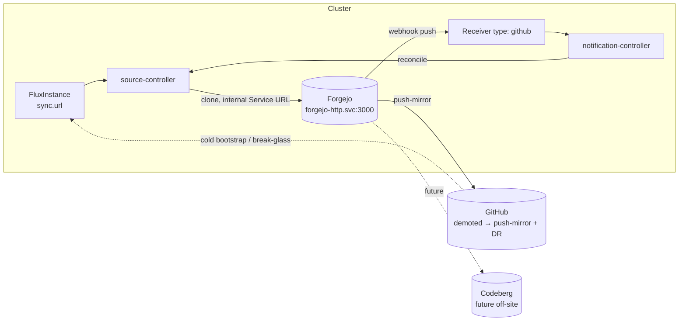

# RFC: Cutting the GitOps umbilical — Flux source → Forgejo

> Status: **Accepted (2026-07-14).** Executed: Flux reconciles from Forgejo (PR 347, merge 9a3b448a) and the GitHub fallback is rehearsed both directions. This RFC proposed repointing Flux's GitOps source from
> `github.com/webgrip/homelab-cluster` to the in-cluster [Forgejo](../general/forgejo.md), so the cluster
> reconciles from a forge it owns — the **last and most load-bearing** thread of the
> [forge migration](../blogs/2026-06-12-bringing-the-forge-home.md). The decisions are
> [ADR-0011](../adr/adr-0011-flux-source-forgejo.md) (cut over the steady-state source) and
> [ADR-0012](../adr/adr-0012-external-bootstrap-fallback-source.md) (keep an external source for cold
> bootstrap + break-glass). It flips to **Accepted** when Flux reconciles a commit pulled from
> Forgejo and the GitHub fallback is proven.

## Why

After the forge, the runners, the mirror, and (in design) Renovate, **Flux still pulls the cluster's
own desired state from GitHub.** The flux-operator `FluxInstance` syncs from
`https://github.com/webgrip/homelab-cluster.git` (`flux-instance/app/helmrelease.yaml`, `sync.url`),
and a `Receiver` (`flux-instance/app/receiver.yaml`) turns a GitHub push into an instant reconcile.
Until that moves, the marching orders for a self-hosted cluster still come from a third party.

This is sequenced **last on purpose**: the moment Flux points at Forgejo, *Forgejo's availability
becomes the cluster's ability to change itself.* You want the forge proven, the content authoritative,
and a fallback in place before making the in-cluster git host load-bearing for the platform that hosts
it. This RFC is that final, deliberate swing — plus the safety net that keeps it from becoming a
single point of failure.

## What's actually wired today (the good news)

Inspecting the live manifests shrinks this from "scary" to "almost a one-liner":

- **Read auth: none.** The `sync` block has **no `pullSecret`** — Flux clones the **public** GitHub
  repo anonymously. So the cutover needs read credentials *only if* the Forgejo repo is private.
- **Webhook type: reusable.** Flux's docs state Gitea/Forgejo emit **GitHub-compatible webhook
  payloads**, so the `Receiver` stays `type: github`; only the webhook's *origin* (a Forgejo repo
  webhook) and the endpoint change. The HMAC secret (`github-webhook-token-secret`) can be reused.
- **The change surface is two files**, both under `kubernetes/apps/flux-system/flux-instance/app/`:
  `helmrelease.yaml` (`sync.url`, optionally `sync.pullSecret`) and the Forgejo-side webhook config.

The `github-deploy.key` / `github-push-token.txt` at the repo root are **bootstrap-time** credentials
(Talos/`flux bootstrap`), not used by the running `FluxInstance` — which matters for
[ADR-0012](../adr/adr-0012-external-bootstrap-fallback-source.md).

## The hard part: the circular dependency

Forgejo runs **inside** the cluster Flux manages. Make Flux's source Forgejo and you get a loop:

- **Steady state:** fine — Forgejo up, Flux pulls, the world turns.
- **Forgejo down:** Flux can't fetch new revisions. It **degrades gracefully** — running workloads keep
  running on the last-applied state — but you **cannot change the cluster via GitOps**, *including
  fixing Forgejo itself.* Forgejo is single-replica (`Recreate`) on a CNPG database; its blast radius
  is real.
- **Cold bootstrap (rebuild from bare Talos):** Flux must sync from a source that **exists before the
  cluster does.** An in-cluster Forgejo does not — it is deployed *by* Flux. So the bootstrap source
  **cannot** be Forgejo.

This is the whole reason for [ADR-0012](../adr/adr-0012-external-bootstrap-fallback-source.md): **decouple the
steady-state source (Forgejo) from the disaster-recovery / bootstrap source (an external mirror).**

## Decisions

| # | Decision | Choice |
|---|----------|--------|
| [ADR-0011](../adr/adr-0011-flux-source-forgejo.md) | Steady-state GitOps source | **Forgejo**, via the **in-cluster Service URL** (`http://forgejo-http.forgejo.svc.cluster.local:3000/...`) — no dependency on public DNS/ingress/TLS for the reconcile loop. |
| [ADR-0012](../adr/adr-0012-external-bootstrap-fallback-source.md) | Bootstrap + break-glass source | **Keep GitHub** (demoted to a Forgejo→GitHub **push-mirror**) as the cold-bootstrap and break-glass source. Codeberg later as a second off-site mirror. |
| [ADR-0014](../adr/adr-0014-codeberg-offsite-push-mirror.md) | Second off-site mirror (Codeberg) | **Forgejo→Codeberg** via native push-mirror for all `webgrip` org repos, reconciled by a Tier-2 CronJob. Decided now, **built after cutover**; gated on Codeberg's usage policy. |

Two settled sub-choices folded in:

- **Webhook:** `Receiver` stays `type: github`; add a Forgejo repo webhook to the receiver endpoint with
  the existing HMAC secret. **Verify the signature header is accepted** (Forgejo→Flux `github`-type) at
  implementation.
- **Repo read path:** prefer the **cluster-internal Service URL** over `forgejo.${SECRET_DOMAIN}` so the
  GitOps loop never depends on the external gateway, public DNS, or cert renewal. If the repo is
  private, add a `sync.pullSecret` (Forgejo read deploy token); if public-read (like GitHub today),
  none is needed.

## Architecture

Steady-state: source-controller clones Forgejo over the in-cluster Service; Forgejo push-mirrors every
commit out to GitHub (and later Codeberg) for redundancy. GitHub is no longer upstream — it's a
downstream copy that *also* serves as the break-glass and cold-bootstrap source.

## Implementation (phased)

**Phase 0 — make `homelab-cluster` authoritative in Forgejo.** Un-wedge the stale mirror lock (the
[blog's ouroboros](../blogs/2026-06-12-bringing-the-forge-home.md)), push current `main`, and
**flip the mirror direction**: stop the inbound GitHub→Forgejo pull-mirror for this repo and configure a
Forgejo→GitHub **push-mirror** so GitHub becomes the downstream copy. This is also the gate that lets the
Forgejo Renovate path adopt `homelab-cluster` ([ADR-0029](../adr/adr-0029-dual-run-renovate-forgejo.md)).

**Phase 1 — prove read access (no cutover yet).** Create a *second, paused/parallel* `GitRepository`
(or a throwaway FluxInstance in a test ns) pointing at the Forgejo Service URL and confirm
source-controller can clone the repo + resolve the ref. If private, mint a Forgejo read deploy token →
`sync.pullSecret`. Confirm TLS/DNS is a non-issue by using the internal Service URL.

**Phase 2 — wire the Forgejo webhook (still on GitHub).** Add a Forgejo repo webhook to the Flux
receiver endpoint using the existing HMAC secret; confirm a Forgejo push reaches notification-controller
and triggers a reconcile (Receiver stays `type: github`).

**Phase 3 — the cutover commit.** Change `sync.url` to the Forgejo Service URL (+ `pullSecret` if
private) in `flux-instance/app/helmrelease.yaml`. Commit to the repo (now Forgejo-authoritative); the
push-mirror lands the same SHA in GitHub. Flux — *still reading GitHub* — reconciles this commit,
flux-operator updates the `GitRepository`, and the **next** fetch comes from Forgejo. The commit exists
in both, so there's no gap. Verify `flux get sources git -A` shows the Forgejo URL and a fresh revision.

**Phase 4 — validate the fallback.** Rehearse break-glass: `kubectl patch` the `FluxInstance` (or the
generated `GitRepository`) back to the GitHub URL, confirm Flux recovers, then patch forward again.
Document it. Confirm the push-mirror keeps GitHub current.

## Execution addendum — verified change surface & stage plan (2026-07-12)

A live sweep (manifests + Forgejo/GitHub APIs) ahead of execution confirmed the phased design and
surfaced **two blockers the phases above don't mention**. Board mapping: Vikunja **#85** (Forgejo CI
parity) gates **#77** (this cutover pack).

**Verified facts.** GitHub `homelab-cluster` is public with **zero tags/releases** — so the
org-enforced immutable-releases trap that wedged `infrastructure`'s push-mirror (tag names are
permanently retired once their immutable release is deleted) cannot bite here; keep it that way by
never cutting GitHub releases on the mirror. The Forgejo copy is public-read, still `mirror=true`,
**Actions unit off**. The `sync` block carries no `pullSecret` (anonymous clone), so no read
credential is needed.

**Blocker 1 — Kyverno Enforce pin.** `kubernetes/apps/kyverno/policies/app/flux-governance-enforce.yaml:41`
(`restrict-gitrepository-url`) validates `spec.url` **equals the GitHub URL** in Enforce mode: the
flux-operator's regenerated `GitRepository` would be **denied admission** at cutover. Pre-widen the
pattern to allow both the GitHub and Forgejo Service URLs in a prep commit; tighten to Forgejo-only
post-cutover.

**Blocker 2 — concurrent-writer window.** `main` has multiple writers (operator machines, agent
sessions, the dark-factory dispatcher). Between the mirror flip (Stage B) and every writer
re-pointing `origin`, a push to GitHub is a push to a **downstream copy**: it diverges GitHub,
wedges the push-mirror (non-fast-forward), and the commit never reaches the authoritative repo.
Re-point all writers in the same sitting as the flip; treat a push-mirror `last_error` as the alarm.

### Stage A — prep commits (repo still GitHub-leading; each independently safe)

1. **CI parity (#85, the gate).** Port the 12-step e2e gate from `.github/workflows/e2e.yaml` to
   `.forgejo/workflows/` per the `forgejo-port-workflows` skill — move-not-copy. Also port
   `flux-local.yaml` and `renovate-dry-run.yaml`; **retire** `labeler.yaml`/`label-sync.yaml`
   (GitHub-label tooling, no Forgejo equivalent); decide `claude-review.yml` separately (needs a
   Forgejo-side trigger design). Enable the Actions unit on the Forgejo repo to prove runs
   pre-cutover; if mirror-synced pushes don't trigger runs, prove via `workflow_dispatch`.
2. **Kyverno pre-widen** (Blocker 1).
3. **Phase-1 probe:** a parallel, throwaway `GitRepository` pointing at
   `http://forgejo-http.forgejo.svc.cluster.local:3000/webgrip/homelab-cluster.git` — prove
   source-controller clones and resolves `main`.
4. **Phase-2 webhook:** add the Forgejo repo webhook → `flux-webhook.${SECRET_DOMAIN}/hook/…` with
   the existing HMAC secret; mirror-synced pushes exercise it for free while still GitHub-leading.
   (A later optimization may target `webhook-receiver.flux-system.svc` directly, but that needs a
   forgejo→flux-system egress allowance once the forgejo namespace goes default-deny.)

### Stage B — the operational flip (no git changes; `forgejo-leading` skill order is load-bearing)

Exclude `homelab-cluster` in the gitea-mirror UI (the one unscriptable step) → final sync → convert
to regular repo (API) → `scripts/forgejo-sync.sh --repo homelab-cluster --apply` (Actions unit,
push-mirror Forgejo→GitHub, branch protection sans GitHub check contexts) → re-point **every**
writer's remotes (Blocker 2) → verify gap-free relay: push a trivial commit to Forgejo, confirm the
same SHA lands on GitHub via the push-mirror and Flux (still reading GitHub) reconciles it. That
relay is the Phase-3 mechanic, rehearsed before it matters.

### Stage C — the cutover PR (opened on Forgejo, merged behind the #85 gate)

One PR: `sync.url` → the Forgejo Service URL (`flux-instance/app/helmrelease.yaml:33`); move
`webgrip/homelab-cluster` from the `webgrip-gitops` (GitHub) RenovateJob's discovery into
`webgrip-forgejo`'s `discoveryFilters`; flip `.renovaterc.json5` presets `github>` → `local>`;
write `runbooks/flux-source.md` (break-glass repoint, webhook re-registration, mirror-direction
recovery). Merge → push-mirror lands the SHA on GitHub → Flux applies it from GitHub → next fetch
comes from Forgejo. Gap-free.

### Stage D — validation & hardening

Success criteria below, plus: rehearse the ADR-0012 break-glass (`kubectl patch` back to GitHub,
recover, patch forward — the one sanctioned imperative); keep the Kyverno two-URL allowlist
(the break-glass patch must pass admission — drill-proven); flip
ADR-0011/0012 and this RFC to **Accepted**; alert on push-mirror staleness (`last_error`/stale
`last_update` — a silently failed mirror is a stale DR copy); re-point the Backstage catalog
`source-location` URLs (cosmetic, batched); fold the remaining GitHub-only workflows and the ARC
runner sets into [RFC: GitHub Actions retirement](rfc-github-actions-retirement.md).

## Success criteria

- `flux get sources git -n flux-system` shows the Forgejo (Service) URL, `Ready=True`, reconciling new
  commits.
- A push to Forgejo `main` triggers an immediate reconcile via the webhook (not just the poll interval).
- GitHub still receives every commit (push-mirror), and a documented one-command break-glass repoints
  Flux back to GitHub and recovers.
- Killing Forgejo does **not** tear down running workloads (graceful degradation), and recovery needs no
  manual intervention once Forgejo returns.

## Risks

- **Forgejo availability = cluster self-management.** Single-replica forge on CNPG; while it's down you
  can't GitOps your way out (including fixing the forge). **Mitigation:** the GitHub fallback +
  rehearsed break-glass ([ADR-0012](../adr/adr-0012-external-bootstrap-fallback-source.md)); CNPG backups for
  `forgejo-db`; keep Forgejo's *own* manifests trivially reconstructible.
- **Cold bootstrap can't use Forgejo** — covered by keeping the bootstrap source external (ADR-0012).
- **Webhook signature mismatch** — `type: github` against a Forgejo webhook is per Flux docs but unproven
  here; verify in Phase 2 (fall back to the poll interval if it misbehaves — non-fatal).
- **Mirror-direction flip** — if the inbound pull-mirror isn't stopped, Forgejo force-syncs from GitHub
  and **discards** commits made in Forgejo (Renovate's, yours). Phase 0 must flip direction, not just add
  a push-mirror.
- **Internal Service URL drift** — if the Forgejo Service name/port changes, the GitOps loop breaks
  quietly; pin to the chart's stable Service name and cover it with the existing Forgejo alerting.
- **Self-referential change application** — the cutover commit must exist in *both* hosts at the same
  SHA (push-mirror handles this); applying it from the old source then following to the new is the
  intended, gap-free mechanic.

## Operations

A `runbooks/flux-source.md` (break-glass repoint, webhook re-registration, mirror-direction recovery) is
written with the Phase-3 implementation. Disaster recovery for the forge itself follows the
[CNPG backups & restore runbook](../runbooks/cnpg-backups.md#restore-dr-drill).

## References

- ADRs [0014](../adr/adr-0011-flux-source-forgejo.md), [0015](../adr/adr-0012-external-bootstrap-fallback-source.md)
- [Forgejo](../general/forgejo.md) · [Bringing the Forge Home](../blogs/2026-06-12-bringing-the-forge-home.md)
  · [RFC: Renovate on Forgejo](rfc-renovate-forgejo.md) ([ADR-0029](../adr/adr-0029-dual-run-renovate-forgejo.md):
  `homelab-cluster` last)
- Upstream: [Flux Receivers](https://fluxcd.io/flux/components/notification/receivers/) ·
  [FluxInstance sync](https://fluxoperator.dev/docs/instance/sync/)
