# RFC: Harbor Pull-Through Proxy Cache

> Status: **Accepted (2026-06-23).** This RFC routes the cluster's *third-party* image pulls
> (`docker.io`, `ghcr.io`, …) through Harbor pull-through **proxy-cache projects**, wired at the
> containerd registry-mirror layer so manifests keep their upstream image references and
> containerd transparently tries the cache first and **falls back to upstream when Harbor is
> down**. The individual decisions are [ADR-0016](../adr/adr-0016-harbor-pull-through-proxy-cache.md)
> (adopt the cache), [ADR-0017](../adr/adr-0017-registry-mirror-talos-spegel.md) (where the mirror is
> injected), and [ADR-0018](../adr/adr-0018-harbor-config-idempotent-job.md) (how the Harbor side is
> provisioned in GitOps). It extends — does not replace — the
> [Harbor Container Registry RFC](rfc-harbor-registry.md), whose "replication to/from a remote
> Harbor" was explicitly deferred.
>
> **Cutover landed 2026-06-23:** the Talos mirror is applied on all 5 nodes and the fallback drill
> passed (uncached pull succeeds with Harbor scaled to zero). Phase 2 came with it — coverage is
> **all six upstreams** (`dockerhub`, `ghcr`, `quay`, `gcrmirror`, `k8s`, `forgejo`), not just two.
> A follow-on extended the same proxies to **non-bootstrap OCI Helm charts** by rewriting their
> `OCIRepository` url (charts bypass containerd, so they can't use the transparent mirror); that
> path is **not** fail-open, so its scope is bounded to non-bootstrap charts — see
> [ADR-0016](../adr/adr-0016-harbor-pull-through-proxy-cache.md) consequences.

[harbor-proxy]: https://goharbor.io/docs/2.10.0/administration/configure-proxy-cache/
[spegel]: https://spegel.dev/
[talos-registries]: https://docs.siderolabs.com/talos/v1.12/reference/configuration/cri/registrymirrorconfig

## Why

Every workload in the cluster pulls its image from a public registry. A repo grep finds **~64
third-party references** — 23 `docker.io`, 34 `ghcr.io`, 7 `quay.io`/`registry.k8s.io`/etc. That
leaves four standing problems:

- **Docker Hub anonymous rate limits.** Unauthenticated pulls are capped per source IP. A
  rollout storm, a new node, or a cache eviction can trip `429 Too Many Requests` and stall
  `ImagePullBackOff` across the cluster — with no local recourse.
- **No cache of record.** When an upstream registry has an outage, any image not already on a
  node's kubelet cache is unreachable. There is no second source.
- **No scan-at-ingress.** Vulnerability posture is computed *downstream* (dependency-track / guac)
  but nothing scans third-party images *as they enter* the cluster.
- **No single egress chokepoint** for policy, observability, or future air-gapping.

[Spegel][spegel] already gives us peer-to-peer sharing of images *a node already has* — but it is
best-effort and cannot pull an image no node holds. A pull-through cache is the missing tier: a
durable, scanning, rate-limit-absorbing source that sits between Spegel's peer cache and the
public internet.

## Scope

**In scope:** pull-through proxy-cache projects in the existing Harbor for `docker.io` and
`ghcr.io`; the containerd registry-mirror wiring that routes those two registries through Harbor
with upstream fallback; idempotent GitOps provisioning of the Harbor-side config.

**Out of scope (future work):**

- **Hosting webgrip's *own* images** (the `ghcr.io/webgrip/*` publish target). That is a separate
  initiative landing in the **`webgrip/workflows`** repo (CI push from in-cluster runners), not
  here — Harbor is LAN-only ([ADR-0005](../adr/adr-0005-lan-only-exposure.md)), so GitHub-hosted Actions
  can't push to it.
- **Proxying the bootstrap/storage chain** (Talos, Cilium, CoreDNS, cert-manager, Longhorn CSI,
  CNPG, ESO, OpenBao, Garage). These must come up *before* Harbor exists; they keep pulling
  upstream directly. Fallback makes this automatic — see [ADR-0017](../adr/adr-0017-registry-mirror-talos-spegel.md).
- **Additional registries** (`quay.io`, `registry.k8s.io`, `mirror.gcr.io`). Trivially added once
  the pattern is proven; deferred to keep Phase 1 small.

## Decisions

| # | Decision | Choice |
|---|----------|--------|
| [ADR-0016](../adr/adr-0016-harbor-pull-through-proxy-cache.md) | Adopt a pull-through cache | **Six Harbor proxy-cache projects** (`dockerhub`, `ghcr`, `quay`, `gcrmirror`, `k8s`, `forgejo`); started as two (docker.io, ghcr.io) and extended to all upstreams at cutover |
| [ADR-0017](../adr/adr-0017-registry-mirror-talos-spegel.md) | Where to inject the mirror | **Talos `machine.registries.mirrors`** (per-registry, `overridePath`) composed with **Spegel `prependExisting: true`**; upstream fallback on |
| [ADR-0018](../adr/adr-0018-harbor-config-idempotent-job.md) | How to provision Harbor | **Idempotent CronJob** against the Harbor v2 API (no operator exists); creds via ESO/OpenBao |

## Architecture

```mermaid
flowchart LR
  kubelet[kubelet / containerd<br/>on each node]

  subgraph hosts["containerd hosts.toml (/etc/cri/conf.d/hosts)"]
    order["mirror order per registry:<br/>1. Spegel peers<br/>2. Harbor proxy<br/>3. upstream (fallback)"]
  end

  spegel[(Spegel<br/>localhost:29999<br/>peer cache)]
  harbor[(Harbor proxy project<br/>harbor.&#36;SECRET_DOMAIN/v2/dockerhub)]
  garage[(Garage S3<br/>bucket harbor)]
  upstream[(docker.io / ghcr.io<br/>upstream)]

  kubelet --> order
  order -->|"1"| spegel
  order -->|"2 miss"| harbor
  order -->|"3 Harbor down"| upstream
  harbor -->|blobs| garage
  harbor -->|cache miss| upstream
```

The mirror list is **prepended** by Spegel onto the per-registry base that Talos writes, so the
resolved order is **Spegel peers → Harbor proxy → upstream**. Because Talos leaves `skipFallback`
at its default (off), and Talos ≥ 1.9 matches the CRI fallback behaviour, **containerd falls back
to the upstream registry whenever every mirror is unreachable** — so Harbor (or Garage, or the
Envoy gateway it routes through) being down degrades pulls to "slower, straight from upstream"
rather than failing them. That same fallback is what makes the bootstrap chain safe: at cold boot
Harbor isn't running, the mirror is unreachable, and every node pulls upstream as if the mirror
weren't configured.

## The SPOF question (and why fallback is the whole design)

Harbor's blobs live on **Garage S3** ([ADR-0002](../adr/adr-0002-registry-blob-storage-garage-s3.md)) —
the exact dependency whose outage cascaded into the
[2026-06-12 storage collapse](../blogs/2026-06-13-harbor-as-a-pull-through-cache.md). Putting
Harbor in the image pull path therefore *adds a local dependency to every pull*. This RFC accepts
that **only because the mirror layer fails open**:

- **Harbor down → upstream fallback** (containerd, automatic). Verified by an explicit drill
  before cutover.
- **Images already pulled keep running** (kubelet cache) regardless.
- **Spegel peer cache** sits *in front* of Harbor, so an image any node holds is served P2P even
  with Harbor and the upstream both unreachable.
- **The bootstrap/storage chain never routes through Harbor** (out of scope above).

Without provable fallback this change would be irresponsible; with it, Harbor is an *accelerator*,
not a new hard dependency.

## Implementation & sequencing

**Phase 0 — provisioning plane (GitOps, inert until creds).** *(this RFC's first commit)*

- `harbor-registry-proxy.externalsecret.yaml` — Docker Hub + GHCR pull credentials from OpenBao
  (`secret/harbor/registry-proxy`). Used only to *raise upstream rate limits*; the proxy projects
  themselves are public for anonymous in-cluster pulls.
- `harbor-proxy-config` CronJob + script — idempotently ensures the two registry endpoints and
  two proxy projects exist via the Harbor v2 API ([ADR-0018](../adr/adr-0018-harbor-config-idempotent-job.md)).
  **Fail-soft**: if the credentials aren't populated yet, it logs and exits 0 — Harbor is
  unaffected, no alert noise.
- Human step: `bao kv put secret/harbor/registry-proxy …` (the upstream tokens are external). On
  the next tick the CronJob creates the projects.
- **Gate:** `docker pull harbor.${SECRET_DOMAIN}/dockerhub/library/hello-world` succeeds on the
  LAN before proceeding.

**Phase 1 — pull-path cutover (node-touching, human-gated). ✅ done 2026-06-23.**

- Applied the Talos `machine.registries.mirrors` patch from
  [ADR-0017](../adr/adr-0017-registry-mirror-talos-spegel.md) on all 5 nodes (`MODE=no-reboot` — a
  containerd config reload, so no drain/reboot was needed).
- Set Spegel `prependExisting: true` in its HelmRelease values.
- **Drill passed:** with `harbor-core`/`harbor-registry` scaled to zero, a fresh pull of an
  uncached image still succeeded (upstream fallback), then Harbor was restored.

**Phase 2 — expansion. ✅ done 2026-06-23.** Added `quay`, `gcrmirror` (mirror.gcr.io), `k8s`
(registry.k8s.io) and `forgejo` proxy projects (all anonymous). Also extended the proxies to
non-bootstrap OCI Helm charts (url rewrite). **Still open:** Trivy "prevent vulnerable from
running" gates on the proxy projects, and proxy-cache retention/TTL to bound Garage growth.

## Success criteria

- A cold `docker pull harbor.${SECRET_DOMAIN}/dockerhub/library/hello-world` returns the image and
  a blob lands in the Garage `harbor` bucket.
- After cutover, `crictl pull docker.io/library/nginx` on a node is served via the proxy
  (Harbor access log shows the request) — with the manifest still referencing `docker.io`.
- **Fallback drill:** with Harbor scaled to zero, an uncached pull still succeeds from upstream.
- Docker Hub `429`s disappear from node events under rollout load.

## Risks

- **Provider quirk for GHCR.** Harbor's dedicated `github-ghcr` provider is geared to replication
  listing; for a *pull-through* proxy we use the generic `docker-registry` provider pointed at
  `https://ghcr.io`. If anonymous proxying misbehaves, GHCR has no Docker-Hub-style anonymous
  limit anyway, so docker.io is the load-bearing win and GHCR can be dropped without loss.
- **A wrong mirror endpoint 404s instead of falling through cleanly.** `overridePath: true` and
  the `/v2/<project>` path are mandatory; the drill catches a misconfig before it's cluster-wide.
- **Credential staleness.** A rotated Docker Hub token that isn't updated in OpenBao silently
  reverts the endpoint to anonymous (rate-limited) pulls — degraded, not broken.
- **CronJob noise.** Mitigated by the same `ttlSecondsAfterFinished` + history-limit hygiene the
  [openbao-init incident](../blogs/2026-06-13-harbor-as-a-pull-through-cache.md) taught us.

## References

- ADRs [0016](../adr/adr-0016-harbor-pull-through-proxy-cache.md),
  [0017](../adr/adr-0017-registry-mirror-talos-spegel.md),
  [0018](../adr/adr-0018-harbor-config-idempotent-job.md)
- Extends [RFC: Harbor Container Registry](rfc-harbor-registry.md);
  [ADR-0002 Blob storage (Garage S3)](../adr/adr-0002-registry-blob-storage-garage-s3.md);
  [ADR-0005 LAN-only exposure](../adr/adr-0005-lan-only-exposure.md)
- [Harbor — Configure Proxy Cache][harbor-proxy] · [Spegel][spegel] ·
  [Talos RegistryMirrorConfig][talos-registries]
- [Platform Components](../general/platform-components.md) (Spegel) ·
  [Blog: Harbor as a pull-through cache](../blogs/2026-06-13-harbor-as-a-pull-through-cache.md)
