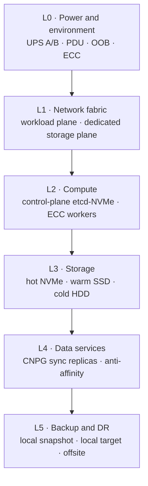

# RFC: Layered Hardware Architecture — Resilient by Layer, Fast by Design

> Status: **Proposed.** This RFC frames the cluster's hardware-evolution program. The thesis is that
> _resilience is a stack_ — every storage SEV the homelab has suffered traces to a root cause that
> lives in a layer that was never isolated — and that "extremely fast" is only worth buying where
> speed is actually scarce (storage and east-west network). It draws **four end-state paths (A–D) as
> equals** rather than picking one, and commits to a single **migration spine** that reaches any of
> them. Individual choices become **candidate ADRs** (next free number ADR-0029 — 0025–0028 are taken by [RFC: Node taxonomy & storage placement](rfc-node-taxonomy-and-storage-placement.md)), assigned as each is
> ratified. **Phase 0 ("stop the bleeding") is actionable now** and maps to existing roadmap
> reliability items. It flips to **Accepted** as a target path is chosen and each layer's ADR lands.

## Why

The cluster today is five bare-metal Talos nodes (see the [hardware spec](../general/talos-cluster.md#hardware)):
three SOYO **N150 / 12 GiB / single 512 GB SATA SSD** control-plane mini-PCs, plus two workers — an HP Z230
**i7-4770 / 16 GiB / 256 GB SSD + 1 TB HDD** and `worker-1`, a Gigabyte / Core-i5 build
(**i5-4670K / 24 GiB / 960 GB SSD**, added 2026-06-19). It has carried real workloads admirably — but it
has also detonated, repeatedly, and **every detonation has the same shape: a resource that was never
given its own failure domain.**

- The [Longhorn OOM cascade](../incidents/2026-06-09-longhorn-oom-cascade.md) — RAM-tight 12 GiB nodes
  OOM-killed the storage manager, triggering rebuild storms.
- The [IM-cpu rolling detonation](../incidents/2026-06-18-longhorn-im-cpu-rolling-detonation.md) —
  instance-manager CPU reservations oscillated and faulted a volume beyond recovery.
- A **batched-rollout storage collapse** — many manifests reconciling at once starved the nodes until
  every CNPG database went down.
- The **CNPG ↔ Garage WAL SPOF** — one S3 endpoint down means _all_ WAL archiving fails and disks fill.

Four incidents, four layers:

| Root cause | Layer it belongs to |
|---|---|
| One disk shared by etcd + OS + every Longhorn replica | Storage (L3) |
| 12 GiB control planes with no headroom | Compute (L2) |
| Replication competing with app traffic on a flat 1 GbE LAN | Network (L1) |
| A single backup / WAL target | Backup & DR (L5) |

The design response is not "buy a bigger box." It is to **give each layer its own failure domain and
put speed where it is scarce.** Novelty has a cost this cluster has already paid in pages; like the
[security-hardening program](rfc-security-hardening.md), the high-leverage moves are **isolations and
flips, shipped one reversible change at a time** — not a green-field rip-and-replace done in one
weekend.

## The layered model (L0–L5)

The architecture is six layers, bottom-up. Each layer is both a **failure domain** and a **speed
budget**: you decide independently, per layer, how much redundancy and how much performance it gets.
This table is the leverage map — where the cluster is today, where the edge is, and which incident
each layer's isolation prevents.

| Layer | Role | Today | Edge | Isolates |
|---|---|---|---|---|
| **L0 Power & environment** | Keep the floor solid | Single feed, no UPS, no OOB, non-ECC | Dual-PSU on A/B UPS, smart PDU, **OOB (IPMI/PiKVM)**, **ECC**, cooling + sensors | Power events, silent corruption, unrecoverable bricks |
| **L1 Network fabric** | Move east-west fast & redundant | Flat 1 GbE, one plane | Two planes (workload + **dedicated storage net**), 25→100 GbE, MLAG, RoCE | Rollout/replication storms starving app traffic |
| **L2 Compute** | Run control plane & workloads | 3× N150/12 GiB shared, 1× i7 worker | Isolated CP tier (**etcd on its own NVMe**) + big ECC worker tier | etcd wobble under load; OOM cascades |
| **L3 Storage** | Serve hot data fast, keep cold cheap | One SATA SSD per node, all-purpose | Hot NVMe / warm SSD / cold HDD tiers; **etcd+boot disks ≠ data** | Shared-disk contention; replica-starved volumes |
| **L4 Data services & placement** | Replicate & schedule safely | Single-instance CNPG, soft affinity | **Sync replicas + hard anti-affinity**, topology-aware | Single-node DB loss; co-located replicas |
| **L5 Backup & DR** | Survive total loss | Single S3 target (Garage) | Local snapshot → separate local target → offsite (3-2-1) | Backup-target SPOF; unrecoverable corruption |

The rest of this RFC is: the **paths** (concrete end-states that buy these edges at different
price/noise/ambition points), the **relayering** the new hardware enables in software, and the
**migration spine** that gets there safely.

## Architecture paths

Four coherent end-states. They are **not ranked** — each is a consistent set of choices across all six
layers, optimized for a different constraint (silence/€, raw capability, operational simplicity, or
no-compromise). Pick later with the [decision framework](#decision-framework-pick-a-path-later); for
now they are equals.

### Path A — Silent Striker

_Prosumer-extreme · hyperconverged · distributed storage · lives anywhere._ The realistic extreme:
brutal perf-per-watt you can keep in an office.

| Layer | Build |
|---|---|
| L0 | PiKVM per node (no IPMI on mini-PCs); single UPS |
| L1 | 25 GbE — Mikrotik CRS510/518 + ConnectX-4 Lx; storage on a dedicated SFP+ VLAN |
| L2 | 4–5× Minisforum **MS-01** (i9-13900H, 96 GB) or **Framework Desktop** (Ryzen AI Max 395, 128 GB) — compute + storage hyperconverged |
| L3 | 3× NVMe/node (boot / hot / replica); **Longhorn v2 (SPDK)** or **Rook-Ceph** |
| L4–L5 | CNPG sync replicas across nodes; local MinIO + offsite |

**Optimizes:** silence, density, €-sanity. **Compromise:** most mini-PCs have **no ECC** and a single
PSU — the resilience tax of staying quiet.

### Path B — Iron Spine

_Datacenter-extreme · disaggregated · dedicated Ceph cluster · lives in a rack._ No compromise,
anywhere.

| Layer | Build |
|---|---|
| L0 | Dual UPS (A/B feeds), metered PDU, redundant PSUs, iDRAC everywhere |
| L1 | Dual 100 GbE ToR (Mikrotik CRS504-4XQ / Mellanox SN2700), **RoCEv2** storage fabric, MLAG |
| L2 | 3× small EPYC 8004 / Xeon-D control plane (etcd on dedicated NVMe) + 3–4× **EPYC Genoa** workers (256–512 GB ECC) |
| L3 | **Dedicated 3–5 node all-NVMe Ceph cluster** (U.2 Gen4/5), own chassis |
| L4–L5 | Sync replicas across worker nodes; local object store + offsite |

**Optimizes:** absolute performance + resilience; survives node/disk/switch/PSU/feed loss.
**Compromise:** dedicated room, real money, real cooling.

### Path C — Twin Heart

_Hybrid · centralized HA storage · quiet compute · keep SOYO/Z230 as witnesses._ Enterprise where it
counts, quiet everywhere else — the easiest to **operate**.

| Layer | Build |
|---|---|
| L0 | IPMI on the servers, PiKVM on minis; single/dual UPS |
| L1 | Redundant 25 GbE enterprise switches (the one place enterprise earns its keep) |
| L2 | Quiet ECC mini-servers (Asrock Rack / Supermicro Xeon-D or Ryzen, 64–128 GB); 2× SOYO demoted to **quorum-witness/edge** |
| L3 | **HA pair of all-NVMe TrueNAS/ZFS** boxes (Optane P5800X SLOG + special vdev), NFS/iSCSI, snapshots replicated between the pair |
| L4–L5 | CNPG on fast NFS/iSCSI; ZFS snapshots → offsite |

**Optimizes:** seconds-fast ZFS snapshots/restore + operational simplicity + resilience where it
matters. **Compromise:** the NAS pair is a concentrated (HA-paired) center of gravity.

### Path D — Endgame

Path B, maxed — not a separate design, but the three grafts that make it the dream:

- a **Threadripper Pro / EPYC + GPU** worker tier for AI/inference,
- an **HA TrueNAS cold tier** behind the Ceph hot tier (hot NVMe → warm SSD → cold ZFS → offsite),
- **100 GbE RoCE end-to-end** with the storage fabric fully separated.

### Comparison

| | A · Silent Striker | B · Iron Spine | C · Twin Heart |
|---|---|---|---|
| Raw speed | High | **Extreme** | High |
| Resilience | Medium (no ECC) | **Extreme** | High |
| Noise / heat | **Silent** | Loud | Low–med |
| Power | **Low** | High | Medium |
| Run cost (€/yr) | **~€450–750** | ~€1,800–3,000 | ~€750–1,200 |
| € upfront (buy) | **Low–mid** | High | Mid–high |
| Ops complexity | Medium | **High** | **Low** |
| Storage model | Distributed | Distributed (dedicated) | Centralized HA |
| Lives in | Office / closet | Rack / garage | Mixed |

## Sourcing & running cost

For always-on hardware the electricity bill rivals the purchase price, and most "cheap used-enterprise"
advice is US-centric and dies on import. Both shape which path is sane.

<!-- Cost figures assume NL electricity at ~€0.35/kWh; scale to your own rate. -->

### Running cost is the dominant axis

The heuristic:

> **1 watt running 24/7 ≈ 8.8 kWh/year ≈ ~€3/year** (1 W × 24 × 365 = 8.76 kWh, × €0.35).

So a build's average draw × 3 ≈ its yearly run cost. Mains is not the limit — a 230 V × 16 A circuit
delivers ≈ 3,680 W — **the bill and the waste heat are.** Every watt is also a watt of heat dumped into
the room.

| Path | Typical always-on draw | ≈ €/year to run |
|---|---|---|
| **A — Silent Striker** (4× mini-PC) | 150–250 W | **€450–750** |
| **C — Twin Heart** (mini-servers + NAS pair) | 250–400 W | €750–1,200 |
| **B — Iron Spine** (EPYC + Ceph cluster) | 600–1,000 W | **€1,800–3,000** |

Paths B/D therefore burn a used car in electricity every few years; they only pay off with cheap or
self-generated (solar) power and a space that tolerates the noise and heat.

### Where to buy (shop EU; lean on Germany for used)

Rule of thumb: **buy inside the EU.** Importing from the US (e.g. eBay US) adds 21% VAT + import duty +
customs, which erases the saving. Germany next door has the deepest used-enterprise market.

| What | NL/EU source | Notes |
|---|---|---|
| Mini-PCs (Path A) — MS-01, Framework Desktop | Minisforum EU store, Amazon.nl, Framework NL | New, warranty, ships to NL |
| Switches / NICs / cables | **FS.com** (EU warehouse), Alternate.nl, Azerty | FS.com is the gentlest on-ramp for DACs + transceivers |
| Used network cards (e.g. Mellanox 25G) | Tweakers Vraag & Aanbod, Kleinanzeigen (DE) | Cheap secondhand; fine for a homelab |
| Used enterprise servers (Path B/D) | **Kleinanzeigen (DE)**, Tweakers V&A, Marktplaats, NL/DE refurbishers | Pricier than the US, but no import |
| Enterprise SSDs (U.2 NVMe) | Kleinanzeigen / eBay.de used; new via Azerty/Alternate | Learn the model numbers first |
| UPS / PDU | Coolblue, Alternate (APC, Eaton) | Buy 230 V EU models |

**ECC on a quiet budget:** most mini-PCs (Path A) lack ECC. To get quiet + low-power + **ECC**, the
EU-friendly route is an **Asrock Rack** board with a **Ryzen** CPU (Ryzen supports ECC) or a used
**Supermicro Xeon-D** — both readily sourced via Azerty/Alternate or Kleinanzeigen.

## Storage & network relayering

New hardware is only half the win; it **unlocks a software re-layering** the current
single-disk/flat-network topology can't support. These are the changes that actually retire the
incident classes.

**Storage model — the biggest fork.** All four beat today's shared-disk Longhorn v1; they trade
differently:

| Model | Resilience | Speed | RAM/CPU overhead | Ops complexity | SPOF |
|---|---|---|---|---|---|
| **Rook-Ceph** | Excellent (n-way, self-healing) | High on NVMe | **High** (MON/OSD/MDS; ~4–8 GiB RAM _per OSD_) | High | None |
| **Longhorn v2 (SPDK)** | Good (replica-based) | High (NVMe/SPDK datapath) | **Medium–high** (~2 GiB _locked_ hugepages + **1–2 CPU cores spinning 24/7** per node) | Medium (GA only since 1.12.0) | None |
| **LINSTOR / Piraeus (DRBD)** | Good (sync replica + diskless tiebreaker) | Very high (in-kernel, near-native latency) | **Low** (in-kernel; no per-volume engine) | Medium–high (CLI-first; DRBD split-brain recovery) | None (needs a 3rd node for quorum) |
| **ZFS-HA (TrueNAS pair)** | Good (HA pair + snapshots) | **Highest single-box** (Optane SLOG) | Low (off-cluster) | **Low** | Mitigated by HA pair |

**Engine choice is gated on disks, not preference — and today's hardware blocks it.** The two
"stay-in-Kubernetes" upgrades from v1 (Longhorn v2 and LINSTOR/Piraeus) were both evaluated against
this cluster in mid-2026; the finding is that **neither is a swap you make on the current nodes.** Two
walls, shared by both:

1. **Both need a clean, dedicated block device.** v1's filesystem path (`/var/lib/longhorn`) does not
   carry over — v2 wants a raw block-type disk, and DRBD wants a raw device to auto-prepare into an
   LVM/ZFS pool. Today **neither storage node has one free**: fringe's 1 TB HDD is still unwiped NTFS
   (the inert cold-tier, [ADR-0027](../adr/adr-0027-longhorn-hot-cold-tiers.md)) and worker-1's SSD is
   fully consumed. So both are **blocked on exactly the L3 boot/etcd-≠-data disk split this RFC already
   calls for** — you cannot adopt either until dedicated data disks exist.
2. **Both add a permanent per-node reservation that lands on this cluster's weak spots** (RAM-tightness
   and power cost, ~€3/W·yr). Longhorn v2 locks **~2 GiB hugepages and busy-spins 1–2 CPU cores per
   node 24/7** even when idle — worst-case for the 12 GiB soyos and a measurable power regression.
   LINSTOR is far lighter (in-kernel, no core-spin — better perf-per-watt) but taxes differently:

| Differentiator (on Talos) | Longhorn v2 (SPDK) | LINSTOR / Piraeus (DRBD) |
|---|---|---|
| **Per-Talos-upgrade tax** | **None** — SPDK is userspace + in-tree modules (`nvme-tcp`/`vfio_pci`) | ❌ **Out-of-tree DRBD module → rebuild the Factory schematic, version-matched, on every Talos bump** |
| **Steady-state footprint** | ❌ ~2 GiB locked hugepages + 1–2 spinning cores/node | ✅ Low; scales with volume count, no core-spin |
| **Ecosystem fit** | ✅ Same UI + S3 `BackupTarget` already wired to Garage | ❌ CLI-first; native S3 backup is DIY (thin/ZFS-gated) |
| **Maturity** | ❌ GA only since **1.12.0 (2026-06-02)**; open Sev-1/P0 data-integrity + crash bugs; cluster runs 1.11.2 where v2 is _Technical Preview_ | Core DRBD mature (15+ yrs); Piraeus-on-Talos a small niche |

**Consequence for the plan:** the payoff both promise — retiring v1's instance-manager-OOM failure
class (the [2026-06-09 cascade](../incidents/2026-06-09-longhorn-oom-cascade.md) /
[06-18 detonation](../incidents/2026-06-18-longhorn-im-cpu-rolling-detonation.md)) — is real, but it is
**a Phase-2 decision made once dedicated NVMe exists, not a Phase-0 move.** Until then **hardened
Longhorn v1 stays the default.** When disks land, the pick is path-shaped: **Longhorn v2** suits the
hyperconverged all-NVMe **Path A** (no kernel tax, keeps the UI/backup) if you can spare the
cores/hugepages; **LINSTOR/Piraeus** suits a perf-per-watt-max node willing to pay the per-upgrade
rebuild tax; **Rook-Ceph** / **ZFS-HA** remain the Path B/C answers. This gate is ratified as
[ADR-0037](../adr/adr-0037-storage-engine-gated-on-dedicated-disks.md) — Longhorn v1 stays until
dedicated data disks exist; the engine pick is deferred to Phase 2.

**Dedicated networks & disks.** Whichever model: put **replication on the L1 storage plane** (so a
rebuild can never again starve app traffic — the batched-rollout collapse), give **etcd its own NVMe**
(fsync-latency isolation), and split **boot/etcd disks from data disks** (the shared-SSD root cause).

**Data services (L4).** Move CNPG from single-instance to **synchronous replicas with hard
anti-affinity** across worker nodes; make WAL archive **dual-target — a local MinIO on the NVMe tier
_and_ offsite** — which directly removes the Garage WAL SPOF and complements
[ADR-0002](../adr/adr-0002-registry-blob-storage-garage-s3.md)'s Garage-for-blobs decision. Schedule
topology-aware so replicas never co-locate on one node or disk.

**Interactions to honor.** This relayering touches standing decisions and must stay compatible with
[external CNPG](../adr/adr-0003-external-cnpg-database.md),
[LAN-only exposure](../adr/adr-0005-lan-only-exposure.md), and
[Cilium WireGuard pod encryption](../adr/adr-0007-cilium-wireguard-encryption.md) (a dedicated storage
network must still ride encrypted or be an explicitly trusted L2 segment). Each interaction becomes a
_Consequences_ note in the spawned ADRs.

## The migration spine (committed)

The one thing this RFC _commits_ to regardless of path: a single road from today's cluster to any
end-state, walked **one reversible step at a time** (the house rule that batched changes cause storage
collapse). The three migration styles are not a choice — they are **distances along this road.**

**Phase 0 — Stop the bleeding** _(actionable now; pure evolve-in-place; valuable under every path)_

- Give etcd a dedicated disk / move write-heavy workloads off the shared control-plane SSD.
- Add an **offsite WAL target** so a Garage outage no longer fails all archiving (roadmap **#52**
  etcd off-node backup, **#58** Longhorn external target, and the Garage-SPOF section in the
  [roadmap](../general/roadmap.md)).
- Bolt **PiKVM OOB** onto each node — Talos is API-only; OOB is the only recovery path for a bricked
  node.
- Runbooks: [CNPG backups](../runbooks/cnpg-backups.md), [Longhorn](../runbooks/longhorn.md).

**Phase 1 — Lay the network spine** — stand up the L1 storage/replication network (25 or 100 GbE) and
NICs. Target-agnostic; this is the seed of the _new core_.

**Phase 2 — Stand up the new storage layer → fork to A/B/C** — hyperconverged NVMe (A), dedicated Ceph
cluster (B), or TrueNAS HA pair (C). Migrate via **CNPG replica failover + PVC copy** — no big bang.

**Phase 3 — Add the compute tier, drain the old** — old SOYO/Z230 become **witness/edge** or get
**retired**.

> **One road, three exit ramps:** evolve-in-place = **Phase 0** · new-core = **Phases 1–2** ·
> greenfield = **Phase 3 completes the cutover.** Stop wherever the budget and ambition run out.

## Decisions (candidate future ADRs)

Nothing here is ratified, so per the [ADR conventions](../adr/index.md) these are **candidate ADRs
without numbers** — each takes the next free number (starting **ADR-0029**; 0025–0028 are taken by
[RFC: Node taxonomy & storage placement](rfc-node-taxonomy-and-storage-placement.md)) when it is
actually decided. The RFC's job is to enumerate the decisions and what gates them.

| Decision | Options | Gated on |
|---|---|---|
| **Network fabric** | 25 GbE (sweet spot) · 100 GbE + RoCE (extreme) | Path choice; budget; whether storage is disaggregated |
| **Storage model** | Rook-Ceph · Longhorn v2 (SPDK) · LINSTOR/Piraeus (DRBD) · ZFS-HA pair | **Dedicated data disks** (every option needs a clean block device — see the [engine-choice gate](#storage--network-relayering)); RAM/power headroom; distributed-vs-centralized appetite; ops capacity |
| **Compute topology** | Disaggregated (CP ≠ worker ≠ storage) · hyperconverged; EPYC vs prosumer | Where it lives (noise/power); € ceiling |
| **Power & OOB baseline** | ECC + dual-PSU + A/B UPS + OOB on all nodes | Whether ECC is required (rules out most mini-PCs) |
| **Backup/DR topology** | 3-2-1: local snapshot + separate local target + offsite | Phase 0 offsite target; RTO/RPO goals |

## Decision framework (pick a path later)

Because the posture is a **menu**, this RFC ends with criteria rather than a single recommendation.
**Running cost usually leads** — answer these (cost-first) and the path falls out:

- **Running cost (power)** — the dominant axis for always-on gear (~€3 per watt per year; see
  _Sourcing & running cost_ above). Cheapest to run → A; mid → C; **B/D only pay off with cheap or
  solar power.**
- **Budget ceiling (upfront)** — low-mid → A; high → B/D; mid-high → C.
- **Where it lives + noise/heat tolerance** — living space → A or C; dedicated room → B/D.
- **Resilience floor** — if **ECC + dual-PSU are non-negotiable**, A is out; choose B, C, or D.
- **Ops appetite** — simplest day-2 → C (ZFS snapshots); comfortable operating Ceph → B/D; already
  fluent in Longhorn → A.
- **Capacity vs latency** — €/TB bulk → C's HDD/ZFS cold tier; lowest latency/IOPS → B/D all-NVMe +
  RoCE.

> **Gate:** Paths **B and D are gated on cheap (ideally solar) power + a dedicated, noise-tolerant
> space.** Without both, their running cost (€1,800–3,000/yr) and heat output make them a poor home
> choice — default to **A**, or **C** for enterprise-grade storage at moderate power.

When the answers converge, ratify the matching rows in
[Decisions](#decisions-candidate-future-adrs) as ADR-0029+.

## Risks & open questions

- **Over-rotation of stability** — the cross-cutting risk. Each step is reversible, but landing several
  network/storage/compute changes in one window compounds blast radius (the batched-rollout collapse is
  precedent). Mitigation: **one isolated, verified commit at a time**; spaced reconciliations.
- **ECC absence on Path A** — prosumer mini-PCs largely lack ECC; for a "resilient" tier this is a real
  compromise to accept consciously, not by default.
- **Cost/power envelope unbounded** — the RFC deliberately defers € and watts until the user sets
  constraints; the [framework](#decision-framework-pick-a-path-later) needs those numbers to resolve.
- **Talos disk-letter instability** — runtime `/dev/sdX` letters shift as Longhorn iSCSI volumes attach
  (see the [storage note](../general/talos-cluster.md#storage-physical-vs-longhorn)); install-disk
  selection and any storage automation must key on stable IDs/WWIDs, not letters.
- **Data-migration risk** — Phase 2 moves live data (Longhorn → new); CNPG failover churn and PVC-copy
  windows need a rehearsed [restore drill](../runbooks/cnpg-restore-playbook.md) before cutover.
- **Next-gen engine readiness** — both in-cluster upgrade paths carry a catch on this hardware:
  Longhorn v2 only reached GA in **1.12.0 (2026-06)** and still locks ~2 GiB hugepages + busy-spins
  1–2 cores per node; LINSTOR/Piraeus (DRBD) is lighter but its **out-of-tree module must be rebuilt
  for every Talos kernel**. Neither is free, and both are gated on the L3 dedicated-disk split — see
  the [storage-model fork](#storage--network-relayering). Adopting either before dedicated disks exist
  reproduces the shared-disk contention it is meant to cure.

## Success criteria

**Phase 0 (near-term, measurable):**

- etcd runs on a disk it does not share with Longhorn replicas.
- A WAL write survives a full Garage outage (offsite target proven).
- Every node is reachable via OOB with the host powered off.

**Architecture (per chosen path):**

- Storage replication traffic rides a network plane separate from workload traffic.
- The cluster survives the loss of any one node / disk / PSU / switch (to the redundancy the path buys).
- A [CNPG restore drill](../runbooks/cnpg-restore-playbook.md) passes against the new storage layer.
- No single backup target can fail all data protection (3-2-1 satisfied).

## Glossary

Terms used above, plainest-first — this RFC should be readable without prior hardware background.

- **ECC RAM** — memory that auto-corrects single-bit errors; without it a flipped bit can silently
  corrupt data. Needs CPU **and** motherboard support. Baseline for anything whose job is storing data.
- **OOB / IPMI / iDRAC / iLO / PiKVM** — "remote hands": a small always-on controller that powers the
  machine on/off and shows its screen over the network even when the OS is dead. Talos has no local UI,
  so this is the recovery lifeline. PiKVM is a DIY (Raspberry Pi) version for boxes without built-in IPMI.
- **NVMe / SATA / SAS** — how a disk attaches. **NVMe** = fast (rides PCIe); **SATA** = older/slower;
  **SAS** = enterprise. **M.2** and **U.2** are two physical shapes of NVMe (gum-stick vs. 2.5" enterprise).
- **1 / 10 / 25 / 100 GbE** — network speeds (Gigabit Ethernet). **SFP+/SFP28/QSFP** are the fast port
  types; a **DAC** is a cheap copper cable for short (in-rack) runs; fibre + transceivers go longer.
- **RoCE / RDMA** — network cards reading each other's memory directly for ultra-low latency. Pure
  "extreme" tier; skip while learning.
- **MLAG / LACP / bonding** — gang two links (or two switches) together for redundancy + more bandwidth.
- **Hyperconverged vs. disaggregated** — same boxes do compute **and** storage (simpler) vs. separate
  dedicated boxes for each (more scalable).
- **Ceph / Longhorn / ZFS** — three ways to keep data safe across disks/nodes. **Ceph** = powerful,
  distributed, complex; **Longhorn** = Kubernetes-native, simpler (already in this cluster); **ZFS** =
  rock-solid single-box filesystem (what TrueNAS runs).
- **LINSTOR / DRBD** — a fourth way: **DRBD** mirrors a disk to another node in real time _inside the
  Linux kernel_, and **LINSTOR** (via the Piraeus operator) orchestrates it in Kubernetes. Fast and
  light on RAM/CPU, but the kernel driver is out-of-tree so it must be **rebuilt for each Talos
  version**, it's command-line-first (no Longhorn-style web UI), and recovering a "split-brain" needs
  DRBD know-how.
- **SPDK / hugepages** — **SPDK** is a "talk to NVMe from userspace, skip the kernel" toolkit that
  Longhorn's **v2 engine** uses for speed. It needs **hugepages** (a big block of RAM reserved up-front
  and locked away from everything else, ~2 GiB/node) and keeps a CPU core (or two) busy-spinning to
  poll the disk — fast, but a fixed RAM + power tax per node.
- **SLOG / special vdev** — optional ZFS speed boosters (often an Intel Optane drive).
- **UPS / PDU** — battery backup that rides out power blips / a smart, network-controllable power strip.
- **Jumbo frames** — larger network packets; more efficient for bulk storage traffic.

## References

- **Hardware:** [Talos hardware spec](../general/talos-cluster.md#hardware) —
  [memory](../general/talos-cluster.md#memory-modules),
  [storage](../general/talos-cluster.md#storage-physical-vs-longhorn),
  [placement](../general/talos-cluster.md#workload-placement-consequence)
- **Incidents:** [Longhorn OOM cascade](../incidents/2026-06-09-longhorn-oom-cascade.md) ·
  [IM-cpu rolling detonation](../incidents/2026-06-18-longhorn-im-cpu-rolling-detonation.md)
- **Runbooks:** [Longhorn](../runbooks/longhorn.md) ·
  [Longhorn capacity](../runbooks/longhorn-capacity-remediation.md) ·
  [Longhorn IM-cpu](../runbooks/longhorn-im-cpu-converge.md) ·
  [CNPG backups](../runbooks/cnpg-backups.md) · [CNPG restore](../runbooks/cnpg-restore-playbook.md)
- **ADRs:** [0002 Garage blob storage](../adr/adr-0002-registry-blob-storage-garage-s3.md) ·
  [0003 external CNPG](../adr/adr-0003-external-cnpg-database.md) ·
  [0005 LAN-only](../adr/adr-0005-lan-only-exposure.md) ·
  [0007 Cilium WireGuard](../adr/adr-0007-cilium-wireguard-encryption.md) ·
  [0021 Cilium gateway egress](../adr/adr-0021-cilium-gateway-egress-for-oidc.md)
- **Roadmap:** reliability — HA/resources/PDBs, backup & DR, Garage SPOF ([roadmap](../general/roadmap.md))
- **Sibling RFCs:** [Security Hardening](rfc-security-hardening.md) ·
  [Dynamic Database Credentials](rfc-dynamic-database-credentials.md)
- **Upstream:** Rook-Ceph · Longhorn v2 (SPDK) · LINSTOR/Piraeus (DRBD) · TrueNAS/ZFS · Cilium · Talos disks
