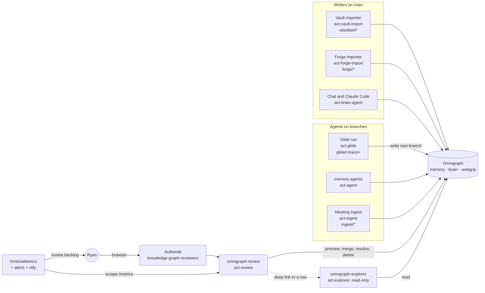
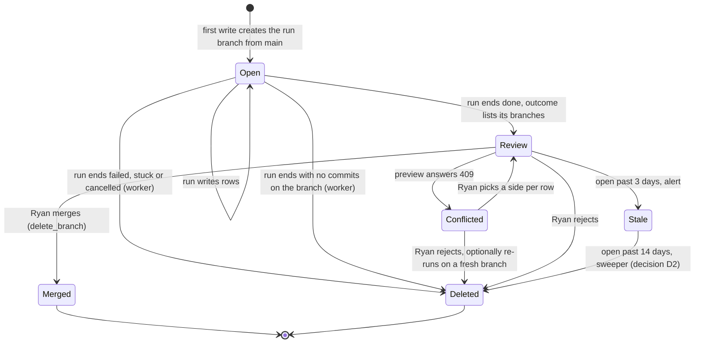
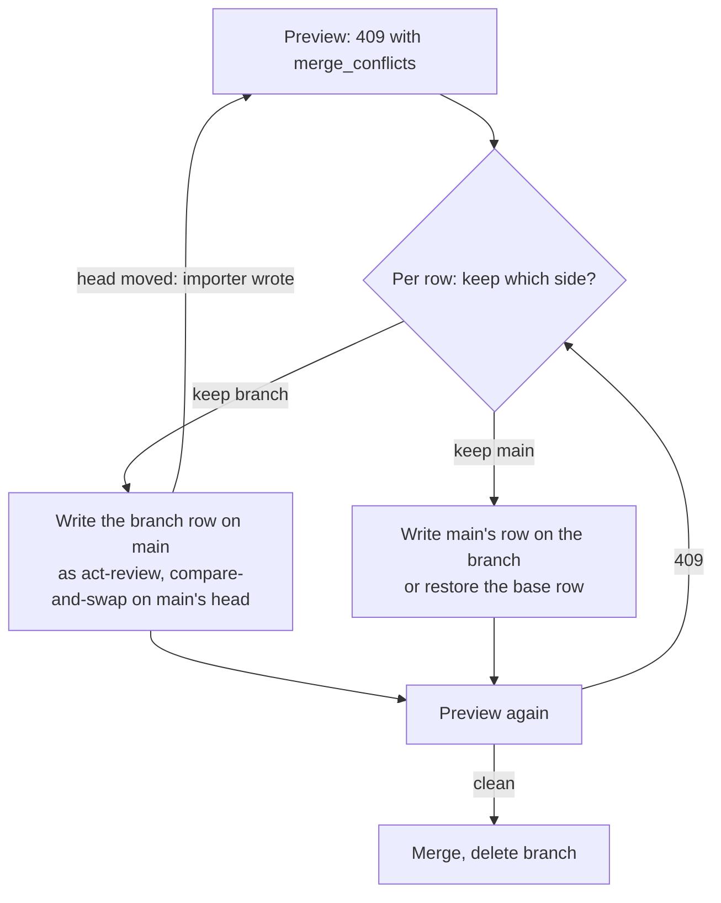
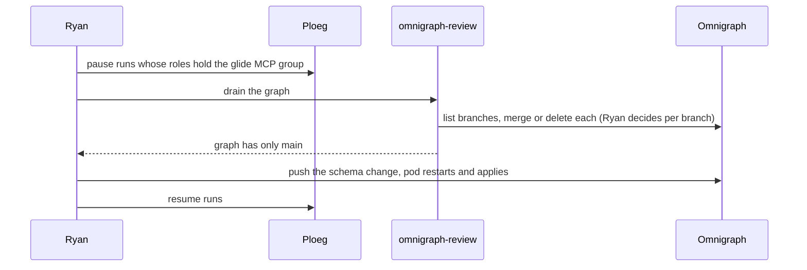

# RFC: Omnigraph branch workflow — how agent branches stay mergeable and get reviewed

> Status: **Proposed** · Date: 2026-09-28 · Tickets: VIK-1258 (review UI), VIK-1300 (Glide side) ·
> Epic: VIK-1259 · Builds on [Glide runs on Omnigraph](spec-glide-omnigraph.md) and the
> [Omnigraph runbook](../runbooks/omnigraph.md)

> **TL;DR.** Omnigraph v0.11 merges row by row. A merge is refused only when both sides changed the
> *same row* to *different* values, and it is refused whole. The importers rewrite `brain` `main`
> every 15 minutes and every hour, so any agent branch that edits a row an importer owns will
> conflict. The fix is mostly avoidance by design: agents write **new rows in their own slug
> namespace** and link them to shared rows, and never edit rows under `obsidian/` or `forge/`.
> For the conflicts that remain, a small **review service** with its own actor (`act-review`,
> behind Authentik, never held by an agent) previews the merge exactly on a throwaway branch,
> shows the net diff, and resolves a conflict with one click by writing the chosen row on the
> side that has to change. Glide never resolves or merges. Branches live for days, not weeks,
> because an open branch blocks schema changes. A branch monitor built into the review service
> exports branch count and age, since Omnigraph v0.11 exports no metrics.

## 1. The questions

Ryan asked on 2026-09-28: how do we actually fix merge conflicts, can Glide's branches be updated,
and what should the setup look like? The answers below are measured, not assumed. Section 2
records the tests. Sections 3 to 9 are the design.

Short answers:

| Question | Answer |
|---|---|
| Can a conflict be fixed? | Yes. Make the conflicting row identical on both sides, or put one side back to the base value, then merge again. Each conflict kind has a fixed recipe ([section 7.3](#73-resolve-a-conflict)) |
| Can Glide's branch be updated from `main`? | Yes. `branch merge main --into glide/<run>` works and turns the later merge into `main` into a fast-forward. `act-glide` lacks `branch_merge` today, so either the review service does it or Glide gets a narrow grant (decision D3) |
| Can things be edited on a Glide branch? | Yes, by anyone with `change` on unprotected branches: `act-glide`, `act-ryan`, and the proposed `act-review` |
| Is there a rebase? | No, not in v0.11 and not planned soon: upstream's draft "branch operations v2" ([ModernRelay/omnigraph#677](https://github.com/ModernRelay/omnigraph/pull/677)) defers rebase and cherry-pick to a later contract. It does propose a merge preview |

## 2. What Omnigraph v0.11 actually does

Tested on 2026-09-28 with the pinned CLI and server (`omnigraph 0.11.0`, from `mise`) against
throwaway local graphs and one throwaway local server. No homelab graph was touched. The
upstream reference is [docs/user/branching/merge.md](https://github.com/ModernRelay/omnigraph/blob/main/docs/user/branching/merge.md).

### 2.1 How a merge decides

A merge is a **three-way merge per row**. For each row it compares three versions: the *base*
(the row when the branch was made, or at the last merge between the two branches), the row on the
branch, and the row on the target. It compares whole rows by value:

- only one side changed the row: that side wins, no conflict;
- both sides changed it to exactly the same row: no conflict;
- both sides changed it to different rows: conflict.

A conflict refuses the whole merge and publishes nothing. The CLI names every conflict. The HTTP
server answers `409` with a structured list, which a UI can use directly:

```json
{"code":"conflict","merge_conflicts":[
  {"entity_kind":"node","type_name":"Note","entity_id":"n1","kind":"divergent_update"},
  {"entity_kind":"node","type_name":"Note","entity_id":"n2","kind":"delete_vs_update"},
  {"entity_kind":"node","type_name":"Note","entity_id":"n9","kind":"divergent_insert"}]}
```

### 2.2 Which changes conflict

| Branch did | `main` did | Result |
|---|---|---|
| Updated row A | Updated row B | Merged |
| Updated `content` of A | Updated `name` of A | **Conflict** `divergent_update`. The unit is the row, not the field |
| Updated A to X | Updated A to X | Merged |
| Updated A to X | Updated A to Y | **Conflict** `divergent_update` |
| Updated A | Deleted A (or the reverse) | **Conflict** `delete_vs_update` |
| Deleted A | Deleted A | Merged |
| Inserted key K | Inserted key K, other values | **Conflict** `divergent_insert` |
| Inserted key K | Inserted key K, same values | Merged |
| Added edge A→B | Added edge A→B | Merged, but **two** edges: edge ids are generated, so each side's edge is its own row (upstream calls this the multiset default) |
| Added edge A→B with id `rel:A>B` | Added the same edge, same id | Merged, **one** edge |
| Added edge A→B, B→C | Nothing on those | Merged |
| Added edge A→B | Deleted node B | **Conflict** `orphan_edge` |
| Added `@card(0..1)` edge A→P1 | Added `@card(0..1)` edge A→P2 | **Conflict** `cardinality_violation` |

### 2.3 What clears a refused merge

| Action after the refusal | Result |
|---|---|
| Write the branch's value on `main`, merge again | Merged (branch value wins) |
| Write `main`'s value on the branch, merge again | Merged (`main` value wins) |
| Put the branch row back to its base value, merge again | Merged (`main` value wins) |
| Write a third value on `main` | Still refused |
| Write a value on the branch that matches neither | Still refused. Also true for a partial match: same `content`, different `tags` |
| Delete the row on the branch, when `main` updated it | Still refused (`delete_vs_update`) |
| Delete it on both sides | Merged |
| Re-insert on `main` the row `main` had deleted, with the branch's values | Merged |
| Delete an orphaned edge on the branch | Merged |
| Merge `main` into the branch first | Refused with the same conflict. Syncing does not dodge a conflict, it only moves where you meet it |
| Delete the branch, make a new one from `main` | Always clean, but the work is lost |

This corrects the runbook's earlier wording ("writing it only on the branch is not enough"). Writing
on the branch does work, as long as the result is the exact row `main` has, or the base row.

### 2.4 Syncing `main` into a branch

- `branch merge main --into glide/x` works. Rows `main` changed arrive on the branch; `main` is
  untouched. The next merge of the branch into `main` is a `fast_forward`.
- A branch stays usable after it is merged. Later writes on it and on `main` merge again against
  the new base.
- The sync appears on the branch as a commit with `merged_parent_commit_id` set. Its change list
  holds `main`'s changes, so a review diff must skip those commits.

### 2.5 Policy for a sync grant

On a local server with a candidate policy that gives `act-glide` `branch_merge` with
`target_branch_scope: unprotected`:

| Call as `act-glide` | Answer |
|---|---|
| Merge `main` into `glide/r1` | 200 `merged` |
| Merge `glide/r1` into `main` | 403 `policy denied action 'branch_merge' … targeting branch 'main'` |
| Merge `glide/r1` into `glide/r2` (another run) | 200. The policy cannot pin prefixes, the same gap as today's write grant |

### 2.6 What a reviewer can read

| API | Gives |
|---|---|
| `GET /graphs/{g}/branches` | Branch names only. No creation time, no author |
| `GET /graphs/{g}/commits?branch=` | The branch's commits, then its ancestors on `main`. Own commits carry `graph_branch = <branch>`, `actor_id` (for example `act-glide`) and `created_at` in microseconds. The first commit without the branch name is the fork point |
| `GET /graphs/{g}/commits/{id}/changes` | Per row: `op` (insert, update, delete), `before` and `after` with every property, and edge endpoints. Compared with the first parent. Paged, at most 8,192 per page |
| `GET /graphs/{g}/changes?branch=&start=after:<fork>` | The same changes as one ordered feed from the fork point, with a resume cursor |
| `POST /graphs/{g}/branches/merge` | The merge, `delete_branch: true` to delete the source after success, `409` with `merge_conflicts` on refusal |

There is **no merge preview** in v0.11. One can be built from what exists, and it is exact:

1. create `preview/<branch>` from `main`;
2. merge the branch into it. A `409` is the exact conflict list. A success creates a merge commit
   whose change list, compared with its first parent (`main`), is exactly what merging would do to
   `main`;
3. delete `preview/<branch>`.

Tested: a row the branch changed to the value `main` already had did not appear in the preview diff,
while a plain sum of the branch's commits would have listed it.

### 2.7 Importer-owned rows

Merge knows nothing about slug namespaces. Tested with a simulated vault import:

| Branch | Importer on `main` | Result |
|---|---|---|
| Edited `obsidian/x` | Rewrote `obsidian/x` | **Conflict** on `obsidian/x` |
| Added its own note plus an edge to `obsidian/x` | Rewrote `obsidian/x` | Merged |
| Added its own note plus an edge to `obsidian/x` | Deleted `obsidian/x` | **Conflict** `orphan_edge` |
| Added its own note | Added `obsidian/y` | Merged |

Even without a conflict, an agent edit to an importer-owned row is lost: the importer compares the
graph with its source and rewrites the row on its next run.

## 3. Design principles

1. **Avoid conflicts by construction, resolve the rest by hand.** Most conflicts come from two
   writers editing the same row. Give each writer its own rows.
2. **Agents propose, people decide.** An agent never merges, never resolves a conflict, never
   writes `main`. That is already policy for `act-glide`; this RFC keeps it.
3. **The review service is a tool for Ryan, not an agent.** It holds a write-capable token, so it
   exposes a fixed set of operations, never free-form GQ, and only Ryan can reach it.
4. **Short branches.** Every open branch blocks schema changes on its graph. A branch is reviewed
   within days or deleted.
5. **No schema change to make this work.** A schema change needs every branch drained and a
   failure takes every graph down. Everything in phases 1 to 4 works on today's schemas.

## 4. Architecture



Components:

| Component | New? | Role |
|---|---|---|
| Omnigraph | No | Unchanged. One new actor, `act-review`, in the three graph policies |
| `omnigraph-review` | New | Server-side review app plus a small UI. Holds the `act-review` token, never sends it to the browser. Exposes `/metrics` for branch monitoring |
| `omnigraph-explorer` | No | Stays read-only. The review UI links into it to show a row in context |
| Ploeg (Glide) | Changed | Prompt contract and worker cleanup, [section 5](#5-branch-lifecycle-for-glide-runs) |

### 4.1 Why a separate service, not the explorer

The explorer's security argument is that it cannot write: its proxy forwards only `GET` on four
paths plus `POST /export`, and its actor is read-only by policy. Adding merge and resolve to it
would turn that simple argument into a long one. A separate Deployment keeps the explorer as it
is and puts every write behind a separate Authentik client, a separate group and a separate
token.

The UI can still share code with the explorer (graph rendering, type colours). Decision D1 asks
where the code lives.

### 4.2 Identity: `act-review`

A new actor, generated and pushed to OpenBao like every other actor (`secret/omnigraph/review`),
added to the `omnigraph-tokens` aggregator. It is held only by `omnigraph-review`.

Rights on `memory`, `brain` and `webgrip`:

```yaml
- id: reviewers-read-and-write-everywhere
  allow:
    actors: {group: reviewers}
    actions:
      - read
      - change
    branch_scope: any
- id: reviewers-manage-and-merge-branches
  allow:
    actors: {group: reviewers}
    actions:
      - branch_create
      - branch_delete
      - branch_merge
    target_branch_scope: any
```

No `export`, no `invoke_query`. `change` on `main` is needed because resolving in favour of the
branch means writing on `main` ([section 2.3](#23-what-clears-a-refused-merge)).

Why not reuse `act-ryan`: that token lives on Ryan's laptop and is his personal CLI identity. A
separate actor can be rotated and revoked alone, and every merge and resolve it makes carries
`actor_id: act-review` in the commit history, so service actions and CLI actions stay apart. The
service writes one log line per action with the Authentik user, the graph, the branch and the
resulting commit id, so the person behind each `act-review` commit can be traced in VictoriaLogs.

Client graphs: the policy validator refuses one actor on two client graphs unless it is
allow-listed. Client graphs stay CLI-reviewed (as `act-ryan`) until a client graph actually needs
the UI. At that point either `act-review` joins the allow-list, which is a security decision, or
each client graph gets its own reviewer actor.

### 4.3 Who gets in

- An HTTPRoute `graph-review.<domain>` on `envoy-internal` (LAN only), behind the gateway OIDC
  `SecurityPolicy` with its own Authentik client `omnigraph-review`
  ([ADR-0060](../adr/adr-0060-gateway-oidc-for-apps-without-a-login.md)).
- Authentik issues a token only to `knowledge-graph-reviewers`, the group of a new
  `knowledge-graph-review` capability, granted to Ryan by name, as the explorer's is.
- Write endpoints are `POST` only, require a custom request header (`X-Review-Intent`) that a
  cross-site form cannot send, and reject a mismatched `Origin`.
- Network: `omnigraph-ingress` admits the review pod, and the review pod gets an egress rule to
  `app: omnigraph` on 8080. No other egress.
- No agent key ever reaches this service. It is not an MCP server and not registered in LiteLLM.

## 5. Branch lifecycle for Glide runs



| Rule | Why |
|---|---|
| **Name** `glide/<trace-id>`, trace id `ploeg-<12hex>` (existing spec). One branch per run per graph | The review UI groups a run's branches across graphs by trace id |
| **Create lazily** from `main`, right before the first write | A reading run leaves nothing behind |
| **Keep short**: a run writes and ends, it does not keep a branch open across runs | Every open branch blocks schema changes and drifts further from `main` |
| **Resume** only within the same run (same trace id). A new run never reuses an old branch | Keeps one reviewable unit per run |
| **No commits at the end**: the worker deletes the branch | An empty branch blocks schema changes for nothing |
| **Failed, stuck, cancelled**: the worker deletes the branch (existing spec) | Nothing to review |
| **Sync from `main`**: not done by default | The preview already compares against the current `main`, so review needs no sync. Sync is for a branch that has to wait; the review UI offers it as "Update branch" |
| **Age**: alert at 3 days, auto-delete at 14 days (D2) | A branch older than two weeks is rarely still worth merging, and it blocks schema work |

The same lifecycle applies to `ingest/*` on `webgrip` and to `act-agent` branches on `memory`,
except that their writers set their own naming.

## 6. Ownership rules that prevent conflicts

### 6.1 Who owns which rows

| Rows | Owner | Agents may |
|---|---|---|
| `obsidian/*` on `brain` | Vault importer | Read. Link to them from their own rows. **Never update or delete** |
| `forge/*` on `brain` | Forge importer | Same |
| `glide/<trace>/*` | That run | Everything |
| Everything else on `brain` (`per-`, `tk-`, `nt-` and so on) | Ryan, his chat and Claude Code | Update only when the task is to change that row, and keep it to that row |
| `memory` notes | Whoever wrote them | Add new notes and `Relates` edges. Do not edit another run's note |
| `webgrip` | Meeting ingest, Ryan | Add. Do not edit |

### 6.2 Slugs: a namespace per run

An agent-created row gets the slug `glide/<trace>/<type prefix>-<name>`, for example
`glide/ploeg-3f9a0c1b2d4e/nt-bike-chain`. Two runs, or a run and `main`, can then never insert the
same key, so `divergent_insert` cannot happen between them. The type prefix from the brain
conventions stays after the run prefix, so prefix searches (`starts_with "glide/"`) and type
conventions both work. After merge the row lives on `main` under that slug; renaming it is not
needed.

### 6.3 Add, don't edit

The strongest rule, because it removes the common conflict: an agent that learns something about a
shared row writes a **new row that points at it** instead of editing it.

| The agent wants to | It writes |
|---|---|
| Add a fact about a person, project, organisation, place or area on `brain` | A `Note` (kind `insight`, or the fitting kind) in its namespace, plus `NoteAboutPerson` (or `NoteAboutProject` and so on) to the shared row |
| Annotate an imported doc, ADR, issue or vault note | A `Note` in its namespace, plus `RelatedNote` to the vault note, or `NoteAboutProject` to the repo |
| Say a shared row is wrong (a stale role, a wrong date) | A `Note` of kind `question`, tag `proposal`, whose content states the row, the field and the proposed value, linked to the row. The review UI shows proposals next to the diff and offers "apply", which writes the change on `main` as `act-review` |
| Record a memory that replaces an older one on `memory` | A new `Note` plus `Relates` to the old one. The old note stays |

This needs no schema change: every edge used already exists. Its limit is that `brain` has no
`Note → Task` edge, so a proposal about a task links to the task's project instead and names the
task slug in its content. A dedicated `Proposal` node type would be cleaner, but it is a schema
change (drained branches, all graphs at risk), so it is deferred to phase 6.

### 6.4 Edges with fixed ids

The same edge added on both sides becomes two edges ([section 2.2](#22-which-changes-conflict)).
To avoid duplicates, an agent adds edges through `load` with an explicit id,
`<EdgeType>:<from>><to>`, for example `NoteAboutPerson:glide/ploeg-3f9a0c1b2d4e/nt-x>per-sam`. Two
writers adding the same edge then produce the same row, which merges cleanly. The importers
already delete and reload their own edges, so they are unaffected. The schema-level fix,
`@key(@src, @dst)` on edge types, is again a schema change (phase 6).

### 6.5 How the rules are held

Omnigraph policy cannot scope by slug. The rules hold in three places:

1. **The prompt contract** in Ploeg (`writeOmnigraphContract`, VIK-1300) states them.
2. **The review service** marks every change to an importer-owned row in red and refuses to merge
   a branch that contains one until the reviewer drops those rows ("keep main", [section
   7.3](#73-resolve-a-conflict)). This is the hard gate.
3. **A branch monitor metric** counts branches that touch importer-owned rows, so a prompt that
   keeps breaking the rule shows up as a trend, not a surprise.

## 7. The review UI (VIK-1258)

### 7.1 What it shows

**Inbox**: one row per open non-`main` branch across the three graphs, grouped by run (the trace
id in `glide/<trace>`) or by prefix (`ingest/*`, others). Per branch: graph, author actor (from the
branch's commits), age (oldest own commit), number of rows changed, and a status computed from the
preview: **clean**, **conflicts (n)**, **touches importer rows**, **empty**.

**Branch view**:

- **Net diff**, from the preview merge commit's change list ([section 2.6](#26-what-a-reviewer-can-read)):
  one entry per row, insert, update or delete, with a before and after table per property and the
  changed properties highlighted. Edges are shown as `from → to` under their source row.
- **Per-commit history**, from the branch's own commits, skipping sync commits
  (`merged_parent_commit_id` set), for "what did the agent do in which order".
- **Conflicts**, from the preview's `409`: per row, three columns (base, branch, `main`), taken
  from the branch's first `before` image, the branch's last `after` image and a read of the row on
  `main`.
- **Proposals**: `Note` rows with tag `proposal` on the branch, each with an "apply" action.
- A link per row into the explorer.

### 7.2 Actions

| Action | Calls, as `act-review` |
|---|---|
| **Merge** | Preview, then `POST /branches/merge` with `delete_branch: true`. On a `409` (someone wrote `main` in between), show the new conflicts, nothing is lost |
| **Reject** | `DELETE /branches/<branch>`, after a confirm. The run's outcome in Ploeg is the record of what was proposed |
| **Update branch** | `POST /branches/merge` `{source: main, target: <branch>}`. For a branch that must wait |
| **Resolve** | [section 7.3](#73-resolve-a-conflict) |
| **Apply proposal** | Write the proposed field on `main` with a compare-and-swap, then delete the proposal note on the branch or merge it as the record |
| **Re-run** (phase 4) | Reject, then ask Ploeg to re-queue the run's ticket so it starts from the current `main` on a fresh branch |

The service never accepts GQ from the browser. Every write it makes is built server-side from rows
it read itself.

### 7.3 Resolve a conflict

The reviewer picks a side per conflicting row. The service then writes one row so that both sides
match, and previews again.



| Conflict | Keep branch | Keep `main` |
|---|---|---|
| `divergent_update`, `divergent_insert` | Write the branch's full row on `main` | Write `main`'s full row on the branch |
| `delete_vs_update`, branch deleted | Delete the row on `main` | Re-insert `main`'s row on the branch |
| `delete_vs_update`, `main` deleted | Re-insert the branch's row on `main` | Delete the row on the branch |
| `orphan_edge` | Re-create the missing endpoint on `main` (rarely right) | Delete the edge on the branch |
| `cardinality_violation` | Delete `main`'s edge | Delete the branch's edge |
| `unique_violation`, `value_constraint_violation` | Not offered; fix on the branch or reject | Same |

Rules:

- **Whole rows.** A write copies every property of the chosen image, including `createdAt` and
  `updatedAt`, using an explicit `update … set` or a merge `load`, never the `capture_*` stored
  mutations, which stamp `now()`. A partial copy leaves the rows different and the conflict stays.
- **Compare-and-swap on `main`.** The importers write `main` every 15 minutes. A write to `main`
  goes through `POST /mutate/if-graph-commit` with the head the preview saw. If the head moved, the
  service previews again instead of overwriting an import.
- **Importer-owned rows are keep-`main` only.** Keeping the branch's version would be overwritten
  by the next import anyway. The UI offers one button, "drop the agent's change to imported rows",
  which restores `main`'s rows on the branch.
- **Keep `main` writes on the branch**, so it leaves `main` untouched: the preferred side whenever
  the reviewer has no reason to keep the agent's version.

Open risk, to test in phase 2 before shipping resolve: rows with an `@embed` vector (`brain`
`Note.embedding`, `Passage.embedding`, `memory` `Note.embedding`). The nightly backfill fills
vectors on `main` only, and a merge `load` clears a row's vector. Whether a vector difference
alone makes two rows unequal for merge, and whether a copied row carries its vector, is not yet
measured. If it does, "keep main" on such rows must copy the vector too, and the backfill itself
can turn an untouched `main` row into a changed one.

### 7.4 What it does not do

- It does not edit arbitrary rows; that is the chat, Claude Code or the CLI.
- It does not merge client graphs (section 4.2).
- It does not approve schema changes.

## 8. How Glide behaves around conflicts

Additions to the Glide contract in [the spec](spec-glide-omnigraph.md#4-tell-the-agent-its-branch):

1. Write new rows under `glide/<trace>/`. Never update or delete a row whose slug starts with
   `obsidian/` or `forge/`.
2. Prefer adding a note linked to a shared row over editing the shared row. When a shared row
   looks wrong, write a `proposal` note.
3. Add edges with `load` and an explicit id `<EdgeType>:<from>><to>`.
4. Never call `branches_merge`, never write `main` (unchanged; the policy refuses both).
5. **Never resolve a conflict.** A run does not see conflicts, because it never merges. If a run
   resumes and finds its branch deleted, that was a rejection: stop and report, do not recreate
   it.
6. At the end, report every branch written, per graph, with the number of rows, in the outcome
   summary.

Worker (deterministic code, not the model):

- delete the branch when the run wrote nothing (in addition to the existing delete on failure);
- optionally (D3) sync `main` into the branch at the end and report conflicts in the outcome, so
  the reviewer sees them before opening the UI.

A rejected run is redone by a **new run** on a fresh branch from the current `main`. That is the
v0.11 substitute for a rebase: the agent redoes the work against today's data instead of replaying
yesterday's edits.

## 9. Schema changes

An open branch on a graph makes `cluster apply` fail for a schema change to that graph, and the
init container then stops **every** graph. The workflow:



Proposed improvements:

- **A drain view** in the review UI per graph: every open branch, its status, and a banner
  "schema changes blocked" while any exists. The same number is a metric
  (`omnigraph_branches_open`), so it is visible before pushing.
- **A pre-push check**: `just omnigraph-schema-ready <graph>` lists the graph's branches as
  `act-ryan` and fails when any exist. Run it before committing a `*.pg` change.
- **Fail safe, not fail down**: make [bootstrap.sh](../../../../kubernetes/apps/ai/omnigraph/app/bundle/bootstrap.sh)
  detect `schema_preview_unavailable` in `cluster plan` and skip the apply with a loud log line and
  a metric, so the server keeps serving the last applied state. The trade-off: every other bundle
  change in that push (policies, queries) is also held back until the branches are drained. That
  is still better than every graph down, but it needs a test that the server serves the old state
  correctly when the bundle on disk is newer.

## 10. Monitoring

Omnigraph v0.11 exports no metrics. The review service already lists branches and reads commits,
so it exports the branch metrics itself on `/metrics`, scraped by a `VMServiceScrape`. It refreshes
every 5 minutes, not per scrape, to keep load off Omnigraph.

| Metric | Labels | From |
|---|---|---|
| `omnigraph_branches_open` | `graph`, `prefix` (`glide`, `ingest`, `agent`, `preview`, `other`) | `GET /branches` |
| `omnigraph_branch_age_seconds` | `graph`, `branch` | Oldest commit with `graph_branch = <branch>`. A branch without commits reports 0 and counts as empty |
| `omnigraph_branch_empty` | `graph`, `branch` | No own commits |
| `omnigraph_branch_touches_importer_rows` | `graph`, `branch` | Diff contains `obsidian/` or `forge/` updates or deletes |
| `omnigraph_review_refresh_success_timestamp_seconds` | none | Last complete refresh, for a dead-man alert |
| `omnigraph_review_actions_total` | `action`, `result` | Merge, reject, resolve, sync |

Alerts (all in-cluster, delivered through the existing ntfy path):

| Alert | Condition | Why |
|---|---|---|
| `OmnigraphReviewBacklog` | Any `glide/*` or `ingest/*` branch older than 3 days | Review is stalling |
| `OmnigraphBranchesPileUp` | More than 10 open branches on one graph for 1 hour | Runs are writing faster than review, and schema work is blocked |
| `OmnigraphBranchMonitorStale` | No successful refresh for 30 minutes | A silent monitor must not look like an empty inbox |
| `OmnigraphReviewGateOpen` | Blackbox: an anonymous request to the review route is not sent to Authentik | The write path is only as safe as its gate |

Branch creation time is not in the API, so age starts at the branch's first commit. That is the
right clock for review (an empty branch has nothing to review) and empty branches have their own
metric.

Dashboard: stat tiles per graph (open branches, oldest age, conflicted count) and a table of open
branches, not time series.

## 11. Phased plan

| Phase | Delivers | Depends on |
|---|---|---|
| 0 | This RFC; runbook correction on what clears a conflict | none |
| 1 | `act-review` actor and policy rules; `omnigraph-review` read-only: inbox, net diff via preview branch, per-commit history; merge and reject; Authentik client and group; route; network policy; blackbox gate probe | 0 |
| 2 | Resolve (per-row pick, compare-and-swap on `main`, importer rows keep-`main` only); proposals with "apply"; the `@embed` vector test from section 7.3 first | 1 |
| 3 | Branch metrics, `VMServiceScrape`, the four alerts, dashboard | 1 |
| 4 | Glide contract additions (section 8) in VIK-1300; worker deletes empty branches; ntfy on run completion links to the branch in the review UI; re-run button | 1, VIK-1300 |
| 5 | Schema drain: drain view, `just omnigraph-schema-ready`, bootstrap fail-safe | 3 |
| 6 | Deferred, needs drained branches: `@key(@src, @dst)` on edge types that should not repeat; a `Proposal` node type; move preview to upstream merge preview when it ships | 5, upstream |

### 11.1 Proposed board tickets (not created)

| # | Board | Title | Estimate |
|---|---|---|---|
| 1 | Homelab Roadmap | omnigraph: correct the runbook on clearing merge conflicts (write-on-branch works when the rows match) | S, hours, low |
| 2 | Homelab Roadmap | omnigraph: `act-review` actor, token generator and pushsecret, policy rules on memory/brain/webgrip, validator stays green | S, hours, low |
| 3 | Homelab Roadmap | omnigraph-review: inbox, preview-branch net diff, merge and reject behind Authentik (refines VIK-1258) | L, days, med |
| 4 | Homelab Roadmap | omnigraph-review: measure `@embed` vector effect on merge equality and row copy | S, hours, med |
| 5 | Homelab Roadmap | omnigraph-review: per-row conflict resolution with compare-and-swap, importer rows keep-main only, proposal apply | M, days, med |
| 6 | Homelab Roadmap | omnigraph: branch metrics, scrape, `OmnigraphReviewBacklog`, `OmnigraphBranchesPileUp`, `OmnigraphBranchMonitorStale`, `OmnigraphReviewGateOpen`, dashboard | M, days, low |
| 7 | Ploeg | glide: slug namespace `glide/<trace>/`, no edits to `obsidian/` and `forge/`, proposal notes, edges with fixed ids, delete empty branches (amends VIK-1300) | M, days, low |
| 8 | Ploeg | glide: completion notice links to the run's branches in the review UI; re-run endpoint for a rejected run | M, days, med |
| 9 | Homelab Roadmap | omnigraph: schema drain view, `just omnigraph-schema-ready`, bootstrap skips a blocked schema apply instead of stopping every graph | M, days, med |
| 10 | Homelab Roadmap | omnigraph: 14-day stale-branch sweeper (only if D2 says yes) | S, hours, low |

## 12. Decisions for Ryan

| # | Question | Recommendation |
|---|---|---|
| D1 | Where does the review UI live: a new repo `webgrip/omnigraph-review`, or a second image from `webgrip/omnigraph-explorer`? | Second image in the explorer repo. It shares the graph code, and the deployments stay separate |
| D2 | Auto-delete branches after 14 days, or only alert? | Alert at 3 days, auto-delete at 14. A run's outcome in Ploeg keeps the record of what was proposed |
| D3 | Give `act-glide` `branch_merge` into unprotected branches so the worker can sync `main` into its own branch? | Not now. Review previews against the live `main` and does not need it. The grant also lets a run merge into another run's branch. Revisit if branches have to wait for days |
| D4 | New `act-review` or reuse `act-ryan` in the service? | New actor, for separate rotation and clear commit authorship |

## 13. Alternatives considered

| Option | Why not |
|---|---|
| Agents write `main` directly, like the chat | Removes review, which is the point of Glide's branch rule. Prompt injection from imported text would land unreviewed |
| Resolve conflicts by re-running every conflicted run | Fine for many conflicts, wasteful for one. Kept as the fallback |
| Put merge and resolve in the explorer | Section 4.1 |
| Rebase in the review service (replay the branch's changes onto a fresh branch) | Tempting, but a replay of `after` images over rows `main` changed is a silent overwrite. The explicit per-row choice is safer and v0.11 gives all the data it needs |
| Row-level locks or a `Proposal` type now | Schema changes; section 3, principle 5 |
| Glide merges its own clean branches | Breaks "only Ryan merges". A clean merge is not a correct one |
