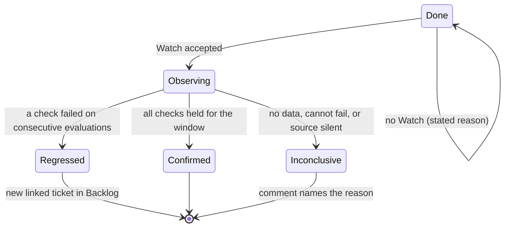

# RFC: Outcome observation — the loop does not end at Done

> Status: **Accepted** (2026-09-28, [decisions](#11-decisions-2026-09-28)) · Date: 2026-09-28 ·
> Epic: VIK-1315 · Extends the board contract's Definition of
> Done ([ADR-0043](../adr/adr-0043-vikunja-roadmap-system-of-record.md), `CLAUDE.md` "Board
> contract") · Borrows created-work limits from Glide
> ([how work flows](https://forgejo.webgrip.dev/webgrip/glide/src/branch/development/docs/concepts/how-work-flows.md#work-that-creates-work))

> **TL;DR.** A ticket closes with a small machine-readable **Watch**: the query that shows its
> result holding, the condition it must meet, and how long to watch. A scheduled evaluator
> checks every open Watch for its window and writes one comment with the result:
> **Confirmed**, **Regressed** or **Inconclusive**. A Regressed Watch creates a new linked ticket
> with the telemetry attached, parked in Backlog until a human refines it. A Watch can also
> declare an **Opportunity** condition. When it is met, the evaluator creates an idea ticket through
> the same capped, human-reviewed path. Before a Watch starts, the evaluator runs it against the
> days before the fix. A check that would have passed then as well measures nothing, so it is
> rejected. The evaluator has its own dead-man and a built-in control pair, so a silent evaluator
> cannot look like a quiet week.

| Term | Meaning |
| --- | --- |
| **Watch** | The declared signal on a closed ticket: one or more checks, a window, a datasource per check. |
| **Check** | One query plus one expected condition, evaluated repeatedly during the window. |
| **Window** | How long the Watch runs after the ticket closes. Default 7 days. |
| **Observing** | A Done ticket whose Watch is still running. |
| **Confirmed** | Every check held for the whole window. Nothing further happens. |
| **Regressed** | A check failed on consecutive evaluations. A new linked ticket carries the evidence. |
| **Inconclusive** | The Watch could not be judged: no data, a query error, a check that cannot fail, or the source went silent. |
| **Opportunity** | A ticket the telemetry suggests: an improvement, not a regression. It is created through the same capped path. |
| **Evaluator** | The scheduled job that reads Watches, runs their checks and writes results. |

## 1. Why

The Definition of Done already asks for the signal that would catch a regression. The
product-owner skill's close procedure puts "the regression signal (alert/dashboard/check — or why
none)" in the evidence comment, and the Vellum board labels its Done column "DoD: deployed +
monitored, evidence in comments" (`kubernetes/apps/vikunja/board/app/index.html`, `STAGES`). After
that comment nothing reads the signal again. "Monitored" means a signal exists, not that anyone
looks at it.

This week showed the gap three times:

- **Warnings went nowhere for a week.** ntfy rejected any message over 4096 bytes and
  Alertmanager dropped the whole group: 6914 warning, 230 critical and 474 digest notifications
  lost between 2026-09-21 and 2026-09-28 (`5b7d0747`). Every ticket closed in that week that named
  a warning alert as its "monitored" signal was watched by nobody.
- **The deadman leg is reported dead since 2026-09-26.** `Watchdog` fires in VictoriaMetrics
  (verified 2026-09-28 05:47Z: `ALERTS{alertname="Watchdog",alertstate="firing"}` = 1), but the
  loop that proves delivery end-to-end is the one the
  [alert delivery RFC](rfc-alert-delivery.md) already listed as "still owed". A signal that relies
  on push delivery inherits every gap in that pipe.
- **VIK-1295 closed with an honest gap.** The closing comment on
  [VIK-1295](https://vikunja.webgrip.dev/tasks/1295) (comment 889) names the signal ("the ploegd
  `managed settlement unresolved` WARN (VictoriaLogs)") and says it plainly: "no dedicated alert
  yet on unresolved settlements". The fix is correct today. Whether it still holds next Tuesday
  depends on someone remembering to run a LogsQL query.

A fourth finding came up while this RFC was being grounded, and it shapes the design (§4.3). The
obvious query for VIK-1295, the bare phrase `"managed settlement unresolved"`, returned **7
hits at 05:40Z, fifteen minutes after the fix**. None of them came from ploegd. They were
the `mcp-victorialogs` and `mcp-vikunja` pods logging the query text itself (and the ticket body
that contains the phrase). Scoped to the stream `{namespace="ploeg",container="ploegd"}` the same
window returns 0. An unscoped "zero bad lines" check would have reported a regression caused by the
act of checking. The owner's rule "question what a metric actually measures" has to be a gate in
the loop, not a reminder.

## 2. Requirements

| # | Requirement |
| --- | --- |
| R1 | A ticket can declare its outcome signal in a form a program can evaluate without an LLM. |
| R2 | Evaluation is automatic, scheduled and bounded by a window. No one has to remember to look. |
| R3 | Results land on the board as ticket history (comments, relations), a surface read without push delivery. |
| R4 | Stages stay **derived from labels + done** (board contract). No stored stage field and no new Vikunja status. |
| R5 | A regression becomes a **new** linked ticket with the evidence attached. The closed ticket is not reopened. |
| R6 | Created work respects review capacity: it goes into Backlog for a human, is capped and deduplicated, and nothing is dropped without a record. |
| R7 | A check that cannot fail is rejected before it starts. A check whose data source went silent is Inconclusive, not Confirmed. |
| R8 | The evaluator failing (crash, expired token, empty scan) is detected and does not look like "all quiet". |
| R9 | The loop measures itself: coverage, catches, and how many Watches end Inconclusive. |
| R10 | GitOps: the evaluator is Flux-managed; its secrets come from ESO + OpenBao. |

## 3. Lifecycle and naming



Confirmed, Regressed and Inconclusive are **the result of the Watch**. They are mutually
exclusive and final. An **Opportunity** is not a fourth result. A Watch can be Confirmed *and*
produce an Opportunity, for example when an optimisation held with so much headroom that a limit
can be lowered. So the owner's third branch is modelled as a **kind of created ticket**, next to
Regression, not as a state of the source ticket.

### 3.1 The name for the third branch: **Opportunity**

| Candidate | Verdict | Reason |
| --- | --- | --- |
| **Opportunity** | **Recommended** | Says what the ticket *is* for the reader: a chance to improve, entering refinement like any idea. It pairs naturally with *Regression* as the two kinds of created work, and it is not a Glide term. |
| Inspired | Rejected | Describes the evaluator's mood, not the ticket. It is anthropomorphic and gives a refiner nothing to act on. |
| Spawned | Rejected | Describes the mechanism, and a Regression is spawned too, so it cannot tell the two apart. |
| Follow-Up | Rejected | A Glide glossary term: "a Work Item created by other work". Both kinds *are* Follow-Ups in Glide's sense, which is why neither may take the name. |
| Idea | Acceptable | Clear, but too broad: every Backlog ticket is an idea. *Opportunity* says the telemetry motivated it. |

### 3.2 Words avoided, and why

The loop sits next to Glide, whose agents read the same board (Ploeg project 10). Each of these
already means something there:

| Word | Glide meaning | Consequence |
| --- | --- | --- |
| Settled | Money settlement of a Run's LLM spend (glossary, `run_llm_accounts`) | Not used for a finished Watch. |
| Outcome | The terminal result of a Run (`pr_opened`, `stuck`, `failed`, …) | Not used for the Watch's result. The ticket template's "Outcome" *section* is fine: the Watch checks that section. |
| Verdict | A reading Run's `approve` / `request_changes` | The Watch's end state is called its **result**. |
| Follow-Up, proposed | Created work and its unapproved state | Reused only as a *reference*: created tickets behave like Glide's `proposed` (§6), without claiming its name. |
| Reviewing | The board's stage for the `review` label | Observing sits **after** Done, not beside Reviewing. |

That is also the argument for the label family `watch/*` over `outcome/*` (§5). A Glide agent
reading `outcome/regressed` on a Ploeg ticket, next to Run Outcomes like `follow_up_created`, could
reasonably misread it. `watch/regressed` cannot be misread that way.

## 4. Declaring a Watch

### 4.1 Where it lives

The Watch goes in the **closing evidence comment**, the comment the DoD already requires, as a
fenced block whose first line is `watch:`. The evaluator reads comments, not the description,
because:

- comments are append-only history. Descriptions **replace on write** (product-owner adapter), and
  a later edit by any agent could silently delete the Watch;
- the closing comment is where "monitored" is written today. The block replaces a sentence and
  adds no step.

A Watch is **mandatory at Done** (decision 2, §11). A ticket that cannot have one closes with an
explicit opt-out block in the same comment, and the reason is required:

```yaml
watch: none
because: docs-only change, no runtime signal
```

A `watch: none` block without a non-empty `because` is a parse error (rule 4 below). A Done ticket
in scope with neither block gets one comment from the evaluator saying the DoD is not met, and it
counts against coverage (§9).

### 4.2 Schema (version 1)

```yaml
watch:
  version: 1
  window: 7d
  every: 1h
  checks:
    - name: short-kebab-name
      datasource: victorialogs
      query: '{namespace="ploeg",container="ploegd"} "managed settlement unresolved" | stats count() as n'
      expect: "== 0"
      alive: '{namespace="ploeg",container="ploegd"} | stats count() as n'
  opportunity:
    - name: short-kebab-name
      datasource: prometheus
      query: 'max_over_time(some_ratio[7d])'
      when: "< 0.3"
      suggest: "Lower the X limit: peak use stayed under 30% for the whole window."
  regress_to: 3
```

| Field | Meaning | Default / limit |
| --- | --- | --- |
| `window` | How long to observe after the ticket's `done_at`. | 7d; max 30d |
| `every` | Evaluation interval. Each evaluation queries the interval since the last one. | 1h; min 15m |
| `checks[].datasource` | A Grafana datasource **uid**: `prometheus`, `victorialogs`, `ploeg-db`, `litellm-db`, `vikunja-db`, … | required |
| `checks[].query` | PromQL, LogsQL (`stats` pipe) or SQL that returns **one number**. | required |
| `checks[].expect` | `== n`, `!= n`, `< n`, `<= n`, `> n`, `>= n`. | required |
| `checks[].alive` | A query that must return `> 0` for the same interval: proof the source was reporting. | **required when `expect` is `== 0` or `< n`** |
| `checks[].consecutive` | Failed evaluations in a row before Regressed. | 2 |
| `opportunity[]` | Optional conditions that create an Opportunity ticket, evaluated at the end of the window. | max 2 |
| `regress_to` | Project id for created tickets. | the source ticket's project |

Datasources are addressed **through Grafana's `/api/ds/query`** by uid, the same uids panels
and the grafana MCP already use (`kubernetes/apps/observability/grafana/app/datasources/`). One
integration covers metrics, logs *and* the SQL sources. VIK-1295 needs that: its second signal
lives in the Ploeg database, not in any metric (`ploeg_*` has no series in VictoriaMetrics,
checked 2026-09-28).

### 4.3 Admission rules (checked when the Watch starts)

The evaluator refuses a Watch, and answers with one comment saying why, if:

1. **It would have passed before the fix.** The evaluator runs every check against the **same
   length of time before `done_at`** (capped at 7 days). A check that also held then cannot tell
   the fix apart from no fix, so it measures nothing. This is the repo's mutation-test rule
   ("break what it checks, watch it fire") applied to every Watch automatically. It needs no
   extra work from the author. A ticket whose "before" genuinely had no signal (a new feature)
   declares `baseline: none` with a reason, and the result is reported as Confirmed-unbaselined.
2. **A log query is not stream-scoped.** A LogsQL query must start with a `{…}` stream filter.
   §1 showed why: a bare phrase matches the observers' own logs.
3. **An absence check has no `alive` query.** "Zero error lines" and "zero lines" look the
   same. Without `alive`, a crashed pod or a broken log shipper would pass as Confirmed.
4. **It parses badly or names an unknown datasource.** The comment quotes the error, and the
   author fixes it with a new comment containing a corrected block. The latest block wins.

### 4.4 Worked example: VIK-1295

[VIK-1295](https://vikunja.webgrip.dev/tasks/1295) (Ploeg project 10) fixed blocked LLM accounts
that never settled because spend rounded up at 4 decimals. It was deployed in glide `0.4.0-rc.6`
(`96d36d82`, ploeg HelmRelease Ready at 05:24:47Z on 2026-09-28).

```yaml
watch:
  version: 1
  window: 7d
  every: 1h
  checks:
    - name: no-unresolved-settlement-warn
      datasource: victorialogs
      query: '{namespace="ploeg",container="ploegd"} "managed settlement unresolved" | stats count() as n'
      expect: "== 0"
      alive: '{namespace="ploeg",container="ploegd"} | stats count() as n'
    - name: no-account-blocked-over-an-hour
      datasource: ploeg-db
      query: "SELECT count(*) FROM run_llm_accounts WHERE state = 'blocked' AND updated_at < now() - interval '1 hour'"
      expect: "== 0"
```

What the evaluator would have seen, from the live data on 2026-09-28:

- **Baseline (before 05:24Z):** the WARN check returned 361, 378 and 157 lines per hour (03:00, 04:00,
  05:00Z buckets). It fails, so the check can tell a fix from no fix. **Admitted.**
- **First evaluation after the fix:** stream-scoped count 0 since 05:25Z, `alive` > 0 (ploegd kept
  logging: 214 lines in the 05:00Z hour). **Holds.**
- **The trap it avoided:** the unscoped phrase counted 7 lines at 05:40Z from the MCP pods. Rule 2
  rejects that query at admission.
- **The second check is weaker than the ticket's intent.** The owner's signal was "`shifts.spent`
  matching gateway spend". That compares two databases (`ploeg-db` and `litellm-db`), and a
  single-number check cannot express it. The declared proxy, no account blocked for over an
  hour, catches the stuck-settlement class. It only catches a *drift* between ledgers when the
  drift blocks an account. The baseline step also questions it: if the sweep bumps `updated_at` on
  every retry, the check held before the fix as well and admission rejects it. That tells the
  author the proxy is blind before anyone relies on it. A cross-source `compare:` check is slice 3
  (§8).
- **If it regresses** (for example a later release re-introduces the precision mismatch): after two
  failed hourly evaluations the evaluator creates *"Regressed: ploeg: settle blocked accounts
  whose spend rounds up at 4 decimals"* in project 10. It gets `needs-refinement`, a `related`
  link to 1295, the failing query, the per-hour counts, the first matching log line (alias and
  `err`) and a link to the Grafana Explore view for the window. The closed ticket gets one comment
  pointing at it. 1295 stays closed.

## 5. Board representation

Stages stay derived (R4). The Vellum board's `stageOf()` returns `done` first for any completed
task, so labels on a Done task cannot move it to another stage. The Watch state is a **sub-state
of Done**, carried by one label from a new dimension:

| Label | Set when | Removed when |
| --- | --- | --- |
| `watch/observing` | The Watch is admitted | The window closes |
| `watch/confirmed` | The window closed, all checks held | never |
| `watch/regressed` | A check failed on `consecutive` evaluations | never |
| `watch/inconclusive` | No data, rejected at admission, source silent | never |

Created tickets carry **no new label**. A Regression or Opportunity ticket is an ordinary Backlog
ticket (`needs-refinement`), titled `Regressed: …` or `Opportunity: …`, with a Vikunja `related`
relation to the source and a footer line `watch-source: VIK-<id>/<check>` that the evaluator uses
for deduplication. Vellum can render the `watch/*` label as a chip on Done cards, a small change in
the existing label-chip code.

**Contract impact.** The board contract lists label *dimensions* as contract and their values as
board state. `watch/*` is a new dimension, so it needs a one-line contract edit in `CLAUDE.md`
and the product-owner skill's contract section. The owner approved it for slice 2 (decision 1,
§11). The contract
explicitly forbids creating a label to make a write succeed. **Slice 1 therefore uses no labels
at all** (§8). The evaluator derives Observing from "has an admitted Watch and no result comment
yet", and results live in comments. The four labels and the `CLAUDE.md` contract line arrive
together with slice 2.

## 6. Created work and review capacity

The binding constraint is review, not production. Glide's own planning bound is
`accepted results per week <= min(ready tickets, candidate production, review capacity)`
([bottlenecks](https://forgejo.webgrip.dev/webgrip/glide/src/branch/development/docs/landscape/bottlenecks.md)).
A loop that creates tickets faster than the owner can refine them adds to the queue it was meant
to protect. So created work copies Glide's created-work rules, scaled down for one person:

| Rule | Glide (Ploeg ADR-0031) | This loop |
| --- | --- | --- |
| Held until a human acts | `proposed`, no agent can claim | `needs-refinement` = Backlog stage; never `ready`, never `agent-ready` |
| Per-source cap | `maxCreatedPerRun` 5 | **1 per Watch**: one Regression *or* up to the declared Opportunities (max 2) |
| Open cap | `maxOpen` 20 per team | **5 open, unrefined, watch-created tickets per project** |
| Over the cap | rejected, reason in the audit log | not created. A comment on the source ticket says why, and `watch_created_rejected_total` goes up |
| Dedupe | n/a | an open ticket with the same `watch-source` gets a comment with the new evidence instead of a twin |

**Regressions vs Opportunities.** The two come from different declarations, so the evaluator never
has to guess which one it has:

| | Regression | Opportunity |
| --- | --- | --- |
| Comes from | a `checks[]` entry failing | an `opportunity[]` condition met at window end |
| Meaning | the declared result stopped holding | the result held and the data suggests a further step |
| Urgency | ranked by the PO like a bug; `impact` copied from the source | no impact label. The PO decides whether it is worth anything |
| Text | evidence only, no suggested fix | the author's `suggest` text, written at close time by someone who knew the context |
| Counts against | the open cap | the open cap. Opportunities are refused first when the cap is near |

**What does not create Opportunities:** free-form mining. An LLM scanning dashboards for "ideas"
could create unlimited plausible tickets. That is the review-capacity failure this section exists
to prevent. If it is ever wanted, it is a Glide planner Role whose output lands in Glide's
`proposed` state with Glide's limits (§10). It is not this evaluator.

## 7. Evaluator

### 7.1 Options

| Option | For | Against | Verdict |
| --- | --- | --- | --- |
| **A. VMAlert rule per ticket**, generated into git on close | Reuses the alert engine; vmalert can evaluate LogsQL too | A git commit per closed ticket; rules have no window end or "Confirmed"; results travel through the push pipe that lost a week of warnings; SQL sources unsupported | Rejected as the evaluator. It is the right **destination** for a check worth keeping forever (§10) |
| **B. CronJob evaluator** reading Vikunja, querying via Grafana `/api/ds/query`, writing comments and relations | Deterministic, no LLM, cheap; covers metrics, logs and SQL; writes results to the board | A new small program and a Vikunja bot identity | **Recommended** |
| **C. Glide Role** on a schedule | Can write good prose and propose Opportunities | LLM cost per evaluation; non-deterministic; Glide judging its own tickets; Glide has no scheduled Work Items today | Rejected for evaluation. Possible later as an Opportunity drafter (§10) |

### 7.2 Shape (option B)

- `kubernetes/apps/vikunja/watch-evaluator/`: a Flux Kustomization with a CronJob every 15
  minutes. Each run evaluates the Watches whose `every` has elapsed. The pod is hardened and
  least-privilege per the `provisioner-job` skill, runs on the worker pool (the soyos stay the
  recovery set), and uses a digest-pinned image. The job needs no Kubernetes RBAC, only two HTTP
  tokens.
- **Identity:** a dedicated Vikunja user `watch-evaluator`, so its comments are attributable and its
  writes can be revoked on their own, plus a Grafana service account with the Viewer role. Both
  tokens are minted by the owner into OpenBao KV and wired with an `ExternalSecret` (no SOPS).
  Glide's `ploegd` gets its own Vikunja user on the same terms (decision 6), so a comment on a
  tracker ticket names the automated writer that made it.
- **Network:** egress to `vikunja` and `grafana` Services only (a `network-policy` skill netpol).
- **State:** none of its own. Everything is recomputed from the board (comments, done dates) each
  run. The evaluator can be deleted and redeployed without losing anything. Per-evaluation
  results are pushed as metrics (below), and the board keeps one comment at admission and one at
  the result, never one per evaluation.
- **Scope:** tasks completed in the last 30 days, in projects listed in its config (start with
  Homelab Roadmap 3 and Ploeg 10).

### 7.3 The evaluator's own dead-man (R8)

A dead evaluator and a quiet week look the same unless the evaluator proves it ran. That is the
failure this RFC exists to fix, so the evaluator gets three independent guards:

1. **Control pair, every run.** Before touching tickets, the evaluator evaluates two built-in checks
   through the same code path: `vector(1)` `== 1` (must hold) and `vector(0)` `== 1` (must fail).
   If either returns the wrong result, the run exits non-zero without writing anything. That
   proves the query, parse and compare path works in both directions, the "one case that must
   PASS" in the repo's gate rule.
2. **Heartbeat metrics** pushed to VictoriaMetrics (`/api/v1/import/prometheus`):
   `watch_evaluator_last_success_timestamp`, `watch_evaluator_tasks_scanned`,
   `watch_active`, `watch_evaluations_total{result}`, `watch_created_total{kind}`,
   `watch_created_rejected_total`. A VMRule fires `WatchEvaluatorStale` when the last success is
   older than 1 hour, using the existing `kube_cronjob_status_last_successful_time` staleness
   pattern (e.g. `openbao-snapshot`, `omnigraph-*-import`) as a second source.
3. **Empty-scan check.** The evaluator exits non-zero when it finds zero done tasks in 30 days
   across its projects. A revoked token that returns an empty list must not pass as a quiet
   period.

Because the deadman leg of alert delivery is itself in doubt (§1), the result comments on the
board are the channel of record. The alert is a second channel, not the only one.

## 8. Minimal first slice, and what follows

**Slice 1: evaluate and comment (no labels, no created tickets).**

- The Watch schema v1 (`checks` only, no `opportunity`) plus the `watch: none` / `because:`
  opt-out, documented in a techdocs reference page and in the product-owner skill's close
  procedure.
- **The DoD contract change ships with slice 1** (decision 2). It lands in `CLAUDE.md` "Board
  contract" and the product-owner skill in the change that makes the evaluator live, not before:
  a rule that no program checks is the gap this RFC closes. Proposed wording, replacing the
  "(2) monitored" clause: *"(2) **watched**: the evidence comment carries a `watch:` block (RFC
  outcome-observation-loop §4.2) that the evaluator admits, or a `watch: none` block with a
  `because:` reason (docs-only, decision, spike)."*
- The evaluator comments once on an in-scope Done ticket that has neither a `watch:` block nor a
  `watch: none` reason.
- The evaluator CronJob (§7.2) with all three dead-man guards (§7.3) and admission rules 1–4.
- Results as comments only: an admission comment, then a result comment (Confirmed, Regressed or
  Inconclusive) with the evidence. A Regressed result also fires a `WatchRegressed` **warning**
  through the existing Alertmanager → ntfy route (decision 5). The board comment stays the channel
  of record, because the deadman leg of that route is still unproven (§1). A Regressed result
  names the evidence but **does not create a ticket yet**. The owner reads it and decides, which gives the first real measure of how often
  Regressed is right before the loop is allowed to create work.
- Proven on real tickets: VIK-1295's Watch (§4.4) plus one Watch per mutation direction. One
  whose baseline also holds must be rejected at admission. One pointed at a deliberately
  unscoped log query must be rejected. One whose `alive` goes to zero must end Inconclusive.

**Slice 2: labels and created work** (the `watch/*` dimension is approved, decision 1):
the four `watch/*` labels and the `CLAUDE.md` board-contract line, Regression tickets as
`needs-refinement` with caps and dedupe (§6, decision 4), the Vellum chip.

**Slice 3: breadth.** `opportunity[]`, a cross-source `compare:` check (VIK-1295's
`shifts.spent` against gateway spend), and a Grafana stat panel for the loop metrics (§9).

## 9. Measuring the loop

Measured from the `vikunja-db` datasource (comments and done dates) and the evaluator's metrics.
They are stats and tables, not timeseries:

| Metric | Formula | Pair (Goodhart) |
| --- | --- | --- |
| **Watch coverage** | Done tickets (28 d) whose closing comment has an admitted Watch ÷ Done tickets without a "no Watch, because …" line | **Inconclusive share.** Coverage inflated with weak Watches shows up as Inconclusive or admission rejections |
| **Inconclusive share** | Inconclusive results ÷ all results | Should fall as authors learn. A rise means the schema or the sources are wrong |
| **Loop-caught regressions** | Regressed results the owner accepted | **Human-caught regressions**: tickets created by a person within 30 days that name a closed ticket as the cause (a `related` link to a ticket with an admitted Watch). The loop earns its keep when loop-caught ≥ human-caught |
| **False-regression rate** | Regressed results the owner rejected ÷ all Regressed | Above 20 % over a month: raise `consecutive` or fix the checks before slice 2 creates tickets |
| **Created-ticket acceptance** (slice 2+) | Watch-created tickets refined to `ready` ÷ closed as won't-do | Low acceptance with a full open cap = noise; lower the cap |
| **Evaluator uptime** | Share of hours with a successful run | 100 % minus maintenance; any gap is a finding |

Decision each metric changes: the Watch is mandatory (decision 2), so coverage below 100 % is a
DoD breach to chase, not a vote on the rule.
False-regression rate says whether slice 2 may create tickets. Loop-caught vs human-caught says
whether the whole loop is worth keeping.

## 10. What not to build

- **No reopening.** A Done ticket stays done. A regression is new work with new evidence (R5).
- **No LLM in evaluation.** Checks are numbers and comparisons. An LLM may later *draft* the text
  of an Opportunity, as a Glide planner Role landing in Glide's `proposed` state, but never
  decides a result.
- **No per-ticket alert rules in git.** A check that deserves to outlive its window is promoted
  by a human into a permanent VMRule, through an Opportunity ticket (`suggest: "promote to a
  standing alert"`). VIK-1295's closing comment already wishes for exactly this.
- **No new Vikunja status or bucket**, and no stored stage (R4).
- **No SaaS evaluator or external uptime check.** Self-hosted only, as with the deadman decision.
- **No Watch on tickets that cannot have one.** Docs, decisions and spikes close with the reason,
  as they do today.
- **No per-evaluation comments.** Two comments per Watch at most. The metrics carry the detail.

## 11. Decisions (2026-09-28)

The owner accepted the RFC (option B, §7.1) and answered the open questions
([VIK-1319](https://vikunja.webgrip.dev/tasks/1319)):

1. **Label dimension.** `watch/*` (`observing`, `confirmed`, `regressed`, `inconclusive`) becomes a
   board-contract dimension **from slice 2**. Slice 1 writes comments only. The `CLAUDE.md` board
   contract gains the dimension, and the four labels are created, in the slice 2 change.
2. **Mandatory at Done, from the start.** Every Done carries a `watch:` block or an explicit
   `watch: none` with a `because:` reason (§4.1). This overrides the draft's opt-in
   recommendation. The DoD contract change ships with slice 1 (§8): `CLAUDE.md` is edited when
   the evaluator goes live, so the rule and its check arrive together.
3. **Opportunity** is the name of the third branch, modelled as a kind of created ticket, not a
   state (§3.1).
4. **Created tickets go on the board** as `needs-refinement` Backlog tickets, capped and
   deduplicated as in §6. They are not held in a comment.
5. **Regressed also notifies** through ntfy as a warning (`WatchRegressed`), from slice 1. The
   board comment remains the channel of record.
6. **Own identities for automated writers.** The evaluator gets the Vikunja user
   `watch-evaluator`, and Glide's `ploegd` gets its own Vikunja user as well, so tracker comments
   from either are authenticated and revocable on their own. The owner mints both tokens into
   OpenBao. The Glide half is shared with the Glide escalation ladder (Glide ADR-0036), under epic
   VIK-1276.

## 12. References

- Board contract: `CLAUDE.md` "Board contract"; [ADR-0043](../adr/adr-0043-vikunja-roadmap-system-of-record.md);
  product-owner skill (`SKILL.md` "Definition of Done", "Close with evidence"; `flow.md`)
- Vellum stage derivation: `kubernetes/apps/vikunja/board/app/index.html` (`stageOf`, `STAGES`)
- Glide: [how work flows: work that creates work](https://forgejo.webgrip.dev/webgrip/glide/src/branch/development/docs/concepts/how-work-flows.md#work-that-creates-work),
  [KPIs](https://forgejo.webgrip.dev/webgrip/glide/src/branch/development/docs/reference/kpis.md),
  [bottlenecks](https://forgejo.webgrip.dev/webgrip/glide/src/branch/development/docs/landscape/bottlenecks.md), glossary
  (Follow-Up, Outcome, Verdict)
- Alert pipe evidence: `5b7d0747` (ntfy size limit), [alert delivery RFC](rfc-alert-delivery.md),
  [observability alerting reliability RFC](rfc-observability-alerting-reliability.md)
- Staleness-alert precedents: `kubernetes/apps/security/openbao/app/prometheusrule.yaml`,
  `kubernetes/apps/ai/omnigraph/forge-import/app/prometheusrule.yaml`
- Datasources: `kubernetes/apps/observability/grafana/app/datasources/` (`prometheus`,
  `victorialogs`, `ploeg-db`, `litellm-db`, `vikunja-db`)
- Worked example: [VIK-1295](https://vikunja.webgrip.dev/tasks/1295), comment 889;
  glide migration `apps/ploeg/pkg/store/migrations/0012_run_llm_accounts.sql`
