# RFC: Renovate on Forgejo

> Status: **Accepted** (2026-06-16). Migrate the self-hosted Renovate off GitHub and onto
> the in-cluster [Forgejo](../general/forgejo.md) — one thread of the [forge migration](../blogs/2026-06-12-bringing-the-forge-home.md).
> It does so by standing up a **second, Forgejo-targeted RenovateJob alongside the existing GitHub
> one** (dual-run) and cutting repos over as each becomes Forgejo-authoritative. The individual
> choices are recorded as [ADR-0011](../adr/adr-0011-dual-run-renovate-forgejo.md) …
> [ADR-0013](../adr/adr-0013-github-as-renovate-data-oracle.md). **Accepted** on 2026-06-16, when the
> `webgrip-forgejo` RenovateJob opened its first real PR (PR #1, alpine `3.x`) on the pilot repo
> `renovate/forgejo-renovate-pilot` — provisioned zero-touch by the bot/token Job ([ADR-0019](../adr/adr-0019-bootstrap-task-pattern.md)).
> The step-by-step execution checklist lives in [Renovate → Forgejo migration](../general/renovate-forgejo-migration.md); how
> Renovate runs today is in [Renovate](../general/renovate.md).

## Why

Renovate is, today, thoroughly a **GitHub employee**. Its admin config declares
`"platform": "github"`; it authenticates by **minting a GitHub App installation token** against
`api.github.com` every 30 minutes (a CronJob exchanges an app ID, installation ID, and private key
for a short-lived token); and it commits as `webgrip-renovate[bot]` with a
`users.noreply.github.com` email. Leaving GitHub means the bot changes employers: platform flipped to
Forgejo's, the App-token dance replaced by a Forgejo token, identity re-homed.

The subtle part — and most of the actual work — is telling two GitHub roles apart:

- **GitHub-as-employer** — the git host Renovate logs into, pushes branches to, and opens PRs
  against. This *must* move to Forgejo.
- **GitHub-as-public-data** — the version oracle Renovate queries for upstream releases
  (`github-releases`, `github-tags`), GitHub Actions versions, and — during the transition — GHCR
  image tags. This is fine to keep, and re-homing it is sequenced *after* Harbor and the CI cutover.

The good news: the mogenius `renovate-operator` supports **Forgejo as a first-class provider**
(project discovery + native webhooks), and Renovate has a dedicated **`forgejo` platform**. So this
is a configuration migration, not a rewrite — but one with a hard ordering constraint.

## The constraint that dictates the ordering

Renovate's Forgejo autodiscover **automatically excludes mirror repositories** (a repo is skipped if
it is a mirror, lacks push permission, or has PRs disabled), and you cannot push update branches to a
pull-mirror anyway. `gitea-mirror` runs **continuous inbound** sync (GitHub → Forgejo), so today
nearly every `webgrip/*` repo *in Forgejo* is a read-only mirror.

→ **Renovate-on-Forgejo can only act on repos that have been made authoritative in Forgejo** (their
inbound mirror turned off). This is the same *content-first, cutover-last* ordering as the rest of
the forge migration: build the Forgejo path now, run it next to the GitHub path, and let it pick up
each repo as that repo flips. `homelab-cluster` itself — the repo Flux reconciles from — comes
**last**, at the GitOps source cutover, because the moment Renovate writes there it must be the same
repo Flux reads.

This single fact is why the answer is **dual-run, not flip-in-place**
([ADR-0011](../adr/adr-0011-dual-run-renovate-forgejo.md)): flipping `webgrip-gitops` to Forgejo today would
strand every repo still authoritative on GitHub *and* find only mirrors on the Forgejo side — a
double miss.

## Scope

**In scope:** a second RenovateJob (`webgrip-forgejo`, `provider.name: forgejo`); a Forgejo
`renovate` bot user + scoped PAT; an ESO-backed `renovate-forgejo-token` Secret; a Forgejo admin
ConfigMap (`"platform": "forgejo"`); the operator's native Forgejo webhook; a pilot on one
de-mirrored repo; and the retirement sequence for the GitHub path at final cutover.

**Out of scope (sequenced elsewhere):**

- **Porting `.github/workflows/`** (including `renovate-dry-run` and `renovate-trigger`) to Forgejo
  Actions — the CI thread of the forge migration.
- **GHCR → Harbor** — the `read:packages` PAT ([ADR-0013](../adr/adr-0013-github-as-renovate-data-oracle.md))
  is the deliberate stopgap; registry auth re-homes to Harbor under
  [RFC: Harbor](rfc-harbor-registry.md) when it exists.
- **The GitOps source cutover** — Flux still reconciles from GitHub; this RFC must not precede that
  cutover for `homelab-cluster`.
- **Moving the `webgrip/renovate-config` preset host** to Forgejo — gated on that repo becoming
  Forgejo-authoritative; until then presets resolve via `github>` (GitHub-as-data).

## Decisions

Each row links its ADR.

| # | Decision | Choice |
|---|----------|--------|
| [ADR-0011](../adr/adr-0011-dual-run-renovate-forgejo.md) | Rollout shape | **Dual-run** — a second RenovateJob `webgrip-forgejo` beside `webgrip-gitops`; retire GitHub at final cutover. Not an in-place flip. |
| [ADR-0012](../adr/adr-0012-forgejo-static-bot-pat.md) | Forgejo authentication | **Static bot PAT** via ESO/OpenBao; **delete the GitHub-App token-minter CronJob** on the Forgejo path. |
| [ADR-0013](../adr/adr-0013-github-as-renovate-data-oracle.md) | GitHub during transition | Keep GitHub as a **read-only data oracle** — datasources, `github>` presets, and GHCR via a `read:packages` PAT. |

Two technical choices are settled and uncontested (folded here rather than given their own ADRs):

- **Platform `forgejo`, not `gitea`.** Forgejo support is being removed from the upstream `gitea`
  platform; `forgejo` is the only forward-compatible choice. Endpoint
  `https://forgejo.${SECRET_DOMAIN}/api/v1`.
- **`platformAutomerge` requires Forgejo ≥ v10.** Confirm the running version at implementation; below
  it, Renovate falls back to branch automerge (functionally fine here).

## Architecture

```mermaid
flowchart LR
  subgraph git[Git / Flux]
    cm_gh[ConfigMap<br/>renovate-config-gitops<br/>platform: github]
    cm_fj[ConfigMap<br/>renovate-config-forgejo<br/>platform: forgejo]
    rj_gh[RenovateJob<br/>webgrip-gitops]
    rj_fj[RenovateJob<br/>webgrip-forgejo]
  end

  subgraph auth[Credentials]
    cron[CronJob<br/>github-app-token<br/>mints hourly]
    rt_gh[(Secret<br/>renovate-runtime-token)]
    es[ExternalSecret]
    rt_fj[(Secret<br/>renovate-forgejo-token<br/>RENOVATE_TOKEN + HOST_RULES)]
  end

  openbao[(OpenBao<br/>renovate/forgejo<br/>renovate/operator)]
  forgejo[(Forgejo<br/>forgejo.&#36;SECRET_DOMAIN)]
  github[(GitHub<br/>employer → leaving)]
  ghcr[(GHCR<br/>data oracle → Harbor later)]
  webhook[renovate-webhook<br/>/webhook/v1/forgejo]

  cron --> rt_gh --> rj_gh
  rj_gh --> cm_gh
  rj_gh -->|push branches / PRs| github

  es -->|ESO| openbao
  es --> rt_fj --> rj_fj
  rj_fj --> cm_fj
  rj_fj -->|discover · push · PR| forgejo
  rj_fj -. version oracle .-> github
  rj_fj -. read:packages .-> ghcr
  forgejo -->|issues / pull_request| webhook --> rj_fj
```

The two RenovateJobs share the same repo policy in `.renovaterc.json5`
— `gitAuthor` and `platform` live in the per-job admin ConfigMap, so the house-style package rules
apply unchanged on either platform during dual-run. The GitHub path (left) is untouched and keeps
serving repos still authoritative on GitHub; the Forgejo path (right) is purely additive until the
final cutover, when the GitHub column is deleted wholesale.

## Secrets (ESO)

The Forgejo path adds **one** ExternalSecret and reuses the existing webhook-auth secret. Crucially,
it introduces **no new minting machinery** — the Forgejo PAT is long-lived, so the value is stored
once in OpenBao and projected verbatim ([ADR-0012](../adr/adr-0012-forgejo-static-bot-pat.md)).

| Secret | Source | Keys | Consumed by |
|--------|--------|------|-------------|
| `renovate-forgejo-token` | OpenBao `renovate/forgejo` (Forgejo bot PAT, entered once) + the static `RENOVATE_HOST_RULES` JSON | `RENOVATE_TOKEN`, `FORGEJO_TOKEN` (operator discovery), `RENOVATE_HOST_RULES` (GHCR `read:packages` PAT + Docker Hub) | `webgrip-forgejo` RenovateJob `secretRef` |
| `renovate-webhook-auth` *(reused)* | OpenBao `renovate/webhook-auth` | `token` | operator `webhook.forgejo.sync` + `authentication` |

`RENOVATE_HOST_RULES` carries registry credentials, so it stays a Secret (never the ConfigMap). Unlike
the GitHub path — where the token-minter *assembles* host rules at runtime from the rotating App token
— the Forgejo path's GHCR credential is a static `read:packages` PAT, so the whole JSON blob is stored
in OpenBao and materialised by ESO with nothing to compute. The GitHub-App keys in `renovate/operator`
and the `github-app-token` CronJob stay **only** until the GitHub path is retired.

## Implementation (phased)

GitOps, under `kubernetes/apps/renovate/renovate-operator/jobs/`. Full step-by-step (with the manual
Forgejo/OpenBao bootstrap) is in [Renovate → Forgejo migration](../general/renovate-forgejo-migration.md);
the design-level phases:

**Phase 0 — Forgejo bot identity + token (manual, one-time).** Create a local `renovate` bot user
(`gitea_admin` break-glass / `forgejo admin user create` — SSO is the only front door, so this is
not an Authentik login). Mint a **scoped PAT**: `repo` R/W, `user` R, `issue` R/W, `organization`
R (+ `read:packages` only if Forgejo packages become a datasource). Store at OpenBao `renovate/forgejo`.

**Phase 1 — decouple registry auth from the GitHub App.** Mint a fine-grained GitHub PAT with
`read:packages` for `ghcr.io/webgrip/*`; assemble the static `RENOVATE_HOST_RULES` JSON (GHCR + the
existing Docker Hub creds) and store it as one OpenBao key.

**Phase 2 — manifests (dual-run, pilot-scoped).** Add the `renovate-forgejo-token` ExternalSecret,
the `renovate-config-forgejo` ConfigMap (clone of the GitHub admin config with `"platform":
"forgejo"`, the Forgejo `gitAuthor`, and the `api.github.com` hostRules kept as a version oracle), and
the `webgrip-forgejo` RenovateJob (`endpoint: https://forgejo.${SECRET_DOMAIN}/api/v1`,
`secretRef: renovate-forgejo-token`, same `fringe` placement/securityContext). **Scope
`discoveryFilters` to the pilot repo only.** `${SECRET_DOMAIN}` is substituted by the jobs
Kustomization `postBuild.substituteFrom: cluster-secrets`.

**Phase 3 — Forgejo-native webhook.** Add the operator `webhook.forgejo.sync` block
(`/webhook/v1/forgejo`, reusing `renovate-webhook-auth` and the bot PAT for registration).

**Phase 4 — pilot.** De-mirror one low-stakes repo in `gitea-mirror`, then verify the full loop:
*discovery → branch push → PR → Dependency Dashboard → webhook → automerge.* This flips the RFC and
ADRs to **Accepted**.

**Phase 5 — scale-out + GitHub retirement.** Widen `discoveryFilters` as repos flip. At the final
GitOps cutover (`homelab-cluster` last): delete `webgrip-gitops`, `renovate-config-gitops`, the
`github-app-token` CronJob + RBAC, and the GitHub-App keys in OpenBao; switch presets to
`forgejo>webgrip/renovate-config`.

## Success criteria

- `webgrip-forgejo` discovers the pilot repo (and **skips** mirrored repos, by design), opens a real
  dependency-update PR, and the PR shows the Forgejo bot as author.
- A Dependency-Dashboard checkbox tick triggers a near-immediate run via the Forgejo webhook (not just
  the next cron).
- An automerge-eligible patch PR merges after checks, end to end, with no GitHub involvement in the
  *write* path.
- Image datasources still resolve (`ghcr.io/webgrip/*` via the `read:packages` PAT; upstream releases
  via the GitHub data oracle) — i.e. leaving GitHub as employer did not break GitHub as data.
- A documented, reversible rollback: suspend/delete `webgrip-forgejo`; the GitHub path is untouched.

## Risks

- **Mirror direction footgun.** Pointing Renovate at a repo that is still an inbound mirror either
  silently skips it (autodiscover) or fails to push. **Mitigation:** de-mirror *before* widening
  `discoveryFilters`; treat "is this repo Forgejo-authoritative?" as the gate for every repo.
- **GHCR access after the App token.** Drop the GitHub App and GHCR auth disappears with it unless the
  `read:packages` PAT is in place first — hence Phase 1 precedes Phase 2.
  ([ADR-0013](../adr/adr-0013-github-as-renovate-data-oracle.md).)
- **Preset resolution.** `github>webgrip/renovate-config#vX` must stay reachable (public GitHub) until
  the preset repo is Forgejo-authoritative; a premature switch to `forgejo>` against a mirror breaks
  every repo's config resolution at once.
- **Operator CRD drift.** The exact `webhook.forgejo.sync` field names must be confirmed against the
  installed chart (4.10.1) CRD before committing — operator docs describe `tokenSecretRef` /
  `authTokenSecretRef`, but pin to the running CRD.
- **`platformAutomerge` below Forgejo v10.** Verify the version; fall back to branch automerge if older.
- **Two bots, one repo policy.** During dual-run a repo must be authoritative on exactly one side, or
  both bots open competing PRs. The de-mirror gate enforces this, but it's the thing to watch.

## Operations

Runbook updates land with the implementation, not here: the existing
[Renovate runbook](../runbooks/renovate.md) gains a Forgejo-auth troubleshooting section (bot token
scope, `FORGEJO_TOKEN` discovery failures, webhook registration), and the stale SOPS-era secrets
section in [Renovate](../general/renovate.md) is corrected to the ESO model. Disaster recovery is unchanged —
Renovate holds no state; re-running a job is idempotent.

## References

- ADRs [0011](../adr/adr-0011-dual-run-renovate-forgejo.md), [0012](../adr/adr-0012-forgejo-static-bot-pat.md),
  [0013](../adr/adr-0013-github-as-renovate-data-oracle.md)
- [Renovate → Forgejo migration](../general/renovate-forgejo-migration.md) · [Renovate](../general/renovate.md) ·
  [Forgejo](../general/forgejo.md) · [RFC: Harbor](rfc-harbor-registry.md)
- [Bringing the Forge Home](../blogs/2026-06-12-bringing-the-forge-home.md) ·
  [External Secrets](external-secrets-plan.md)
- Upstream: [Renovate `forgejo` platform](https://docs.renovatebot.com/modules/platform/forgejo/) ·
  [renovate-operator Forgejo webhooks](https://github.com/mogenius/renovate-operator/blob/main/docs/webhooks/forgejo.md)
